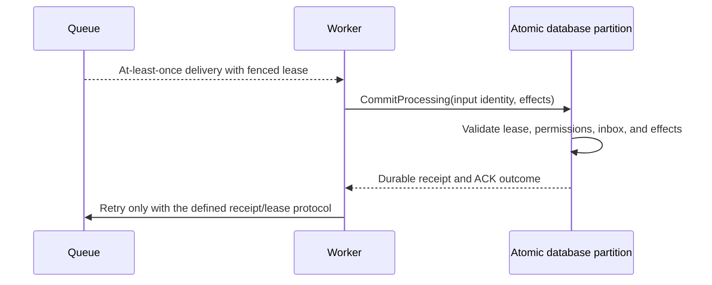

# ADR-026: At-least-once delivery with fenced leases and inbox effects

Status: Accepted; end-to-end RF3 delivery and reconciliation qualification pending.

## Context and decision

Durable queue delivery can repeat after lost responses, worker restarts, or expired leases. Exactly-once handler execution cannot be guaranteed for arbitrary user code or external services. The database can provide at-least-once delivery and protect canonical effects by fencing stale claims and atomically committing inbox identity, database effects, and local acknowledgement.

Every claim has a persisted lease version/generation and signed token bound to message, lane, principal, incarnation, and expiry. ACK, NACK, and renew validate current ownership. `CommitProcessing` deduplicates handler input/fingerprint and commits permitted same-partition effects plus inbox receipt and ACK atomically. External calls remain outside the transaction and require their own idempotency protocol.

## Alternatives and consequences

Claiming exactly-once external execution is rejected. Unfenced ACK can let an expired worker acknowledge a reclaimed message. Separate effect and ACK commits create duplicate effects after a lost response. Atomic inbox state protects database effects but does not make arbitrary handler code or network side effects transactional.

## Related requirements and implementation contract

Related: `REQ-MSG-001..003/AC-MSG-001..003`, ADR-023/024/027/029/030; KL-086..090, KL-096, KL-099, KL-102..103.

1. Freeze lease-token fields, dedup identity/horizon, supported atomic scope, and external-side-effect caveat.
2. Test lost claim/ACK response, stale and expired worker, changed fingerprint, permission revocation, quota failure, process kill, and reopen with real store/process.
3. Implement lease state and inbox effect transaction in `src/KeyLoad.Core/Features/Messaging/`; keep worker transport in the ClientApi/Messaging boundary and Orleans routing in its existing ClusterRouting slice.
4. Fence stale token generations. Rollback may restore only a verified cut matching retained inbox receipts and canonical effects; assign a new/fenced identity, keep delivery paused, and reconcile before redelivery. Never reactivate stale lease tokens or repeat a known canonical effect. The current wire and persisted-data formats remain fixed.
5. Run GitHub TUnit, process recovery, and RF3 SDK/MCP races; publish only exact-SHA evidence.

Current source: `src/KeyLoad.Core/Features/Messaging/Execution/Messaging.cs`, `src/KeyLoad.Core/DatabaseEngine.cs`, `src/KeyLoad.Abstractions/Contracts.cs`; tests: `tests/KeyLoad.UnitTests/MessagingTests.cs`, `SubscriptionTests.cs`, `TransactionTests.cs`. The feature contract is [Messaging](../Features/Messaging.md). No external exactly-once claim is made.
