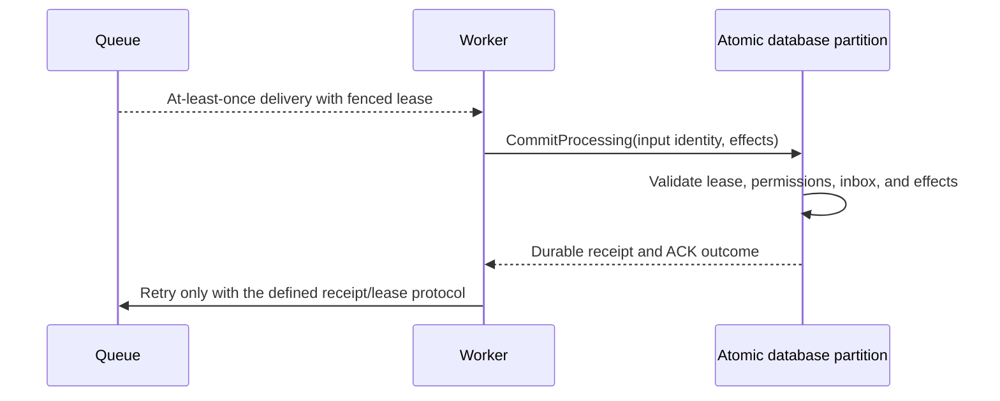
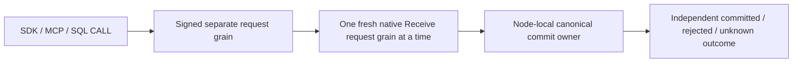
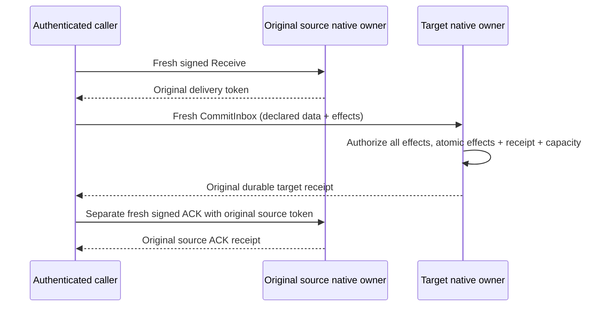

# ADR-026: At-least-once delivery with fenced leases and inbox effects

Status: Accepted; end-to-end RF3 delivery and reconciliation qualification pending.

## Context and decision

Durable queue delivery can repeat after lost responses, worker restarts, or expired leases. Exactly-once handler execution cannot be guaranteed for arbitrary user code or external services. The database can provide at-least-once delivery and protect canonical effects by fencing stale claims and atomically committing inbox identity, database effects, and local acknowledgement.

Every claim has a persisted lease version/generation and signed token bound to message, lane, principal, incarnation, and expiry. ACK, NACK, and renew validate current ownership. `CommitProcessing` deduplicates handler input/fingerprint and commits permitted same-partition effects plus inbox receipt and ACK atomically. External calls remain outside the transaction and require their own idempotency protocol.

## Alternatives and consequences

Claiming exactly-once external execution is rejected. Unfenced ACK can let an expired worker acknowledge a reclaimed message. Separate effect and ACK commits create duplicate effects after a lost response. Atomic inbox state protects database effects but does not make arbitrary handler code or network side effects transactional.

## Related requirements and implementation contract

Related: `REQ-MSG-001..003/AC-MSG-001..003`, ADR-023/024/027/029/030; KL-086..090, KL-096, KL-099, KL-102..103.

1. Freeze lease-token fields, dedup identity/horizon, supported atomic scope, and external-side-effect caveat.
2. Test lost claim/ACK response, stale and expired worker, changed fingerprint, permission revocation, quota failure, process kill, and reopen with real store/process.
3. Implement lease state and inbox effect transaction in `src/KeyLoad.Core/Features/Messaging/`; keep worker transport in the ClientApi/Messaging boundary and Orleans routing in its existing ClusterRouting slice.
4. Fence stale token generations. Rollback may restore only a verified cut matching retained inbox receipts and canonical effects; assign a new/fenced identity, keep delivery paused, and reconcile before redelivery. Never reactivate stale lease tokens or repeat a known canonical effect. The current wire and persisted-data formats remain fixed.
5. Run GitHub TUnit, process recovery, and RF3 SDK/MCP races; publish only exact-SHA evidence.

Current source: `src/KeyLoad.Core/Features/Messaging/Execution/Messaging.cs`, `src/KeyLoad.Core/DatabaseEngine.cs`, `src/KeyLoad.Abstractions/Contracts.cs`; tests: `tests/KeyLoad.UnitTests/MessagingTests.cs`, `SubscriptionTests.cs`, `TransactionTests.cs`. The feature contract is [Messaging](../Features/Messaging.md). No external exactly-once claim is made.

## Multi-lane receive composition

Accepted implementation contract for TASK-KL087-MULTI-LANE-RECEIVE-001,
REQ-MSG-007 / AC-MSG-007; qualification remains pending. The complete normative
request/result, ordering, bounded admission, per-lane authorization/read-cut,
atomicity, cancellation and uncertainty contract is in
[Messaging](../Features/Messaging.md#task-kl087-multi-lane-receive-001).

Implement in order: freeze that contract; add native attributed Messaging types
and centrally validated lane ceiling; compose existing claims through fresh signed
request grains and joined native Communication CQRS streams; bind one SDK/HTTP/MCP
operation and its SQL CALL inventory; add real ZoneTree and public RF3 whole flows;
then run every required native gate and retain original results before status
changes. Existing request/identity/grain/commit lifetimes are reused, no new
scheduler, read-cut authority, persisted group receipt or cross-partition commit.
Explicit request-to-request graph permission is limited to the existing native
ExecuteStreamAsync transition; a multi-lane parent only emits ordinary Receive
children and cannot recursively emit multi-lane children. Field aliases/IDs of
existing persisted claims remain fixed. Rollback drains the new ingress while
preserving committed lease/receipt recovery. Root is the integration owner.

## TASK-KL087-NATIVE-POST-SUBMIT-ENCODING-001

REQ/AC-CRS-003/004, REQ-MSG-007/AC-MSG-007 and ADR-026 require truthful write
uncertainty after an actual native Submit has returned a committed value. The
existing GrainCommandExecutor already tags its reply encoder failure with the
private closed ReplyEncoding stage; GrainReplyFactory must classify that command
failure as UnknownWriteOutcome, using the existing fixed safe interrupted-write
detail while logging the original failure's closed category/stage. Preserve
actual primary/cleanup settlement. This rule applies only to tagged command reply
encoding, including a multi-lane parent's final encoding. Definitive canonical
failed operations (including quota/validation) and read failures keep their exact
codes. No blanket ResourceExhausted mapping, fake provider, gate bypass or new
production observation hook is introduced. Actual native whole-flow byte-bound
claim proof is in MultiLaneReceiveBoundaryWholeFlowTests; source-only pending run.

### TASK-KL087-POST-DISPATCH-DRAIN-001 and caller cancellation follow-on

REQ-MSG-007 / AC-MSG-007: once an actual child stream creation is invoked, a typed KeyLoad transport/stream-validation exception is an uncertain child outcome, not a definitive whole-group rejection. Retain already confirmed lane outcomes, emit UnknownWriteOutcome with the canonical static interrupted detail for that child, and mark the undispatched suffix NotAttempted. Preserve original exceptions in closed native diagnostics. Exceptions before invocation retain their original classification. Cancellation and cleanup aggregate failures are not caught or rewritten. This is a source correction; KL-087 remains in progress.

The required caller-after-submit RF3 regression uses the existing RequestCqrsProbeFixture Hold at SubmitReturned for the first original stable ReceiveRequestId, bound to the persisted principal and signed discovery voter. Observe the marker and the public persisted first-lane claim before cancelling the original caller token; join the existing settlement and ProducerDisposed boundary before examining the outcome. SDK must expose its actual UnknownWriteOutcome; official MCP must retain its actual safe unknown tool result or actual transport/cancellation exception. No synthetic tool reply is permitted. The next lane must retain its complete original message state and have no original receipt. Retire the owned arm, retry unchanged original leaf IDs through the real callers, compare the durable first receipt and full literal deliveries, then ACK and run a complete healthy continuation. Original outer cancellation, deadlines, per-lane authorization and cleanup remain unchanged. Existing probe ownership, current-image Aspire orchestration and private marker trust are reused; no new production test hook, delay or retry loop. Native execution is mandatory and not claimed by this contract.

### TASK-KL087-CALLER-AFTER-SUBMIT-RF3-001

REQ-MSG-007 / AC-MSG-007, related REQ-CRS-003/004: two native tests, SDK and official MCP, use one actual separately Aspire-owned current-image RF3 wave each. The fixture arms the first original leaf ReceiveRequestId at existing SubmitReturned/Hold for the persisted non-admin queue principal; the signed-voter-bound marker plus complete public MessageInspection proves the first claim committed while the original caller is pending. No second leaf is submitted until this held first leaf finishes. Cancel the original caller CTS only after this observation. Require the native Cancelled settlement marker and ProducerDisposed join; original SDK must return UnknownWriteOutcome without a success payload; official MCP must expose its actual safe unknown tool error or its actual transport/cancellation exception. A nested leaf marker RequestId is not the outer MCP execution ID.

Compare complete first and second MessageInspection bytes after settlement; the second is still Ready with original metadata/body/headers. Retire the exact owned arm before receipt reconciliation. Recover the unchanged first leaf via actual SDK and official MCP single-lane Receive, require complete result bytes and unchanged committed message bytes, then retry the entire unchanged group through both actual public clients: first result equals recovered durable receipt, second contains its first lease only. Full SDK/MCP group result bytes match and replay leaves complete inspections unchanged. ACK both exact recovered tokens through SDK and replay ACK through official MCP, verify the complete literal Acked metadata (state version3, attempt1, lease version1, generation1, original ready sequence1), cleared lease and null payload/headers because native ACK deletes message body. The healthy message uses the literal next ready sequence2. Delivered payload/headers remain checked before ACK. Then enqueue, claim and ACK a complete healthy literal message. This proves receipt recovery and exactly one observable first claim; it does not claim a public receipt-inspection endpoint for an undispatched leaf.

The existing shared cleanup accepts a non-generic original Task solely to join any native SDK result type; it cancels admission, releases only owned open arms, joins original calls and producers, disposes clients, stops Aspire, joins controls, preserves primary and cleanup errors, and removes owned roots only on complete cleanup. Deadlines and image admission remain unchanged. New tests live in Messaging/Cases and Messaging/Helpers. Required native filters are /*/*/MultiLaneReceiveCancellationRf3Tests/* (two authored cases, not discovered inventory). Existing local-image standard8 selection is not expanded. Use the owning full RF3 image/fixture entry or separately reviewed explicit admission. Fresh build, actual native discovery, exact-source Linux execution and original output receipts remain mandatory. KL-087 remains in progress until its complete original criteria are qualified.

## TASK-KL086-PRODUCER-RF3-COLD-002 — mixed producer batch and real returned-response cancellation

REQ-MSG-001/005 → AC-MSG-001/005 → architecture KL-086 → ADR-026. Existing Core Enqueue/PersistEnqueuedMessage writes the original stored body, metadata, ready/scheduled index and counters in the same atomic transaction as a producer document. No product gap or new public/persisted boundary is asserted. Existing QueueEnqueueColdWholeFlowTests, MessagingTests.QueueQuotaFailureRollsBackProducerDocument, QueueBodyAccountingTests and TransactionTests retain their exact native raw-byte/count/rollback oracles and mandatory normal/scalar/process gates.

Add a genuine private-ClusterFixture RF3 operation with ordinary and caller-cancellation variants. Configure an explicit MaxStoredMessages=2 through the existing persisted resource operation while preserving every other QueuePolicy default. One persisted publisher has actual scoped document-write/read and queue-publish/inspect/consume/ACK capabilities. One SAME-partition CommandRequest writes a literal producer document, one ready message and one future scheduled message. Preserve original command ID and immutable body.

Narrow approved test-owned transport contract: create the SAME native IHttpMessageHandlerFactory default handler and apply its actual HttpClientFactoryOptions and Aspire endpoint, exactly as existing McpCallerHttp.CreateObserved. A private borrowed DelegatingHandler selects ONLY the exact original command GUID header and existing Commands route. It awaits one original base.SendAsync(request, original caller token). Only actual successful command response headers trigger cancellation of the original linked caller CTS. Return the SAME response; the native HTTP/SDK machinery settles naturally. No manufactured exception, response-stream substitution, lost-response result or fabricated receipt. Retain only the closed response-observed fact. SDK may genuinely return UnknownWriteOutcome/null or may already have completed successfully; preserve and independently reconcile whichever actual result occurred. Genuine official MCP SAME-ID submission obtains the original native receipt. All task/response/client/handler/caller lifetimes remain joined, with original plus cleanup failure ledger. No server redispatch, signature/body/nonce/options/deadline/authority/DI change. A guaranteed network-loss fault is NOT qualified by this cancellation scope.

Complete public oracles: literal producer document and complete actual ready/scheduled MessageInspection; original receipt exact SDK/MCP replay; changed original body Conflict; fresh duplicate identity Conflict and absent producer document; fresh over-count ResourceExhausted and absent producer document/message, complete original business image unchanged. First cold restart the SAME original volumes; fresh SDK/MCP must replay the exact original epoch1 receipt and full ready/scheduled/document image. Then persist inspect/read-only epoch2, fresh mixed write PermissionDenied with no model change; restore epoch3 through actual administrator, original epoch1 receipt replay PermissionDenied (never epoch-rebind). Both cold restarts use all original three Aspire resources and original volumes, preserving all resource join/health checks and original operation token. Original messages/document remain complete. Actual claim/ACK of ready item releases exactly one stored-message slot. Fresh epoch3 mixed command succeeds, same-ID SDK/MCP replay returns exact actual receipt; second cold proves scheduled item unchanged, ACKed old item complete and healthy literal document/message, then actual healthy claim/ACK and empty receive while original scheduled sibling remains future.

Cancellation here follows actual returned successful command headers and retains the genuine terminal result. It is not an assertion of pre-commit cancellation or guaranteed response loss; existing native lost-response whole-flow tests remain mandatory and a public real network-loss criterion remains OPEN. Whole existing native negative/cancellation/unknown, process recovery, RF3 and future horizon gates remain mandatory. Ordinary cases run native50; each new case owns independent actual Aspire resources. No strict native selectors/UID/count/PASS/status change. Root-only build/analyzers/discovery/source-PDB-UID/Linux normal+scalar/process/RF3 gates remain unqualified. Rollback removes only additive fixture/tests/docs; production remains unchanged.

## Public renewal/reclaim cold fencing, 2026-10-10

# KL087 genuine public renew/reclaim fencing and cold receipt continuation

TASK-KL087-RENEW-RECLAIM-RF3-001; REQ-MSG-001/004 and AC-MSG-001/004, ADR-026. Architecture KL087 requires committed delivery, original claim/ACK reconciliation and stale token isolation. Native QueueLeaseReuseTests covers direct renew/foreign/expired/stale tokens; QueueLostResponseWholeFlowTests covers full native cold claim/ACK result and whole-store byte replay. Existing public RF3 multi-lane cases have no complete renew/NACK/cold same-message reclaim and old-token ACK+renew refusal.

Implement only a new complete Messaging RF3 operation regression. One privately owned existing ClusterFixture starts the genuine original Aspire RF3; no shared fixture's resources are stopped. Use original McpCallerDeadline and unchanged default queue policy/Receive lease duration. Persist distinct scoped worker and foreign credentials through the actual root SDK. Claim the genuine seeded message, replay its complete Receive result through official MCP while current, renew with the original token, inspect actual persisted new deadline/state and replay the identical renew receipt. Invalid renewal above the actual configured policy ceiling and a currently authorized foreign principal with the original token must reject without changing the complete original message inspection.

Genuine NACK retains scheduled body/state and a real receipt. Dispose all original callers before actual all-three Aspire container kill/restart on SAME volumes; preserve individual failures, original token/deadline and existing native health waits. No added timer, request retry, fake time, cache mutation or grant regeneration. Use ONLY existing DueRecurringRf3Assertions.WaitForDueTimeAsync(original Scheduled.Metadata.NotBefore, original token): it waits to that absolute persisted due time with original TimeProvider, without polling or deadline reset. Cold elapsed alone is never the authority. A separate same-partition queue retains a genuine public Enqueue NotBefore one hour in the future, default policy unchanged; before/after each cold cohort, SDK empty receive and its official MCP replay must leave the complete literal inspection unchanged. The future record stays unclaimed until normal owned-fixture teardown; no unsupported CancelMessage API is invented. Fresh signed receive reclaims the SAME message with attempt/lease version incremented exactly and unchanged generation/body/headers. Old token ACK and renew refuse StaleLease through BOTH SDK and official MCP, complete inspected state unchanged. Original old claim replay also refuses StaleLease; original known renew/NACK receipts still replay byte-identically under fresh current persisted authority. No rejected original result is manufactured or called uncommitted.

ACK the actual new token and replay the complete receipt; real empty claim proves no redelivery. Enqueue healthy work, cold-restart SAME owned cohort again, reauthorize with the SAME persisted credential, replay original producer/renew/NACK/ACK receipts and inspect original Acked state, then actually claim/ACK the literal healthy body/headers with SDK and official MCP and replay its receipt. All operations/tasks are awaited; native SDK/MCP/client and Aspire cleanup share original failure ledger. No payload/token/credential diagnostics, new observer, activation, production code, options, clocks, timeouts, signing/authorization, aliases/Ids, strict UID/count/status/selector edits.

Native contracts reviewed: DatabaseEngine.ApplyDeliveryTransition moves the exact lease index and increments state while renewal retains lease version; Lease compares incarnation/lane/principal/current version/generation and deadline; AddLeaseReadyInput increments real attempts/version. CommandOutcomes reauthorizes current policy and cached Receive lease, while old Delivery receipts remain historical results. Case source identity is QueueLeaseFencingRf3Tests.ActualRenewAndNackReceiptsSurviveColdReclaimStaleTokensThenAcknowledgedHealthyWork. Root-only compile/analyzers/native discovery/exact-source Linux normal/scalar/native Unit/process Recovery/public RF3 gates remain pending. This test is not a product defect claim, power-loss proof or whole KL087 closure.

## TASK-KL088-RETRY-DLQ-EXPIRY-COLD-001 — complete retained retry operation

REQ-MSG-001/004/005 and AC-MSG-001/004/005 preserve original KL-088's bounded retry, durable pending payload and versioned transition requirements. Freeze before source this real native ZoneTree reference flow: same-partition queue policy has three attempts, two stored-message slots, base retry1000ms capped1500ms; these are bounded actual fixture configuration, not changed production defaults or a relaxed quota. Seed independently literal retry payload/headers/ordering key plus one future scheduled/expiring message under persisted administrator and inspect-only principals.

Canonical Apply uses its existing recorded evaluation instant; no host clock replacement, timer, delay/sleep, timeout or scheduler exemption. First claim/NACK writes scheduled state/version3 with exact1000ms delay; a not-due claim is empty. Join the native store and reopen the SAME root, preserving every actual body/meta/counter/ready/scheduled/lease/dead-letter/inbox lane byte and original full command/delivery receipts. The second original claim/NACK uses the exact1500ms cap; claim3/NACK reaches DeadLettered version9 at attempts3 with exact original raw body, full payload/headers/fingerprint/ordering identity, retained queue storage bytes and canonical dead-letter marker.

The full original queue refuses a new mixed producer document+message batch without either effect, while preserving every original lane byte including pending DLQ content. Stale original ACK and renew, inspect-only privileged DLQ read and denied receive retain the complete business image; failed command outcome/clock metadata are legitimately distinct from business no-effects. An actual already-cancelled ApplyEmbedded receive preserves whole native store bytes/position and the original cancellation token. No committed operation is said to be undone by cancellation.

At the original recorded expiry cut, native receive expires ONLY the scheduled message and removes its body, freeing its original slot under unchanged policy. A fresh literal message is enqueued, claimed and ACKed, with complete receipt and final metadata/body/counter checks. Join/reopen again, replay complete original enqueue and every original NACK/ACK receipt, retain pending DLQ content and exact whole lane image, then run an empty healthy claim. Replay of the now-stale first receive must refuse StaleLease with no payload while its ORIGINAL persisted receive outcome remains byte-identical; no expired delivery is fabricated as a recovered success.

Ordered test-only ownership: Messaging Cases QueueRetryDeadLetterColdWholeFlowTests; Contracts QueueRetryColdProtocol; Models QueueRetryColdState (bounded original receipt references); Helpers Trial/Phases/Refusals; Assertions QueueRetryColdAssertions and QueueRetryColdIndices. Every leased/scheduled/DLQ/expired/healthy phase independently checks complete native index rows (no extra ready, lease or inbox entries), full signed delivery lineage and original full metadata/body; healthy producer and denied saturated producer retain their stable command identities through cold replay. Existing QueueWholeFlowStorage/native DatabaseEngine/ZoneTree APIs and central UnitExecutionOptions remain unchanged. Root owns docs-first join, real compiler/analyzers, normal/scalar originals, process and public SDK/official MCP RF3 qualification. New source declaration is not native UID/count/PASS. Rollback removes only this complete test flow after actual store cleanup; no persistence/wire/serializer migration.

Original whole088 still requires parked/full-DLQ-specific policy, redrive generation, jitter and StrictPerKey contracts/implementation where absent, stale expiry/renew race qualification, all transition reference fixtures and actual public/Linux recovery/RF3 proof. Saturated existing stored-message quota is precisely labelled; it is not claimed to be a separate implemented DLQ capacity or parked transition. This supporting cold operation does not close the original task.

## TASK-KL088-PUBLIC-DLQ-COLD-001 — original public terminal receipt and preserved payload

REQ-MSG-001/004/005, AC-MSG-001/004/005 and original KL-088 pending DLQ acceptance gain a separate genuine Aspire RF3 supporting flow. Two original parameterized cases select SDK or official MCP as first terminal NACK caller, then replay the identical complete public producer/NACK receipt through both actual clients. Configure only unique fixture resources: MaxAttempts1 and MaxStoredMessages1. These are explicit bounded test policies; production defaults/ceilings and original McpCallerDeadline are unchanged.

Seed an independently literal message/body/headers/ordering key; claim, terminal NACK, exact complete DeadLettered metadata/payload/header inspection through both clients. A mixed document+enqueue producer refuses ResourceExhausted through both SDK and MCP with the SAME command identity; inspect both proposed effects absent and original full DLQ inspection identical. A genuinely persisted QueueInspect-only principal lacks DeadLettersRead and must receive PermissionDenied without private body/header/credential in the real official MCP response. No caller trusted roles.

Healthy continuation uses an independently configured sibling lane under the SAME persisted database and source partition: real fresh enqueue/receive/ACK with full literal metadata/delivery/receipt replay. It does not free or reinterpret the saturated DLQ lane. Dispose/join original clients; capture actual node1 owner status before all three retained Aspire-owned containers are killed/restarted. Observe every original kill/restart error, await native healthy readiness, acquire fresh actual SDK/MCP clients, require same NodeId/incarnation and nondecreasing read-generation/applied horizon. Recheck full original DLQ literal, replay original producer and NACK receipt and the refused producer, then execute another real sibling healthy operation. All original errors and client cleanup are joined through existing ServerFailureObserver; fixture owns final host shutdown.

Ordered owning files: Cases QueueDeadLetterPublicRf3Tests; Contracts QueueDeadLetterRf3Protocol; Models QueueDeadLetterRf3State; Helpers Scenario/Trial/Cold; Assertions QueueDeadLetterRf3Assertions. This packet depends on the exact sealed TASK-KL088-RETRY-DLQ-EXPIRY-COLD-001 three documentation postimages and appends to them. No public/signed/persisted contract or new topology/clock/probe/timeout/quota. Root alone joins and runs compiler, native normal/scalar discovery and genuine Linux RF3. Source declarations are not compiled UID/count or runtime PASS. Original parked/redrive/jitter/StrictPerKey/full-DLQ-specific policy and stale expiry/renew race remain unsupported/open, and process/RF3/whole-task qualification remains mandatory.

## TASK-KL088-NATIVE-LIFECYCLE-001 — proposed whole-product implementation contract

Status: Proposed for root contract review BEFORE public/persisted/index seams. Original architecture §39.5 and KL-088 remain authoritative; supporting Unit11/publicRF3-10 are immutable and do not implement these missing product criteria. Dependencies: exact publicRF3-10 documentation postimages (which depend on Unit11), KL-087 lease/claim ownership, current atomic Batch and ADR-125 connection pipeline. The Core Messaging local policy's read-only discovery boundary remains unchanged: new command owners belong in Commands, not DueWorkDiscovery or an alternate writer.

### Requirements, acceptance and finite stages

* REQ-MSG-088-PARK / AC-MSG-088-PARK: max-attempt NACK or due lease exhaustion atomically retains body/header/fingerprint; admits same-lane parked reference only inside configured DLQ sublimits, otherwise persists PendingDeadLetter with no deliverable index and no discarded payload. Both remain charged to the original queue stored grant. Bounded explicit pending promotion, cancellation and redrive must be real same-partition Batch effects with full receipts. A later failing document/event/message effect rolls back EVERY preceding lifecycle/index/counter mutation.
* REQ-MSG-088-REDRIVE / AC-MSG-088-REDRIVE: genuinely persisted administrator plus explicit scoped DeadLettersRedrive authorizes exact-state/generation redrive; current source raw-use and current queue field/header write admission are required. Stable CommandId returns the original complete receipt without incrementing twice, changed content conflicts. Fresh delivery generation fences every old receive/ACK/NACK/renew/processing token; original inbox/execution receipt history stays immutable. A new explicit handler ExecutionGeneration is required for business re-execution: redrive never silently reuses or rewrites an old inbox.
* REQ-MSG-088-CANCEL / AC-MSG-088-CANCEL: explicit scoped administrative cancellation from a nonterminal lifecycle state removes only actual current indexes/body and adjusts actual stored/inflight/DLQ usage in the SAME commit. Caller cancellation is distinct: cancellation before admission has no effects; after committed or unknown outcome it neither proves rollback nor frees ownership. Unknown outcome uses the original receipt protocol. ACK/Cancelled/Expired cannot be resurrected.
* REQ-MSG-088-ORDER / AC-MSG-088-ORDER: explicitly configured StrictPerKey admits at most the oldest unresolved original ordering head. Its scheduled retry blocks later same-key delivery, while unrelated keys may progress within the original scan bound. Parked-head Continue/Block is explicit; terminal ACK/cancel/expiry releases head. No promise of external side-effect completion order, global order, wait-until-work, starvation freedom, or cross-lane serialization.
* REQ-MSG-088-JITTER / AC-MSG-088-JITTER: bounded retry uses configured exponential factor and None/Full jitter, with the selected absolute retry instant logged in the original leader-admitted replicated command. Replay, followers and cold restart apply that instant exactly; no follower or caller clock/random generator supplies it. Keep original recorded-time strictness and original retry/max-attempt ceilings.

Only stage1 fields/capability/mutations/families ship with stage1 implementations; later reserved ordering/jitter fields are added only WITH their real semantics, never as ignored flags. Stage1 priority is bounded same-lane parked/pending/redrive/cancel plus full native Unit/process/RF3 real operations; stage2 adds real StrictPerKey original lineage/head ownership; stage3 adds actual leader-preappend retry decision and deterministic replay. Remote DLQ does not become a local destructive shortcut: it must use existing source CreateQueueTransfer, destination AcceptQueueTransfer and source CompleteQueueTransfer authority, current destination capacity/permissions, retained source body until authentic destination receipt. Exact remote lifecycle and jitter envelope fields require native owner review before their separate code stage; absence is not complete implementation.

### Exact proposed stable reservations (no existing IDs/values change)

QueuePolicy retains Id0..7 and original defaults. Append Id8 nullable MaxDeadLetterMessages and Id9 nullable MaxDeadLetterBytes: null explicitly means inherit THAT same configured MaxStoredMessages/MaxStoredBytes grant, preserving every existing smaller fixture/resource configuration; a supplied value must be positive and <= that configured grant. These are sublimits of the SAME grant, never additional quota. Null is a typed inheritance policy, not legacy deserialization, silent clamp, fallback, an unlimited cap or ignored flag; validation and apply resolve it identically under the existing resource definition. Append Id10 QueueOrderingProfile (CompetingConsumers=0 default, StrictPerKey=1), Id11 ParkedHeadPolicy (Continue=0 default, Block=1), Id12 QueueRetryJitter (None=0 default, Full=1), Id13 RetryExponentialFactor (original2 default). Reject unknown enums, nonpositive factor and Block with CompetingConsumers rather than ignore a flag. Original defaults, lease/scan/deadline/buffer quotas stay unchanged.

MessageState original Scheduled0..Expired6 remain exact; append PendingDeadLetter=7. Existing DeadLettered=4 is the admitted parked state; do not invent a second synonymous Parked enum. MessageMetadata retains Id0..11, appends Id12 ParkedSequence (zero outside admitted DLQ), Id13 OriginalEnqueueSequence (immutable), Id14 ActiveOrderSequence (new generation gets new sequence). QueueCounters retains Id0..4, appends Id5 DeadLetterMessages, Id6 DeadLetterBytes, Id7 NextParkedSequence, Id8 NextEnqueueSequence. Zero initial counts, checked monotonic sequence arithmetic; overflow refuses without partial effects. StoredBytes continues actual native MessageBody serialized bytes, not claimed total CLR/physical index heap bytes; original atomic encoded-frame and record/scan admission still bound all added records.

Append three public typed Batch mutations in Abstractions/Features/Messaging/Contracts/QueueLifecycleContracts.cs, each derived from existing Mutation(Queue), generated native serializer, exact per-derived field IDs (base Resource Id0 remains in its own serializer scope):
- RedriveQueueMessage: Id0 Queue, Id1 MessageId, Id2 ExpectedStateVersion, Id3 ExpectedDeliveryGeneration, Id4 NotBefore nullable; discriminator redriveQueueMessage, alias keyload.contract.redrive-queue-message.v1.
- CancelQueueMessage: Id0 Queue, Id1 MessageId, Id2 ExpectedStateVersion, Id3 ExpectedDeliveryGeneration; discriminator cancelQueueMessage, alias keyload.contract.cancel-queue-message.v1.
- ParkPendingQueueMessage: Id0 Queue, Id1 MessageId, Id2 ExpectedStateVersion, Id3 ExpectedDeliveryGeneration; discriminator parkPendingQueueMessage, alias keyload.contract.park-pending-queue-message.v1.
All IDs mandatory for conditional mutation; nonpositive expected state/generation refuses Validation. No new OperationKind, public route/tool, caller role or signed control ID. Append Capability.QueueCancel at bit38, extend All through bit38 preserving bits0..37. Cancel requires current persisted administrator AND explicit QueueCancel scope; park/redrive require current persisted administrator AND explicit DeadLettersRedrive scope. Administrator is not a substitute for scoped data grants: use a copy with ClusterAdministrator=false for current scope/raw-use/write checks exactly like existing queue-transfer authorization.

Stage1 native new family queue-pending-dead-letter keyed queue/messageId contains no payload and a closed sanitized reason; native new family queue-dead-letter-order keyed queue/parkedSequence/messageId contains QueueDeadLetterReference alias keyload.core.queue-dead-letter-reference.v1 with Id0 MessageId, Id1 Sequence, Id2 DeliveryGeneration, Id3 SafeFailureCode. Preserve current dead-letter/queue/messageId marker bytes for existing exact native inventory/inspection contracts. Stage2 family queue-order keyed queue/orderingKey/activeOrderSequence/messageId contains original message identity only. Native alias of pending reference is keyload.core.queue-pending-dead-letter-reference.v1 with Id0 MessageId, Id1 DeliveryGeneration, Id2 SafeFailureCode. No directory/index scan becomes authority. Add EVERY actual family to PartitionRecordFamilies.All and source-bound complete backup/restore/movement/deletion rosters and independent full inventory tests before acceptance; no count-only update.

### Canonical transaction and fences

1. Existing authenticated signed Batch reaches reused ConnectionGrain, original command ID/fingerprint, current principal policy and node-local atomic apply gate. Validate all typed mutations, current resource kind/domain, administrator/scope, field/header policies and exact metadata stateVersion+deliveryGeneration before writes.
2. Max-attempt NACK/expired lease retires the actual lease index/inflight reservation. If DLQ count/bytes fit, insert both original dead-letter marker and ordered parked reference, increment DLQ counters/sequence, persist DeadLettered stateVersion+1. Otherwise insert bounded pending reference and PendingDeadLetter stateVersion+1, keep body, keep stored usage, and remove ready/scheduled/lease references. Never release payload to reduce backlog.
3. ParkPendingQueueMessage is an explicit single-message bounded operator transaction; if admission still fails return ResourceExhausted/no effects. Successful promotion changes version once and appends a real monotonic parked sequence. No automatic unbounded scan or timers.
4. Redrive is restricted to PendingDeadLetter/DeadLettered with actual body and unexpired ORIGINAL ExpiresAt. Past expiry or invalid NotBefore refuses without deleting protected body; it does not fabricate an extension. Validate current resource is unpaused and field/header policies. Remove exact pending/parked marker/reference and decrement ONLY actual DLQ usage. Preserve original raw body/fingerprint/ordering key; increment stateVersion, deliveryGeneration and leaseVersion, reset Attempts=0 and lease owner/until/safe failure, choose new ready sequence or valid scheduled NotBefore, preserve immutable original enqueue sequence. Resetting generation cannot rewrite original command/inbox history. Later fresh claim consumes attempt1 under existing persisted lease signing key/incarnation.
5. Cancel accepts Ready/Scheduled/Leased/PendingDeadLetter/DeadLettered under exact condition; removes every actual current reference and body, decrements counters once, increments version/generation/leaseVersion and writes Cancelled minimal metadata. Already terminal state refuses Conflict; stable replay returns original receipt. Expiry of deliverable or leased messages uses original command-time path, same ordered gate and actual current indexes; stale due key/version after a renew must never delete a renewed lease or decrement twice. Dead-letter/pending original payload is retained until explicit operator cancellation/redrive/retention authority; inspection is read-only.
6. Batch success exposes original CommitReceipt/Token/complete ordered MutationReceipt (redriveQueueMessage/cancelQueueMessage/parkPendingQueueMessage, exact queue/id/new state version), only after original RF3 acknowledgement. Failed later effect aborts every staged lifecycle mutation. Existing cached-outcome reauthorization enforces fresh administrator/scopes/policy/raw-use/write permissions; replay does not demand mutable source version/body after successful later ACK, and never rewrites receipt history. No transaction/view/lock crosses await.

### Strict ordering and logged jitter finite owner boundaries

Strict ordering must use one canonical queue-order row per unresolved keyed message, created with actual successful enqueue under existing transaction (no sampled counters). Null OrderingKey follows competing behavior. OriginalEnqueueSequence is immutable; ActiveOrderSequence is monotonic per generation. Receive inspects bounded canonical same-key head; only matching oldest row can lease. Retry retains head; DeadLettered/Pending retains or removes its row according to explicit Block/Continue policy. Redrive enters at a NEW active sequence; it cannot steal another held head. Configuration profile change requires an empty stored queue and no unresolved keyed rows, otherwise Conflict; no migration/reindex/fallback of existing populated queue. Existing EnqueueMessage fields/fingerprint/producer behavior remain intact and movement worker owns separate producer tests; exact append integration is coordinated before source.

Jitter cannot be implemented by accepting an unauthenticated public RetryAt or selecting randomness in replicated Apply. Native ReplicaLeader must prepare a closed retry transition decision AFTER canonical clock/authority/current metadata admission and BEFORE original ordered append, signed/replicated with that operation; original public payload/CommandId remains identity input and callers cannot inject a decision. The exact existing native envelope field/alias/IDs, signature verification and prepared decision-to-current metadata fence require a separate precise native contract from actual owner APIs. Stage1 must not pretend fixed exponential is jitter. Factor computation saturates to existing RetryMaxMilliseconds within existing MaximumRetryExponent; Full jitter selects a positive delay <= capped factor, never immediate infinite retry. Actual selected time is persisted in command and Scheduled metadata. This paragraph reserves semantics, not unverified envelope IDs or runtime proof.

### Exact source/caller map, verification and integration

Abstractions owns MessagingContracts append enums/IDs, QueueLifecycleContracts, AuthorizationContracts capability, Contracts.cs three discriminators and NativeContractAliases. Core Commands QueueLifecycleCommands/QueueDeadLetterAdmission/QueueLifecycleIndexes own transitions under original IAtomicTransaction; existing QueueDeliveryTransition and QueueSweepTransitions delegate admission; ProtocolValidation/AtomicMutationApplication/BatchMutationAuthorization/CommandAuthorization/ReauthorizeExtendedOutcome integrate typed Batch, permissions and cached authority. ResourceConfiguration validates real sublimits/enums; no duplicate public dispatcher. Stage2 modifies actual Enqueue and QueueReadyClaims with owning queue-order helpers only after source ancestry coordination. Storage remains native ZoneTree and ordered atomic WAL; shared canonical rosters/backup/restore receive exact family additions. Server/Orleans public Batch JSON/native derived contracts flow through existing codecs/connection execution. SDK CommitAsync, official MCP keyload_documents_commit and existing SQL executeSql CALL documents.commit use the SAME typed CommandRequest; qualify all available original Q1 routes and exact generated public schema/effect hints (cancel is destructive) before advertising them. No new tools or false SDK compatibility claim.

Phase1 meaningful Unit reference sequences: body-preserving full-DLQ pending; quota refusal/mixed-batch rollback; explicit park after capacity-freeing cancel; redrive→new claim→stale old token/inbox protection→healthy processing; cancel/expiry/renew ordering both serializations with original full counters/index/body/receipt; persisted denied operator/raw-use/write scope→repair grant→healthy; before-admission cancellation and same-root cold at pending/parked/redriven cuts. Genuine process-kill at original commit boundaries; RF3 SDK/MCP/Q1 persisted admin/scoped denial→same-ID receipt lookup→same-owner cold/full independent literals and counters where native observation is available. Phase2 two same-key messages plus unrelated key: head retry blocks successor, Continue/Block parked policies, concurrent receive/cancel/failover and cold full page. Phase3 chosen-time original command/leader failover/follower/clock-skew/renew-race references and complete public operations. No getter/mock-only cases, synthetic compiled UID or source-based PASS. Ordinary50/heavy1, original suite/deadline/grants/native package versions remain unchanged.

Rollout: homogeneous exact-source first-release cohort; native generated append fields preserve existing aliases/IDs, no legacy JSON reader, migration, hidden reindex or mixed image. Reject unsupported profile/state/envelope rather than promote pending/newest data. Rollback requires no deployment with these new canonical records unless exact current-format feature authority and operator contract support it; code revert alone is not recovery. Root reviews/fixes final format/cohort admission contract before product seam join. Root sole live writer/build/test/Git; worker private guarded packets, movement peer append union, native exact diagnostics and authenticated Linux original evidence. Proposed contract is not Implemented or qualified.

### TASK-KL088-PHASE1-NATIVE-PRODUCT-WHOLE-001 — guarded executable source stage

This stage implements only the approved Phase1 contract above: REQ-MSG-088-PARK/REDRIVE/CANCEL with AC-MSG-088-PARK/REDRIVE/CANCEL, and original REQ-MSG-001/004/005 / AC-MSG-001/004/005. Three typed Batch mutations retain the existing public Commit, official MCP documents.commit and Q1 CALL entry. QueueCancel is capability bit38; no new operation discriminator or trusted caller role is introduced. StrictPerKey, leader-selected jitter and remote DLQ transfer remain explicit product gates, with no ignored Phase2/3 fields. Source preparation does not close any runtime acceptance.

Ordered integration: exact Unit11 supporting flow and its documentation, public RF3-10 flow and its documentation, approved native-product R2 documentation, then this guarded source. Four supporting oracle owners use their sealed predecessor postimages as bases, not an absent live file. Abstractions appends QueuePolicy nullable Id8/9 (positive, no greater than the original stored grant), MessageMetadata ParkedSequence Id12, QueueCounters Id5..7, PendingDeadLetter7 and the three generated Mutation types. Existing aliases and fields remain unchanged. The new native reference aliases/Ids and sortable pending/parked keys are exactly those frozen above. Core authorization strips administrator privilege for scoped queue/raw/use/write admission while also requiring the current persisted administrator. Stable replay reauthorizes the original effect against current persisted policy without re-evaluating an already-completed mutable transition.

Within the original atomic transaction: NACK and due-lease exhaustion remove the actual lease/in-flight usage, then retain the original native body and admit a parked reference or PendingDeadLetter under the same stored grant and configured DLQ sublimit. Cancel frees only actual current body/reference/counter usage once. Park validates the current version/generation and pending reference, refuses a full DLQ atomically, then allocates the next ordered parked sequence. Redrive preserves original body/fingerprint/ordering/expiry, increments generation/version/lease fences and creates one fresh ready or scheduled reference. The ready counter is unchanged for a future scheduled redrive. No wall clock, delay, quota increase, secondary store or consumer-side fallback is added.

Counters are authoritative native records. A missing counter with an existing body/metadata record, contradictory usage, an unsupported pre-admission dead-letter marker, or a missing/mismatched selected pending/parked reference refuses RecoveryRequired. The bounded marker witness never reconstructs counters or resets cold usage. RecoveryRequired follows the existing ExecuteAndBuildOutcome uncaught authority-failure contract; it is not a synthetic stored business failure. The complete Unit corruption flow saves the original bytes, deletes the actual ordered reference, proves read and mutation refusal without an append, restores precisely those bytes, then continues healthy and cold. Dead-letter and pending bodies retain original expiry; expired redrive refuses, and only explicit authorized cancel/redrive/retention changes their protected body. Existing deliverable expiry and retry paths retain their original command-time behavior.

Whole test mapping (declarations only, never compiled UID/count evidence): QueueLifecyclePhaseOneTests retains two original count/byte sublimit Args and performs three-message parked/pending/held setup, full counters/body/native references, saturated refusal, late mixed-batch rollback, persisted field-denied administrator, genuine already-cancelled admission, missing-authority exact repair, unchanged original command retry, park/redrive/new claim/stale old tokens/ACK/cancel, full original receipt replay and two same-root cold continuations. The same case performs actual native CreateBackup/Restore, full nine-family bytes, new-incarnation rejection of old receipts/tokens, fresh authorized lifecycle/healthy processing and target cold replay without changing the source. PartitionRecordInventoryTests independently includes both new canonical families in the full ordinal inventory and real page assertions.

QueueLifecycleProcessRecoveryTests maps the existing five canonical HeaderWritten/PayloadWritten/JournalFlushed/MutationApplied/ApplyCompleted process-kill boundaries to a real original atomic cancel+park+redrive operation. Existing MessagingCrashTrial deadlines, StorageTrialLease ownership, process kill/drain and native recovery entry are unchanged. Recovery requires the journal-flushed stages to expose the original committed outcome, checks complete independent before/after metadata/body/counters, reconciles the same original receipt, then completes original processing, exact same-root cold receipt/image replay and a fresh full healthy message. These are process-kill controls, not power-loss proof.

QueueLifecyclePublicRf3Tests retains four source Args for SDK, official MCP, Q1 SDK and Q1 MCP as the first-operation route. Every argument invokes all four routes for complete independent public MessageInspection literals, failed original command replay and full binary CommitReceipt equality. Persisted scoped administrators with and without actual field grants exercise denial and unchanged healthy state. The fixture owns actual Aspire RF3, all three retained-owner kill/restart cycles, discovered clients, cancellation and joined cleanup. Two cold phases preserve NodeId/incarnation and nondecreasing fresh generation/applied cut; no old cursor/read cut is reused. Original McpCallerDeadline, ordinary50 and exclusive-heavy1 remain unchanged.

Ownership/join: Core mutations and replay run under the existing native commit/apply owner; tests retain original command/receipt references only for their bounded case lifetime. Original caller, CTS, official SDK/HTTP sessions, native stores/process pipes and Aspire resources retain their existing initiating-plus-cleanup/fatal error ledger and disposal joins. No live proposal write, build/test/format, publication or status promotion accompanies this private stage. Shared Messaging append text is root-unioned with KL086/089; public/persisted fields above are not re-numbered.

Remaining gates: canonical compiler/analyzers/format, native normal/scalar discovery and image/source/PDB/DLL binding, full normal/scalar Unit and process recovery, actual SDK/MCP/Q1 Linux RF3 originals, and final cleanup/resource gates are unqualified. Actual messaging movement capture/import is the next independently guarded successor with its own native source cut; frozen existing movement index/receipt oracles are unchanged here. Full task completion also requires StrictPerKey, true leader-selected jitter, remote DLQ transfer, remaining expiry/renew races and full hardware/scalar/fault/resource qualification. This source stage is not Implemented/PASS and does not turn a declaration or family count into authentic evidence.

## TASK-KL090-LOCAL-INBOX-PUBLIC-COLD-001

REQ-MSG-002 / AC-MSG-002 and canonical KL090: the existing local ProcessingRequest/native CompleteProcessing contract is exercised by InboxProcessingPublicColdTests.FailedEffectsOriginalInboxReceiptsAndRestoredPolicySurviveTwoRf3ColdCutsThenHealthyProcessing. Actual fresh persisted queue/effect authorization precedes inbox replay. Preserve token scope, exact handler/input/generation/effect/principal fingerprint, original inbox receipt, native ACK-before-effects quota release and all-or-nothing apply. No product/schema/route/activation/default/clock change is proposed.

One unique Aspire RF3 fixture uses a persisted nonadministrator worker and real SDK plus official MCP. A failed document CAS must preserve the exact input lease/body and absent effects; genuine processing writes document+output+inbox+ACK. Two same-volume three-owner cold cuts retain exact original receipt/full public input/output/document bytes. Changed effects conflict, policy epoch2 refuses both routes without changes, restored epoch3 still fences original epoch1 command receipts while a new command with the same existing inbox identity returns the original effects receipt. Genuine output claim and empty-effects processing complete a healthy continuation. All owners/clients use existing lifetimes and original McpCallerDeadline, original failures and cleanup retained; independent native50 scheduling. No manufactured lost response, fake clock or public receipt proves raw bytes.

Existing Unit inbox rollback/lease/quota and subscription-processing seven process cuts remain mandatory, with fresh Linux normal/scalar/recovery and genuine current-image RF3 required. This supporting local flow does not close remote target-inbox, redrive identity or universal dedup-horizon resource acceptance. There is no native UID/PASS from source.

### TASK-KL090-TARGET-INBOX-001 — explicit target inbox atomic operation

REQ-MSG-002 / AC-MSG-002 add the approved target-only application-dedup operation to existing local processing. Source implementation is authored, not runtime-qualified. The immutable boundary review is KL090 target inbox R3 (SHA256 1d6bdda86ed9a6d7ffa27b5a32d2975236f06b850232baefadb34282bcbedeb6); the following exact implementation preserves its authority separation.

`CommitInbox=38` follows reserved EventFeedControl36/SourcePhase37. `InboxWrite=1L<<39` follows reserved QueueCancel38; integration composes the canonical All once. ResourceDefinition nullable InboxPolicy Id14 requires a positive explicitly configured receipt count and retained key+record byte bound, no larger than that WorkQueue's actual existing stored-message/byte limits. Null is UnsupportedCapability, not a default. ResourcePolicyUpdates remains unchanged: inbox quota cannot be raised through an unsupported policy-only CAS. No pruning or retention migration is promised.

Generated request alias `keyload.contract.commit-inbox-request.v1` retains Id0 CommandId /1 Target /2 Source /3 MessageId /4 DeliveryGeneration /5 HandlerScope /6 ExecutionGeneration /7 Effects. Result alias `keyload.contract.commit-inbox-result.v1` retains Id0 original CommitReceipt /1 AlreadyProcessed /2 original CommitToken. Policy alias `keyload.contract.inbox-policy.v1` retains Id0 MaxReceipts /1 MaxBytes. Native target record alias `keyload.core.target-inbox-record.v1` Id0 canonical full-input identity fingerprint /1 effects fingerprint /2 original receipt; the exact full input tuple also appears in its native key. Capacity alias `keyload.core.target-inbox-capacity.v1` Id0 Count /1 Bytes. Families processing-inbox and processing-inbox-capacity enter the original closed ordinal roster and actual movement/backup capture. Existing local InboxRecord, ProcessingRequest and principal-scoped fingerprint remain unchanged.

The existing native factory/normalization/fingerprint/partition resolver/dispatcher and server-owned ConnectionGrain execute this one target-partition operation. Fresh target InboxWrite and every actual mutation permission precede cached command/inbox lookup, and repeat in ordered atomic apply. Failed effects/quota retain their real failed native outcome, but roll back all business effects, inbox and capacity writes. Another currently authorized worker can reconcile the same target input; changed effects Conflict. Original command outcomes still reject a changed policy epoch. Target results neither validate source existence nor authorize source ACK. Explicit execution-generation changes deliberately begin a new application processing lifetime.

Source/public selection (authored identities, not native UIDs):

- `TargetInboxAtomicProcessingTests.TargetEffectsInboxAndQuotaSurviveTwoColdCutsWhileSourceAckRemainsSeparateAndFreshlyFenced`: genuine source claim, failed target CAS, literal document/event/output and exact native inbox byte accounting, unchanged source lease, two original cold opens, current other-worker reuse, epoch2/3 denials, changed-effects refusal, separate real source ACK, quota refusal without effects, replay at quota and genuine output ACK.
- `TargetInboxCancellationTests.CancelledTargetAdmissionHasNoNativeCommitThenSameOriginalOperationAndSourceAckComplete`: original cancelled coordinator admission, exact token/position/full raw rows unchanged, same command healthy and byte-identical replay, real source ACK.
- `TargetInboxPolicyTests.UnconfiguredTargetInboxRefusesWithoutEffectsThenExplicitConfiguredTargetCompletes`: null capability refusal with full native business cut unchanged followed by configured target effects/receipt/counter.
- `TargetInboxProcessRecoveryTests.TargetInboxCrashRecoversWholeTargetEffectsReceiptAndQuotaWhileSourceAckIsSeparateThenColdHealthy`: actual CrashHost HeaderWritten0/PayloadWritten0/JournalFlushed0/MutationApplied0,1,2/ApplyCompleted0 cuts. Actual recovered document/output/inbox/capacity/original outcome must be all absent or all present, with flushed cuts all present. Original source remains leased, same original operation reconciles, genuine source ACK follows target, next actual cold replay leaves all native bytes/position unchanged, then real output claim/ACK. Existing MessagingCrashTrial90s/cleanup30s ownership and all old scenarios remain unchanged.
- `TargetInboxPublicColdTests.TargetPartitionInboxReceiptsRemainAtomicAndSourceAckSeparateThroughPolicyRefusalsTwoColdCutsAndHealthySdkMcpQ1`: genuine Aspire RF3 SDK source claim and target CAS refusal; original successful response headers cancel ONLY the original caller CTS. Actual SDK success or UnknownWriteOutcome is retained, never manufactured; independent official MCP reconciles the exact original target result. Source ACK occurs immediately through its true token before cold cuts, avoiding any assumption that cold time preserves a default30s lease. Two joined same-volume three-node cold cuts preserve target receipts and complete literal models. SDK/official MCP/Q1 SDK/Q1 MCP dedup replay, epoch2 demotion/epoch3 restore denials, exact source ACK receipt replay, changed-effects and quota no-effect refusals, actual stale source ACK refusal, then fresh output claim/ACK complete. The header callback is fixture-only and exports no payload/credentials; it does not guarantee or qualify a lost socket outcome.

MCP/Q1 canonical catalog and typed native decode inventory add the operation without deleting any old entry. Independent literal partition family inventory adds the two current families. Existing local queue/subscription whole operations and all required normal/scalar/recovery/RF3 suites remain mandatory. Test source/census is not a discovered UID, PASS or full task closure. Fresh root-owned build/normal+scalar/process/Docker RF3 Linux images and original reports are required; no current run, performance, endurance or power-loss claim is made.

Rollout/join: preserve all old IDs/aliases/enum values and root's KL08436/37/KL08838 shared reservations; compose shared dispatch/capability/doc appendages exactly once. Homogeneous generated current native contracts are required, no legacy fallback or copied storage codec. Private postimages are guarded; root owns source join/build/runtime delivery. Rollback before writes removes the additive source stage; after persisted target records exist, removing their native family/serializer without a separately approved format boundary is invalid.

## TASK-KL088-R54-COLD-CALLER-RESTORE-001 — original cold operation prerequisites

REQ-MSG-001/004 and AC-MSG-001/004 retain the full native retry, dead-letter, fencing, expiry, quota, cancellation and two-cold-owner operation assertions. Caller Delivery, MessageInspection and native MessageBody payloads use the independently literal canonical enqueue JSON oracle (ordinal property order and escaped Unicode). Native MessageBody retains that exact original committed canonical body, headers, ordering key and fingerprint of the independently declared original typed EnqueueMessage, whose original input JSON remains distinct from its committed canonical body through every retry and cold replay. No JSON comparison normalization or reduced byte oracle is introduced.

The original FullDeadLetterPendingAtomicRefusalRedriveCancellationAndSameRootCold(true/false) backup continuation first proves exact restored lane image and refusal of original-incarnation operation/delivery tokens. It then uses the existing persisted lifecycle administrator through actual OperationKind.SetDispatch with false, requires the actual true result, and retains that command in original receipt replay before new claims. Restore continues to pause dispatch by default; no product, clock, timeout, limit, field ID or policy change.

Ordered ownership: QueueRetryColdProtocol independent CallerPayload; QueueRetryColdAssertions full caller and canonical native MessageBody expectations; QueueLifecycleRestoredContinuation explicit authorized resume before its existing batch/claim. QueueLifecycleOperations replays that retained SetDispatch outcome as its exact native bool, including JSON, error, safe detail, runtime type and value, while all original mutation outcomes retain full CommitReceipt assertions. Existing full operation identities are QueueRetryDeadLetterColdWholeFlowTests.ActualCappedRetryDeadLetterQuotaRefusalExpiryAndCancellationPreservePendingBodyThenHealthyAckAndColdReplay and QueueLifecyclePhaseOneTests.FullDeadLetterPendingAtomicRefusalRedriveCancellationAndSameRootCold(bool). R54 original failures remain retained; fresh complete normal/scalar native runs and all original process/RF3 gates are pending. Rollback removes only this fixture correction; no persisted format or production default changes.

## TASK-KL088-STRICT-JITTER-RACES-001 — Phase2 exact native contract proposal

Status: private contract proposal for root review; no new public/persisted source seam is joined or qualified. Depends on approved Phase1 whole64 postimages. Related architecture39.3/39.4/39.5 and original KL088; REQ-MSG-088-ORDER/AC-MSG-088-ORDER, REQ-MSG-004/AC-MSG-004 and REQ-MSG-001/005 with their original acceptance. Remote DLQ is outside this phase until its separate trust/durability contract. Preserve source50 ordinary/exclusive-heavy1, original request/suite/fixture deadlines, MaxBatchBytes/MaxScanRecords/QueueScanPageSize, RF3 ordered journal/quorum and connection-local signed identity.

### Frozen proposed fields and native families

QueuePolicy append only after Phase1 Id8/9: Id10 OrderingProfile (CompetingConsumers0 default, StrictPerKey1), Id11 ParkedHeadPolicy (Continue0 default, Block1), Id12 RetryJitter (None0 default, Full1), Id13 RetryExponentialFactor (original2 default). They are actually consumed and validated in this phase; unknown enums, nonpositive factor and Block with CompetingConsumers refuse Validation. MaxAttempts/lease/stored/inflight/retry base/max defaults stay exact. Factor arithmetic saturates to existing RetryMaxMilliseconds within original MaximumRetryExponent and never wraps.

MessageMetadata append Id13 EnqueueSequence (original immutable per-message admission order), Id14 ActiveOrderSequence (current strict generation admission order), default0 outside StrictPerKey. QueueCounters append Id8 NextOrderSequence default0; it is distinct from readiness and parked sequences. Native family queue-order key queue/orderingKey/activeOrderSequence/messageId stores QueueOrderReference alias keyload.core.queue-order-reference.v1, Id0 MessageId, Id1 ActiveOrderSequence, Id2 DeliveryGeneration. Native sequence and identity arise only from successful same-gate enqueue/redrive. No inferred count or scan reconstructs sequence authority. Every actual family joins canonical inventory/backup/restore/movement/deletion and complete independent page/image oracles.

StrictPerKey requires an explicit nonempty bounded OrderingKey; missing key refuses before body/counter/index publication. Existing CompetingConsumers admits the original optional key exactly. A resource cannot switch its OrderingProfile while the actual queue has stored input (including protected pending/DLQ); refuse Conflict rather than reindex, reset usage, reinterpret old records or introduce a migration reader. Enable StrictPerKey only for a genuinely empty current resource; first enqueue obtains EnqueueSequence=ActiveOrderSequence=++NextOrderSequence and publishes its actual ordered reference with body/meta/ready/scheduled under the original transaction. Current policy changes use persisted administration and existing resource authorization; no caller-trusted profile.

### Native strict eligibility and completion

CaptureReadyItem reads the original same native body/metadata and validates its order reference. Under StrictPerKey the first native key of that exact ordering prefix is the only eligible message. The reference must equal its current metadata/generation; missing/corrupt authority refuses, never falls back to ready order. Scheduled retry and a live lease retain their entry, so later same-key ready inputs remain blocked while a different key can progress within the original bounded ready scan. Claim's deferred ReadyClaimInput list does not create a second head: the original head entry remains retained during leasing, and every later candidate rechecks it inside the same transaction. No full queue/map/corpus copy, extra snapshot, writer owner or await is added.

ACK, explicit cancel and deliverable expiry delete the exact current order entry atomically with current body/counter/metadata transition. Internal ReadyClaimInput appends Id5 optional StrictOrderKey (existing0..4 unchanged); deferred expiry applies its real deletion in ApplyReadyInputs, without mutating the view during native VisitRange. Original buffers/record ceilings bound the additional key copy and serialized representation under the same operation, with real retained allocation/resource qualification still required.

For Block, PendingDeadLetter/DeadLettered retain their original order entry and block successors; explicit cancel removes it, and authorized redrive preserves its original ActiveOrderSequence while advancing generation/reference. For Continue, protected pending/DLQ remains fully stored but its order entry is removed at parking; later same-key input may progress. Redrive does not jump ahead of an already admitted successor: it joins the current strict tail with a fresh ActiveOrderSequence=++NextOrderSequence, retaining immutable EnqueueSequence and original body/fingerprint. This makes the explicit new delivery generation's order visible without creating two active heads. Redrive may remain Ready behind an existing lease/scheduled head. A park-policy change with nonempty strict input refuses Conflict, preventing silent index reinterpretation.

### Signed logged bounded jitter, precise native integration

ReplicatedOperation retains public/generated Id0..5 and public JSON unchanged. Existing NativeCommandPayload alias keyload.core.v1.NativeCommandPayload appends Id5 RetryDecisions as a bounded owned native byte representation, empty for no selected timing. Existing NativeCommandAuthority alias keyload.core.native-command.authority.v1 appends Id9 RetryDecisionHash, empty if no decisions, otherwise exact SHA256 of those bytes. Preserve original purpose/incarnation/operation/kind/principal/fingerprint/value hash/error/detail Id0..8. IssueNativeOperation signs the updated claims with the actual existing identity signing key; VerifyOperationAuthority validates decisions hash and signature as well as original public identity/value. No public JSON/SDK/MCP caller can insert a choice; generic normalization has no caller decision input. No alternate operation family, public RetryAt or public byte-field escape is added.

QueueRetryDecisions alias keyload.core.queue-retry-decisions.v1 uses Id0 Version=1, Id1 EvaluatedAt, Id2 Items. Each QueueRetryDecision alias keyload.core.queue-retry-decision.v1 uses Id0 Lane, Id1 MessageId, Id2 ExpectedStateVersion, Id3 ExpectedLeaseVersion, Id4 DeliveryGeneration, Id5 Attempts, Id6 DueIndexKey (empty for original NACK), Id7 PolicyDigest (SHA256 of the exact native QueuePolicy), Id8 DelayMilliseconds, Id9 RetryAt. The native collection is bounded by existing QueueScanPageSize and the original combined MaxBatchBytes/native budget; selected identities are distinct, order follows the original native due scan, and all bytes are owned before releasing the gate. No new limit option or unbounded decision materialization.

Deterministic full-range jitter uses server-owned existing signing key and HMACSHA256 over a native QueueRetrySeed alias keyload.core.queue-retry-seed.v1, Id0 original OperationId, Id1 Lane, Id2 MessageId, Id3 DeliveryGeneration, Id4 Attempts, Id5 StateVersion. Interpret the first unsigned64 digest bits in big-endian order; delay=1+(sample modulo saturated cap), positive and <=cap. This is bounded deterministic pseudorandom spreading, not a claim of statistically exact uniformity or measured acceleration. The full native decision and chosen absolute RetryAt are recorded once in the canonical command. Public command identity/fingerprint excludes choice just as it excludes evaluated time; signed choice is separate immutable execution authority. A stable original replay returns its actual existing outcome without choosing/replacing timing; a changed public command remains Conflict.

Native ReplicaLeader.SubmitAsync owns rounds plus state.LockedAsync. After original RequireReadyLeader and actual final clock selection, invoke the feature-owned DatabaseEngine preparation against a single current read view before constructing/appending the original ReplicaEntry. No storage view/gate crosses await. Native journal entry retains the signed selection. Existing authorized operation is verified before preparation; no replacement coordinator. Embedded ApplyCore selects its original final clock inside Store.Commit then prepares against THAT transaction view before original ApplyCommittedCommand, without nested Store.Read. Explicit replica Apply receives prepared canonical timing; it never chooses jitter. Empty selections are valid only where no Full-profile retry transition is taken. Missing required/extra/duplicate/stale selection, differing clock/policy/current state/version/generation/due-key or bad hash refuses before protected partial effects. Apply current persisted authorization/clock/expiry and original ordered state-machine guards remain authoritative.

Preparation first checks the actual same-scope CommandOutcomeKeyResolver selection; an already recorded original outcome is left untouched, and ordinary cached-result/current-policy validation owns its replay. Metadata/policy sampled for a new selection is disposable evidence, never a cached role or final authority. The actual current lease/ref/state/policy is revalidated by apply. A leader/state race results in a precise rejection/unknown outcome according to the original coordinator, no hidden reselection, retries, new deadline or newest-state promotion.

NACK with RetryJitter.None retains the original fixed exponential delay, now using validated configured factor2 default. Full uses its exact signed RetryAt. Due lease reclaim under Full stages a bounded retry with its selected RetryAt rather than selecting follower time; scheduled promotion at RetryAt retains canonical retry attempt/order and proceeds through the original sweep. None retains the current due-lease ready behavior and positive lease-duration bound; this profile limitation remains explicit. Max-attempt due/NACK still uses approved Phase1 pending/park admission, and original expiry takes precedence. The native due-entry check validates that actual indexed deadline/key/state still matches current metadata before deletion/counter changes; a stale candidate cannot delete a renewed lease or double-decrement.

### Exact owners, joins and whole operation tests

Abstractions MessagingContracts/feature-local enum contracts own policy and metadata/counter fields. Core Messaging QueueOrderAdmission/QueueOrderEligibility/QueueOrderTransitions own one canonical queue-order family and exact checks; existing PersistEnqueuedMessage, QueueReadyClaims, QueueDeliveryTransition, QueueSweepTransitions and Phase1 QueueLifecycleCommands/Indexes integrate it. Core internal serialization NativeCommandPayload/NativeCommandAuthority/NativeOperationAuthority own appended signed decision binding; Messaging QueueRetryPreparation/QueueRetrySelection/QueueRetryApply own closed choice/fences. Existing AtomicCommandCommit.ApplyCore is the embedded join and native ReplicaLeader.SubmitAsync is the RF3 join. Existing CoreNativeContracts/ReadyClaimInputFields append deferred order-key deletion. No independent file/provider/store owner, public IAtomicStore API, role cache or connection lifetime fork. Root composes shared field/roster documentation and live source; all worker implementation stays private/guarded.

Meaningful Unit parameterized Continue/Block full flow: genuine two same-key messages plus an unrelated key, first claim/NACK retry blocks successor while unrelated key progresses, original receipt/empty blocked claim and full native rows/counters; due retry/MaxAttempts parks or retains pending under actual sublimit; policy-specific successor behavior; forbidden stale token/conditional cancel/redrive and unchanged full state; repair by actual authorized transition, fresh processing, complete same-ID receipts and same-root cold independent images/literals. Cold revalidates exact order/counters/ref metadata; missing-reference failure uses actual removal and exact-byte repair before healthy/cold. No private map/getter proof.

Jitter flow uses actual prepared command to compare complete signed selection with independently checked positive cap and native NotBefore, not an assumed delay/time. Same original command/receipt/decision remains identical through replica replay, process kill, leader failover and cold. Explicit forged/missing/stale choices refuse without private results or partial counter/index effects, followed by a new genuine healthy submission. Preserve native current signing keys from output; tests never export secret/header/body/exception strings in diagnostics.

Expiry/renew/reclaim two serializations: real current delivery; successful renew then stale original expiry candidate cannot alter the renewed deadline/usage/body; real expiry/reclaim first then stale renew/ACK cannot alter the fresh owner/generation. Full metadata, raw native refs/counters, original durable receipts, denied state and current token payload equality are independent oracles. Follow each refusal with fresh healthy claim/ACK and same-root cold full replay. Fixture advances only its original recorded native operation time/actual owning test clock; production TimeProvider, deadlines and clock-sanity semantics remain unchanged. Genuine RF3 public SDK/official MCP/Q1 flows use existing actual connection/Aspire owner and bounded signed probe barriers only where an original operation must overlap; no polling, manufactured hold, timeout relaxation or retry.

Required stages: docs/root review before fields; private strict/index implementation and positive/negative/race reference flows; signed preparation/apply/current clock plumbing; process and four-route RF3/cold integration; exact native compiler/analyzers/format/discovery/source-image/PDB/DLL/original Linux execution. No invented UID, compiled count, local qualification or source PASS. Rollout is a homogeneous current-format source cohort, no migration/fallback/reindex. Unsupported old strict authority refuses; public competing/None original behavior remains unchanged. Rollback cannot discard admitted order/decision authority or protected input; freeze exact deployed-current-format recovery before release.

Phase2 native configuration join clarification: ResourcePolicyUpdates currently permits only field/header policy CAS. The approved extension normalizes only WorkQueue OrderingProfile, ParkedHeadPolicy, RetryJitter and RetryExponentialFactor when checking the non-policy definition. All original queue capacity, retry-base/max, lease, attempt and DLQ sublimit values, every other resource field, schema CAS and current authorization remain exact. Ordering/park-policy changes require a bounded current database message-metadata scan under the same transaction, filtering the exact resource key component and checking native body/state/counter authority. The existing QueueScanPageSize bounds the scan; incomplete absence evidence refuses ResourceExhausted rather than assuming empty. Actual retained input refuses Conflict. No quota reset, rebuilt ordering, new cap or metadata migration. Terminal historical metadata without stored input is not a retained delivery. Native apply and same-ID replay remain subject to current policy authorization.

Phase2 borrowed-native peer join: existing ReplicaNativeCommandInspectionCodec reads/writes the same NativeCommandPayload appended Id5 RetryDecisions and ReplicaNativeOperationAdmission forwards its original borrowed bytes to Core VerifyNativeAuthority. The original signed authority's appended Id9 hash authenticates those exact bytes; empty decision bytes require empty hash. No separate transport/schema/alias, owned body copy, changed native entry budget or old-format fallback. Original peer memory owner remains joined and stable through synchronous verification and original subsequent owned admission. All runtime peer/follower/current-format tests remain required.

Phase2 stale preparation classification: a correctly authenticated original decision whose sampled current state, generation, due candidate set or policy changes before ordered apply refuses the existing Conflict domain outcome, before execution effects, with the normal original atomic reset/persisted receipt and same-ID replay. A malformed/missing required canonical decision or invalid signed digest remains Corruption; missing/corrupt native index authority remains the existing hard RecoveryRequired contract. Legitimate leader/apply sampling races are not classified as corrupt WAL or repaired by reselection, waiting, retry, increased deadlines or follower-side choices. Actual lease expiry/staleness keeps its original LeaseExpired/StaleLease failure.

The empty delivery-policy CAS proof includes both native metadata and body prefixes: metadata authority/state and body absence are checked in borrowed read-only VisitRange callbacks under the original transaction. Each family uses the existing QueueScanPageSize and their combined examined bytes are admitted before callbacks under the same original MaxBatchBytes grant. No body corpus copy, mutations inside a visitor, nested Store.Read, cached role or new quota. Orphan retained body cannot be treated as empty; incomplete absence evidence refuses, and historical terminal metadata must still have exact current counter authority.

### Phase 2 native backup boundary and restored continuation

The same original StrictPerKey Continue/Block whole case captures the actual ten-family queue image while A is parked, C is acknowledged and B is either genuinely leased or blocked-ready. Native CreateBackup/Restore must preserve every queue-order key/value together with body, metadata, counters, lease, retry and parking families. The restored incarnation is distinct; a fresh normalization of the original public command retains the original command ID and must refuse the prior-incarnation outcome without mutation. The original source lease likewise cannot authorize restored delivery. On the restored owner, one actual same-partition command cancels B and redrives A using exact observed version/generation fences, then a fresh current lease acknowledges A. Full independent metadata, body absence, counters and empty native order inventory precede same-root cold reopen, original complete receipt replay and a fresh literal healthy delivery. Source cut and every original native family byte remain unchanged. Cleanup joins actual native stores before deleting fixture-owned paths and retains initiating plus cleanup failures; no new quota, deadline, format, migration or movement fixture index is introduced. Related REQ/AC remain the Phase 2 ordering/retry, replay, authorization, cold and native family completeness requirements above; source declarations are not native discovery or PASS evidence.

### Phase 2 signed retry process boundary

The owning CrashHost creates a real StrictPerKey/Full queue with A and B on the same key, obtains A's original lease and freezes the actual normalized signed NACK with its one native retry decision before arming the existing canonical commit fault observer. The fixture-owned files retain native generated bytes for the exact original operation and Delivery; JSON cannot retain the JsonIgnore native payload. Five original HeaderWritten/PayloadWritten/JournalFlushed/MutationApplied/ApplyCompleted stages use the existing MessagingCrashTrial process kill, deadline and joined cleanup. Recovery requires one complete leased or scheduled native image, exact persisted choice/authority hash and full receipt replay, then advances only the existing logged-operation fixture evaluation clock to that authenticated RetryAt to claim and ACK A and B in strict order. A same-root reopen retains every native queue family and original receipts before a genuine fresh literal healthy delivery. These deterministic operation timestamps do not change the product clock, live RF3 timing, limits or deadlines; process kill is not power-loss qualification. Existing CrashHost modes and other task families remain exact.

### Phase 2 public RF3 ordering and recorded retry deadline

Eight real cases retain the existing exclusive fixture-owned RF3 topology and four native SDK/official MCP/Q1 SDK/Q1 MCP routes, with Continue/Block as the second original policy axis. A fresh persisted administrator with scoped queue capabilities and full field grant creates the bounded two-body/two-attempt test queue. A and B share one strict key. Actual NACK publishes Scheduled metadata with its recorded positive bounded retry deadline; the caller waits once only for that actual persisted NotBefore under the unchanged McpCallerDeadline, never polls or retries a failed receive. Full public literal inspection precedes fresh claim, attempts exhaustion/park, denied redrive state preservation, same-partition redrive and exact stale-token refusal. Continue must preserve B ahead of redriven A; Block must retain A ahead of B. Every original complete command/delivery receipt is replayed through all four public routes. After all leases/tasks/client sessions settle, the same three retained native roots restart and preserve identity/nondecreasing generation before full terminal literals, a fresh healthy literal delivery and original receipt replay. The case subsequently repeats same-root cold and full terminal/empty receive. Live server clocks, quotas, original deadlines and scheduling are unchanged; no source declaration implies native UID or PASS.

### Empty-profile CAS complete operation control

After the same ordering case has genuinely acknowledged every retained body, an actual expected-schema-version ConfigureResource changes only the four approved delivery profile fields. Full original capacity/lease/attempt fields remain exact and historical metadata/counter sequences are not reset. The empty native queue-order image is preserved. A fresh body with no strict key is then genuinely enqueued, claimed and acknowledged under the new competing-consumer/None profile; complete native/public literals, original resource result and command receipts, and same-root cold image/replay prove continuation. This is part of the existing two whole cases, not a standalone policy getter or a new quota.

### Strict leased expiry after race settlement

Both existing renew-first/reclaim-first whole cases continue after their original healthy cold delivery with an actual expiring same-key enqueue and real current lease. At that original observed lease deadline the unchanged logged fixture clock executes the real receive/sweep path: expiry wins over retry sampling, releases the body/usage and exact strict head once, and records the complete Expired metadata. Old renew/ACK both refuse StaleLease with the full protected native image unchanged. A new same-key literal succeeds and acknowledges, then the exact full image and every original nonreceive result replay through a second same-root native reopen. No product TTL, clock, lease duration, deadline or quota is altered.

The same eight RF3 ordering cases additionally perform a genuine original-token Renew before the first Full NACK, retaining the original lease generation/version and its complete renewal receipt in all-route/cold replay. NACK samples the actual post-renew state version; the independent scheduled/parked/redriven/ACK public metadata versions include this real transition. Default lease seconds, command timeout and policy caps remain unchanged. The original redrive invalidates the renewed old token, while a current fresh claim proceeds healthy. Unit renewed-before-sampling Conflict and due-reclaim-before-renew StaleLease controls separately retain their full native state and exact cold continuation.

## TASK-KL088-STRICT-JITTER-RACES-001 — finite guarded implementation source stage

The owner approved the exact Phase2 fields, aliases and semantics above before source integration. This appendix supersedes only the earlier proposal disposition; the preserved approved contract remains readable and no prior immutable packet is rewritten. This private stage has not been joined, compiled, discovered or executed. It maps REQ-MSG-088-ORDER to AC-MSG-088-ORDER and original REQ-MSG-001/004/005 to AC-MSG-001/004/005; parked/redrive/cancel retain approved Phase1 requirements and full operation gates.

Ordered source integration is documentation first, then Abstractions policy/order metadata and exact native authority fields, Core same-view admission/eligibility/transition/fence helpers, existing atomic embedded and actual RF3 leader/borrowed-codec entry points, canonical literal family roster, and full existing native test entries. Original OperationKind36/37 event feed and38 target inbox, QueueCancel38/InboxWrite39/All40, current connection pipeline, processing-inbox families and every existing CrashHost mode remain exact. The actual current canonical67-family roster acquires queue-order as one additional real family, independently listed in the full inventory/page oracle; this source inventory is not a compiled case count or qualification result. ApplyCancelQueueMessage is intentionally instance-bound again because the new actual Resource(tx,...) call enforces original physical/resource ownership; no static cached policy substitutes for that owner.

The exact test entry declarations are QueueOrderedRetryWholeTests.StrictHeadSignedRetryParkRedriveNegativeHealthyAndSameRootCold with original Continue/Block Args, QueueRetryLeaseRaceWholeTests.RenewBeforeExpiryOrReclaimBeforeRenewRetainsFullStateAndColdContinuation with original true/false Args, QueueOrderedRetryProcessRecoveryTests.StrictHeadSignedRetryProcessKillRetainsOneCompleteCutAndOriginalReceiptThroughHealthyColdContinuation with five actual canonical CommitStage Args, and QueueOrderedRetryPublicRf3Tests.StrictHeadRecordedJitterParkDeniedRedriveOriginalReceiptsHealthyAndSameOwnerCold with eight actual route/policy Args. These are source declarations only; original native discovery must supply every UID and strict missing/extra count. Unit supports full original payload/headers/body/fingerprint/private metadata/counters/references, authority deletion→exact byte repair, missing/forged recorded choice refusal, positive and denied delivery-profile CAS, sampled-before-renew Conflict, actual expired-lease staging before stale renew/ACK, strict expiry precedence, healthy operations, native backup/restore new-incarnation refusal and complete receipt/image cold continuation. Process recovery retains actual native signed choice bytes and exact before/after images and independently recalculates keyed choice and signed hash; original process deadlines/joins are unchanged. RF3 exercises real SDK, official MCP, Q1 SDK and Q1 MCP, all-route complete receipt replay, actual renewal and recorded retry deadline, Continue-tail versus Block-head ordering, denied admin without actual field grant, stale original token, full healthy public literals and two actual same-owner cold phases.

The additional retained policy/key/decision material uses the original native MaxBatchBytes and QueueScanPageSize bounds. Existing general VisitRange callers are unchanged; callbacks make no writes, no Store.Read is nested, and no gate crosses await. Generation/lease/current policy/expiry and signed current operation are revalidated under the actual apply transaction. Correctly signed but no-longer-current sampled state/policy/due candidate refuses the original domain Conflict with atomic rollback and persisted original failure; malformed/missing required choice or invalid signed hash remains Corruption. Missing canonical order/counter/index authority remains RecoveryRequired. No retry/resample/timeout relaxation is introduced.

Qualification remains open: canonical Release compiler/analyzers/format, actual normal/scalar native discovery and source/PDB/DLL/image binding, original complete Unit/recovery results, Linux RF3 originals and resource/cleanup/source identity gates. Focused source selectors are the four exact declared classes above plus original PartitionRecordInventoryTests, preserving native50 ordinary and heavy1. No guessed UID/count, power-loss durability or performance claim is made. Full KL088 additionally retains remote-DLQ trust/durability/product and actual movement capture/import continuation as explicit subsequent independently guarded gates; this stage does not implement ignored remote flags, migration/read fallback or alter frozen movement fixture identities.

## TASK-KL088-ORDERED-RESTORE-AUTHORITY-001 — original scope refusal and genuine repaired continuation

REQ-MSG-088-ORDER/AC-MSG-088-ORDER and REQ/AC-MSG-001/004/005; existing ADR-026. Original canonical R65 normal Unit Block/Continue failures are retained: fresh restored Cancel(second)+Redrive(first) failed PermissionDenied at QueueOrderedRetryRestoredContinuation line11. Source proof: TestDatabase bootstrap root belongs to system; AuthorizeQueueLifecycle strips ClusterAdministrator for scoped data authorization; AuthorizationPolicy.Require requires the actual partition tenant. Native Restore preserves principal/resource records and creates fresh identity with dispatch paused. The existing ordered restored helper also omitted the actual SetDispatch(false) operation. This is a fixture authority/composition defect, not a reason to weaken product authorization or stale-token fences.

Test-only ordered stages: provision a real persisted ordered administrator with the exact queue tenant/database/resource capabilities and explicit field grant through existing bootstrap administrator BEFORE original ordered commands. Existing process peers retain the State default root; only the existing two Unit cases select the new stored principal. Preserve original initial body/order/counter/jitter/error/receipt oracles and all original Block/Continue Args. Capture actual native historical operation bytes and resource bytes from the restored original cut. Before changing policy, retain original old receipt and original held-token TokenInvalidated/no-effect assertions. Persist a higher-epoch scoped inspect-only policy for that same administrator, execute a genuine fresh Cancel+Redrive batch, and require PermissionDenied/null protected result with the full queue image unchanged. Restore the original complete scoped grants at the next policy epoch through the original administrator. Old epoch1 command and old refused epoch2 command stay denied; exact original native stored outcome bytes remain immutable local history.

Fresh epoch3 operations genuinely resume dispatch via existing SetDispatch(false), cancel second, redrive first, claim and ACK under original versions/order semantics. Root-owned ConfigurePrincipal operations retain their own original PrincipalRecord results and full replay; SetDispatch retains its actual bool result. Complete independent metadata/body/counter/queue-order assertions remain unchanged. Join the same restored owner, reopen the same native directory, verify exact complete resource/native history/current persisted principal and full lane image, replay every current native result, then perform original healthy literal work and terminal assertions. Original source remains unchanged by target repair and its original scoped epoch1 receipt results still replay after its own same-root cold. No new product/public/persisted/clock/limit/deadline/role/provider seam, migration, fallback, retry or expected-error bypass.

Owners: existing QueueOrderedRetryTrial/State/BackupRestore/RestoredContinuation/RestoreRefusal/Operations plus the existing MissingChoiceRefusal/Message assertion identity call sites and one feature-local RestoreAuthority helper. The unprepared NACK and public native message inspection use the SAME selected persisted operator so missing-choice corruption and healthy privacy cannot accidentally be tested under bootstrap-root bypass. Docs precede source; root alone guard-joins, builds, discovers and executes. Rollback removes only this unqualified test correction after exact guards; original cases and acceptance remain mandatory. Actual normal/scalar whole cases, original genuine process/RF3 routes and native discovery/source/image/cleanup evidence remain OPEN until root execution; source/preview is not PASS.
