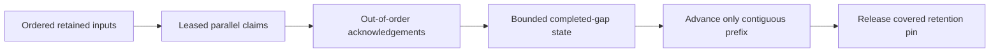

# ADR-027: Durable consumer groups with contiguous checkpoints

Status: Accepted; bounded-gap and RF3 qualification pending.

## Context and decision

Parallel consumers may finish later messages before earlier ones. A checkpoint that advances to the largest acknowledged position can permanently skip unfinished work. Each subscription group therefore persists independent deliveries and advances only through a contiguous completed prefix; later completions are recorded as bounded gaps.

Bound the gap window and in-flight state. Reaching the gap/quota limit applies backpressure rather than silently skipping work. Filters, seek, retention, group generation, and ownership epochs are persisted and fenced. A checkpoint is not an arbitrary caller-provided offset.

## Alternatives and consequences

Max-ACK checkpointing is rejected because it skips pending input. Strict sequential consumption avoids gap metadata but prevents parallelism. Bounded gap tracking balances concurrency with explicit backpressure. Each named group owns its own progress and retention relationship.

## Related requirements and implementation contract

Related: `REQ-MSG-003/AC-MSG-003`, `REQ-FEED-004/AC-FEED-004`, ADR-023/025/026/030; KL-089, KL-093, KL-098/099, KL-102. Current group types/behavior are in `src/KeyLoad.Core/Features/Messaging/Execution/SubscriptionGroups.cs`, `EventSources.cs`, and `src/KeyLoad.Abstractions/Features/EventStreams/Contracts/Subscriptions.cs`.

1. Freeze gap bounds, filter generation, checkpoint ownership, and retention-pin transition rules.
2. Test ACK beyond a pending gap, gap ceiling, restart, seek/filter changes, retained-history discovery, partition movement, and concurrent workers.
3. Implement persisted group/checkpoint state in Messaging within the same atomic command and use explicit generation fencing.
4. Restore older checkpoints paused; reconcile group ownership and history before enabling workers. Rollback must not move a visible checkpoint backward.
5. Qualify real workers/store/process and three-node failover through GitHub TUnit/recovery/RF3 workflows.

Existing tests include `SubscriptionTests.IndependentGroupsRetainOnePayloadAndAckOnlyAContiguousPrefix`, `GapWindowStopsNewClaimsUntilTheMissingPrefixIsAcknowledged`, and `SeekFencesOldTokensAndRequiresExplicitResume`; they do not qualify current delivery. Owner: Messaging with root owning Orleans worker and partition-movement joins.

# TASK-KL089-FILTER-GENERATION-CAS-001 — explicit paused filter generation update

Root-reviewed implementation contract. Private source remains uncompiled and unqualified. KL-089 canonical work requires independent groups, competing workers, bounded gaps, filter generations, coverage discovery and ownership epochs. REQ-MSG-003 / AC-MSG-003 and ADR-027 own contiguous progress; existing SubscriptionTests and SubscriptionRecoveryTests already prove native bounded contiguous ACK/seek basics. Their source does not prove the required Linux/public cohort. Current ConfigureSubscription always refuses a changed SubscriptionDefinition fingerprint with Conflict. Existing callers must create a new group identity; there is no in-place explicit filter-generation update. The proposed scope adds only that missing bounded operation. Dynamic new-partition coverage discovery is a distinct requirement, kept OPEN rather than implicitly advertised.

## Proposed public contract and exact schema ownership

Preserve ConfigureSubscriptionRequest existing alias and Id0 CommandId, Id1 Subscription, Id2 Definition, Id3 Start, Id4 Cursor exactly. Append nullable ExpectedGeneration Id5 (audited currently unused) with native generated serialization and public JSON omit-when-null. Existing requests with null retain exact create/identical-definition behavior and changed-definition Conflict. ExpectedGeneration is an explicit CAS request, never trusted role or read proof. Positive expected value and EXISTING group required; absent group must refuse, not silently create. CAS filter update permits ONLY Start.FromBeginning plus Cursor=null as closed unused-offset shape; it cannot implicitly seek a caller offset. No new OperationKind/GrainReadKind/alias/routes/tool variant, no legacy/migration fallback. Existing SDK and official MCP ConfigureSubscription carry the same additive typed field. Source owner: Abstractions/Features/EventStreams/Contracts/Subscriptions.cs.

## Native ordered behavior proposed for review

Keep the current command dispatch, actual ConnectionGrain call-local child, signed request, SourceResource, Definition limits/event-type checks, fresh DataPrincipal authorization/worker-input authorization and current SubscriptionManage caller authority unchanged and ahead of state mutation. For explicit expected generation: require actual existing group.Generation exact (RevisionConflict otherwise), group.Paused=true (Conflict otherwise), and actual Checkpoint lies in [head.FirstAvailablePosition-1, head.TailPosition] (HistoryUnavailable otherwise), allowing a genuinely caught-up or empty group. Preserve SAME subscription/source/partition identity and actual contiguous Checkpoint; no offset supplied by caller authorizes skipping.

If definition is byte/fingerprint-identical, return actual unchanged state under the same valid CAS and pause prerequisites. Otherwise bound the current-generation window scan using the actual existing Policy.MaxWindow+1 and current native batch/read guards; reject over-bound/corrupt rows before any mutation. Delete ONLY actual old-generation window rows in the SAME atomic transaction. Set the freshly validated Definition, Generation+1, OwnershipEpoch+1, IssuedPosition=existing.Checkpoint, Paused=true, SafeFailureCode=null; retain existing.Checkpoint and original completed historic rows/outcomes. Store through existing native GroupState codec and GroupInfo (no GroupState field/alias change). An explicit existing SetSubscriptionPaused with actual new generation is still required to deliver. Old tokens fail TokenInvalidated; new filter deterministically evaluates retained pending positions from Checkpoint+1. No lease retry, deadline/quota/default change, fake time or second dispatcher.

Core owner: Features/Messaging/Commands/SubscriptionDefinitionUpdates.cs new small native partial helper reached ONLY from the existing validated ConfigureSubscription branch in Execution/SubscriptionGroups.cs. Do not alter seek/ordinary Configure/Receive/ACK behavior. New constants are feature-local domain-named; no public error-detail weakening. Existing native apply/WAL/RF3 rollback and original failed-outcome retention remain authoritative. Storage ownership remains PartitionHost.

## Complete regression and rollout gates

Native Unit: real topic with retained positions and two independent groups; out-of-order ACK leaves true pending prefix; active update rejects with complete raw group/window/source/receipt image unchanged except exact original failed outcome; pause, stale CAS/offset/cursor/absent group/malformed definition/fresh denied manager reject; correct CAS changes only actual bounded window/current group, preserves checkpoint, advances both fences, retains source history; old token refuses, explicit resume replays all still-pending matching positions, closes gaps; actual same-directory cold owner reopen retains original receipts/group state, fresh healthy publisher and ACK succeed. Preserve all existing SubscriptionTests Args and meaningful full operation oracles.

Public RF3: genuine private Aspire three-owner SAME volumes; .NET SDK and official MCP Configure/status/receive/ACK/pause/update/seek/read. Two actual competing persisted principals and independent groups; bounded window/backpressure, genuine out-of-order ACK and actual failed CAS with unchanged public full state; original operation receipts replay through both transports; first SAME-root cold BEFORE generation update proves retained progress. Perform valid paused update under actual persisted manager, old tokens/refused epoch unchanged, resume explicitly and deliver retained history under new filter; second cold plus full literal source/topic/document processing/no-repeat/healthy receipt proof. Original lifetime/clock/limits/50 independent slots unchanged. No raw node-local substitute for public proof.

Root approved this exact public semantics before implementation. Root alone integrates/builds/discovers actual Linux source/PDB/native UID and runs normal/scalar Unit, mandatory process recovery and full RF3 SDK/MCP gates. Source does not close coverage discovery, restore/failover, race/resource/performance or whole KL-089 acceptance. Rollback removes the additive field/helper/cases before release; existing old field IDs/aliases and persisted records remain exact. Shared append docs Messaging/ADR027 are root-unioned with current KL086/KL088 ancestors, never blind guard refresh.

### TASK-KL089-FILTER-GENERATION-CAS-001 implementation and exact source map

The finite source proposal appends only ConfigureSubscriptionRequest.ExpectedGeneration Id5 and the Core SubscriptionDefinitionUpdates owner. GroupState and GroupDelivery fields/aliases stay unchanged: actual per-delivery PrincipalId/LeaseVersion belong to the old window; existing GroupClaims checks both generation and ownership epoch before lease expiry. The update scans only the old current-generation prefix (MaxWindow+1), validates complete decoded record/key/position/state and page exhaustion before any delete, then atomically advances both fences. Same-definition valid paused CAS is an actual no-op state result. Null ExpectedGeneration preserves the original behavior. A caught-up/empty source is admitted by the explicit retained checkpoint interval; no implicit seek occurs.

Automated source identities (uncompiled/unexecuted in this worker):
- KeyLoad.UnitTests.Features.Messaging.SubscriptionFilterGenerationTests.PausedFilterCasPreservesGapFencesBothWorkersAndColdOriginalReceipts: actual native topic/window/gap, CAS/policy-shape refusals, exact scoped raw image, copied actual own-row corruption/excess-window refusal then exact owned row repair, two native same-directory cold cuts, original result replay, pending filter replay, independent progress, caught-up group and healthy publish/ACK.
- KeyLoad.IntegrationTests.Features.Messaging.SubscriptionFilterGenerationRf3Tests.CompetingWorkersPausedFilterCasAndContiguousGapsSurviveTwoColdCutsWithOriginalReceipts: actual two persisted workers/manager; SDK and official MCP claim/ACK/status/window backpressure; active/stale/offset/cursor/absent/malformed/null-change refusals; paused identical CAS; policy2 deny/restored3 historic receipt fencing; two true same-volume RF3 cold cuts; original current-policy update receipt through SDK/MCP/Q1 CALL; pending refilter/gap closure; atomic processing/document/source history and healthy empty receive. Original HTTP/ConnectionGrain/task/auth owners, same-partition atomicity and the existing whole cancellation lifetime remain unchanged; fresh GUID-owned fixture is ordinary native50, no blanket serial attribute.
- KeyLoad.RecoveryTests.Features.Messaging.SubscriptionFilterProcessRecoveryTests.FilterGenerationAndOldWindowRecoverAsOneNativeTransaction: seven native CommitStage/MutationApplied arguments (HeaderWritten0, PayloadWritten0, JournalFlushed0, MutationApplied0/1/2, ApplyCompleted0). Real original child is killed at the existing canonical boundary. Recovery permits only the original old generation+whole window/no outcome or new generation+no old window/actual outcome; JournalFlushed-or-later requires the new state. Same saved original CAS replay, old token refusal, explicit resume/ACK and healthy publish/ACK are required. Existing original20s process bound remains unchanged; process-kill is not power-loss evidence.

Root owns actual canonical build/analyzers, native source/PDB/UID discovery, normal/scalar Unit, all required process recovery and genuine Linux Docker/Aspire RF3. These nine authored source-case identities are not a compiled/native census or PASS. Dynamic new-partition coverage discovery, race/endurance/performance and the rest of whole KL089 remain OPEN; this finite CAS stage does not claim task completion. Existing SubscriptionTests, SubscriptionRecoveryAndPolicyTests and seven SubscriptionProcessRecoveryTests remain mandatory and unchanged. Shared Messaging appendage requires root's explicit append-union with other pending queue stages rather than overwriting their text.
