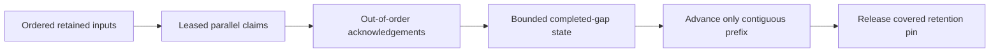

# ADR-027: Durable consumer groups with contiguous checkpoints

Status: Accepted; bounded-gap, migration, and RF3 qualification pending.

## Context and decision

Parallel consumers may finish later messages before earlier ones. A checkpoint that advances to the largest acknowledged position can permanently skip unfinished work. Each subscription group therefore persists independent deliveries and advances only through a contiguous completed prefix; later completions are recorded as bounded gaps.

Bound the gap window and in-flight state. Reaching the gap/quota limit applies backpressure rather than silently skipping work. Filters, seek, retention, group generation, and ownership epochs are persisted and fenced. A checkpoint is not an arbitrary caller-provided offset.

## Alternatives and consequences

Max-ACK checkpointing is rejected because it skips pending input. Strict sequential consumption avoids gap metadata but prevents parallelism. Bounded gap tracking balances concurrency with explicit backpressure. Each named group owns its own progress and retention relationship.

## Related requirements and implementation contract

Related: `REQ-MSG-003/AC-MSG-003`, `REQ-FEED-004/AC-FEED-004`, ADR-023/025/026/030; KL-089, KL-093, KL-098/099, KL-102. Current group types/behavior are in `src/KeyLoad.Core/Features/Messaging/Execution/SubscriptionGroups.cs`, `EventSources.cs`, and `src/KeyLoad.Abstractions/Features/EventStreams/Contracts/Subscriptions.cs`.

1. Freeze gap bounds, filter generation, checkpoint ownership, and retention-pin transition rules.
2. Test ACK beyond a pending gap, gap ceiling, restart, seek/filter changes, retained-history discovery, migration, and concurrent workers.
3. Implement persisted group/checkpoint state in Messaging within the same atomic command and use explicit generation fencing.
4. Restore older checkpoints paused; reconcile group ownership and history before enabling workers. Rollback must not move a visible checkpoint backward.
5. Qualify real workers/store/process and three-node failover through GitHub TUnit/recovery/RF3 workflows.

Existing tests include `SubscriptionTests.IndependentGroupsRetainOnePayloadAndAckOnlyAContiguousPrefix`, `GapWindowStopsNewClaimsUntilTheMissingPrefixIsAcknowledged`, and `SeekFencesOldTokensAndRequiresExplicitResume`; they do not qualify current delivery. Owner: Messaging with root owning Orleans worker and migration joins.
