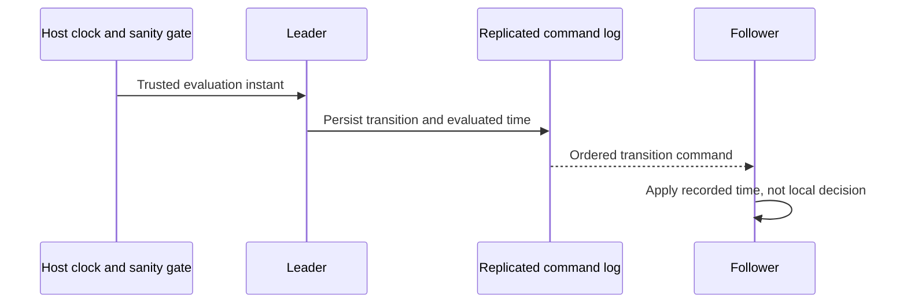

# ADR-028: Persisted scheduling with logged evaluation time

Status: Accepted; scheduler service, clock-sanity, and failover qualification pending.

## Context and decision

Queue due times, retries, lease expiry, and recurring work must transition consistently across restart and replicas. A follower cannot independently decide a time-based state transition using its local wall clock. The current command envelope records an evaluated time; the complete persisted scheduler/coordinator and clock-health gate are not established by that source alone.

Make time-dependent transitions deterministic from a canonical logged evaluation instant and persisted schedule state. The leader must pass the accepted clock-sanity/readiness gate before proposing transitions; replicas apply the recorded instant. `TimeProvider.System` remains the host-wide runtime clock; this decision does not freeze or replace it. No worker-local timer may be treated as canonical authority.

## Alternatives and consequences

Each replica consulting local time is rejected because skew creates divergent state. A per-message timer is rejected because it is not restart durable and scales allocations with queue depth. Logged evaluation time yields deterministic apply but requires monitoring clock uncertainty and bounded scheduler lag.

## Related requirements and implementation contract

Related: `REQ-MSG-004/AC-MSG-004`, `REQ-REP-002/AC-REP-002`; ADR-003, ADR-026, ADR-031; KL-052, KL-088, KL-092, KL-093, KL-100, KL-102. Current source: `src/KeyLoad.Core/Messaging.cs`, `src/KeyLoad.Core/DatabaseEngine.cs`, replicated operation envelopes. Target scheduler belongs under `src/KeyLoad.Core/Features/Messaging/`; cluster coordination belongs under `src/KeyLoad.Orleans/Features/ClusterRouting/`, with message contracts in the canonical Messaging slices.

1. Freeze accepted clock skew, readiness/error behavior, evaluation-time encoding, and transition semantics.
2. Test due/not-due boundaries, retry jitter determinism, restart, lease-expiry races, replica skew, leader change, and clock-uncertain denial.
3. Implement a persisted bounded scheduler/seek index under `src/KeyLoad.Core/Features/Messaging/` and append transitions with canonical evaluated time; keep cluster coordination in `src/KeyLoad.Orleans/Features/ClusterRouting/` and preserve `TimeProvider.System` for host scheduling and timeout infrastructure.
4. Roll out with versioned schedule records and replay tests; rollback pauses scheduling while retaining canonical pending entries.
5. Qualify process recovery, real RF3 leaders/followers, and operator readiness signals through GitHub Actions only.

Current `MessagingTests` cover queue time behavior, but a full scheduler gate is planned. Owner: Messaging plus ClusterReplication/Orleans; dependencies: persisted command time, resource governor, and ADR-036 foundation.
