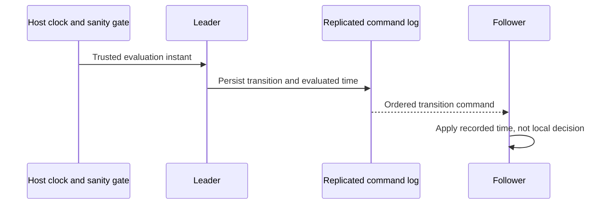

# ADR-028: Persisted scheduling with logged evaluation time

Status: Accepted; scheduler service, clock-sanity, and failover qualification pending.

## Context and decision

Queue due times, retries, lease expiry, and recurring work must transition consistently across restart and replicas. A follower cannot independently decide a time-based state transition using its local wall clock. The current command envelope records an evaluated time; the complete persisted scheduler/coordinator and clock-health gate are not established by that source alone.

Make time-dependent transitions deterministic from a canonical logged evaluation instant and persisted schedule state. The leader must pass the accepted clock-sanity/readiness gate before proposing transitions; replicas apply the recorded instant. `TimeProvider.System` remains the host-wide runtime clock; this decision does not freeze or replace it. No worker-local timer may be treated as canonical authority.

## Alternatives and consequences

Each replica consulting local time is rejected because skew creates divergent state. A per-message timer is rejected because it is not restart durable and scales allocations with queue depth. Logged evaluation time yields deterministic apply but requires monitoring clock uncertainty and bounded scheduler lag.

## Related requirements and implementation contract

Related: `REQ-MSG-004/AC-MSG-004`, `REQ-REP-002/AC-REP-002`; ADR-003, ADR-026, ADR-031; KL-052, KL-088, KL-092, KL-093, KL-100, KL-102. Current source: `src/KeyLoad.Core/Features/Messaging/Execution/Messaging.cs`, `src/KeyLoad.Core/DatabaseEngine.cs`, replicated operation envelopes. Target scheduler belongs under `src/KeyLoad.Core/Features/Messaging/`; cluster coordination belongs under `src/KeyLoad.Orleans/Features/ClusterRouting/`, with message contracts in the canonical Messaging slices.

1. Freeze accepted clock skew, readiness/error behavior, evaluation-time encoding, and transition semantics.
2. Test due/not-due boundaries, retry jitter determinism, restart, lease-expiry races, replica skew, leader change, and clock-uncertain denial.
3. Implement a persisted bounded scheduler/seek index under `src/KeyLoad.Core/Features/Messaging/` and append transitions with canonical evaluated time; keep cluster coordination in `src/KeyLoad.Orleans/Features/ClusterRouting/` and preserve `TimeProvider.System` for host scheduling and timeout infrastructure.
4. Use the current schedule-record contract and replay tests; rollback pauses scheduling while retaining canonical pending entries.
5. Qualify process recovery, real RF3 leaders/followers, and operator readiness signals through GitHub Actions only.

Current `MessagingTests` cover queue time behavior, but a full scheduler gate is planned. Owner: Messaging plus ClusterReplication/Orleans; dependencies: persisted command time, resource governor, and ADR-036 foundation.

## Embedded final clock ordering, TASK-EMBEDDED-CLOCK-ORDER-001

EmbeddedCoordinator is the product-owned real standalone admission coordinator over DatabaseEngine and its native ZoneTree Store.Commit gate. For coordinator-owned JSON/native submissions, bounded validation/normalization stays before commit; the final EvaluationClock.GetUtcNow sample is selected inside the original Store.Commit callback immediately before the existing ApplyCommittedCommand. Retain exactly one commit and the shared authorization/outcome/fingerprint/strict ValidateCommandClock pipeline. Public Apply(ReplicatedOperation, replicationIndex) retains supplied canonical EvaluatedAt unchanged. This matches RF3 ReplicaLeader final timestamp selection under rounds and state.LockedAsync before ordered append; embedded ownership does not qualify RF3. No clamp, retry, backward-clock acceptance, fence reset or second coordinator lock is allowed. Cancellation is rechecked inside admission before clock selection; synchronous original apply settles before return. TASK-EMBEDDED-CLOCK-ORDER-001 maps REQ-REP-001 and AC-REP-001, and native durable-job clock/owner contracts under ADR-028/ADR-110. Preserve original R308 four journal-fence failures. Root validates all five NativeSagaTimeoutFunctionalTests actual native job operations, plus existing strict stale-clock/replay tests, normal/scalar and required Linux/RF3 gates. No result or source review closes these runtime predicates.

## Native fixture default-time admission, TASK-TEST-EMBEDDED-CLOCK-ORDER-001

TASK-TEST-EMBEDDED-CLOCK-ORDER-001: TestDatabase is the shared test owner of a genuine native ZoneTree DatabaseEngine. Submit without explicit time must use existing DatabaseEngine.ApplyEmbedded, which selects final business time inside the original ordered Store.Commit callback. Submission with explicit DateTimeOffset retains public Apply and its strict supplied-clock/replay/outcome semantics. Preserve the same stable operation ID, serialization, principal, errors and one real commit; no clamp, retry, mock coordinator, new gate or fenced-manager reset. This fixture composition refines TestInfrastructure actual-operation evidence (REQ/AC-TEST-010) and ADR-028 embedded clock ordering, not RF3 topology or clock qualification. NativeSagaTimeout shared PerTestSession fixture concurrently admits default CompleteSaga/CancelSaga/ConfigurePrincipal/revocation operations while native durable-job journal removal commits; pre-gate default clock sampling can therefore race the later committed instant. Existing five actual NativeSagaTimeoutFunctionalTests plus explicit stale-clock/ClockUncertain/replay tests, full normal/scalar and Linux gates remain required. Original R308 journal fences remain immutable evidence; no runtime success is claimed.

## Saga deadline construction and admission

TASK-TEST-SAGA-DEADLINE-ORDER-002 freezes CreateWaitingSaga intent: sampled now constructs dueAt, persisted CompareExchangeSaga.Deadline and identical DueWorkHint.DueAt. It is not an externally authoritative command evaluation instant. Sample deadline construction from the owning Database.EvaluationClock, preserve unchanged DueOffset/CompletionTimeout arithmetic and the exact canonical deadline/hint. Submit without explicit time selects final operation evaluation inside existing ApplyEmbedded commit admission. Never widen deadline, clamp time, retry or reset the native journal fence. Explicit-time canonical clock/replay regressions elsewhere remain unchanged. Existing five genuine NativeSagaTimeoutFunctionalTests deadline/effect/stale/revoked/completed/canceled and healthy control-job oracles remain required, along with original R317 outcomes before join.

### TASK-TEST-R382-NATIVE-OWNER-EXPIRY-001

REQ-TEST-010 / AC-TEST-010 and REQ-MSG-007 / AC-MSG-007: original R382 native failure evidence is retained. Each actual native TestCluster builder carries one private fixture-owner token in its Properties; actual ISiloBuilder.Configuration resolves only that owning fixture. A separately owned fixture cannot replace or clear another builder's owner. Register before native build/start, unregister only the same owner during its original joined cleanup; startup failures retain original failure and database cleanup failures. No new product hook, alternate coordinator, timeout or provider. Existing shared PerTestSession and owned boundary fixtures keep their actual native Orleans/ZoneTree lifetimes.

The parent expiry whole-flow advances the actual owning clock two minutes after the first committed claim. Its unchanged default30second lease has then expired. Canonical receive replay reauthorizes that lease (CommandOutcomes.ValidateCachedQueueReceive -> Messaging.Lease) and must return exact Rejected/LeaseExpired with null result; serializing that null as a recovered receipt was the test error. Assert complete outer/lane identity, typed failure, no stop error, unchanged original persisted ReceiveResult bytes, every native store byte and position, followed by fresh healthy receive. Never extend lease or parent deadline, reset clock, disable strict native validation or invent a result. Existing valid receipt replay cases remain intact. Fresh original focused normal/scalar, full native and Linux gates are required; no source-only PASS or closure.
