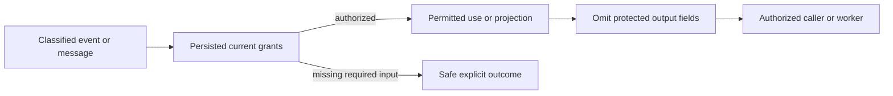

# ADR-029: Event and message classification with safe diagnostics

Status: Accepted; cross-surface privacy and worker qualification pending.

## Context and decision

Event payloads, queue bodies, headers, dead-letter records, replay inputs, and projection lineage may contain PII or secrets. Generic database permissions are insufficient when payload fields need different read/use/write policy or a worker needs a protected input for processing. Diagnostics and errors must not turn a denied field into an output leak.

Persist field/header classifications and separate raw-read, field-use, and field-write grants. Project returned payloads through the common safe projector; omitted values stay absent by default. A worker missing a required input grant receives an explicit safe denial before claim/processing effects. Reclassification/revocation is enforced on the next authorized request; secret/token values are never logged.

## Alternatives and consequences

One broad resource-read grant is rejected because it cannot protect individual fields or distinguish computation from disclosure. Returning raw payload to trusted application code is rejected as a default. Fine-grained grants require schemas, lineage propagation, and review of every projection/replay/diagnostic path.

## Related requirements and implementation contract

Related: `REQ-AUTH-006..009/AC-AUTH-006..009`, `REQ-MSG-002/AC-MSG-002`, `REQ-FEED-002/AC-FEED-002`, ADR-014/015/022/026; KL-062..068, KL-096/097, KL-103. Current checks are in `src/KeyLoad.Security/Features/Authorization/Execution/AuthorizationPolicy.cs`, `src/KeyLoad.Core/MutationAuthorization.cs`, `EventSources.cs`, `Messaging.cs`; feature contracts are [Authorization](../Features/Authorization.md), [Messaging](../Features/Messaging.md), and [ChangeFeeds](../Features/ChangeFeeds.md).

1. Freeze classification vocabulary, grant separation, schema evolution, and safe diagnostic policy.
2. Add real persisted-policy canary tests across read, search, event, queue, DLQ, replay, projection, and required worker input.
3. Implement one projector and lineage propagation; each feature owner applies its own source authorization before projection or processing.
4. Reclassification preserves restrictive defaults and invalidates affected cached/cursor authority; rollback cannot expose raw output that current policy denies.
5. Qualify unauthorized output absence and no-effect denial in GitHub unit, recovery, and RF3 .NET/MCP suites; inspect logs/artifacts for canaries.

Current security tests cover document/query and feed paths; event/message-wide coverage and current integrated qualification remain pending. Root joins cross-slice policy changes. Public callers never provide trusted roles.

## KL-096 immutable delivery replay and current classification

REQ/AC-AUTH-006/007/008/009 and REQ/AC-MSG-002 require current persisted field/header policy to protect an original successful queue or subscription receive replay. The original StoredOutcome bytes, original principal-policy fence, group generation/ownership, token and lease fences remain exact. A resource-only policy CAS may change its SchemaVersion without changing principal PolicyEpoch; after successful original lease validation, cached output must therefore be checked against the current projector in the same existing synchronous IKeyValueView. Queue output uses current caller; subscription output uses current persisted data principal followed by current caller, matching genuine acquisition. No nested storage read or await is introduced.

If the common current projector removes an actually retained JSON value, replay refuses PermissionDenied with fixed safe detail and no payload. Complete semantic JSON equality allows formatting changes and hidden paths absent from the retained value; it does not rewrite or redact an original receipt into a different successful receipt. The original outcome, canonical input body, lease and counters stay unchanged. Parsing remains within the existing admitted JSON/receive bounds; no new grant, limit, serializer ID, persisted family, provider, clock, retry or deadline is introduced. Higher-epoch repair never makes an old-epoch result replayable: fresh authorized work produces its own original outcome.

Ordered ownership: specs/ADR first; Core Authorization/Validation owns cached projection validation; CommandOutcomes composes it after real lease validation; native whole Unit plus real SDK/official MCP/both Q1 cases own full body/header, denial/no-effects, persisted revoke/repair, DLQ inheritance and same-root cold continuation. Original native outcome bytes are an independent local authority oracle. Normal/scalar, process and Aspire RF3 Linux source/image/UID/runtime gates remain open until actual qualification. Existing migration/conversion/fallback prohibitions remain exact; this is current-schema authorization, not stored-format compatibility.

TASK-AUTH-KL096-CACHED-DELIVERY-001 source map: existing `src/KeyLoad.Core/CommandOutcomes.cs` calls new `src/KeyLoad.Core/Features/Authorization/Validation/CachedDeliveryPrivacy.cs` strictly after native lease validation. `EventMessageSensitiveReplayTests.CurrentResourceBodyAndHeaderPolicyRefusesOriginalDeliveryThenRepairedNewWorkAndColdPreserveExactAuthority` declares four genuine native operation variants: queue body, queue header, subscription caller body and subscription data-principal header. Each variant includes original complete result/native outcome bytes, resource-only reclassification, no-body/no-effect refusal, required-input refusal, persisted revoke/higher-epoch repair, old-result denial, new-result replay, same-root reopen and final ACK/empty continuation. `AbsentProtectedPathPreservesCompleteUnicodeArrayReceiptAfterCurrentPolicyChangeAndColdThenDeniedProducerAndFreshHealthyWork` is the complete safe-replay control: Unicode, ordered arrays and null values stay semantically unchanged while an absent protected path causes harmless JSON formatting; original complete outcome replays unchanged through cold, denied producer has no effect, and new authorized work completes.

`EventMessageSensitivePublicRf3Tests.CurrentBodyHeaderPoliciesRevokeRepairOriginalRefusalFreshDeliveryDlqAndSameOwnerColdFourRoutes` declares the same four current-policy authority variants with real SDK/official MCP/both Q1 routes, persisted inspector omission, required-input refusal, revoke/repair, immutable old-command refusal, new authorized full result/receipt replay and genuine three-node same-owner cold. Queue variants additionally use actual NACK/max-attempt terminal admission, full policy-inherited DLQ inspection and actual state-version/delivery-generation redrive. Each original producer/completion/redrive receipt is compared completely on all four routes; current read generation/applied cut is acquired fresh and can advance on restart. The fixture chooses existing default policy's admitted lease maximum without changing policy ceilings or the original whole-flow deadline. Native test UIDs/counts are not inferred from these source declarations.

Exact role ownership stays under Authorization Cases/Contracts/Models/Helpers/Assertions in Unit and Integration. The existing fixture and caller owners retain credential validation, real official SDK initialization, connection lifetime, RF3 readiness, original operation cancellation and joined cleanup. Specs/ADR, guarded private source, coherent root join, canonical compiler/analyzers/format, actual discovery, normal/scalar Unit, process recovery and Linux Aspire RF3 are sequential gates. This source stage does not qualify process-kill behavior, power loss, performance, complete event/message export/trace lineage or production readiness. No internal compatibility/migration path exists; rollback removes the composed source stage before delivery and preserves immutable original evidence.
