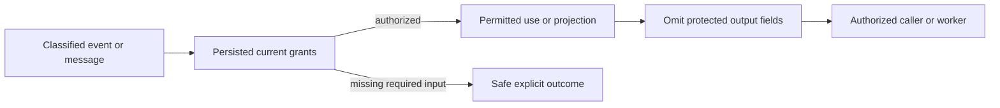

# ADR-029: Event and message classification with safe diagnostics

Status: Accepted; cross-surface privacy and worker qualification pending.

## Context and decision

Event payloads, queue bodies, headers, dead-letter records, replay inputs, and projection lineage may contain PII or secrets. Generic database permissions are insufficient when payload fields need different read/use/write policy or a worker needs a protected input for processing. Diagnostics and errors must not turn a denied field into an output leak.

Persist field/header classifications and separate raw-read, field-use, and field-write grants. Project returned payloads through the common safe projector; omitted values stay absent by default. A worker missing a required input grant receives an explicit safe denial before claim/processing effects. Reclassification/revocation is enforced on the next authorized request; secret/token values are never logged.

## Alternatives and consequences

One broad resource-read grant is rejected because it cannot protect individual fields or distinguish computation from disclosure. Returning raw payload to trusted application code is rejected as a default. Fine-grained grants require schemas, lineage propagation, and review of every projection/replay/diagnostic path.

## Related requirements and implementation contract

Related: `REQ-AUTH-006..009/AC-AUTH-006..009`, `REQ-MSG-002/AC-MSG-002`, `REQ-FEED-002/AC-FEED-002`, ADR-014/015/022/026; KL-062..068, KL-096/097, KL-103. Current checks are in `src/KeyLoad.Security/Features/Authorization/Execution/AuthorizationPolicy.cs`, `src/KeyLoad.Core/MutationAuthorization.cs`, `EventSources.cs`, `Messaging.cs`; feature contracts are [Authorization](../Features/Authorization.md), [Messaging](../Features/Messaging.md), and [ChangeFeeds](../Features/ChangeFeeds.md).

1. Freeze classification vocabulary, grant separation, schema evolution, and safe diagnostic policy.
2. Add real persisted-policy canary tests across read, search, event, queue, DLQ, replay, projection, and required worker input.
3. Implement one projector and lineage propagation; each feature owner applies its own source authorization before projection or processing.
4. Reclassification migration preserves restrictive defaults and invalidates affected cached/cursor authority; rollback cannot expose prior raw output.
5. Qualify unauthorized output absence and no-effect denial in GitHub unit, recovery, and RF3 .NET/MCP suites; inspect logs/artifacts for canaries.

Current security tests cover document/query and feed paths; event/message-wide coverage and current integrated qualification remain pending. Root joins cross-slice policy changes. Public callers never provide trusted roles.
