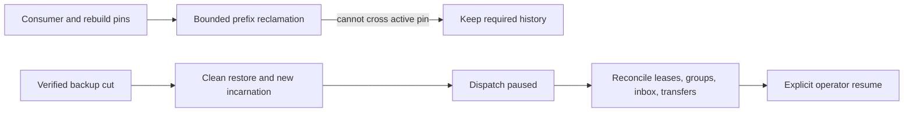

# ADR-030: Retention pins and paused restore of an older cut

Status: Accepted; cluster cut/reconciliation and delivery resumption qualification pending.

## Context and decision

Feeds, projection rebuilds, consumer groups, inbox deduplication, transfer intents, and receipts depend on retained history for different horizons. Purging beyond an active consumer's required prefix can make recovery silently incomplete. Restoring an older snapshot can roll back leases, checkpoints, and external-delivery receipts, so external work must not resume automatically.

Persist retention pins for active consumers/rebuilds/transfers and report history loss explicitly. Restore verifies the manifest, creates a new incarnation, invalidates old tokens, and starts with dispatch paused. Operators reconcile group/lease/inbox/transfer state against retained history before explicit resume. This is a fail-closed boundary, not a claim of global consistency for current local backups.

## Alternatives and consequences

Unpinned time-based deletion is rejected because a slow or rebuilding consumer could miss required input. Automatic redelivery after restoring an older cut is rejected because an external effect may already have occurred. Explicit pause adds operator steps but avoids silently duplicating or losing external work.

## Related requirements and implementation contract

Related: `REQ-BACKUP-003..004/AC-BACKUP-003..004`, `REQ-FEED-004..005/AC-FEED-004..005`, `REQ-MSG-003/006`; ADR-008/017/023/025/026/027; KL-005, KL-042, KL-089, KL-094, KL-098/099/104. Current local restore is in `src/KeyLoad.Storage.ZoneTree/ZoneTreeStore.cs`; outbox pins are in `src/KeyLoad.Core/Features/ChangeFeeds/Execution/ProjectionOutbox.cs`; detailed feed design is `docs/design/change-feeds.md`.

1. Freeze which state classes create pins, how pins expire/release, restore cut format, and manual reconciliation responsibilities.
2. Test pin floor, bounded purge, restore corruption, new incarnation, stale token rejection, paused dispatch, and no automatic external redelivery.
3. Implement pin and manifest support in owning ChangeFeeds/Messaging/BackupRestore slices; coordinate all record classes through the root recovery owner.
4. Roll out restore as paused by default; rollback returns to the prior validated database, not an unverified partially resumed older cut.
5. Qualify real process recovery and Docker/Aspire RF3 restore/leader-loss scenarios in GitHub. Power-loss and endurance need separate gates.

Current source has local backup restore and outbox retention pins. Cluster-wide per-partition cut vectors and complete eventing-state restore remain planned. No test title alone constitutes a qualification result.

### TASK-BACKUP-EVENTING-CUT-001 (KL-098 local capability-state proof)

Freeze before code under REQ/AC-BACKUP-001/002/003/004, REQ/AC-EVENT-004/005/006 and REQ/AC-MSG-003/005/006: seed actual native resources, three canonical source events, two independent subscription groups, an out-of-order completion gap, one persisted subscription-processing inbox with document+queue effects, and a real leased queue message. Capture the native backup cut, pack/unpack the genuine current-format artifact, restore into a clean target and reopen real ZoneTree. Independently require stable positions/content/generation, literal group checkpoint/issued/gap state, exact document/message state and byte-identical retained event/subscription/inbox/queue/outbox records. Manifest/source cut and single restore-authority position increment are exact; archive bytes remain unchanged.

Before explicit operator resume, fresh subscription and queue receive must fail exactly DispatchPaused and old source cursor/delivery tokens and pre-restore original command outcomes must fail exactly TokenInvalidated without effects. Persisted narrow principal denial remains enforced. Failed owned Apply outcomes commit exactly once and same-ID failed replay preserves complete result and store position. Old stored outcomes are retained; no old incarnation receipt is fabricated as current success.

Reconcile through existing public native operations only: explicitly seek the restored group from retained beginning to a new subscription generation, clear that group's explicit pause, explicitly set dispatch running as administrator, and obtain genuine new-incarnation claims. Reprocess the already completed source position using the same handler scope/execution generation: the persisted inbox returns AlreadyProcessed with original effects token and no second document/enqueue. Close contiguous gaps with actual acknowledgements. A new bounded producer/claim/ack and final close/reopen prove healthy continuation and all canonical state. Use no sleeps, fake providers, raw system-key resume or implementation-only migration APIs.

This closes only the missing local eventing artifact-state regression. KL-098 consumer/rebuild/transfer retention pins, event/topic purge/receipt horizon, history-loss reconciliation, remote-transfer KL094 and cluster-wide per-partition backup cut remain distinct open criteria. Current public event/topic APIs expose caps, reads and subscription seek, but no event/topic purge/pin implementation; the test must not synthesize history loss by deleting canonical keys or advertise local backup as a cluster cut. Existing outbox purge/pin and remote-transfer suites remain mandatory.

Ownership: UnitTests BackupRestore Cases/Fixtures/Assertions/Helpers; native artifacts and ZoneTree product APIs unchanged. Ordered join: contract, test-only implementation, root format/build and full normal/scalar native execution with exact original source/DLL identities; Linux recovery/RF3/global gates unchanged. No coverage inventory edit or status closure. Failure retains owned source/backup/target root and original primary plus joined disposal errors. No product seam, format/serializer/public contract change. Rollback removes this task and its test-only flow; no old report is rewritten.

Independent R2 review tightens the literal healthy continuation oracle: all new EventData fields, RecordedAt/sequence/source, delivered queue payload/headers/attempt/lease version/generation/deadline, and complete canonical Acked metadata/body absence must match independent literals. The signed delivery token is required nonempty and verified by the actual authorized ACK. The original derived message remains leased with its exact original literal metadata/body; no lease reset, expiry wait or synthetic body is introduced. Reopening the real target repeats the complete final state assertions.
