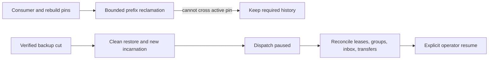
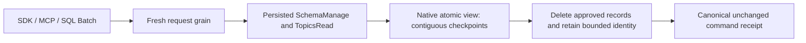

# ADR-030: Retention pins and paused restore of an older cut

Status: Accepted; cluster cut/reconciliation and delivery resumption qualification pending.

## Context and decision

Feeds, projection rebuilds, consumer groups, inbox deduplication, transfer intents, and receipts depend on retained history for different horizons. Purging beyond an active consumer's required prefix can make recovery silently incomplete. Restoring an older snapshot can roll back leases, checkpoints, and external-delivery receipts, so external work must not resume automatically.

Persist retention pins for active consumers/rebuilds/transfers and report history loss explicitly. Restore verifies the manifest, creates a new incarnation, invalidates old tokens, and starts with dispatch paused. Operators reconcile group/lease/inbox/transfer state against retained history before explicit resume. This is a fail-closed boundary, not a claim of global consistency for current local backups.

## Alternatives and consequences

Unpinned time-based deletion is rejected because a slow or rebuilding consumer could miss required input. Automatic redelivery after restoring an older cut is rejected because an external effect may already have occurred. Explicit pause adds operator steps but avoids silently duplicating or losing external work.

## Related requirements and implementation contract

Related: `REQ-BACKUP-003..004/AC-BACKUP-003..004`, `REQ-FEED-004..005/AC-FEED-004..005`, `REQ-MSG-003/006`; ADR-008/017/023/025/026/027; KL-005, KL-042, KL-089, KL-094, KL-098/099/104. Current local restore is in `src/KeyLoad.Storage.ZoneTree/ZoneTreeStore.cs`; outbox pins are in `src/KeyLoad.Core/Features/ChangeFeeds/Execution/ProjectionOutbox.cs`; detailed feed design is `docs/design/change-feeds.md`.

1. Freeze which state classes create pins, how pins expire/release, restore cut format, and manual reconciliation responsibilities.
2. Test pin floor, bounded purge, restore corruption, new incarnation, stale token rejection, paused dispatch, and no automatic external redelivery.
3. Implement pin and manifest support in owning ChangeFeeds/Messaging/BackupRestore slices; coordinate all record classes through the root recovery owner.
4. Roll out restore as paused by default; rollback returns to the prior validated database, not an unverified partially resumed older cut.
5. Qualify real process recovery and Docker/Aspire RF3 restore/leader-loss scenarios in GitHub. Power-loss and endurance need separate gates.

Current source has local backup restore and outbox retention pins. Cluster-wide per-partition cut vectors and complete eventing-state restore remain planned. No test title alone constitutes a qualification result.

### TASK-BACKUP-EVENTING-CUT-001 (KL-098 local capability-state proof)

Freeze before code under REQ/AC-BACKUP-001/002/003/004, REQ/AC-EVENT-004/005/006 and REQ/AC-MSG-003/005/006: seed actual native resources, three canonical source events, two independent subscription groups, an out-of-order completion gap, one persisted subscription-processing inbox with document+queue effects, and a real leased queue message. Capture the native backup cut, pack/unpack the genuine current-format artifact, restore into a clean target and reopen real ZoneTree. Independently require stable positions/content/generation, literal group checkpoint/issued/gap state, exact document/message state and byte-identical retained event/subscription/inbox/queue/outbox records. Manifest/source cut and single restore-authority position increment are exact; archive bytes remain unchanged.

Before explicit operator resume, fresh subscription and queue receive must fail exactly DispatchPaused and old source cursor/delivery tokens and pre-restore original command outcomes must fail exactly TokenInvalidated without effects. Persisted narrow principal denial remains enforced. Failed owned Apply outcomes commit exactly once and same-ID failed replay preserves complete result and store position. Old stored outcomes are retained; no old incarnation receipt is fabricated as current success.

Reconcile through existing public native operations only: explicitly seek the restored group from retained beginning to a new subscription generation, clear that group's explicit pause, explicitly set dispatch running as administrator, and obtain genuine new-incarnation claims. Reprocess the already completed source position using the same handler scope/execution generation: the persisted inbox returns AlreadyProcessed with original effects token and no second document/enqueue. Close contiguous gaps with actual acknowledgements. A new bounded producer/claim/ack and final close/reopen prove healthy continuation and all canonical state. Use no sleeps, fake providers, raw system-key resume or implementation-only migration APIs.

This closes only the missing local eventing artifact-state regression. KL-098 consumer/rebuild/transfer retention pins, event/topic purge/receipt horizon, history-loss reconciliation, remote-transfer KL094 and cluster-wide per-partition backup cut remain distinct open criteria. Current public event/topic APIs expose caps, reads and subscription seek, but no event/topic purge/pin implementation; the test must not synthesize history loss by deleting canonical keys or advertise local backup as a cluster cut. Existing outbox purge/pin and remote-transfer suites remain mandatory.

Ownership: UnitTests BackupRestore Cases/Fixtures/Assertions/Helpers; native artifacts and ZoneTree product APIs unchanged. Ordered join: contract, test-only implementation, root format/build and full normal/scalar native execution with exact original source/DLL identities; Linux recovery/RF3/global gates unchanged. No coverage inventory edit or status closure. Failure retains owned source/backup/target root and original primary plus joined disposal errors. No product seam, format/serializer/public contract change. Rollback removes this task and its test-only flow; no old report is rewritten.

Independent R2 review tightens the literal healthy continuation oracle: all new EventData fields, RecordedAt/sequence/source, delivered queue payload/headers/attempt/lease version/generation/deadline, and complete canonical Acked metadata/body absence must match independent literals. The signed delivery token is required nonempty and verified by the actual authorized ACK. The original derived message remains leased with its exact original literal metadata/body; no lease reset, expiry wait or synthetic body is introduced. Reopening the real target repeats the complete final state assertions.

## TASK-KL098-TOPIC-RETENTION-001 — bounded native topic purge

REQ-EVENT-RETENTION-001: `PurgeTopic(Topic, ThroughPosition, Generation)` is an inclusive same-partition Batch mutation through SDK CommitAsync, existing official MCP documents_commit and shared SQL CALL documents_commit decoder/request grain. Persisted SchemaManage AND TopicsRead are required before cached outcome replay. No new transport, provider or physical owner.

REQ-EVENT-RETENTION-002: delete only retained positions FirstAvailablePosition..ThroughPosition inclusive; reject nonpositive, beyond-tail or already-retained-away cuts, stale generation and scan/byte exhaustion. Every persisted same-source/generation group's contiguous Checkpoint pins all positions greater than Checkpoint, including paused/parked groups; IssuedPosition/ACK gaps do not release pins. Therefore requested cut must be <= every Checkpoint. Refusal is ResourceExhausted and cannot alter topic/group/inbox/queue state.

Every original native observer charges one examined record plus bytes before decoding, including range lookahead and missing point lookup; callbacks never escape native read ownership. All PurgeTopic effects in one owned ApplyMutations batch share one monotonically charged MaxScanRecords/MaxBatchBytes ledger; no reset per mutation. Native atomic write cancellation/admission remains owned by the original apply gate; this adds no separate token or deadline.

REQ-EVENT-RETENTION-003: atomically advance FirstAvailablePosition to cut+1 and subtract exact native serialized source bytes; preserve TailPosition, partition event sequence, generation, group/inbox/queue state, incarnation and backup identity. Retain only generated native typed event-ID digest/original position/generation in existing topic-event-id family. No bodies, fallback, migration or receipt pruning. Fresh identical event reuse remains DuplicateEventId; conflicting content remains Conflict; same immutable original command ID returns byte-identical receipt after purge.

AC-EVENT-RETENTION-001: genuine ZoneTree seeded three-event/two-group operation refuses unread and paused pins, releases only by existing exact ACK/explicit seek; bounded approved purge leaves literal event3 at original position/sequence3 and unchanged other model bytes, old read yields exact HistoryUnavailable; same-ID purge replay retains complete receipt and stable store cut.
AC-EVENT-RETENTION-002: post-purge original publish replay returns exact original receipt, fresh identical/conflicting event commands preserve exact distinct errors; denied caller cannot purge or replay privileged receipt, stale generation/cut/record/byte budget failures retain complete logical state and stable same-ID rejected outcomes; healthy next publish is position/sequence4.
AC-EVENT-RETENTION-003: native store reopen retains exact head, digest identities, group/checkpoint/inbox/queue state and receipts; shared real SQL compiler/decoder admits same Batch mutation; root must run native unit/scalar/recovery and genuine RF3 SDK/MCP before qualification. Automated owning cases: TopicRetentionOperationTests, TopicRetentionBoundaryTests; no source-only proof.

Implementation order: this contract first; Abstractions/EventStreams Contracts + generated native alias; Core/EventStreams Commands and Messaging publisher identity; existing Batch validation/auth/apply joins; UnitTests/EventStreams native operation fixtures/cases. Roll out only as a homogeneous freshly built native server cohort; do not downgrade a store whose journals/records retain the new generated aliases. Existing formats/aliases/field IDs are unchanged, with no mixed-version fallback. Historical digest count and receipt-horizon-wide storage bounds remain unqualified; active MaxEvents/MaxBytes is not reinterpreted as a lifetime-ID limit. Rollback source before qualification; persisted purge is deliberate irreversible data removal and has no migration rollback. Rebuild/transfer pins, receipt-horizon pruning, remote KL094 and complete KL098 closure remain explicitly incomplete.

### TASK-KL098-TOPIC-PURGE-CRASH-001: native admitted purge cuts

REQ-EVENT-RETENTION-004 / AC-EVENT-RETENTION-004: the real CrashHost first acknowledges purge through source position1, then arms the existing native CanonicalCrashBoundary for exactly the next Store.Commit position of immutable purge-through2. Two seeds admit either success (paused checkpoint3) or exact ResourceExhausted rejection (paused checkpoint1). Kill only the owned original process after its native phase marker; join original exit and both bounded readers, prove exclusive native locks, reopen actual ZoneTree. HeaderWritten/PayloadWritten are pre-flush boundaries; JournalFlushed is AFTER native durable flush returns and BEFORE native apply, not inside an OS flush syscall. MutationApplied0 and ApplyCompleted are actual native apply cuts. Pre-flush may recover old or whole new cut; post-flush must recover complete success/rejected receipt, never partial model changes.

The independent oracle requires literal head/events/source positions/digests/doc/queue/paused checkpoint plus original acknowledged seed receipt, canonical command fingerprint/receipt, exact committed clock and stable same-ID replay with full-store byte equality. Fresh identical/conflicting EventID errors remain distinct. Follow with actual append/read/queue claim and final native reopen. No new product seam/provider/journal/format/whitelist, sleeps, wider deadlines or retry-to-green. Root native discovery/build/recovery execution and exact source/DLL/PDB receipts are pending; process kill is not power-loss proof. Historical identity-population/horizon/rebuild/transfer/remote retention and full KL098 gates remain open.

Ownership: CrashHost EventStreams Contracts/Helpers, existing CrashHostApplication mode join; RecoveryTests EventStreams Cases/Processes/Assertions. Contracts join after TASK-KL098-TOPIC-RETENTION-001, then child/oracle; existing original process/readers/cleanup helpers are reused unchanged. Rollback removes this scenario/tests only, preserving product retention contract and immutable historical results.

### TASK-KL098-TOPIC-RETENTION-CORRUPTION-001

REQ-EVENT-RETENTION-005 / AC-EVENT-RETENTION-005: before an actual purge uses a persisted subscription pin, require its exact native canonical group key, positive subscription generation/ownership epoch, native definition/policy bounds and 0<=Checkpoint<=IssuedPosition<=the current source tail. GroupState has no source identity fields; source identity/generation comes from the canonical prefix, and subscription generation MUST NOT equal source generation by assumption. Paused/parked pins remain authoritative. Wrong native alias, extra key suffix and impossible persisted shape return exact Corruption, never silently pin/unpin. Reuse current native identifier/policy constants; no repository-wide group behavior change.

A retained-ID digest must be exactly 64 lowercase hexadecimal characters, with generation equal source generation and position within the actually purged prefix. A canonical active event and preexisting digest at the same ID is Corruption; purge must never overwrite it. Native wrong aliases remain Corruption with the retained-history detail, not DuplicateEventId/Conflict. Corruption is an existing fatal command-compilation boundary: exact KeyLoadException/Corruption escapes before canonical outcome or redo commit, so neither first call nor identical original-ID repeat advances position, clock, dedup or any canonical byte. It must not be normalized into an OperationResult or stored rejected receipt. Require the exact retained-history detail and whole-store byte equality for both actual throws while corruption remains. Explicitly restore the original native state; the same original purge ID then commits its literal two-record effect and exact success receipt once, followed by stable receipt replay. A same original publish ID that previously threw on corrupt retained digest is freshly evaluated after repair: valid retained identity yields exact DuplicateEventId, persisted once and replayed unchanged. Healthy new append remains required. No receipt is invented for the fatal attempt. No fallback, fake storage, authorization bypass, generation clamp, policy quota relaxation or product test hook. Existing valid fresh identical IDs remain DuplicateEventId, changed content Conflict, original command replay immutable.

Owning paths: Core EventStreams Validation/Commands and Messaging TopicPublishReads retained-ID branch; UnitTests EventStreams Cases over actual TopicRetentionFixture. Join after purgeR1 and crash follow-on docs, preserve both immutable packets. Root format/build/native normal/scalar/recovery/RF3 discovery/execution pending. This precise corruption follow-on does not close KL098 broader gates.

Shared-ledger boundary: each first purge-through1 completes exactly two observed group reads plus source body, active-ID pointer and missing retained-digest probe (five). The next effect observes both original persisted groups, reaching seven before another body read. Fixture cap6 proves second-effect rollback under one shared ledger; original cap4 remains an explicit first-effect rejection control. Production limits are unchanged; both require the same exact scan-budget ResourceExhausted outcome and full rollback.

R441 actual native correction, TASK-KL098-TOPIC-RETENTION-CORRUPTION-001 / REQ/AC-EVENT-RETENTION-005 and AC-EVENT-RETENTION-002: original twelve Corruption failures and one nonadvancing policy-epoch failure remain retained. DatabaseEngine.ExecuteAndBuildOutcome excludes Corruption from stored domain outcomes. The genuine manager revocation advances persisted epoch1 to2 before replay denial; original success receipt and complete native bytes remain immutable after denied repeat. No product exception normalization, authorization weakening or new recovery claim. Root owns fresh native build/census/whole-operation re-execution; this source correction is not PASS evidence.
