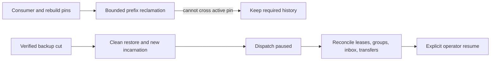
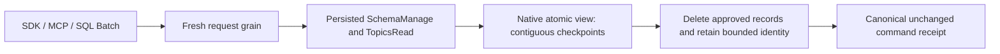
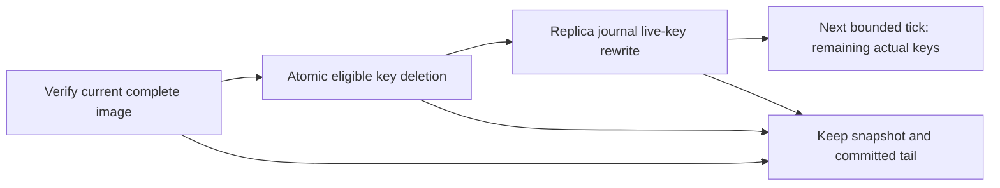

# ADR-030: Retention pins and paused restore of an older cut

Status: Accepted; cluster cut/reconciliation and delivery resumption qualification pending.

## Context and decision

Feeds, projection rebuilds, consumer groups, inbox deduplication, transfer intents, and receipts depend on retained history for different horizons. Purging beyond an active consumer's required prefix can make recovery silently incomplete. Restoring an older snapshot can roll back leases, checkpoints, and external-delivery receipts, so external work must not resume automatically.

Persist retention pins for active consumers/rebuilds/transfers and report history loss explicitly. Restore verifies the manifest, creates a new incarnation, invalidates old tokens, and starts with dispatch paused. Operators reconcile group/lease/inbox/transfer state against retained history before explicit resume. This is a fail-closed boundary, not a claim of global consistency for current local backups.

## Alternatives and consequences

Unpinned time-based deletion is rejected because a slow or rebuilding consumer could miss required input. Automatic redelivery after restoring an older cut is rejected because an external effect may already have occurred. Explicit pause adds operator steps but avoids silently duplicating or losing external work.

## Related requirements and implementation contract

Related: `REQ-BACKUP-003..004/AC-BACKUP-003..004`, `REQ-FEED-004..005/AC-FEED-004..005`, `REQ-MSG-003/006`; ADR-008/017/023/025/026/027; KL-005, KL-042, KL-089, KL-094, KL-098/099/104. Current local restore is in `src/KeyLoad.Storage.ZoneTree/ZoneTreeStore.cs`; outbox pins are in `src/KeyLoad.Core/Features/ChangeFeeds/Execution/ProjectionOutbox.cs`; detailed feed design is `docs/design/change-feeds.md`.

1. Freeze which state classes create pins, how pins expire/release, restore cut format, and manual reconciliation responsibilities.
2. Test pin floor, bounded purge, restore corruption, new incarnation, stale token rejection, paused dispatch, and no automatic external redelivery.
3. Implement pin and manifest support in owning ChangeFeeds/Messaging/BackupRestore slices; coordinate all record classes through the root recovery owner.
4. Roll out restore as paused by default; rollback returns to the prior validated database, not an unverified partially resumed older cut.
5. Qualify real process recovery and Docker/Aspire RF3 restore/leader-loss scenarios in GitHub. Power-loss and endurance need separate gates.

Current source has local backup restore and outbox retention pins. Cluster-wide per-partition cut vectors and complete eventing-state restore remain planned. No test title alone constitutes a qualification result.

### TASK-BACKUP-EVENTING-CUT-001 (KL-098 local capability-state proof)

Freeze before code under REQ/AC-BACKUP-001/002/003/004, REQ/AC-EVENT-004/005/006 and REQ/AC-MSG-003/005/006: seed actual native resources, three canonical source events, two independent subscription groups, an out-of-order completion gap, one persisted subscription-processing inbox with document+queue effects, and a real leased queue message. Capture the native backup cut, pack/unpack the genuine current-format artifact, restore into a clean target and reopen real ZoneTree. Independently require stable positions/content/generation, literal group checkpoint/issued/gap state, exact document/message state and byte-identical retained event/subscription/inbox/queue/outbox records. Manifest/source cut and single restore-authority position increment are exact; archive bytes remain unchanged.

Before explicit operator resume, fresh subscription and queue receive must fail exactly DispatchPaused and old source cursor/delivery tokens and pre-restore original command outcomes must fail exactly TokenInvalidated without effects. Persisted narrow principal denial remains enforced. Failed owned Apply outcomes commit exactly once and same-ID failed replay preserves complete result and store position. Old stored outcomes are retained; no old incarnation receipt is fabricated as current success.

Reconcile through existing public native operations only: explicitly seek the restored group from retained beginning to a new subscription generation, clear that group's explicit pause, explicitly set dispatch running as administrator, and obtain genuine new-incarnation claims. Reprocess the already completed source position using the same handler scope/execution generation: the persisted inbox returns AlreadyProcessed with original effects token and no second document/enqueue. Close contiguous gaps with actual acknowledgements. A new bounded producer/claim/ack and final close/reopen prove healthy continuation and all canonical state. Use no sleeps, fake providers, raw system-key resume or implementation-only migration APIs.

This closes only the missing local eventing artifact-state regression. KL-098 consumer/rebuild/transfer retention pins, event/topic purge/receipt horizon, history-loss reconciliation, remote-transfer KL094 and cluster-wide per-partition backup cut remain distinct open criteria. Current public event/topic APIs expose caps, reads and subscription seek, but no event/topic purge/pin implementation; the test must not synthesize history loss by deleting canonical keys or advertise local backup as a cluster cut. Existing outbox purge/pin and remote-transfer suites remain mandatory.

Ownership: UnitTests BackupRestore Cases/Fixtures/Assertions/Helpers; native artifacts and ZoneTree product APIs unchanged. Ordered join: contract, test-only implementation, root format/build and full normal/scalar native execution with exact original source/DLL identities; Linux recovery/RF3/global gates unchanged. No coverage inventory edit or status closure. Failure retains owned source/backup/target root and original primary plus joined disposal errors. No product seam, format/serializer/public contract change. Rollback removes this task and its test-only flow; no old report is rewritten.

Independent R2 review tightens the literal healthy continuation oracle: all new EventData fields, RecordedAt/sequence/source, delivered queue payload/headers/attempt/lease version/generation/deadline, and complete canonical Acked metadata/body absence must match independent literals. The signed delivery token is required nonempty and verified by the actual authorized ACK. The original derived message remains leased with its exact original literal metadata/body; no lease reset, expiry wait or synthetic body is introduced. Reopening the real target repeats the complete final state assertions.

## TASK-KL098-TOPIC-RETENTION-001 — bounded native topic purge

REQ-EVENT-RETENTION-001: `PurgeTopic(Topic, ThroughPosition, Generation)` is an inclusive same-partition Batch mutation through SDK CommitAsync, existing official MCP documents_commit and shared SQL CALL documents_commit decoder/request grain. Persisted SchemaManage AND TopicsRead are required before cached outcome replay. No new transport, provider or physical owner.

REQ-EVENT-RETENTION-002: delete only retained positions FirstAvailablePosition..ThroughPosition inclusive; reject nonpositive, beyond-tail or already-retained-away cuts, stale generation and scan/byte exhaustion. Every persisted same-source/generation group's contiguous Checkpoint pins all positions greater than Checkpoint, including paused/parked groups; IssuedPosition/ACK gaps do not release pins. Therefore requested cut must be <= every Checkpoint. Refusal is ResourceExhausted and cannot alter topic/group/inbox/queue state.

Every original native observer charges one examined record plus bytes before decoding, including range lookahead and missing point lookup; callbacks never escape native read ownership. All PurgeTopic effects in one owned ApplyMutations batch share one monotonically charged MaxScanRecords/MaxBatchBytes ledger; no reset per mutation. Native atomic write cancellation/admission remains owned by the original apply gate; this adds no separate token or deadline.

REQ-EVENT-RETENTION-003: atomically advance FirstAvailablePosition to cut+1 and subtract exact native serialized source bytes; preserve TailPosition, partition event sequence, generation, group/inbox/queue state, incarnation and backup identity. Retain only generated native typed event-ID digest/original position/generation in existing topic-event-id family. No bodies, fallback, migration or receipt pruning. Fresh identical event reuse remains DuplicateEventId; conflicting content remains Conflict; same immutable original command ID returns byte-identical receipt after purge.

AC-EVENT-RETENTION-001: genuine ZoneTree seeded three-event/two-group operation refuses unread and paused pins, releases only by existing exact ACK/explicit seek; bounded approved purge leaves literal event3 at original position/sequence3 and unchanged other model bytes, old read yields exact HistoryUnavailable; same-ID purge replay retains complete receipt and stable store cut.
AC-EVENT-RETENTION-002: post-purge original publish replay returns exact original receipt, fresh identical/conflicting event commands preserve exact distinct errors; denied caller cannot purge or replay privileged receipt, stale generation/cut/record/byte budget failures retain complete logical state and stable same-ID rejected outcomes; healthy next publish is position/sequence4.
AC-EVENT-RETENTION-003: native store reopen retains exact head, digest identities, group/checkpoint/inbox/queue state and receipts; shared real SQL compiler/decoder admits same Batch mutation; root must run native unit/scalar/recovery and genuine RF3 SDK/MCP before qualification. Automated owning cases: TopicRetentionOperationTests, TopicRetentionBoundaryTests; no source-only proof.

Implementation order: this contract first; Abstractions/EventStreams Contracts + generated native alias; Core/EventStreams Commands and Messaging publisher identity; existing Batch validation/auth/apply joins; UnitTests/EventStreams native operation fixtures/cases. Roll out only as a homogeneous freshly built native server cohort; do not downgrade a store whose journals/records retain the new generated aliases. Existing formats/aliases/field IDs are unchanged, with no mixed-version fallback. Historical digest count and receipt-horizon-wide storage bounds remain unqualified; active MaxEvents/MaxBytes is not reinterpreted as a lifetime-ID limit. Rollback source before qualification; persisted purge is deliberate irreversible data removal and has no migration rollback. Rebuild/transfer pins, receipt-horizon pruning, remote KL094 and complete KL098 closure remain explicitly incomplete.

### TASK-KL098-TOPIC-PURGE-CRASH-001: native admitted purge cuts

REQ-EVENT-RETENTION-004 / AC-EVENT-RETENTION-004: the real CrashHost first acknowledges purge through source position1, then arms the existing native CanonicalCrashBoundary for exactly the next Store.Commit position of immutable purge-through2. Two seeds admit either success (paused checkpoint3) or exact ResourceExhausted rejection (paused checkpoint1). Kill only the owned original process after its native phase marker; join original exit and both bounded readers, prove exclusive native locks, reopen actual ZoneTree. HeaderWritten/PayloadWritten are pre-flush boundaries; JournalFlushed is AFTER native durable flush returns and BEFORE native apply, not inside an OS flush syscall. MutationApplied0 and ApplyCompleted are actual native apply cuts. Pre-flush may recover old or whole new cut; post-flush must recover complete success/rejected receipt, never partial model changes.

The independent oracle requires literal head/events/source positions/digests/doc/queue/paused checkpoint plus original acknowledged seed receipt, canonical command fingerprint/receipt, exact committed clock and stable same-ID replay with full-store byte equality. Fresh identical/conflicting EventID errors remain distinct. Follow with actual append/read/queue claim and final native reopen. No new product seam/provider/journal/format/whitelist, sleeps, wider deadlines or retry-to-green. Root native discovery/build/recovery execution and exact source/DLL/PDB receipts are pending; process kill is not power-loss proof. Historical identity-population/horizon/rebuild/transfer/remote retention and full KL098 gates remain open.

Ownership: CrashHost EventStreams Contracts/Helpers, existing CrashHostApplication mode join; RecoveryTests EventStreams Cases/Processes/Assertions. Contracts join after TASK-KL098-TOPIC-RETENTION-001, then child/oracle; existing original process/readers/cleanup helpers are reused unchanged. Rollback removes this scenario/tests only, preserving product retention contract and immutable historical results.

### TASK-KL098-TOPIC-RETENTION-CORRUPTION-001

REQ-EVENT-RETENTION-005 / AC-EVENT-RETENTION-005: before an actual purge uses a persisted subscription pin, require its exact native canonical group key, positive subscription generation/ownership epoch, native definition/policy bounds and 0<=Checkpoint<=IssuedPosition<=the current source tail. GroupState has no source identity fields; source identity/generation comes from the canonical prefix, and subscription generation MUST NOT equal source generation by assumption. Paused/parked pins remain authoritative. Wrong native alias, extra key suffix and impossible persisted shape return exact Corruption, never silently pin/unpin. Reuse current native identifier/policy constants; no repository-wide group behavior change.

A retained-ID digest must be exactly 64 lowercase hexadecimal characters, with generation equal source generation and position within the actually purged prefix. A canonical active event and preexisting digest at the same ID is Corruption; purge must never overwrite it. Native wrong aliases remain Corruption with the retained-history detail, not DuplicateEventId/Conflict. Corruption is an existing fatal command-compilation boundary: exact KeyLoadException/Corruption escapes before canonical outcome or redo commit, so neither first call nor identical original-ID repeat advances position, clock, dedup or any canonical byte. It must not be normalized into an OperationResult or stored rejected receipt. Require the exact retained-history detail and whole-store byte equality for both actual throws while corruption remains. Explicitly restore the original native state; the same original purge ID then commits its literal two-record effect and exact success receipt once, followed by stable receipt replay. A same original publish ID that previously threw on corrupt retained digest is freshly evaluated after repair: valid retained identity yields exact DuplicateEventId, persisted once and replayed unchanged. Healthy new append remains required. No receipt is invented for the fatal attempt. No fallback, fake storage, authorization bypass, generation clamp, policy quota relaxation or product test hook. Existing valid fresh identical IDs remain DuplicateEventId, changed content Conflict, original command replay immutable.

Owning paths: Core EventStreams Validation/Commands and Messaging TopicPublishReads retained-ID branch; UnitTests EventStreams Cases over actual TopicRetentionFixture. Join after purgeR1 and crash follow-on docs, preserve both immutable packets. Root format/build/native normal/scalar/recovery/RF3 discovery/execution pending. This precise corruption follow-on does not close KL098 broader gates.

Shared-ledger boundary: each first purge-through1 completes exactly two observed group reads plus source body, active-ID pointer and missing retained-digest probe (five). The next effect observes both original persisted groups, reaching seven before another body read. Fixture cap6 proves second-effect rollback under one shared ledger; original cap4 remains an explicit first-effect rejection control. Production limits are unchanged; both require the same exact scan-budget ResourceExhausted outcome and full rollback.

R441 actual native correction, TASK-KL098-TOPIC-RETENTION-CORRUPTION-001 / REQ/AC-EVENT-RETENTION-005 and AC-EVENT-RETENTION-002: original twelve Corruption failures and one nonadvancing policy-epoch failure remain retained. DatabaseEngine.ExecuteAndBuildOutcome excludes Corruption from stored domain outcomes. The genuine manager revocation advances persisted epoch1 to2 before replay denial; original success receipt and complete native bytes remain immutable after denied repeat. No product exception normalization, authorization weakening or new recovery claim. Root owns fresh native build/census/whole-operation re-execution; this source correction is not PASS evidence.

## KL035 bounded replica-prefix GC contract (2026-10-08)

TASK-REP-PREFIX-GC-001 / REQ-REP-GC-001 / AC-REP-GC-001 freezes actual prefix reclamation. A node-local Materializer holds its existing apply owner, then SnapshotStore gate, then native log ProtocolGate and log lock. CURRENT published snapshot is reverified against native complete image, incarnation, format, checksum and committed cut before any eligible key deletion. One batch deletes actual canonical replica-entry keys with absolute Index<=snapshot.Index using the native replica store atomic Commit; it changes neither hardstate snapshot/term/vote/LastIndex/CommittedIndex nor canonical apply/docs/receipts. Only existing MaxAppendEntries and MaxAppendBytes bound range/work/key retention, checked before allocation; cancellation before commit publishes no effects. The same verified immutable image remains and all suffix entries are retained. Unpublished/corrupt/missing image fails closed before deletion.

The GC batch then awaits the existing REPLICA store Compact publication under the same owner, rewriting replica commands.wal with surviving live keys; CANONICAL Compact is not called. Native ZoneTree derived segments may retain older deleted bytes, and eventual maintainer segment reclamation is explicitly separate/unmeasured. This is actual key deletion plus replica-journal live-key rewrite, not read visibility cutoff or immediate whole-tree byte reclamation. Native compaction failure/poison and original ownership cleanup propagate; snapshot+tail remains at every valid recovery cut. Existing journals/formats/aliases/term/index semantics are unchanged. No discarded atomic journal, migration or compatibility fallback.

REQ-REP-GC-002 / AC-REP-GC-002: maintenance schedules at most one existing joined checkpoint/reclamation task. Bounded later ticks use actual remaining prefix keys as progress; no persisted/stale cursor and no unbounded reclaim loop. Reader results are existing independent native arrays; per-call image files are closed under snapshot gate. GC deletes no snapshot image or transfer file and never invalidates borrowed native read cuts. Compact uses its actual storage write gate/current-generation contract.

REQ-REP-GC-003 / AC-REP-GC-003: real current-format store/CrashHost flows create committed snapshot+new retainedtail/full literal original receipts, reclaim actual eligible keys, inspect exact hardstate/terms/index/suffix/canonical state, native dispose/reopen, fresh-target complete install+tail and exact retry with healthy next command. Corrupt/missing snapshot and canceled GC preserve full native state; repair then healthy GC follows. Real owned child kills at existing publication and replica-store native checkpoint/journal fault boundaries prove at least one complete verified snapshot+tail path. All actual original children/readers/filelocks are joined. This proves process-kill recovery only; power-loss/endurance/current Linux RF3 remain separate pending gates.

Ownership: Replication ClusterReplication/Contracts existing interfaces; Storage native log prefix collector/reclaimer and snapshot owner; Execution Materializer/Maintenance. No new provider, public SDK/SQL/MCP operation or wire format is introduced: this is existing node-local housekeeping, never caller-authorized database mutation bypass. RecoveryTests/ClusterReplication and CrashHost/ClusterReplication own real native cuts and wholeflow assertions. Root joins/builds/native tests/records actual new census. ADR030 remains Accepted until exact required evidence exists.

### Exact private GC verification map

`ReplicaPrefixGcProcessRecoveryTests.AcRepGc003ActualPrefixDeletionAndReplicaRewriteRetainVerifiedSnapshotTailRecovery` owns ten native argument rows: HeaderWritten/0, PayloadWritten/0, JournalFlushed/0, MutationApplied/0, MutationApplied/3, ApplyCompleted/0, SnapshotWritten/0, SnapshotFlushed/0, InstallPrepared/0, JournalSwapped/0. Existing synchronous native `CommitStage` observer pauses only the admitted replica-store deletion/rewrite position; the real original CrashHost child is killed and its readers joined before reopen. No new product fault callback is introduced. Original cuts before durable journal completion permit only complete prefix retained or complete prefix reclaimed; all later cuts require complete reclamation. Partial key deletion is rejected.

Each actual row verifies snapshot cut4+term1, retained tail5, immutable complete hardstate bytes, canonical inventory equivalence, all literal original put mutation receipts2–5 and byte-identical replay without position changes. A fresh empty native target installs the retained complete snapshot and actual surviving tail entry, applies them, then commits independently specified healthy revision5/cut6 and reopens. The same owned trial additionally checks original-token cancellation, missing native image (FileNotFoundException) and hash-corrupt image (Corruption), full unchanged replica/canonical records and position, exact image repair, successful reclamation and healthy tail. Native images, stores, original child/readers and file locks remain trial-owned through cleanup; failures retain original root/evidence. New case discovery counts/compiled identities and all Linux qualification remain root-owned and unobserved for this packet.

Code ownership adds feature-local `ReplicaPrefixReclaimer`, `ReplicaVerifiedPrefixReclamation`, `ReplicaCheckpointReclamation` and cohesive `ReplicaCheckpointPublication`; the latter moves existing state calculation only, preserving its original locks/guards. New crash/test types are under their actual ClusterReplication Contracts/Helpers/Processes/Assertions/Cases roles. No native aliases/field IDs, storage formats, public SDK/MCP/SQL routes, runtime deadlines or qualification statuses change.

An explicit reclamation call with an already-deleted prefix still verifies the current complete image and joins one native replica WAL rewrite, returning zero without a no-op atomic commit. This settles process interruption between deletion and rewrite. Original cancellation is checked again before that zero-deletion rewrite; once a positive deletion commits, the original rewrite is joined despite later cancellation. The normal maintenance trigger remains actual remaining prefix keys or its unchanged snapshot threshold. No persistent cursor/new recovery format is added.

Native GC negative-image setup drains actual FileStream buffers with caller-canceled FlushAsync, then joins RandomAccess.FlushToDisk on the same owned handle before testing corruption. This preserves the actual synchronous OS durability barrier; async buffer drain alone does not substitute for it. The API contract is documented by [Microsoft .NET10 RandomAccess](https://learn.microsoft.com/en-us/dotnet/api/system.io.randomaccess.flushtodisk?view=net-10.0) and [FileStream.FlushAsync](https://learn.microsoft.com/en-us/dotnet/api/system.io.filestream.flushasync?view=net-10.0). These are process-recovery fixture actions, not a power-loss qualification claim.

R573 retained ten original process-trial failures at the independent document-result oracle. The expected literal and recovered result are separate object graphs; their Orleans reference encoding is not the public value contract. Compare the complete public document result through exact JsonDefaults bytes, including the entire reference, revision, exact user JSON, redaction flag and ordered redacted fields. The independent literal mutation receipt comparison, byte-identical original native receipt replay, complete canonical and replica inventory bytes, hardstate and native snapshot/WAL checks remain unchanged. This changes no production serializer, persisted format or acceptance requirement; repaired native execution is still required.

R578 retained ten original failures at fresh-target append: the fixture created an independent random canonical signing key and correctly rejected the source's original signed native tail. A fresh receiving member must use the source RF3 cluster's actual configured canonical signing key, as production PartitionStores and existing real stored-cluster fixtures do. Pass that owned key through ZoneTreeStoreOptions at target creation and again at its genuine reopen; do not re-sign or re-normalize the original tail, copy an identity file, relax signature verification or substitute another operation. Native source-tail bytes and all receipt/state assertions remain unchanged. This fixture correction is not a production authority change or proof that the repaired flow passed.

R580 retained ten cleanup failures after the original operation assertions completed: the scalar-store cleanup searched for owner.lock at the trial root instead of its actual nested stores. GC cleanup must use existing bounded ReplicaProcessFiles ownership checks for all three known node roots (original, fresh target and negative boundary), including both canonical and replica stores of each, after original process/readers/materializers joined. Only after every exact owned file check succeeds may the existing bounded deletion remove the trial root. Observe every check/deletion failure and retain that original root; do not create a dummy root lock, skip missing store locks, relax file-release checks or expand cleanup deadlines.

## TASK-KL029-INCREMENTAL-TEXT-CHECKPOINT-001 — draft implementation contract

# KL029 incremental native text prerequisite

Source-only draft, 2026-10-08. No runtime or acceptance claim. Root owns join, build, generated contracts, native Linux qualification and status.

Original KL029: index worker, checkpoint, deletes, analyzer generations, initial maintenance rebuild; removal plus replay restores expected results; a checkpoint crash cannot hide missing updates; a stale revision cannot resurrect. Existing ADR078 format1 native generations explicitly reconstruct the complete source cut. Their ten process cuts are retained and are not incremental replay evidence.

## Authority and ownership

REQ-FTS-INCREMENTAL-001 / AC-FTS-INCREMENTAL-001: canonical documents and persisted projection consumer remain authority. A PartitionHost-owned explicit native text maintenance operation is invoked through the existing separately authorized request grain. Fresh persisted cluster-administrator authority is required for every seed, page, publication, ACK, restore and release. Internal services never manufacture a principal or commit directly around the protected database capability. No background dispatcher or implicit query-time ACK.

Reuse ANN's additive ReadProjectionBatchRequest Id3 ThroughSequence and native validation as an explicit dependency; do not independently modify shared contracts. Consumer generation/resources/kinds are immutable, resources select the actual collection, kinds exactly putDocument/patchDocument/deleteDocument. Fixed upper bound is obtained from the actual same-cut canonical snapshot/head/active-consumer authority; missing retained history returns HistoryUnavailable. A released or replaced consumer cannot authorize old work.

The initial seed is a bounded complete current canonical corpus at a pinned upper sequence. Bootstrap ACKs may cover only native batches through that same captured upper after seed completeness is independently verified; they are not incremental application evidence. Subsequent pages must apply their actual chronological Before/After changes. Current source/corpus/policy/schema verification is mandatory before publication; no seed based on an unrelated read cut.

REQ-FTS-INCREMENTAL-002 / AC-FTS-INCREMENTAL-002: a distinct generated-Orleans current-format incremental generation lives in a separate owned text-projections root. No reinterpretation or fallback to ADR078 format1. Its receipt binds physical NodeId/incarnation/data epoch, atomic partition, collection, field, analyzer/hash versions, consumer/name/generation, canonical upper/dependency digest, stable native record IDs, revisions/deleted tombstones, checkpoint and actual tracked native paths/inventory. IDs are positive, unique, monotonic and never reused within generation; bounded metadata including tombstones obeys existing MaxScanRecords. No retained JSON body copy. Existing query generation/default container behavior remain unchanged until explicit query integration is joined.

## Actual native update and crash order

REQ-FTS-INCREMENTAL-003 / AC-FTS-INCREMENTAL-003: serialize one page and generation mutation under the node-local owner gate; no mutation while a borrowed query lease exists. Before the first posting change, durably persist a checksummed typed pending intent with exact consumer/generation/after/through, signed native batch token, stable references/revisions and bounded old/new hashed token triples. Derive triples with the existing canonical NFKC/Rune tokenizer and SHA256-le64-v1; charge the same budget before retained allocation. Actual native IndexOfTokenRecordPreviousToken<ulong,ulong>.DeleteRecord(token,id,previousToken) and UpsertRecord(token,id,previousToken) implement updates/deletes. Do not call DeleteRecord(id): pinned source scans the complete index without the caller budget. No repeated full rebuild for ordinary page application.

Apply exact deletions then additions, idempotently. Preserve deleted record revision tombstones; older revisions fail closed rather than overwrite. Native WAL is synchronous. Close/join native handles and capture actual inventory before durable complete generation checkpoint publication. Only then issue the canonical CommitProjectionBatchRequest with exact original command ID/token/empty effects. Retain its exact full receipt; after ACK joins, retire pending intent. Checkpoint never advances beyond durable native publication; source bytes and projection effects remain distinct.

On crash before publication, the original durable intent owns partially applied native postings; reopen and replay those exact deletions/additions, never serve the partial generation. Crash after publication/before ACK resumes only the exact original canonical ACK; fresh authorization still applies. Crash after ACK/before intent removal uses the immutable existing receipt and stable checkpoint. Mismatched intent/receipt/generation/checksum/native inventory fails closed and is preserved. No generic retry loop, fresh command ID, source-history guess, legacy format or missing-update success.

REQ-FTS-INCREMENTAL-004 / AC-FTS-INCREMENTAL-004: public search always uses fresh canonical row/field authorization and complete literal source/revision validation under one read cut. Native index contains derived hashes, never authorizes output or ranking. Preserve existing exact lexical/RRF arithmetic, token/deadline/read/grant owner and no partial result. Policy/schema/incarnation/cut mismatch cannot reuse old publication. A replaced/deleted document cannot reappear from stale native postings. Query hookup requires an explicit stable-ID lookup lease; current ordinal-only NativeTextProjectionLease cannot be silently reused.

## Verification and files

REQ-FTS-INCREMENTAL-005 / AC-FTS-INCREMENTAL-005: real native bilingual fixture seeds Ukrainian/English literal documents; actual same-ID update/delete receipts, chronological bounded pages and generation checkpoint. Real CrashHost pauses at intent flush, first native deletion, first native addition, native inventory settled, checkpoint publication, canonical ACK completed and pending retirement. Existing process ownership kills only that child, joins its stdout/stderr/exit and every native handle/store lock; reopen canonical ZoneTree and selected native FTS, resume original intent, compare complete canonical document/outbox/consumer/receipt state and literal current results. Exact same command replay never duplicates effects or advances receipt position; healthy subsequent append/update/search and final reopen remain literal. Negative stale revision, expired/released consumer, original token cancellation, budget and malformed intent preserve state; repair then healthy continuation. Process-kill only, no power-loss claim.

Source ownership: Server/Search/{Contracts,Serialization,Validation,Storage,Lifecycle,Execution} NativeTextIncremental*; Query/Search contracts/execution stable-ID lease adapter only when integrated; Orleans/ClusterRouting typed maintenance capability and existing request-grain composition; PartitionHost lifecycle/registration joins root-owned; UnitTests/Search real operation fixtures; CrashHost/RecoveryTests/Search new native incremental mode and cases; docs NativeFullTextProjection/ADR078 + required storage-fault ADR030 append. Shared ANN ChangeFeeds files are dependencies, not independently authored replacements. Type200/method64/file400, existing bounded caps/deadlines/cancellation and joined primary+cleanup policy remain mandatory.

Ordered stage: freeze source/dependency/API contract; implement owned typed generation/intent + exact native page writer; route explicit protected maintenance/checkpoint/ACK through original request capability; integrate source-verified stable-ID query lease; implement native unit and real-process whole flows; peer review; root guarded join/full build/native discovery/normal/scalar/recovery/RF3. Rollback releases exact consumer and removes only verified disposable owned generation after handles join; canonical outbox/receipts unchanged. No task closure until original criteria receive genuine bound Linux PASS.

## Pinned API evidence

NuGet package1.0.9 nuspec source c0993e2c65186708f3b087741082545bf49224fd. Official source:
https://raw.githubusercontent.com/koculu/ZoneTree.FullTextSearch/c0993e2c65186708f3b087741082545bf49224fd/src/ZoneTree.FullTextSearch/Index/IndexOfTokenRecordPreviousToken.cs
Public exact-triple deletion lines226–243; public upsert203–219; complete-index delete249–263/270–273; native background cancel/join167–180. Implementation must use actual tracked IFileStreamProvider, pinned synchronous WAL and existing joined provider lifecycle. Original current package/DLL hashes will be guarded in final manifest; no generated image identity invented.

## Explicit protected parent API amendment

`TextIndexMaintenanceRequest` is the single shared public DTO: Id0 original CommandId; Id1 exact persisted Consumer; Id2 Collection; Id3 canonical Field; Id4 positive IndexGeneration; Id5 actual Guid NodeId; Id6 immutable PhysicalShardRecord placement; Id7 explicit Build/Restore/Release mode. Build captures a bounded complete canonical seed. Restore loads the existing native generation and applies retained canonical outbox updates; it never silently rebuilds. Release fences the generation and releases only its exact canonical pin through a distinct fresh authorized child. The parent itself has no atomic CommitToken; results expose actual canonical child checkpoint receipts separately.

Shared authenticated route is `/v1/search/text/maintain`; on-demand official MCP tool is `keyload_search_text_maintain`. It is a write/effectful maintenance command, not a read DTO or WaitForIndex effect. SDK, official MCP and versioned SQL CALL decode the same DTO through the existing signed unique request parent. Each configure/read/commit/release effect is a fresh signed native child request with original bounded cancellation/frame admission; no parallel dispatcher. Catalog additions layer after ANN without changing initial discovery tools, existing read-DTO counts or selectors.

The exact-through prerequisite is immutable `/private/tmp/keyload-ann-exact-through-dependency-r2-20261008`; its genuine existing applyVectorProjection filter correction is ANN-owned. FTS consumes only putDocument, patchDocument, deleteDocument for one exact collection, with one fixed captured upper U per parent. Native canonical tombstones are included in the initial map so a later resurrection must match the previous revision/digest rather than allocate an unrelated identity.

The original per-readcut format1 native text generation remains untouched. Incremental files live under a distinct `text-projections` root and use new typed manifest/intent aliases. The existing strict native filesystem ledger, real LocalFileStreamProvider, index API and checksummed native envelope may be composed without calling restart-retiring `NativeTextFiles.InitializeRoot`. New startup validates retained complete inventory/pending intent and current ownership rather than deleting all generations. No fallback accepts the old ordinal manifest as incremental metadata.

## Original work budget and current child cancellation

REQ-FTS-INCREMENTAL-007 / AC-FTS-INCREMENTAL-007: one maintenance session retains one original ReadExecutionBudget timestamp, counters, token, grants and byte/result constraints across signed child phases. Each ordered child phase adds its actual current cancellation token through an internal disposable stage scope; Check always preserves original cancellation and deadline and also checks that additional token. Scope removal occurs only after all original stage work joins. Concurrent/nested stage admission is rejected; scope disposal restores the prior no-stage state, never a new budget or deadline. Ordinary query budgets do not allocate the optional stage owner. This is native long-operation composition, not a test hook. The same actual cancellation byte boundary must prove original during-work OCE, no partial publication/ACK, retained original intent and healthy exact immutable recovery.

Native process boundary reuse (owner-approved 2026-10-08): reuse existing feature-owned Action<NativeTextFaultStage> observation only at actual OwnerFlushed after complete native ownership/enrollment durability, first real NativePostingWritten per admitted owner after delete/upsert, NativeInventoryFlushed after native flush/disposal and bounded inventory capture, and ManifestPublished after actual atomic complete publication. No new fault framework, fake storage, per-read callback, test-specific branch, environment hook or deadline change. Existing genuine CrashHostPause/NativeTextCrashBoundary owns typed observation→parent process kill→original readers/exit/store locks. Durable original intent is required before the first actual posting; recovery replays that exact intent and original canonical ACK before retirement. These process-kill trials do not claim power-loss durability.

### Incremental process-cut verification stage

REQ-FTS-INC-009 / AC-FTS-INC-009: the native process case first commits the bilingual seed, original projection pin, native generation and its canonical ACK through the real replica journal/materializer. It then commits one exact revision-2 Ukrainian update and English deletion. The admitted incremental page persists its complete original intent before the actual first posting mutation; the owned child is stopped only at NativePostingWritten, NativeInventoryFlushed or ManifestPublished. Reopen uses the original complete intent, original immutable checkpoint command and actual native index; it must never seed from a replacement complete corpus to conceal incremental recovery. Every case proves complete literal revision-2 documents/tombstone, exact updated postings with no old Ukrainian/English postings, original write receipt replay, actual checkpoint ACK, healthy revision-3 append and final cold reopen. This is process-kill evidence only, not power-loss, RF3 or incremental public query-path qualification.

The exact child owns ReplicaCrashNode canonical/replica stores, a native ReplicaMaterializer and the node-local text maintenance service. Normal exit joins service, materializer, DI owner and all stores while retaining primary plus cleanup errors. The parent owns the actual child, both bounded readers, exact three native lifecycle modes and every known target-store lock through exit; failure retains the original root/evidence. Existing process admission/deadline/output caps are unchanged. No manually written AppliedBytes, alternate journal, new fault framework, timeout extension or owner-name substitution is admitted.

### KL029 process evidence bounds and exact recovery oracle

The private incremental crash stage retains one immutable original two-effect update/delete command and full native receipt, and bounds every typed evidence sidecar at 1,048,576 bytes before allocating or serializing. The fixed corpus admits at most 16 native command entries (resource/seed/consumer/initial ACK/update/recovered ACK/healthy write/healthy ACK); exceeding this closed fixture bound fails rather than truncating. A retained command resumes its original native index, never appends a second index. Existing process-run, cleanup, pipe and storage-trial limits remain unchanged.

`NativeTextIncrementalProcessRecoveryTests.AcFtsInc009DurableIncrementalReplaySurvivesRealPostingInventoryAndPublicationCuts` has three native arguments: NativePostingWritten, NativeInventoryFlushed, ManifestPublished. The owned child first acknowledges a committed initial generation and an actual canonical bilingual update/delete; the next child stops only at the selected actual incremental boundary. Recovery must settle the original durable intent and original canonical checkpoint ACK, retain stable English record 1 (revision 2 tombstone) and Ukrainian record 2 (revision 2), and expose exactly the independently literal two new-token native postings with no original English/Ukrainian postings. Full public document value and the original native receipt are checked independently. Healthy revision 3 then a separate cold child must preserve the complete canonical record digest/count, store position, applied index, all mapped records/postings, original healthy receipt and index identity. Every original child/pipe is joined, both known canonical/replica ownership files checked, and the root retained on failure. This is process-kill evidence only and does not qualify public incremental query selection, RF3, endurance, performance or power loss.

### Genuine native terminal movement supporting flow (2026-10-08)

REQ-MOVE-NATIVE-TERMINAL-001: The configured two-owner native supporting fixture submits every immutable target StagePage and Install phase through the actual A grant/MAC admission and independently signed B journal/materializer. Every actual B journal is acknowledged at A before a subsequent authority transition. Terminal Install uses the original Handle.PageCount; A Installed advancement accepts only the actual returned CommitReceipt and ACKed terminal grant. Technical publication does not authorize ordinary target traffic while the public A-authority bridge remains closed.

AC-MOVE-NATIVE-TERMINAL-001: The complete mixed original source corpus is captured with independently checked family/page/resource digests. Every StagePage leaves all destination canonical model families unchanged; same-ID phase replay is byte-identical and preserves complete raw state, canonical position and native journal index. Installation checks full independently expected destination values, storage-incarnation normalization and original integrity incarnation, exact terminal command/token/mutations/durability, original A receipt authority and cold A/B reopening. Finalize/Publish/Retire must use actual preceding grants/journals; no synthesized Installed/MoveReady/receipt.

REQ-MOVE-NATIVE-HISTORY-001: The supporting fixture retains at most64 native entries. The explicitly selected terminal fixture admits at most426 original entries:19 throughCaptured +4*55 transfer pages +2 terminalInstall +3 InstalledAdvance/Finalize/CompleteRetirement +2 Publish +180 source cleanup operations. Native per-append MaxAppendEntries64, MaxAppendBytes, snapshot/materialization ceilings, command timeout, database/cache limits remain unchanged. The actual corpus must fit55 transfer families and one bounded cleanup batch per family; excess is a failure, not a quota adjustment.

AC-MOVE-NATIVE-HISTORY-001: Original command lookup reads actual retained native journal pages bounded by the original configuration; every page and entry checks the original token, exact index continuity and nonempty progress. Actual same-ID result/cut/index remains stable after replay and cold reopen. The final case asserts its independently counted history; no visibility-only history, fake journal or lost reader ownership is accepted.

All cases remain authored and unexecuted until root's genuine native gate. Public six-silo movement, terminal abort and four-child crash acceptance remain separate mandatory criteria; no task/status closure is proposed.

REQ/AC-MOVE-NATIVE-NONE-CORRUPTION-001: The separate real native malformed-control case replaces only persisted current-format control Phase with None0 and submits the original first Install authorization through configured MAC admission and the actual replica log/materializer. Fatal apply preserves complete canonical bytes/cut and produces no receipt. The original waiter exposes RecoveryRequired/corrupt-log; joined original worker shutdown retains Corruption/invalid-state. Exact original row bytes are restored with one native commit, faulted owners fully dispose, and cold new owners/admission replay the original retained command before genuine complete target installation and cold model/receipt checks. Two intentional fault-preparation/repair commits are explicitly counted apart from the replicated index. Production markers1..9, native serializer, quotas/timeouts and all original terminal case assertions remain unchanged. No immediate fabricated corruption receipt or materializer reset.

TASK-MOVE-NATIVE-COMPOSED-003 joins the current terminal, malformed-control and active-capture abort source operations through the canonical [ClusterRouting traceability and integration contract](../Features/ClusterRouting.md#task-move-native-composed-003). Current source/helper guards, one root compiler/native-test owner and all original qualification limits remain mandatory; this authored candidate does not change the ADR implementation status.

# TASK-KL042-NATIVE-RESTORE-PATH-ADMISSION-010

REQ/AC-BACKUP-002/003, existing ADR008/030/123: ordinary native ZoneTreeStore.Restore and CLI restore must reject an existing destination leaf or ancestor link before staging/data publication, preserving exact original nonempty conflict precedence. Source-proven chain ZoneTreeStore.Restore → ZoneTreeBackupRestore.Restore → ZoneTreeBackupRestoreRestore currently checks only Directory.Exists/nonempty at initial admission and Publish. A valid empty leaf link can consequently be replaced, while an ancestor link directs sibling staging/publication through its target. This is an owning KeyLoad wrapper defect, not a ZoneTree dependency defect and not runtime-qualified evidence.

Implementation reuses the EXISTING internal ZoneTreeCatalogBackupPublication.RequirePath(directory), immediately AFTER the original nonempty check inside EnsureDestinationIsEmpty. The same original EnsureDestinationIsEmpty already runs before staging and at Publish; both repeat the same existing path guard. Its original Conflict/closed native-catalog-destination detail stays exact; no copied reader/new public API/friend/schema/options/format/default/limit/cancellation/flush/order change. Nonempty still refuses first with its original RestoreDestinationNotEmpty detail. Source archive verification and fresh restore authority remain unchanged. This snapshot validation does not claim concurrent path-swap or dangling-link hardening.

Genuine process tests: CliBackupRestoreUnsafeDestinationTests.AcBackup002CliLeafAndAncestorLinksRefuseBeforePublicationThenSameDestinationRestoresCold(bool ancestor), two original typed bool arguments. Through existing real CliBackupRestoreFixture/process/options, create an actual native backup, retain full original source/archive bytes, then create ONLY a fixture-owned destination leaf link (false) or parent link (true) to a separate original empty fixture-owned directory. Real CLI restore must emit exact failed exit/Problem Conflict/detail with stdout empty and every process/stdout/stderr/disposal joined. Link target and link identity remain unchanged; referenced directory stays empty, original source/archive bytes stay identical, no restore staging is retained anywhere under the fixture-owned root.

After the original CLI is genuinely joined, a real finally removes ONLY that exact original link (ReparsePoint and original LinkTarget must still match); no unexpected replacement or detached process authorizes cleanup. Preserve original failure plus genuine link-cleanup failure. After accepted refusal+cleanup, create an ordinary owned parent only for ancestor variant and invoke actual CLI restore at SAME lexical destination, using SAME original backup and actual central options/token. Full literal value, actual new incarnation/paused dispatch/native receipt are verified, then all owners close and native cold reopen requires stable complete restored identity/cut/value. Original source/archive bytes and previously referenced empty directory remain unchanged. No timeout/retry/fake result/provider/skip; successful old implementation is a test failure.

Ownership: Storage BackupRestore/Recovery/ZoneTreeBackupRestoreRestore.cs one existing call; Unit BackupRestore Cases/CliBackupRestoreUnsafeDestinationTests.cs and Helpers/CliBackupRestoreUnsafeDestinationTrial.cs new; append BackupRestore and ADR030/ADR123. No shared fixture/status/strict selectors/UID/count/source family edits. Root fresh compiled Linux normal/scalar Unit discovery/execution and mandatory Recovery/Aspire RF3 remain required; supporting process scope is not six-owner restore qualification. Rollback removes only new call/tests, retains all original restore API/bytes and immutable historical evidence.

# TASK-KL042-RESTORE-REPAIR-FAILURE-LEDGER-012

Preserve TASK009/010 whole operations and every original source guard/typed argument/authority/byte/cold assertion. The actual adjacent Archive8 native CA1031/CA1849 failures establish the same source-local risk in these still-private Unit helpers. Use existing ServerFailureObserver for the unchanged initiating/fatal and cleanup operation stages, with original link-created guard and exact original repair; ThrowIfAny before healthy continuation. CliBackupRestoreProcess.RunAsync was semantically audited: actual SettleOriginalTasksAsync awaits original joined exit/stdout/stderr tasks before return/throw and disposes the same process; no new owner/timer or speculative cleanup API is added. Its original returned join/disposal assertions remain.

The same original synchronous FileStream.Flush(true) in Metadata repair moves ONLY to a private synchronous helper. No FlushAsync or async work relocation, generic suppression, exception weakening, retry, deadline/default/budget/fixture change. Exact refusal and original+cleanup ledger remain mandatory; fresh native compiler/Linux results are OPEN. Keep immutable coherent R2, link4 and archive8/tiny4 ancestors; docs append union must preserve TASK011 if already live or separately joined by root.

TASK012 supersedes only the earlier literal try/finally syntax: canonical stage observation records original invocation/task/fatal/cancellation failures and returns after genuine stage terminal observation, so original cleanup stages always execute in the same order before ThrowIfAny. No failure branch skips cleanup or starts healthy continuation.

## TASK-KL042-LINK-RESTORE-FIXTURE-PLACEMENT-013 — complete backup oracle

REQ-BACKUP-002 / AC-BACKUP-002, ADR-030 and ADR-123: MetadataIntegrityTests.ReparsePointCanonicalFileFailsBeforeDestinationCreation uses the SAME fixture-owned sibling destination for original corrupt-link refusal, exact identity-byte repair, successful restore and cold reopen. MetadataBackupFixture owns a private root; its actual BackupDirectory parent provides that existing owner boundary without a new fixture API. Preserve MetadataTestContract.LinkRestorePath basename. Resolve the parent before mutation and fail if absent.

The destination must be outside the backup because CliBackupRestoreAssertions.CaptureFilesAsync recursively captures every backup file. Preserve that complete recursive byte oracle, source/backup equality, original corruption detail, exact link verification/repair, synchronous flush, native restored identity/value and cold assertions. No ignored files, product path-validation or overlap-guard changes, API/schema/limits/deadline/UID edits. Rollback is this test destination placement only; R3 remains immutable. Root compiler and exact-source Linux normal/scalar/recovery/RF3 gates remain unqualified.

#### KL098 original six-node canonical-cut join (2026-10-10)

The finite read-only test contract and exact stage/file ownership are recorded in [BackupRestore](../Features/BackupRestore.md#kl098-original-rf3-complete-canonical-cut-and-cold-byte-oracle-2026-10-10). Preserve the original current-format restore authority, public/private identities and failure/disposal ledger. Complete actual partition bytes are compared before resumed mutation and across the existing all-six same-root cold continuation, under original native bounds. Mixed RF3 corpus/process and queued pin/order successors remain open; source is not qualification.

## TASK-EVENT-MIXED-RF3-CURRENT-098 — one actual mixed archive vector and restore continuation

Docs-first test-only contract under original KL-098, REQ/AC-EVENT-RETENTION-001–003 and REQ/AC-BACKUP-CLUSTER-001–006, ADR-030. QueueLifecycleTrial already covers Phase1 backup; this extension supplies the missing coherent public mixed-cut join. It changes no product/public/persisted field, schema, policy, provider, clock, quota or deadline. It preserves the original ClusterRestoreRf3Tests fixture, six real Aspire voters, original scenarios/Args, source capture, CLI denial/repair, paused inspections, all original linked-model/eventing oracles, explicit resume, same-root cold and failure/cleanup joins.

A new feature-local parameterized mixed case uses the four existing SDK, official MCP, Q1 SDK and Q1 MCP route declarations. Those source declarations are not compiled UIDs or a passing census. Its genuinely empty target partition is bound through the persisted administrator API to the second registered physical owner before data; its distinct input partition remains on the first. The actual directory revision and complete placement resolutions are validated. Both partitions contain real retained data and must occur in their respective captured rosters.

The bounded original corpus contains unchanged Phase1 parked/pending queue inputs, full bodies/headers and exact counters; a filtered four-event topic with held first/fourth, filtered second and ACKed third; an independent pinned topic with genuine refusal, explicit seek/pause, purge2 and exact retained third/head/native identity tombstones; and a source input still leased after a target inbox commits document + AppendEvents + output enqueue atomically. Target dedup never supplies source ACK authority. Original native generated outcomes, inbox/capacity and byte-accounted queue counters are read from the verified original archive. Full canonical bytes for every actual current PartitionRecordFamilies.All family are compared by the separate canonical-cut6 predecessor on all six paused targets and after cold. Live Phase2 roster68 is distinct from published6415408 roster67; this Phase1 seed creates no manufactured order or B/C pin/control rows.

Before any policy repair, old mutating commands and original queue/subscription leases refuse TokenInvalidated without protected results or effects. Current paused Receive refuses DispatchPaused. Original outcome bytes remain immutable local history, never a public success claim. Persisted worker and narrow inspector are revoked while their actual previously established SDK/official connections remain owned, then repaired at epoch3. Old epoch1 commands still refuse PermissionDenied. The inspector has only persisted QueueInspect/DeadLettersRead/Query and no private field grant; complete metadata plus both redacted body/header JSON values are independently checked before repair and cold. Public JSON normalization permits only full semantic JSON-value equality at that documented boundary; native stored bytes stay exact against the original archive. Shared Phase1 helper byte/text oracles remain unchanged until actual RF3 proves a defect.

Only new epoch3 commands perform original version/generation-fenced cancel/park/redrive, genuine current receive/ACK and healthy enqueue/ACK; filtered group explicit seek/gen2/unpause then full matching ACK completion; historical inbox duplicate with exact original Effects/result and no source ACK; an inspected current-CAS cancellation of the old held input; genuine fresh source input, new target inbox effects/full independent receipt and a separate current source ACK. All new complete receipts replay on all four routes after the actual same-root six-voter restart; old commands stay denied. Complete bodies, headers, nulls, arrays/order, references, revisions, topic/stream head and event records, group generations/checkpoint/window, queue/inbox accounting and saved outcome bytes are required. Per-request cursors/cuts are observed under fresh authority, never copied as old authority.

Ownership: thirteen new feature-local owners are ClusterRestoreMixedRetentionRf3Tests (Cases), State (Models), Protocol (Contracts), Seed/Queue/FilteredTopic/PurgeTopic/Inbox/Privacy/Restore/Cold (Helpers), Literal/NativeCut (Assertions). Only the existing Scenario and its canonical-cut6 Continuation compose nullable mixed state and fixed stage calls. Original null-state behavior is preserved. Dependencies/join: canonical-cut6 must first be actually joined and its exact two CS postimages verified; the mixed source records those required predecessor hashes separately from current live original guards. Shared docs are append-only root unions with immutable Unit17/cut6. No partial mixed source join or guessed discovery identity is permitted.

Verification remains OPEN: coherent Release/analyzers/formatter, actual fresh Linux normal/scalar native discovery and full case receipts with source/DLL/PDB/image/cleanup binding, genuine RF3 public operations and actual canonical bytes. Existing ordinary slots50/heavy1 and suite deadlines remain unchanged. Mixed process horizons, physical erasure, reviewed Phase2 ordering, undelivered B/C/transfer pins, remote-transfer KL094, endurance and power-loss criteria remain distinct open gates. Rollback removes only this unqualified test extension after root-owned guard review; no original fixture/case, canonical family, stored history or acceptance gate is removed.
