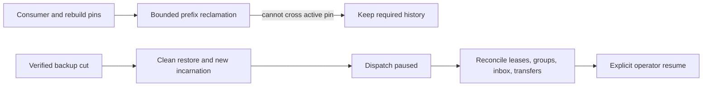

# ADR-030: Retention pins and paused restore of an older cut

Status: Accepted; cluster cut/reconciliation and delivery resumption qualification pending.

## Context and decision

Feeds, projection rebuilds, consumer groups, inbox deduplication, transfer intents, and receipts depend on retained history for different horizons. Purging beyond an active consumer's required prefix can make recovery silently incomplete. Restoring an older snapshot can roll back leases, checkpoints, and external-delivery receipts, so external work must not resume automatically.

Persist retention pins for active consumers/rebuilds/transfers and report history loss explicitly. Restore verifies the manifest, creates a new incarnation, invalidates old tokens, and starts with dispatch paused. Operators reconcile group/lease/inbox/transfer state against retained history before explicit resume. This is a fail-closed boundary, not a claim of global consistency for current local backups.

## Alternatives and consequences

Unpinned time-based deletion is rejected because a slow or rebuilding consumer could miss required input. Automatic redelivery after restoring an older cut is rejected because an external effect may already have occurred. Explicit pause adds operator steps but avoids silently duplicating or losing external work.

## Related requirements and implementation contract

Related: `REQ-BACKUP-003..004/AC-BACKUP-003..004`, `REQ-FEED-004..005/AC-FEED-004..005`, `REQ-MSG-003/006`; ADR-008/017/023/025/026/027; KL-005, KL-042, KL-089, KL-094, KL-098/099/104. Current local restore is in `src/KeyLoad.Storage.ZoneTree/ZoneTreeStore.cs`; outbox pins are in `src/KeyLoad.Core/ProjectionOutbox.cs`; detailed feed design is `docs/design/change-feeds.md`.

1. Freeze which state classes create pins, how pins expire/release, restore cut format, and manual reconciliation responsibilities.
2. Test pin floor, bounded purge, restore corruption, new incarnation, stale token rejection, paused dispatch, and no automatic external redelivery.
3. Implement pin and manifest support in owning ChangeFeeds/Messaging/BackupRestore slices; coordinate all record classes through the root recovery owner.
4. Roll out restore as paused by default; rollback returns to the prior validated database, not an unverified partially resumed older cut.
5. Qualify real process recovery and Docker/Aspire RF3 restore/leader-loss scenarios in GitHub. Power-loss and endurance need separate gates.

Current source has local backup restore and outbox retention pins. Cluster-wide per-partition cut vectors and complete eventing-state restore remain planned. No test title alone constitutes a qualification result.
