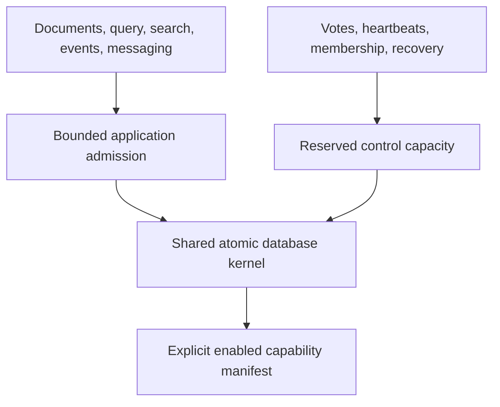

# ADR-031: Modular all-in-one deployment with reserved control resources

Status: Accepted; mixed-load liveness and capability-manifest qualification pending.

## Context and decision

KeyLoad is one repository and one deployable data system with optional capability modules. A resource-intensive search, replay, queue, or projection workload must not starve consensus, membership, cancellation, or recovery work. Optional modules must not imply that every feature is enabled or qualified.

Expose enabled capabilities through an explicit manifest and isolate reserved control-plane admission/resource budgets from application traffic. Keep one repository and shared persisted authority, but give query/search, eventing, messaging, backup, and cluster control their canonical ownership and resource limits. A modular profile may omit optional providers; it must report unsupported capability instead of weakening semantics silently.

## Alternatives and consequences

One unbounded shared queue is rejected because application saturation can prevent quorum/control progress. Splitting into unrelated repositories is rejected by the single-repository architecture. Always enabling every feature is rejected because optional providers and their readiness may not be available. Reserved budgets consume capacity but preserve liveness boundaries.

## Related requirements and implementation contract

Related: `REQ-REP-006/AC-REP-006`, `REQ-MP-003/AC-MP-007`, `REQ-MSG-004/AC-MSG-004`; ADR-020/028/036; KL-040, KL-052, KL-076, KL-080, KL-093, KL-104. Current admission code is in `src/KeyLoad.Core/AdmittedCommandQueue.cs`, `HttpAdmissionGovernor.cs`, and `src/KeyLoad.Orleans/`; policy is in root `AGENTS.md`.

1. Freeze capability manifest, reserved control classes, admission quotas, and overload behavior.
2. Test saturating application work while votes/heartbeats, shutdown, cancellation, and recovery retain bounded progress; test unsupported capabilities fail clearly.
3. Implement admission and per-capability registration in AppHost/Server/Orleans composition; business slices own their own work budgets.
4. Roll out capacity changes with safe defaults and operator visibility; rollback reduces optional workloads before control reserves.
5. Qualify real mixed-load and failure scenarios through GitHub RF3 workloads and recorded resource evidence; no local benchmark or assumed liveness claim.

Current API already contains admission controls; modular deployment, final capability manifest, and mixed-load qualification remain pending. Root owns shared resource composition and final integration; feature owners own their canonical behavior.
