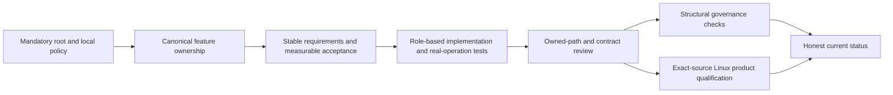

# ADR-032: Current MCAF governance and repository layout

Status: Accepted governance contract; outstanding architecture-layout debt and delivered-source qualification remain tracked separately. Requirements: REQ-MCAF-001..010; acceptance: AC-MCAF-001..010. The owning contracts are in [RepositoryGovernance](../Features/RepositoryGovernance.md), the [architecture map](../Architecture.md), and the mandatory [root policy](../../AGENTS.md).

| Requirement | Acceptance | Current contract |
|---|---|---|
| REQ-MCAF-001 | AC-MCAF-001 | Preserve every mandatory policy and review the complete change. |
| REQ-MCAF-002 | AC-MCAF-002 | Keep required governance policies and real commands current. |
| REQ-MCAF-003 | AC-MCAF-003 | Maintain required local policy coverage for projects and delivery modules. |
| REQ-MCAF-004 | AC-MCAF-004 | Keep the architecture/slice map current and document layout debt. |
| REQ-MCAF-005 | AC-MCAF-005 | Use disjoint ownership and join all required integrated review results. |
| REQ-MCAF-006 | AC-MCAF-006 | The bootstrap installed no skills. Current root policy authorizes the narrowly scoped global Quality and Orleans skill bundles; that later owner direction does not rewrite the bootstrap inventory or authorize unrelated skill installation. |
| REQ-MCAF-007 | AC-MCAF-007 | Keep conflicts and qualification limits explicit; do not claim unsupported readiness. |
| REQ-MCAF-008 | AC-MCAF-008 | Keep working plan/brainstorm/acceptance files absent and ignored. |
| REQ-MCAF-009 | AC-MCAF-009 | Run structural governance validation, including negative hygiene cases. |
| REQ-MCAF-010 | AC-MCAF-010 | Use responsibility-based folders inside every owning feature slice. |

## Decision

Apply the current root policy to every solution-owned project, module, workflow, script, site and durable document. MCAF adds no exception to the owner's architecture, ownership, evidence, privacy or qualification rules. Preserve all existing mandatory policy and stable REQ/AC identifiers. Local policies may tighten root policy but cannot weaken it.

Every non-trivial capability has one canonical `Features/<SliceName>/` ownership boundary across applicable code, tests, contracts and durable feature documentation. Inside that slice, populated role folders reflect actual responsibility; feature-local folders do not become repository-wide layers. Keep only genuinely solution-wide composition roots, infrastructure, building blocks and global documents outside feature slices. Record non-applicable surfaces explicitly. New work uses the required structure; existing deviations remain debt until the listed paths move and their verification passes.

## Existing architecture-layout debt

The current [architecture inventory](../Architecture.md) and owning RepositoryGovernance validator are the source for complete path review; source placement must be checked against the required canonical slices and populated responsibility folders. The oversized `src/KeyLoad.Core/DatabaseEngine.cs` partial type remains the separately scoped ADR-041 type-size deviation; it is not recast as an MCAF feature-path exception. Any additional confirmed layout deviation must list exact live paths, owner, target layout, verification and removal date. New feature work uses the required structure regardless of outstanding debt.

## Current workflow and publication boundary

The repository has four separate workflows: Build and Tests, Benchmarks, Website and Release. Build and Tests owns build, repository checks and ordinary test suites. Benchmarks owns native database comparison jobs, complete authenticated aggregation, and only a final bounded dispatch to Website. Website independently builds and qualifies on trusted main changes or manual dispatch, then deploys Pages with least privilege; it uses the newest ready authenticated benchmark aggregate when available and otherwise qualifies the site without benchmark figures. New ready benchmark data triggers a fresh Website run. Website is not a validation-only job, and Benchmarks does not build or deploy the site. Release remains prepared and manual; execute packaging/publication only after product readiness or an explicit owner release request. See [ADR-062](ADR-062-workflow-separation.md), [ADR-064](ADR-064-workflow-release-delivery.md), and [ADR-112](ADR-112-independent-website-publication.md).

Local tests and builds use the canonical Aspire-owned entry and are development evidence. Only exact-source Linux GitHub jobs qualify delivered behavior. Documentation or static governance success never substitutes for product tests, native recovery, RF3, coverage, complexity, endurance or fault gates.

## Implementation and verification contract

1. Root and local policy remain mandatory. Any policy conflict is surfaced for rule-specific owner direction; MCAF may not silently remove, weaken or bypass a current requirement.
2. Each project/module has the required local policy before new implementation begins. Policy inventories are checked against the current repository and canonical architecture map rather than a copied historical project count.
3. The owning feature specification maps every stable `REQ-*` to measurable `AC-*`, every acceptance criterion to real tests or an explicit evidence exception, and each cross-cutting decision to its current ADR. `REQ-MCAF-001..010` and `AC-MCAF-001..010` remain owned by RepositoryGovernance.
4. Repository-governance validation is structural: required documents/sections, IDs and mappings, policy inventory, canonical layout, and live relative-link destinations. It does not infer behavior from source text. Functional tests execute real operations and assert observable outcome and resulting state; compiler/analyzer tests execute the real compiler/analyzer and assert diagnostics.
5. A layout move preserves the original behavior and complete public, persisted and inter-grain contracts. Review the complete source/path mapping, update only owned references, and run the applicable governance, formatting, Release build and required TUnit/recovery/RF3 gates. Record actual outcomes and unresolved blockers in their canonical current status/evidence owners.
6. Root owns shared policy, central documentation, joined review and delivery. Feature owners own their scoped source/tests; a move does not authorize staging unrelated work or weakening any acceptance gate.

## Rollout and rollback

Architecture refactoring is an exact ownership/path change unless its feature contract separately authorizes behavior changes. Preserve current behavior, persisted formats, public contracts, privacy and native ownership. Rollback reverses only the reviewed path/source unit and preserves later unrelated changes; it does not waive the mandatory target layout or any product gate. Historical receipts remain historical and never qualify changed source.
