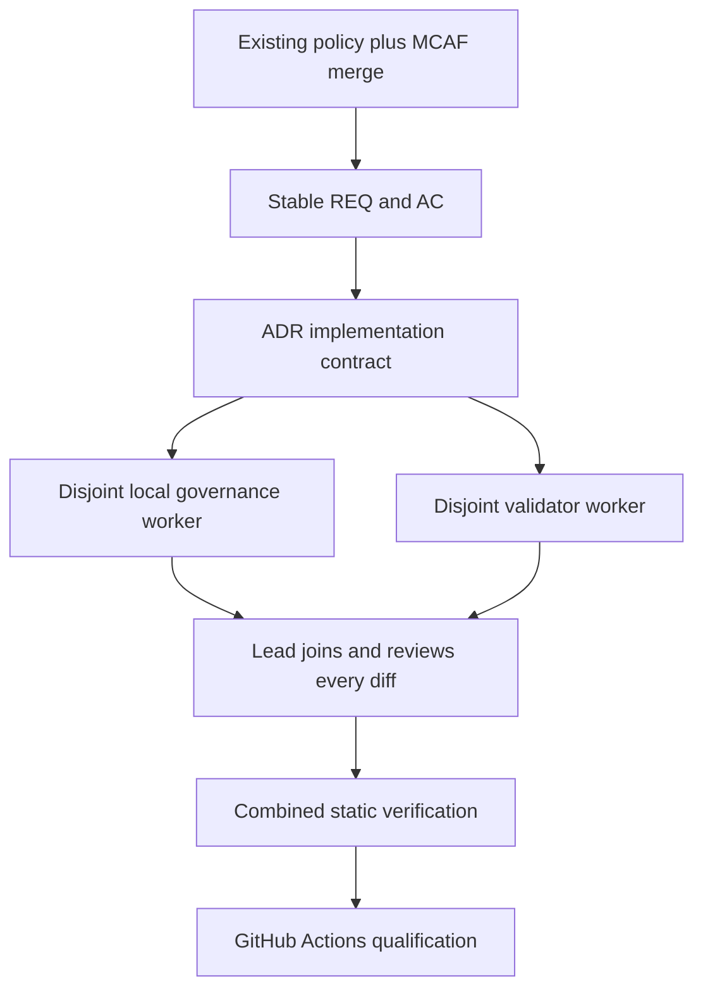
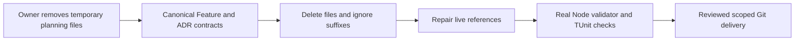

# ADR-032: Preserve existing policy while adopting MCAF

Status: Accepted. Date: 2026-10-01. Owner: KeyLoad lead/integrator. Requirements: REQ-MCAF-001 through REQ-MCAF-007. Acceptance: AC-MCAF-001 through AC-MCAF-007.

## Decision

Keep every existing root policy byte intact and append the customized current MCAF requirements. Add a project-local AGENTS.md to every csproj root and local policies for site, workflows and documentation. Use docs/Architecture.md as the global map and PascalCase canonical feature names under Features/<SliceName> across applicable technical roots. All solution-owned code and delivery assets stay in this repository.

No skills are installed. The owner explicitly overrode tutorial skill-install steps. No runtime restart is necessary to load nonexistent new skills. MCAF concepts are configured directly in repository governance.

## Implementation contract

1. Read all existing policy, the full current template and tutorial; save an exact pre-installation byte-count/hash baseline. Lead owns the root and shared docs.
2. Define design analysis, acceptance and execution contracts in the owning feature specification and this ADR, and review the architecture map before any delegated write task starts. The owner correction below removes separate working planning files.
3. Merge root policy. Record conflicts rather than silently selecting weaker wording. A read-only highest-capability architect reviews the decisions.
4. TASK-MCAF-LOCAL-002 owns only new local AGENTS.md in the 20 csproj roots, site, .github/workflows and docs. It must name entry points, boundaries, commands, protected risks and no-install skill policy.
5. TASK-MCAF-CHECK-003 owns only scripts/Features/RepositoryGovernance/verify.mjs and new scripts/AGENTS.md. It uses Node built-ins, consumes docs/implementation/mcaf-installation.json and scans the real repository for project/module coverage, prefix preservation, policy IDs, required documents and unexpected skills.
6. Lead waits for every required result, inspects every diff, fixes integration issues, runs the validator, reviews links and Mermaid sources, and records acceptance evidence. TASK-MCAF-REVIEW-005 supplies the highest-capability independent final review. Workers cannot commit, push or install anything.
7. Qualification and published performance data remain GitHub Actions evidence. A governance bootstrap cannot mark unrelated product migrations complete.

Start condition: the owning feature specification contains acceptance and ordered execution contracts, and required ADR contracts exist. Shared contracts and central docs have one integration owner. Terminal states: complete, blocked, failed or cancelled. Only a reviewed complete evidence packet can satisfy a join condition. Ambiguity, unsafe file overlap or missing credentials must be escalated immediately.

## Existing architecture migration debt

The current source layout predates MCAF. It is not declared compliant by this ADR. The target is mirrored Features/<SliceName>/ paths with shared composition roots and building blocks outside feature folders. Lead owner; removal date: 2026-10-15.

| Existing paths | Target / scope | Verification and migration owner |
|---|---|---|
| benchmarks/KeyLoad.Comparisons/*.cs and Targets/; AppHost/BenchmarkResources.cs; ComparisonTests/ComparisonTests.cs; site benchmark code | Features/BenchmarkComparisons/ in each applicable technical root; shared executable entry points remain composition roots. | BenchmarkComparisons feature owner; identical corpus, real Docker/Aspire topology, qualified GitHub JSON and site proof. |
| Core/Documents.cs, Events.cs, Messaging.cs, GraphAndSeries.cs; query and security feature files | DocumentStorage, EventStreams, Messaging, GraphTraversal, Search and Authorization slices, preserving node-local storage ownership. | Owning feature leads; mapped contracts and existing recovery/security regressions must pass before each move. |
| Existing unit/recovery/integration feature tests in flat project roots | Matching Features/<SliceName>/ test paths; fixtures and real-process hosts remain shared test infrastructure. | Owning feature leads; no skipped or weakened tests. |

New feature-owned artifacts must use the target layout. Existing runtime divergences (unqualified TUnit migration, DotNext consensus, host-process RF3, incomplete official MCP and blob surfaces) are separately tracked implementation gaps, not exceptions to mandatory policy and not work completed by MCAF installation. TUnit references and test source have been migrated locally after the initial inventory; only a successful delivered-source GitHub run can qualify them.

### Static site migration join (2026-10-02)

[ADR-040](ADR-040-static-site-threejs-evidence.md) and [BenchmarkComparisons](../Features/BenchmarkComparisons.md) now own the website portion of this debt: feature HTML/modules/styles, pinned same-origin Three.js, independent TUnit `KeyLoad.SiteTests`, atomic historical-evidence loading and a validation-only Pages job. The new project's local policy was created before code. Replacement packets, static/raw-byte proof, manual browser evidence and the exact-source GitHub suite must all join before that portion is marked complete. This extension does not close the benchmark/runtime migrations in the table or qualify new database topologies.

## Conflict register

- The incoming template permits local exceptions and obsolete-rule removal. Owner policy forbids weakening or omitting existing rules: existing policy stays mandatory; no exception can weaken it.
- The incoming template asks to install skills. Owner's latest explicit instruction says not to install skills: no skills are added or changed.
- Historical supplied AGENTS required lock files; an explicit owner correction requested removal of packages.lock.json before this bootstrap. The current on-disk mandatory root prohibits generating or committing them. This installation preserves that current file exactly and does not change package policy or central build settings.
- The design document discusses DotNext as an earlier candidate and optional per-request facades; current root forbids DotNext and requires a separate Orleans grain per request. Current stricter policy controls future implementation. The product specification is not silently rewritten.
- Existing site validation uses Node's test runner while current root policy says all tests use TUnit. Existing Node test invocations are recorded migration debt, not authorization to add an alternate framework. Static installation validation does not replace runtime tests.

## Rollout, rollback and verification

Installation adds documentation and a static validator only; it neither changes persisted data nor publishes fabricated metrics. Root policy rollback/removal requires explicit rule-specific owner direction. No preexisting source/config file is reset.

Verification: run node scripts/Features/RepositoryGovernance/verify.mjs; inspect all local files and the root diff; inspect native worker statuses and final evidence; confirm no skill changes. Baseline runtime proof is GitHub Actions 36926803549 at 9c570f8c33a7a9667507a8e1c0ca68860de3be45. Unconfigured complexity/coverage gates are reported as gaps, never green checks.

## Owner-directed working-file removal, 2026-10-03

The owner explicitly requests removal of all working plans, brainstorms and acceptance files and ignore rules preventing their return. This changes artifact placement only: canonical Feature/ADR requirements, pass/fail criteria, execution order, test mappings and qualification remain mandatory. The original preserved root prefix remains exact; its hash is not replaced.

Implementation contract: REQ-MCAF-008/009 and AC-MCAF-008/009 in [RepositoryGovernance](../Features/RepositoryGovernance.md), TASK-MCAF-CLEAN-001..005. Root owns AGENTS, ignore rules, file deletion, shared contracts and final staging. The validator/test worker owns only scripts/Features/RepositoryGovernance/verify.mjs and tests/KeyLoad.UnitTests/Features/RepositoryGovernance/. The documentation and catalog workers have disjoint frozen paths and preserve concurrent changes.

Ordered stages: update owner policy and these contracts; capture current paths and unrelated changes; remove all three suffix families without relocating plans; ignore root/nested matches without exceptions; replace live references with canonical Feature/ADR contracts; stop requiring planning artifacts and reject their reintroduction; run the original Node validator and focused real-process TUnit cases; review combined diffs and scoped stage/commit/push.

Migration affects documentation and repository validation only, with no runtime/API/data/dependency/topology change. Historical receipts retain original source descriptions. Deleted tracked files remain recoverable in Git history; rollback of the new owner rule requires owner direction. Required regressions include positive absence, each suffix at root/nested paths, original prefix/inventory/policy/skill protections, actual ignore behavior and live link checks. Local tests are development evidence; GitHub qualification is separate. The working-file cleanup and local verification are complete; the owning Feature records the nine passing TUnit cases, formatter, inventory, ignore and link evidence and the unrelated shared-build limitation. This does not close the ADR's other migration or product-qualification stages.

## Owner-directed feature-local role migration, 2026-10-04

Decision: MCAF-ARCH-001 requires populated responsibility folders inside each owning
feature. A flat collection of unrelated grains, commands, queries, models and helpers
is not the target structure. Roles stay inside the canonical slice rather than becoming
global layers. Requirements: REQ-MCAF-010; acceptance: AC-MCAF-010; execution:
TASK-MCAF-LAYOUT-001/002 in RepositoryGovernance. This stage covers KeyLoad.Orleans.

Implementation contract: root first adds policy and captures exact current source bytes,
then moves every feature source to its actual role, preserving dirty/untracked work,
namespaces, API signatures, Orleans aliases/Ids and serialization. Routing owns Grains,
Commands, Queries, Models, Contracts, Streaming, Identity, Serialization, Diagnostics and
Topology. Replication owns GrainServices, Discovery, Transport, Authentication, Replay,
Contracts and Models. ResourceExecution owns Models, Contracts, Serialization,
Authentication and Validation. Small read-capability slices own Queries. The read-only
reviewer verifies responsibility assignment and path consumers; root owns all writes,
reference updates, combined checks and delivery. New API/data/dependencies/topology,
behavior fixes and other projects' layout migrations are outside this stage.

Rollout is an exact-content physical move with current documentation path repair;
MSBuild's existing recursive source glob includes the files. Rollback reverses physical
paths without losing later code edits; it does not revoke the owner's mandatory rule.
Verification compares every pre/post file byte and complete inventory, checks no flat
feature C# file remains, reviews live links, and runs governance, formatter, Release
build and AppHost unit/recovery/RF3 suites. Existing process-recovery and real SDK/MCP
RF3 contracts remain mandatory. Missing infrastructure or unrelated concurrent compiler
failures are reported and never relabelled as passing. This migration does not mark the
ADR's other architecture debt or product qualification complete.
