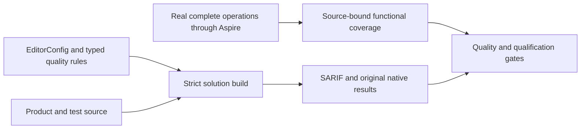

# ADR-033: source-owned code quality and evidence gates

Status: Accepted; implementation and complete qualification remain pending. Related requirements, acceptance criteria and current slice ownership are canonical in [CodeQuality](../Features/CodeQuality.md).

## Native failure constructor classification, 2026-10-09

REQ/AC-CQ-NATIVE-EXCEPTION-001 and TASK-CLIENT-CONNECTION under ADR-125
require existing KeyLoadException constructors to remain intact with native
generated serialization. KLD0021 governs Orleans DTO constructors; a native
System.Exception hierarchy is a runtime failure, not a DTO. The first joined
diagnostic stage produced five false positives on those existing constructors.

Implementation order: freeze this semantic boundary; classify actual direct or
indirect Exception inheritance in CodeQuality/Analyzers/
OrleansContractConstructorAnalyzer.cs using the active compilation symbol and
SymbolEqualityComparer; add real framework Roslyn inputs to the existing
OrleansContractConstructorTests; join build, diagnostics and original GitHub
analyzer tests. The implementation owner may reuse existing metadata constants.
Root owns contracts, the join and source delivery; the analyzer owner supplies
the semantic repair and focused tests. No name/namespace-based whitelist,
suppression, severity change or ordinary DTO-constructor exemption is allowed.
Existing positive/negative cases and compiler-success assertions remain mandatory.

This does not change persisted/public formats or add a runtime dependency. Rollout
is one coherent analyzer/regression source stage with the connection repair.
Rollback restores those changes together; removing legitimate constructors or
silencing the diagnostic cannot substitute for qualification. Analyzer tests run
in their original GitHub gate; actual native Serializer<Exception> and capacity/
wrong-owner RPC execution independently verify the repaired runtime failure path.

## Decision

Owner direction 2026-10-09 adds Roslynk 2.1.0 as a pinned repository-local
development tool and project-scoped Codex MCP server. The matching
REQ/AC-CQ-ROS-001..003 and TASK-CQ-ROS-001 implementation contract in
[CodeQuality](../Features/CodeQuality.md#roslynk-semantic-tooling-owner-direction-2026-10-09)
owns installation, actual MCP interoperability, complete workspace loading,
located diagnostics, reviewed fixes, rollback and the final verification join.
Use its native semantic APIs while retaining the selected analyzer catalog,
EditorConfig and every independent build/format/TUnit/Aspire/Linux gate.
Upstream advice to replace builds with workspace diagnostics does not apply.
The tool and disposable loopback workspace own no database execution or storage.

Use the owner-selected EditorConfig unchanged, the .NET SDK analyzers at `latest-all`, build-time style checks and warnings-as-errors across every solution project. Keep the eight applicable imported rules, excluding the four whose contracts do not apply to KeyLoad. Own editable Roslyn rules in the central source analyzer project and test them through actual SDK Roslyn compilations with TUnit. Keep compiler SARIF 2.1 reports available for successful and failed builds. Preserve the pinned compiler-host package selection; analyzer tests use SDK Roslyn references rather than a second loader.
Keep `GenerateDocumentationFile` enabled for the native IDE0005 build diagnostic.
Missing public documentation remains an error; no imported suppression list is permitted.

The exact analyzer catalog, semantic rules, test boundaries and source ownership live in the CodeQuality feature specification. Tests execute real product operations or the real compiler/analyzer and assert observable state or diagnostics. Reading implementation source and asserting tokens or implementation shape is not functional proof. Do not use mocks, fakes, stubs or service doubles to replace actual behavior. Generated-code policy, public contracts, error identity, authorization, cancellation, resource bounds and existing operation order remain enforced.

## Requirements and acceptance

The CodeQuality feature is the canonical requirements-to-test map. This ADR retains its current IDs and decision boundaries:

| Requirement | Acceptance criteria retained |
|---|---|
| REQ-CQ-001: strict, unchanged shared editor and SDK analysis | AC-CQ-001 |
| REQ-CQ-002: editable analyzer rules with real compiler cases | AC-CQ-002, AC-CQ-004 |
| REQ-CQ-003: independent compiler SARIF including failed-build diagnostics | AC-CQ-003 |
| REQ-CQ-004: preserving repairs and honest quality qualification | AC-CQ-005, AC-CQ-006, AC-CQ-022, AC-CQ-023, AC-CQ-024, AC-CQ-025, AC-CQ-026, AC-CQ-027, AC-CQ-028 |
| REQ-CQ-005: preserving benchmark prerequisites | AC-CQ-007 |
| REQ-CQ-006: executable numeric maintainability and coverage gates | AC-CQ-008, AC-CQ-009, AC-BC-027 |
| REQ-CQ-007: preserving CLI, query, search, storage, site, and lifecycle behavior | AC-CQ-010, AC-CQ-011, AC-CQ-012, AC-CQ-013, AC-CQ-014, AC-CQ-015, AC-CQ-016 |
| REQ-CQ-008: bounded qualification workflow concurrency | AC-CQ-017, AC-QUAL-001, AC-QUAL-002, AC-QUAL-003 |
| REQ-CQ-009: source-bound functional coverage and uncovered-flow repair | AC-CQ-018, AC-CQ-019, AC-CQ-020, AC-CQ-021, AC-CQ-039, AC-CQ-040, AC-CQ-041, AC-CQ-042, AC-CQ-043, AC-CQ-044, AC-CQ-045, AC-CQ-046, AC-CQ-047, AC-CQ-048 |
| REQ-CQ-010: typed synchronization | AC-CQ-025, AC-CQ-026, AC-CQ-027 |
| REQ-CQ-011: named runtime values | AC-CQ-029, AC-CQ-030, AC-CQ-031, AC-CQ-032 |
| REQ-CQ-012: complete runtime literal analysis | AC-CQ-033 |
| REQ-CQ-013: centralized typed operational options | AC-CQ-034, AC-CQ-035, AC-CQ-036, AC-CQ-037, AC-CQ-038 |
| REQ-CQ-014: complete-operation behavioral test ownership | AC-CQ-049, AC-CQ-050 |

The executable maintainability limits remain 400 source lines per file, 200 code lines per type, 64 code lines per executable unit, and nesting depth 3. KLD0030–KLD0033 remain enabled errors at those boundaries. The numeric compiler fixtures verify the exact legal and rejected boundary and diagnostic span; the same current limit applies to every qualified source cohort.

Functional coverage includes only complete functional operations. Load, stress, performance, and database-comparison tests do not contribute. Preserve the 80% module line, 70% module branch, 90% critical-pipeline thresholds, module no-decrease rule, and source-mapped CRAP requirements. CRAP combines native source-mapped complexity and functional coverage from the same source/build cohort. Missing, stale, skipped, failed, unbound, mixed-cohort, or incomplete results are unmeasured or failed, never zero-filled or relabelled.

Original MTP/TUnit reports, source and compiled identities, module and image identities, settings, failures, and coverage exports remain immutable evidence. Coverage requires the exact source inventory and matching DLL/PDB/MVID/portable-PDB identity; RF3 server contribution comes from the three actual AppHost-owned server processes. Line hits may be unioned only for matching source identities. Native branch outcomes are merged only when original reports identify each outcome; coarse covered/total fractions remain per-run evidence and merged branch coverage stays unmeasured otherwise. Healthy and rejected operations must preserve their original state, errors, cancellation identity, owned-process settlement and cleanup behavior.
Retain the existing evidence admission bounds: native XML is at most 32 MiB, the source inventory at most 5,000 files, and the distinct source-line inventory at most 100,000 locations. Source and run manifests retain their separate 64 MiB and 4 MiB ceilings, and native output retains its 64 KiB bound. Reject DTD/external resolution, paths outside the captured source root, duplicate conflicts, absent identities and invalid counts before producing derived coverage. These limits remain distinct from configurable stream buffers and manifest policy.

## Execution and ownership

The CodeQuality feature owns the current implementation sequence, task graph, exact file ownership, test mapping and report schemas. The integration owner alone joins shared configuration, AppHost, CI, inventories, documentation and cross-slice consumers. Slice owners preserve actual APIs and submit guarded, disjoint changes; an ownership or contract conflict stops the affected stage for review.

Use the Aspire-owned suite entry point for analyzers, unit, scalar, recovery and RF3 operations. Unit and scalar do not require an RF3 topology; RF3 operations use the discovered three-node Docker topology and the real SDK and official MCP client flows. Every process, collector, file reader and application resource must settle under its existing validated bounds before receipt verification or owned-root cleanup. Preserve the primary failure and all cleanup failures; a failed cleanup or missing report cannot produce a successful receipt.

A local build, focused run, static inventory, source review, or one passing cohort is development evidence only. Delivered-source qualification requires the exact Linux CI source SHA, successful required suites, original reports and verified source/image identities. Build, format, analyzer, governance, normal unit, scalar unit, recovery, RF3, functional coverage, and delivery gates remain separate. No skipped suite or unrelated workflow event substitutes for a required gate.

## Rollout and source checkpoint

This ADR changes quality tooling and evidence contracts; it does not change database bytes, SQL or external client protocols, Orleans activation movement, storage authority or RF3 topology. Roll out one reviewed source checkpoint containing its analyzer, tests, settings, inventory and documentation joins. A rollback restores the coherent source/configuration pair and retains every original report; it does not disable a rule, reduce a limit, or relabel prior reports as evidence for changed source.

The decision remains Accepted until the complete implementation and all mapped exact-source gates pass. The current status and original qualification receipts remain in the canonical [implementation status](../implementation/status.json) and [CodeQuality evidence record](../implementation/code-quality.md); these records must bind qualification to its exact source, run, job and original reports.

## Current native analyzer and report admission

TASK-CQ-CURRENT-NATIVE-042 implements REQ-CQ-001/006/009 and AC-CQ-001/008/044/046
under the owning feature contract. Ordered join: freeze the current artifact/report
contract; build the source analyzer in the formatter's actual Debug configuration;
run the unchanged canonical formatter; use native Cobertura `name` identities in
the complete CLI collector/merge oracle; run full Release plus relevant Aspire
flows and exact-source Linux checks. Root owns workflow, assertions and evidence.
Keep80/70/90 coverage thresholds, original counts/union and400/200/64/depth3 rules.
Rollback must retain a coherent source analyzer and strict native-report reader,
never stale artifacts, skipped assertions or synthetic coverage. No database
format, dependency, public API or topology changes belong to this quality stage.

## Complete functional unit contributor partition

TASK-CQ-FUNCTIONAL-UNIT-INVENTORY-043 implements REQ-CQ-009 and AC-CQ-018/020/021.
Keep ordinary unit and scalar suites complete, unfiltered and without coverage
after the authorized physical transfer leaves their assemblies free of benchmark
and comparison cases. Those checks stay with the Benchmarks-owned projects and
workflow. Collect functional unit coverage separately through five bounded
positive selector groups in each mode, with one exact post-transfer current case
inventory. Every permitted functional case belongs to exactly one group;
classify any residual nonfunctional cross-slice case explicitly and record the
new owner for moved benchmark cases without duplicating selector inventories.
Namespace membership alone does not authorize a contributor. Bind the inventory
to current test sources, the same Release compiler-input/DLL/PDB/MVID identities
and actual native TRX.

Ordered stages: root freezes this contract and owning feature; a Luna worker
prepares guarded source and meaningful merge-operation regressions; root joins,
builds, formats and runs Aspire collection; verify all ten unit groups plus
recovery and RF3 before report admission. Reject missing, duplicate, overlapping,
empty, excluded, failed, skipped or source/image-mismatched contributors. Preserve
native per-run branch evidence and every existing bound and80/70/90 threshold.

Exact source ownership and required tests are in CodeQuality's matching task.
Root owns workflow, inventory, identity and report joins. Roll out one coherent
strict descriptor/validator/CI checkpoint; rollback restores that checkpoint's
source/configuration pair, without an alternate reader or reduced qualification.
No numeric coverage or module closure follows from preparing an inventory.

A separate post-descriptor regression invokes the native merge entry point in
`ProductAdmission` mode against the actual generated Product descriptor and TRX
receipts. Product and admission modes share path/tool/bounds checks and
`Read-FcNativeProductPlan`; admission emits only a bounded validation result and
does not invoke collectors, merge reports or write coverage outputs. The
regression admits original evidence, rejects a controlled modified copy only
for its expected validation failure, verifies original bytes remain unchanged,
and admits the originals again. It uses no authored TRX. Ordinary full unit/scalar
operations do not claim to perform this separate admission regression.

The Product descriptor also binds successful full normal and scalar unit
`unitCensus` runs from the same evidence cohort and Release build. Both run with
coverage disabled and bind original TRX/report hashes, exact identities and
source locations, the captured source-manifest digest and test-image receipt.
Normal/scalar census identity sets must agree with each other and with the exact
current functional inventory. In each mode, its five instrumented groups are
disjoint and their union equals both that mode's census and the inventory, with
zero failed/skipped cases. Census files are bounded validation inputs only, never
coverage merge inputs/counts. Product and ProductAdmission both revalidate the
same descriptor/census through `Read-FcNativeProductPlan`; native merge
execution remains unchanged.

Each inventory case also records the original native TUnit `lineNumber` and
`endLineNumber` alongside its exact current source path/hash. Require positive,
ordered line bounds within that source file; both census reports and every
instrumented report must match this exact method/argument source range. Missing
or mismatched ranges reject rather than falling back to path-only ownership.

The descriptor producer takes `-UnitRunStatusPath` pointing to
`functional-coverage.unit-run-status.v1.json` inside the same evidence root,
replacing the former single unit/scalar exit-code parameters. Its strict schema
is `schemaVersion:1`, `sourceRevision`, `sourceManifestSha256`, and `runs`; each
run has exactly `id`, `suite`, `filter`, `coverageEnabled`, `exitCode`, and
`resultsDirectory`. Require exactly twelve unique runs: `unit-census`,
`unit-scalar-census`, `unit-functional-01` through `unit-functional-05`, and
`unit-scalar-functional-01` through `unit-scalar-functional-05`. The two census
filters are empty and coverage is false; each coverage filter equals its exact
inventory selector and coverage is true. Each results directory equals its run
ID and is confined to the evidence root. Capture each integer exit code from
the original native TUnit process; all twelve must be zero. Recovery/RF3 retain their
explicit existing exit-code inputs. Require current source/image parity and
original bounded native reports for every row; the status file alone cannot
prove successful execution. Read at most 64 KiB, within the configured manifest
limit, and reject unknown, duplicate, missing, skipped or malformed entries.
No alternate directory discovery or prior unit-status schema is accepted.
The fixed 64 KiB bound accommodates ten ASCII selectors of at most 4,096
characters and the twelve closed metadata rows. Keep the per-selector bound,
exact schema and configured manifest limit; the former 16 KiB aggregate cannot
represent every admitted selector set. This is a private evidence-format bound,
not a change to operation deadlines, test outcomes or coverage thresholds.

Bind `unitRunStatus` and per-unit/scalar/census `statusId`, consuming all twelve
rows once with exact directory confinement; recovery/RF3 inputs stay separate.
The existing `NativeCoverageMergeTests` case uses new CodeQuality/Helpers
`NativeCoverageProductEvidenceRejection.cs` and
`NativeCoverageProductEvidenceFiles.cs` for its required post-descriptor phase.
Set `KEYLOAD_NATIVE_PRODUCT_ADMISSION_REQUIRED=true` and
`KEYLOAD_NATIVE_PRODUCT_DESCRIPTOR_PATH` together; missing, inconsistent or
invalid required inputs fail. CI validates the bounded
`native-product-admission-phase.v1.json` receipt after the complete native
admit/controlled-denial/immutability/re-admit/cleanup flow. Both absent selects
only ordinary real backup/restore and cannot qualify the separate phase.

TASK-CQ-FUNCTIONAL-UNIT-INVENTORY-043 joins temporary-directory creation to the existing observed admission/cleanup lifetime: the caller retains the exact owned path before creation and attempts bounded cleanup even when creation fails. Check copied native TRX/descriptor bytes against their own format bounds and the configured per-file bound before writing. Preserve original native failure, all cleanup errors, the existing whole-operation case and the required post-descriptor receipt. No runtime fault proof is inferred from source review.

TASK-CQ-FUNCTIONAL-UNIT-INVENTORY-043 inventory validation preserves native multi-case declaring classes and byte-preserving benchmark transfer namespaces. Distinct declaring classes still obey the frozen positive selector identity contract. The exact physical ComparisonTests source path/hash establishes moved-case ownership; preserved UnitTests namespaces are not functional coverage authority. Case identities remain unique and all functional census/positive-group parity and exclusion checks remain mandatory.

The 2026-10-07 report-display amendment to TASK-CQ-FUNCTIONAL-UNIT-INVENTORY-043 records the declared CLR `className` from original TRX separately from exact original MTP `nativeReportClassName` on each functional inventory row. Native TUnit tree selectors use the former; fixture display suffixes remain untouched in the latter. The linked CodeQuality contract freezes the extra field's bounds, one-to-one report/TRX/source joins, unchanged moved-case shape and mandatory successful census/group parity. Ordered stages are contract freeze, private two-script producer repair and native draft reconciliation, one coherent inventory/producer/workflow join, strict build/format/parser checks, and original complete Linux coverage plus ProductAdmission qualification. Root owns integration; the Luna worker owns only `functional-coverage.native-merge.contributors.ps1` and `functional-coverage.native-merge.functional-report.ps1` within the existing stage. Rollback removes the coherent amendment without introducing a fallback alias reader. Public APIs, persisted formats, dependencies and all existing thresholds are unchanged; failed draft evidence remains unqualified.

## Q2 whole-operation contributor integration

TASK-CQ-Q2-CONTRIBUTOR-044 and AC-CQ-Q2-CONTRIBUTOR-001 continue REQ-CQ-009 /
AC-CQ-044/046/047 under the matching CodeQuality contract frozen 2026-10-07.
Root joins the 37 additional exact operation rows in the existing product
contributor registry and the native report reader as one coherent stage. The
Luna reader owner extends only the exact RF3 display/CLR/fixture/native-ID join
for the four constructor-data Q2 classes and the one parameterless budget
class; preserve the two existing exact mappings, original TRX/source checks,
rejection behaviour, schemas and bounds. It is current pinned-TUnit identity,
not a stored database format or compatibility path.

Ordered stages: freeze this feature/ADR contract; review disjoint guarded JSON
and one-script proposals; run strict build/format and native whole-flow tests;
require original complete Linux normal/scalar/recovery/RF3 and the required
ProductAdmission original-admit/controlled-denial/immutability/re-admit/cleanup
operation before qualification. Source review is the explicit exception for
unchanged strict native-ID denial branches, with genuine matching RF3/report
results mandatory. Root owns final source/report/compiled-image verification,
status and delivery. Rollout and source rollback keep registry and reader
coherent; all numeric coverage, no-decrease, provenance and original-report
gates remain mandatory. No source-only inventory check qualifies execution.

The Stage VII audit confirms ProductAdmission is specified but absent from the
current Product/ToolingProof entry and CI. NativeCoverageMergeTests proves CLI
tooling collection/merge, not product admission. Implementation and the required
whole native-evidence flow remain mandatory open work, alongside the complete
inventory/census descriptor amendment. Root repairs the three existing CI
functional collection selectors to consume the 92-row Q2 registry coherently;
all ordinary suites, server collectors, source/image/report identity, module
completeness and numeric gates stay intact. The separate AC-CQ-018 first-profile
contract is preserved. Luna owns a private one-workflow selector patch, root
reviews and joins it before delivery; no fabricated native evidence or coverage
claim is permitted. A rollback removes registry, reader and selectors together.

### Native coverage package-producer implementation contract, 2026-10-07

Native coverage package metadata composition joins the legitimate NuGetPackageRoot, dotnet-coverage and the centrally pinned version with System.IO.Path.Combine. Roots with and without a trailing separator have identical native package ownership semantics. Retain immutable build metadata, original feed/package closure validation and fail-closed preparation; no environment fallback or surrogate package is admitted.

Ownership: CodeQuality, ADR-033, TASK-CQ-PRODUCTION-IDENTITY-003; AC-CQ-039..042 and the existing source-manifest/process-settlement acceptance flows. Root must build legitimate NuGet package roots with and without their trailing separator, then execute NativeCoverageMergeTests.ActualCliBackupRestoreCoverageMergesWithRepeatedInputInvariantAndPreservedState and NativeCoverageImageMaterializationTests.RealMaterializerRejectsAlteredAndOccupiedInputsThenCopiesTheObservedReleaseClosure on the genuine installed package. Preserve original pre-operation failures and exact new source/image identities.

### Native coverage metadata-enumeration implementation contract, 2026-10-07

Native compilation receipt enumeration uses MetadataReader.GetAssemblyDefinition().GetCustomAttributes(), the native indexed collection for the owning assembly. Preserve assembly parent, constructor, type, scope, signature, blob, enumeration order, record/count/text bounds and all original source pre/post equality scans. No caching, skipped project scan or weakened manifest validation is permitted.

Ownership: CodeQuality, ADR-033, TASK-CQ-PRODUCTION-IDENTITY-003; AC-CQ-039..042 and the existing source-manifest/process-settlement acceptance flows. Root must execute the existing complete NativeImagesProduceClosedManifestAndRejectTamperingWithoutReplacingEvidence and AcCq045CanceledChildAndOutputOverflowSettleBeforeHealthyOperation flows, retaining tamper denials, restored healthy verification, create-only evidence and joined child cleanup. Compare actual original metadata records before/after on genuine product and generated TUnit images. No runtime equivalence or speedup is claimed by this packet.

## Native confined path traversal, TASK-CQ-NATIVE-CONFINED-PATH-001

TASK-CQ-NATIVE-CONFINED-PATH-001 preserves Resolve-FcPath lexical rooted/parent/escape rejection and every per-segment reparse denial. Replace PowerShell provider Join-Path/Test-Path/Get-Item with native Path.Combine/File.GetAttributes for the same original segments. Only FileNotFoundException and DirectoryNotFoundException retain the original missing-path behavior; all other native IO failures propagate, never admit an unchecked path. Symlink/dangling/reparse points retain the exact frozen ErrorPath message. No filesystem cache, omitted segment, skipped source/PDB/image scan, new authority or timeout change. Final regular-file/compiled-file and caller-specific existence checks remain unchanged. Original path normalization, source checksum/pre-post identity binding, all complete manifest passes and cleanup remain mandatory. Linux filesystem behavior requires original runner proof; private macOS native diagnostics are development evidence only. Ownership is CodeQuality shared path confinement under ADR033/TASK-CQ-PRODUCTION-IDENTITY-003 and AC-CQ-039..042 plus existing complete native manifest tamper/restoration and process-settlement flows. Root must qualify real normal/scalar source-manifest operations with original bounds before closure.

## Inventory3 complete-census producer/admission join, 2026-10-07

TASK-CQ-FUNCTIONAL-UNIT-INVENTORY-043 implements REQ-CQ-009 and
AC-CQ-018/020/021 through the exact inventory3/descriptor3 contract frozen in
CodeQuality. Functional cases and required ordinary-only controls remain
disjoint; full census proves their union while five groups prove only functional
projection. Native negative method-prefix selectors preserve mixed classes,
actual parametrized report/TRX identities and4096character pergroup bounds.
Canonical deterministic /_/ source-map prefix remains exact, with current
compiled source/hash/range witnesses; no source suffix heuristic is introduced.

Ordered stages: private contract freeze; guarded existing producer/admission
repair and feature-local unit-inventory/unit-selectors helpers; actual current
normal/scalar original census reconciliation and whole-operation classification;
one root-owned inventory/readers/producer/workflow join; native build/format;
complete Linux ordinary/census/groups/recovery/coveredRF3; existing genuine
ProductAdmission admit/copiedTRX denial/original immutability/healthy re-admit
and joined cleanup receipt. Only runtime original success qualifies.

Owned source files are functional-coverage.native-product-descriptor.ps1,
functional-coverage.native-merge{,.admission,.contributors,.unit-inventory,
.unit-selectors,.functional-report,.test-images,.trx}.ps1, existing
NativeCoverageMergeTests/Process/EvidenceInventory and feature-local
NativeCoverageProductEvidenceFiles/Rejection helpers. Root owns workflow,
canonical reviewed inventory, contract integration and gates; the assigned
Sol worker prepares private guarded source, another Sol independently reviews.
Source manifest remains3 with14 production+2 infrastructure modules; statuses
and phase receipt remain1 and bounds/thresholds unchanged. Dependencies and
public formats/APIs remain unchanged. Replace old descriptor/inventory readers
as one coherent join without runtime fallback. Rollback removes that complete
join; absent coveredRF3, failed/changed/missing census or unresolved
classification rejects without creating passing evidence.

### R4 genuine native census and confined selectors (authored, pending native group proof)

REQ-CQ-039..045 and ADR-033 retain the schema3 contributor/descriptor contracts, exactly five disjoint nonempty functional groups, every required ordinary control, all sixteen production module gates and unchanged80/70/90/no-decrease thresholds. The genuine R332 full discovery contains2876 complete parameterized native identities; source review reconciles2788 existing identities and88 new whole-operation cases. The reviewed partition is2534 functional and342 ordinary-only controls. These are inventory counts, not measured coverage or Linux qualification. Original failed and superseded native reports remain retained.

The canonical selector uses the shortest ordinal CLR class-leaf identifier prefix plus terminal `*` whose matches within the complete observed universe are confined to the assigned group. Deduplicate and remove redundant longer prefixes, sort ordinally, retain existing exact method-prefix exclusions, reject collisions, unassigned/ordinary-only classes, unsafe exclusions and selectors over4096 characters. Do not infer TUnit wildcard behavior from this construction. Before collecting coverage, root must run genuine native `--list-tests json` for each exact selector on the same compiled image and compare its complete parameterized identity set to that group's inventory. Any missing/extra/control identity rejects admission; full discovery must equal the complete functional-plus-ordinary census.

`functional-coverage.native-census.ps1` performs bounded read-only equality validation against digest-bound original native JSON and the reviewed inventory. The preflight requires a digest-bound genuine native image observation, validates current DLL/PDB and every declared source hash (at most8192 records), and invokes existing schema3 inventory/source/group validation. Native exit/status, before/after source/image equality, matching PDB/MVID/declared compiled-source receipt and original native JSON remain mandatory independent evidence. The R332/R337 receipts bind the historical pre-formatter image only; subsequent formatter or R4 source changes require fresh native identities and discovery. Full ordinary normal/scalar, all five normal/scalar coverage groups, recovery, covered RF3 and original descriptor/TRX admission remain separate mandatory gates. No measured coverage, RF3 success or task closure follows from authored source or discovery alone.

R5 independently confirmed correction: the R3/R4 native merge whole-operation case changes its source bytes and method span. Bind its authored proposed sourceSHA36c399c42a659957ac7e9308a38bb747551fe79f55828d0fc0f9270788b0aef5, preserve original observed native range7..19 as pending historical metadata, and block source/census qualification until actual post-join full discovery and matching current compiled image observation exist. The optional full-census-only private range rebind changes only lineNumber/endLineNumber from genuine native records after complete reviewed universe/class/method/display/sourceSHA equality and existing schema3 validation. It writes one new exclusive inventory.current-native.v3.json outside checkout; root reviews and guards the range-only canonical join. No source-derived guessed range, UID or native success is published. Original R345/R346 are pre-R5 image/discovery receipts only; a subsequent R5 build and original native source/image/census proof are mandatory.

### R5 same-job workflow producer integration (source proposal, runtime pending)

TASK-CQ-FUNCTIONAL-UNIT-INVENTORY-043 / REQ-CQ-039..045 / AC-CQ-039..045: Build and Tests retains all ordinary required verify/RF3 gates. The RF3 coverage job additionally owns one source/image preparation, native full plus five selected discoveries in both normal/scalar modes, full uninstrumented normal/scalar execution, ten disjoint instrumented groups, existing recovery contributor and covered RF3. Each original child exit is retained; twelve closed unit status rows represent two censuses and ten coverage groups, while recovery/RF3 remain separate explicit exit inputs and twelve covered inputs. Failed execution rejects descriptor admission without altering original reports.

Workflow-local CodeQuality producer helpers use the existing genuine native DLL/PDB/assembly compile-receipt snapshot and strict schema3 census validator; snapshots before/after each discovery must match. Discovery original stdout/stderr and joined native process receipt remain artifacts. No inferred wildcard selection, authored positive report, timeout increase, cache or omitted source scan is permitted. Each native discovery keeps the ordinary 30-minute ceiling and joined 30-second settlement; ordinary unit/recovery and RF3 execution retain existing runner budgets. Root must first join genuinely observed post-R5 native ranges; CI never rebinds or mutates inventory automatically.

After same-job source/image verification, descriptor producer consumes the bounded twelve-row status file. NativeCoverageMergeTests runs separately with both required ProductAdmission environment inputs; validate its original one-case TRX and bounded phase receipt against the descriptor digest, two healthy admissions and one controlled TRX denial. Product merge then enforces unchanged sixteen-module80/70/critical90/no-decrease gates. Every original artifact survives failures; source authoring alone establishes no qualification. Owned paths: .github/workflows/build-and-tests.yml and scripts/Features/CodeQuality/functional-coverage.workflow-{discovery,collect}.ps1; root owns joins and native execution. Rollback removes this complete workflow integration, never restores the obsolete four-cohort producer contract.

TASK-CQ-FUNCTIONAL-UNIT-INVENTORY-043 argument-construction correction: source review found that PowerShell comma-array precedence combined the intended Suite and ResultsDirectory expressions into one string. Freeze the existing exact two native selection arguments before correcting only expression parentheses in functional-coverage.workflow-collect.ps1. Retain every status row, original child exit, suite/filter/coverage/result-path/budget and all discovery/source/image/descriptor/admission gates. Verify actual two-element argument values with bounded literal-only PowerShell evaluation, then genuine native execution after root releases frozen images. This is a tooling source correction, not a successful native test receipt.

### TASK-CQ-RF3-CLOSED-CATALOG-046 / native diagnostic isolation correction (authored)

REQ-CQ-039..045 / AC-CQ-039..045 retain the original source/image, artifact, collector and joined-node gates. The covered RF3 cohort is exactly the existing eleven nonparameterized identities in functional-coverage.product-contributors.json: four query/document cases and seven Q2 relational cases, across seven closed classes. The AppHost typed contributor catalogue owns exact class/method/instance equality; producer filter, admission, run manifest and fixture reader must select this same cohort. Missing, duplicate, foreign class, substituted method or instance is rejected before infrastructure; a count alone grants no admission. No local-image selection, resource quota, deadline or coverage threshold changes. Existing native source preparation exercises actual manifest admission, controlled identity corruption, byte-preserving restoration and healthy read before native source verification. Covered RF3 still requires its original eleven real SDK/official MCP operations and original node exports.

The original Linux run37655841124/attempt1/source0c2f4799df1ebfa1dd90cd0ae31c1fde4991b057 retains eleven BeforeTestSession selection failures; authored correction is not executed RF3 or coverage proof. Root owns fresh build, native census/inventory, full normal/scalar, recovery and covered RF3 execution.

Implementation order: freeze closed cohort; introduce feature-local typed catalogue; route native admission and fixture equality through it; retain producer exact seven-class filter; extend the existing genuine source-preparation/rejection/restoration operation; qualify original native artifacts after root join. Rollback removes the complete correction rather than admitting wildcard/count-only substitutes. No data format or migration changes.

## TASK-CQ-RF3-PREPARATION-OWNERSHIP-002

REQ-CQ-039/040 and AC-CQ-039/040 retain the closed original eleven contributor,
source/DLL/PDB/image/context and collector admission. Original4e18 BeforeSession
selection failure used obsolete two-class runtime filter while producer selected
seven classes/eleven cases; current shared catalogue already repairs that mismatch.
No nested empty-string normalization is authorized: nested fixture mode/source are
explicitly cleared, suite is absent, and current typed image context remains strict.

The native TUnit coverage preparation owner must compose the AppHost directly through
the existing Aspire testing builder API, validating outer original-node selection and
exact closed catalogue first, then adding the unchanged real prerequisite resources.
It must never resume a standalone TestSuiteApplication after removing its runner.
The fixture owns preparation start/readiness/output/stop/dispose/collector cleanup;
original primary plus joined cleanup failures remain retained. No deadline, image,
source manifest, public RF3 topology, whitelist or thresholds change. Extend existing
genuine source-preparation operation with exact old-selector rejection followed by
healthy canonical-selector source admission and unchanged original manifest bytes.
This admission control is supporting infrastructure evidence, not product coverage;
actual covered RF3 eleven original collector flows and Linux gates remain mandatory.

Supporting control owns GITHUB_SHA briefly under the existing globally nonparallel test, using only the genuine prepared native source manifest revision, restores the exact prior environment in finally and propagates primary/restore failures. Production selection still checks its original environment source SHA; no bypass parameter or fabricated manifest.

R3 joined restoration: observe each original environment-key restore individually through existing ServerFailureObserver, continue every remaining key, retain all earlier stop/output/builder/image failures and throw only after restoration settles. Output lifetime disposal and cleanup service lookup similarly retain original failure identities. Prepare primary/cleanup aggregation remains unchanged. Correct actual AppHostRuntimeOptions.NativeCoverageRf3Image property verified in owning source.

## TASK-CQ-PRIVATE-IMAGE-INVOCATION-001

REQ-CQ-039/040, AC-CQ-039/040/042 and ADR-033 require the original owned image descriptor to be private at creation. On Unix the actual CreateNew producer requests owner read/write only (0600), before any descriptor byte is written; no post-creation permission repair, existing-file overwrite or relaxation of the materializer's regular-file/link/private-mode admission is permitted. Windows creation preserves its existing platform behavior; native Unix qualification remains mandatory. Original descriptor bounds, source/DLL/PDB/MVID/base-image proof, closed eleven RF3 admission and all original process/reader/cleanup deadlines remain unchanged.

The existing NativeCoverageImageMaterializationTests.RealMaterializerRejectsAlteredAndOccupiedInputsThenCopiesTheObservedReleaseClosure supporting control creates its descriptor through the actual producer write boundary, rejects an explicitly public-mode descriptor through the real Node materializer without creating a context or modifying descriptor bytes/mode, rejects a second CreateNew write without changing the original descriptor, then materializes a fresh actual Release closure and verifies complete native context/source identity and joined child/output/disposal. Existing altered-source and occupied-context controls remain. This control is ordinary infrastructure evidence, not product coverage or RF3 execution. Original Linux661 preparation/cleanup failures are retained: the source mismatch is confirmed, but the historical runtime stage/category is unobserved and is not inferred from elapsed time. Root must build, execute this control in normal/scalar and run the unchanged actual covered RF3 session before qualification.

### TASK-CQ-PRIVATE-IMAGE-INVOCATION-001 safe original preparation observation

Additive REQ-CQ-039/040 and AC-CQ-042 evidence observes only closed preparation phase, actual original child exit code/closed signal, stdout/stderr byte counts and original exit/reader settlement flags. Unknown observations remain null/false. One fixed-field bounded JSON line is emitted on the original preparation failure stderr beside the unchanged generic failure. No raw stderr, exception detail, file path, source payload, credentials or image reference is retained. Phase is set immediately before the actual awaited native operation; it does not infer an initiating category from elapsed time or safe error text. Original primary/cleanup order, process stop/settlement deadlines and hard-exit behavior for unsettled tasks remain unchanged. Root must inspect the actual next preparation failure receipt and execute healthy original preparation/collector cleanup; authored source is not observed RF3 evidence.

### TASK-CQ-NATIVE-PACKAGE-DIGEST-001

REQ-CQ-039/040 and AC-CQ-039/040/042 retain the existing native package archive, closure, source/image and collector gates. The native package producer emits nupkgSha512 as the canonical Base64 encoding of the actual 64-byte SHA-512 digest, matching the restored NuGet sidecar. The RF3 context reader must admit that exact format, with an 88-character bound, successful 64-byte decode and canonical round-trip equality; hex, whitespace, malformed padding and alternate encodings are rejected. No schema aliases, fallback or rewritten evidence is introduced.

The shared validator belongs to KeyLoad.AppHost/Features/CodeQuality/Validation/NativeCoveragePackageDigestValidation.cs and is consumed by the existing IntegrationTests context reader. Extend the existing RealMaterializerRejectsAlteredAndOccupiedInputsThenCopiesTheObservedReleaseClosure operation: consume the actual native materialized package hash, compare it with the independently hashed original archive, reject controlled alternate representations, and preserve all source/context bytes and joined child/reader cleanup. This remains an ordinary infrastructure control. Original exact46a4 covered11 failures remain retained; their compound rejection does not independently identify every failed field. Full original covered RF3 and numeric coverage admission/merge remain required. Root joins the shared validator and the native producer-consumer regression together, builds and runs the existing normal/scalar operation, then delivers the source for the unchanged Linux covered RF3 and admission/merge gates. No dependency, topology, catalogue, deadline or threshold changes.

### TASK-CQ-RF3-PREPARATION-TEMPLATE-001 — distinct native template and base-image source identity

REQ-CQ-039/040/042 and AC-CQ-039/040/042, ADR-033 and ADR-117 retain the exact eleven contributors and all source/image, native materializer, create-only evidence, bounds and joined cleanup gates. The root Dockerfile hash authenticates the pinned ASP.NET base-image selection. The native image template hash independently authenticates scripts/Features/CodeQuality/functional-coverage.server-image.dockerfile from the actual selected source checkout. They are distinct inputs and MUST NOT be compared as if they were identical. The consumer reads that fixed source path through its existing bounded regular-file reader and compares the declared original context template digest against those exact bytes. Neither hash is omitted or replaced by a caller-selected file.

The existing RealMaterializerRejectsAlteredAndOccupiedInputsThenCopiesTheObservedReleaseClosure whole-operation control must materialize the genuine current release closure, read and validate the actual generated context against the selected native template, alter the actual context's template digest, reject it without altering original input/receipt/other context bytes, restore the exact original manifest, and validate the complete healthy context again. Original child/process/readers remain joined and all failures retained. This ordinary control is not a product coverage contributor. Original Linux run37744013727/attempt1/source59e856254a4243ebc74780f95dec1623a9fe2dae retains covered RF3 0/11 failure; both authenticated archives omit the context manifest, so the exact historical predicate value is unobserved. The mismatch is established from actual producer/consumer code and the original base/materializer receipts; new native reproduction remains mandatory. Numeric product coverage remains NULL.

### Current controlled-movement whole-flow census extension (2026-10-08)

TASK-CQ-FUNCTIONAL-UNIT-INVENTORY-043 retains REQ-CQ-039..045,
AC-CQ-039..045 and ADR-033. Admit only the five source-reviewed whole-operation
cases documented under REQ-MOVE-NATIVE-001 / AC-MOVE-NATIVE-001..004 and
REQ-CLIENT-006 / AC-CLIENT-006 / AC-MCP-003 / AC-MCP-007. Preserve every existing
3039 case identity and disposition, required ordinary controls, exclusions,
benchmark moves and five cohort owners. Derive locations from the actual newly
compiled native census and bind their current source hashes to the original
PE/PDB/compile observation; derive confined selectors against the complete
universe and verify every selected census. No UID, location, operation outcome
or coverage value may be inferred from source review.

R721 observes 3044 native cases: 2648 functional contributors and 396 required
ordinary controls. These are discovery counts. The 46-case local R720 run passes
the corrected complete seed/cold-reopen flow and affected routing, serialization
and MCP regressions. R715 retains three macOS loopback bind failures; its initial
seed queue oracle failure is corrected using a separate literal canonical JSON
payload, preserving the original command/fingerprint. Actual Linux prepare,
fence and capture flows, all full/instrumented suites, covered RF3 and the final
source-bound merge remain required. Product functional coverage stays unmeasured;
load/comparison and website JavaScript coverage remain separate.

### Owner-admission whole-flow census extension (2026-10-08)

TASK-CQ-FUNCTIONAL-UNIT-INVENTORY-044 retains the existing coverage
REQ/AC-CQ-FUNC-039..045 source, census and contributor gates. R735 observes
3045 actual native cases after the configured-owner admission repair: 2649
functional contributors and 396 required ordinary controls. Preserve every
previous3044 identity, disposition, REQ/AC mapping, exclusion and group owner;
only rebind actual current source checksums/native locations and add the one
reviewed operation contributor. No guessed native UID or source range is allowed.

UnconfiguredMovementAuthorityWholeFlowTests is an actual canonical native store
operation. It injects each independently literal malformed movement authority
family, rejects construction and current-cut access without effects, executes
a genuine global principal command with retained failed outcome/replay and no
principal effect, removes the actual fault, and reads the complete literal
DocumentResult. It maps REQ-MOVE-NATIVE-001 to AC-MOVE-NATIVE-005; supporting
configured Prepare/Grant flows also exercise real null-owner issuance/apply,
restoration and source-fenced original command replay. These supporting flows
retain their existing identities and require Linux loopback execution.

The new class belongs to existing group unit-functional-01, whose U* selector
already selects it. Native groups become527/528/494/528/572; no selector,
threshold, exclusion, ordinary control or contributor is removed. R735
PE/PDB/compiled-source observation and canonical full plus five selected
normal/scalar discovery must independently bind the current inventory/image.
Read-only discovery is not a scalar operation rerun, coverage measurement or
complete acceptance. Original R733 eleven read-budget/owner whole flows pass
locally with unchanged exact budgets; full normal/recovery, original Linux
RF3 and admitted merged product coverage remain separately required.

## Native unit-image producer/consumer join

TASK-CQ-UNIT-IMAGE-PRODUCER-044 implements REQ-CQ-009/AC-CQ-044. Root freezes the exact existing unit sidecar contract, emits it via Get-FcTestIdentitySnapshot, then exercises the actual strict Read-FcTestIdentityManifest through the existing owned bounded native-process runner. The complete prepare/read/tamper/reject/restore/read/create-only flow preserves original bytes, errors, joined exit/readers/disposal and every current source/PE/PDB binding. Root updates the exact normal/scalar contributor identity oracle alongside the eight genuine maintenance flows, builds/formats, runs focused native normal/scalar operations and publishes one coherent checkpoint for Linux qualification. No permissive reader, historical label fallback, database format, dependency, topology or numeric coverage claim belongs to this repair; rollback restores the coherent producer/consumer pair and retains the original reports.
