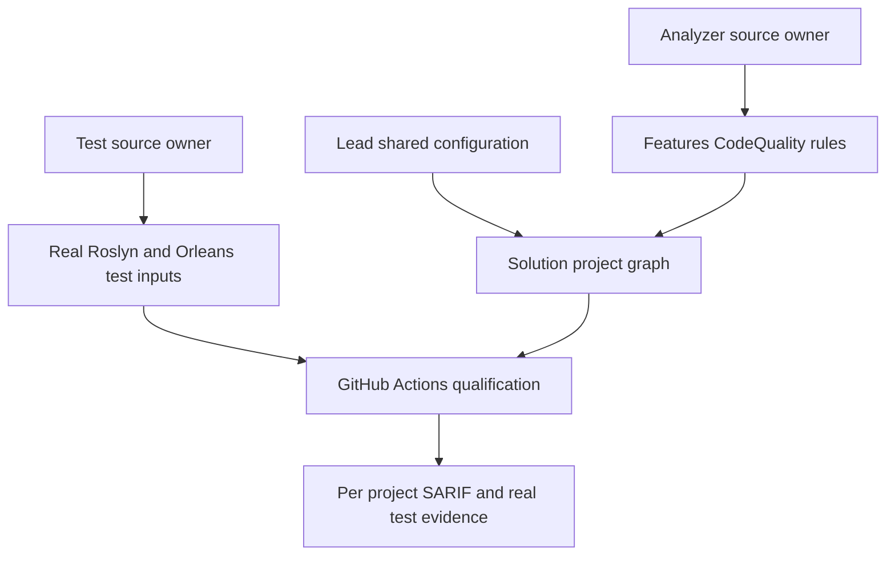
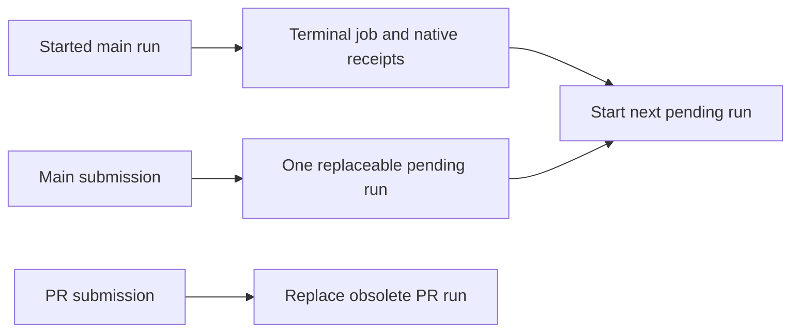
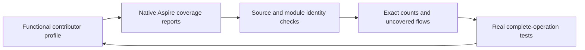

# ADR-033: source-owned CodeQuality analyzers and compiler reports

Status: Accepted. Owner direction: import Prostir EditorConfig/build checks and
bring editable Roslyn rules into KeyLoad. Related REQ-CQ-001..004 and AC-CQ-001..006
are defined in [CodeQuality](../Features/CodeQuality.md) and its acceptance file.

## Decision

Copy the owner-selected EditorConfig without modifications. Enable SDK .NET and
build/live style analysis with latest-all and warnings-as-errors for every project.
Import eight applicable rules, changing product ownership names and diagnostic
prefix only; exclude four rules whose product contracts are absent in KeyLoad.
Use a centrally attached source Analyzer ProjectReference and SDK Roslyn metadata,
as Prostir does. No sibling checkout reference, runtime analyzer dependency, custom
reporting engine or dependency upgrade is needed. Compiler ErrorLog writes SARIF
2.1; CI uploads it on failure as well as success.

Enable GenerateDocumentationFile as Prostir does, because the imported IDE0005
build diagnostic requires it. Do not copy Prostir's NoWarn list: missing public
documentation and other newly exposed diagnostics stay visible as errors.

The real Orleans test metadata dependency already brings Microsoft.CodeAnalysis.Common
5.0.0, while the pinned SDK hosts Roslyn 5.9.0.0. Keep the existing package version
centrally pinned; the test project excludes that package's compile/runtime assets
and uses the SDK Roslyn references consistently. This is compiler-host asset
selection within the test project, with no package upgrade or custom assembly loader.

## Implementation contract

1. TASK-001: lead writes acceptance/plan and this decision before implementation.
2. TASK-002/003: independent read-only source and CI discovery; lead reviews joins.
3. TASK-005: regression worker authors valid/invalid real-compilation TUnit cases
   in `tests/KeyLoad.Analyzers.Tests/Features/CodeQuality/`, with project/local policy.
4. TASK-004: analyzer worker imports sources into
   `src/KeyLoad.Analyzers/Features/CodeQuality/`, with project/local policy; compile
   against SDK Roslyn. Split source helpers where imports exceed repository limits.
5. TASK-006: lead alone edits root config/solution, workflow, inventory, architecture,
   feature/ADR/README/status; joins every worker diff and runs development builds.
6. Qualification: canonical CI exact delivered SHA, TUnit analyzer and all existing
   suites, format/governance and reports. Remain Accepted until every mapped gate
   passes. Source/build is not test qualification; no numeric coverage is invented.

Workers may not alter public runtime contracts, unrelated code, dependencies,
severities, root policies or shared files. Escalate ambiguous applicability, actual
analyzer defects, compiler crashes and ownership conflicts to lead. No mocks or
framework stubs; tests reference real Orleans metadata. Shared-file edits serialize.
No qualifications/tests execute locally.

Migration/rollout is build-only and forward-only, with no persisted data changes.
Ordinary revert rolls back the scoped import under owner direction. Existing dirty
work remains intact. Defects in independent ManagedCode packages use their owning
repository repair/release policy; this import is solution-owned tooling.

Rollback restores a previously verified rule implementation and matching central configuration only after integration review. Mandatory SDK/style analysis, every applicable repository rule, warnings-as-errors and project scope remain in force; reverting a diagnostic or disabling the analyzer to hide violations is not an accepted rollback. Retained compiler reports stay immutable. Runtime data rollback is N/A because this decision changes build tooling, not persisted product state.

## Maintainability and evidence

The import preserves behavior while extracting large tables/helpers into cohesive
files where needed. Descriptor text and symbol/metadata names are centralized
constants where appropriate. No new diagnostic suppressions are authorized.
The full-solution warning inventory is real output, with failure status retained.
Missing existing coverage/complexity infrastructure remains recorded pending.

## Source prerequisite repair contract

TASK-MP-010C repairs public storage-contract XML documentation and the required
StorageRecords.PutRecord transaction/key argument guards under AC-CQ-001/005/006
and AC-MP-012. Lead alone owns Storage/StorageContracts.cs and new UnitTests
Features/StorageRecovery argument/roundtrip cases. All interface/type/member names,
collection shapes, serialization, ownership and store action lifetimes remain
unchanged in this stage. Null arguments reject before serialization; real provider
roundtrip assertions and existing typed-read null guards are preserved. Author the
regression source first, add meaningful docs/guards, then strict development/static
and exact GitHub qualification. No artificial tests for XML comments, suppressions,
dependencies or consumer workaround. Array/naming migration is a separate accepted
decision before implementation, not part of this documentation repair.

TASK-MP-010B fixes the located ServiceDefaults diagnostics under AC-CQ-001/005/006
and AC-MP-012. Its sole write scope is `src/KeyLoad.ServiceDefaults/Extensions.cs`.
The infrastructure helper type is renamed to `KeyLoadServiceDefaultsExtensions`
to avoid the existing framework namespace collision; extension-method names,
signatures, health routes, liveness tags and telemetry registration stay the same.
No explicit static-type callers exist in the current solution inventory. This is
a source-name change in solution-owned composition infrastructure, with no package,
wire or persisted-data change. Named constants, XML documentation, argument guards
and explicit `OrdinalIgnoreCase` path comparison preserve existing behavior.
Lead joins every caller in the strict solution build and CI integration suite;
documentation-only additions need no artificial implementation-mirroring tests.
No severities, tests, policies or dependencies may change in this scope.

TASK-MP-010L repairs the 20 actual ArtifactTransfer/BackupArtifact diagnostics
under AC-CQ-001/005/006 and AC-MP-012. memory_cluster_review owns only those two
files, their target Features/BackupRestore replacements/helpers, root ArtifactTests
and new matching BackupRestore unit cases. Move the existing feature into its
canonical slice while preserving public namespace/type/member/signatures and
removing replaced root declarations. Add meaningful XML/braces, named constants,
private immutable canonical-file names and the concrete FileSystemStorage local
type. Replace direct DateTime.UtcNow only with TimeProvider.System.GetUtcNow().UtcDateTime;
retain real wall time, exact catalog/segments/chunk order and byte format, create-new
and permissions, bounded transfer, SHA/checksum and cancellation behavior. Existing
real artifact pack/inspect/unpack/transfer cases remain; any changed argument/error
behavior requires a meaningful test first. No new dependency, format, signature,
retry/fallback or consumer-side dependency workaround. Stop on an upstream defect.
The lead joins source/compiler/format and exact-SHA GitHub qualification; no local
tests and no claim that formatter output proves backup/recovery durability.

### Accepted pinned-driver prerequisite joins

### Accepted remaining preserving benchmark prerequisites

The same serialized formatting prerequisite also permits whitespace-only fixes
for the exact U/V/X and already joined host/test scopes when canonical verification
reports them. It permits no automatic visibility, API, naming or rule-severity fix;
remaining contract diagnostics stay failures. Whitespace source edits alone do not
qualify behavior, numeric complexity or coverage.

REQ-CQ-005 / AC-CQ-007, AC-CQ-001/005/006 and AC-MP-010/012 own this stage.
Lead accepts the bounded repair contract under the existing analyzer/performance
repair authorization. The 123-error source cut is the actual dependency-enabled
host build after ADR-043 and brace repairs; no runtime test failure is invented.

Ordered stages: (1) preserve the source cut and author public argument regressions;
(2) disjoint XML-only and private helper workers; (3) lead shared guards/clock/
sampler lock and exact diff joins; (4) normal actual-dependency build and canonical
formatter/governance; (5) stable delivered-SHA GitHub unit/comparison and all required
suites with artifacts. Lead alone owns shared docs/contracts/runner integration.

- TASK-MP-010U-W: economical capable documentation worker owns only XML trivia in
  KeyLoadStreams.cs, PostgresStreams.cs, KurrentTarget.cs, OpenSearchTarget.cs and
  existing Targets/{KeyLoad,Postgres,Neo4j,Qdrant,Rabbit,Redis}Target.cs. Describe
  actual public lifecycle, supported scenarios, profile evidence and dependencies;
  retain every non-comment token, public symbol, constructor/default and statement.
  Stop rather than applying visibility/style/guard or public collection changes.
- TASK-MP-010V-W: economical capable coding worker owns only OpenSearchHttp.cs,
  RabbitReplicaProof.cs, QdrantReplicaProof.cs, RedisReplicaProof.cs and
  PostgresTopology.cs. Reorder only the private SendAsync cancellation argument,
  retain callers, use UriKind.RelativeOrAbsolute for the same existing HTTP path,
  explicit catch(Exception) with identical cleanup/rethrow, and the actual pinned
  Npgsql IsDBNullAsync overload with caller token. Preserve every native receipt,
  membership/probe/timeout/count, request body, error order and cancellation gate.
  No SQL/public API, additional retry, topology, dependency or suppression change.
- TASK-MP-010W-R: capable high-reasoning read-only reviewer examines the three
  PostgreSQL CA2100 sites and current public collection/enum/exception callers.
  Return a concrete safe contract and migration/test ownership proposal; no writes,
  builds, tests or assumptions that a generated schema alone explains dataflow.
- TASK-MP-010X-L: lead owns new ComparisonArgumentTests.cs first, then null guards
  only in ComparisonOptions.Read, BenchmarkDataset public inputs and runner targets/
  samples; real TimeProvider.System wall time; named configuration key; private
  sampler gate replacing Process as the lock identity. XML runner documentation
  belongs to lead. Signatures, successful outputs and measurement definitions stay
  unchanged; null rejects before work. Adapter guards and public arrays/enum/
  exception or SQL migration are separate later joins.

Every coding worker reports exact source artifacts and static verification; lead
reviews all diffs and owns the combined gates. New behavior requires regressions
first; XML/private source-compatible corrections use existing real caller suites
plus explicit static review, with no implementation-mirroring fake test. Never run
tests or benchmarks locally. All new helpers/tests use the canonical slice; rollback
is one scoped source repair unit retaining strict rules and the preserving host
boundary. Persisted data/JSON/wire/topology migration is N/A in this stage. Stop on
ownership overlap, an upstream defect, unsupported actual APIs or structural scope
expansion. CI, numeric coverage/complexity and production proof remain pending.

### Accepted numeric source analysis extension

TASK-CQ-UNIT64-010 applies the explicit owner correction of2026-10-06 to
REQ-CQ-006 / AC-CQ-008: the current executable-unit cutoff is64 code lines.
This supersedes earlier active50-line limits in feature implementation contracts;
original historical measurements and diagnostics retain their original cutoff.
Counting, KLD0032 Error severity/identity, source locations, file400, aggregate
type200 and nesting3 remain mandatory. No storage, runtime protocol, dependency
or deployment format changes.

Ordered delivery: root updates root/local policy and active requirement text;
Luna prepares the guarded threshold/descriptor and real compiler regression
changes; root reviews the complete diff, joins it, builds the full solution,
runs the Aspire analyzer suite and formatter, and commits/pushes the complete
authorized checkpoint. Owned files are ExecutableUnitCodeLineCountAnalyzer.cs,
NumericQualityRuleDescriptors.cs, ExecutableUnitCodeLineCountAnalyzerTests.cs
and ExecutableUnitSpanAndTriviaAnalyzerTests.cs in the existing CodeQuality
roles. Verify63/64 pass,65 rejects with exact diagnostic/message/span, every
existing oversized unit still rejects, and generated/trivia cases still pass.
Rollback may replace a defective implementation with a validated one preserving
the authorized64-line policy; restoring the old50-line rule requires owner
direction. Build/source review alone does not establish runtime test coverage.

REQ-CQ-006 / AC-CQ-008/009 and
[CodeQuality](../Features/CodeQuality.md) define the exact
token-LOC, aggregate partial-type, executable-unit and control-flow-depth metrics.
The [execution contract](../Features/CodeQuality.md) owns task graph, test-first sequence
and join. Add KLD0030/31/32/33 as enabled errors at400/200/64/3 respectively, preserving
all eight imported rules and the exact copied EditorConfig. Only the exact existing
KeyLoad.Core / KeyLoad.Core.DatabaseEngine aggregate type exception applies before
UTC2026-11-01; file/function/depth stay mandatory and no generalized bypass is added.

TASK-MP-010AC-W owns only new numeric analyzer/helpers and real compiler fixture
files in the existing CodeQuality slices, plus DiagnosticContractTests.cs inventory.
First author cutoff/literal/trivia/partial/nesting/generated/exception-date fixtures,
then implement cancellable concurrent syntax/symbol analysis; one useful error per
violating measured entity. A new analyzer-only InternalsVisibleTo for exactly
KeyLoad.Analyzers.Tests is allowed to verify pure internal metric/date predicates,
without adding fake clocks or public bypass/configuration. The two infrastructure
projects keep nonrecursive central attachment; a real Roslyn source self-inventory
fixture must cover their numerical policy rather than silently omit them.

Economical capable worker waits for this accepted contract and returns a complete
reviewable source packet. Lead owns central/project/CI/docs, all violated product
source repairs, actual graph builds and final exact-SHA GitHub rules/full suites.
No local tests, tools, packages, suppressions, metric loosening or product-generated
tags. Escalate ambiguous unsupported syntax/API, scope overlap or rule weakening.
No delegate result is integrated proof until lead review and actual gates.

The AA research verified the restored TUnit/MTP-compatible coverage extension and
official Cobertura options. AC-CQ-009 is mandatory unfinished work, separately from
the numeric analyzer: central direct pin, strict raw-count verifier, functional CI
collection separate from measured comparisons, actual RF3 container-server export
and a matched numeric baseline. Test-host data does not establish container-server
coverage. No gate is claimed passed before its real results; no automatic N/A or
unapproved exception replaces80/70/90 or module/no-decrease requirements.

### Accepted adapter argument and ownership completion

TASK-MP-010Y-A/B derives from REQ-CQ-005 / AC-CQ-007 and AC-MP-009/010/012. Tests
are authored first as new BenchmarkComparisons TUnit files, using actual ordinary
HttpClient and native target types, with no handlers/doubles or local execution.
For HTTP targets, missing dataset must reject before any request/configuration
work. A never-initialized target must dispose its owned clients without sending a
remote cleanup request. A relative-only client with no BaseAddress makes accidental
preflight/cleanup I/O fail; an absolute request after disposal must throw the actual
ObjectDisposedException. This tests public error and ownership behavior without
substituting a service. Existing real Docker/Aspire engine cases still prove normal
setup, partial remote setup and cleanup. None of these authored cases is yet green.

Y-A owns only KeyLoadTarget.cs, Neo4jTarget.cs, QdrantTarget.cs, KurrentTarget.cs,
OpenSearchTarget.cs and NEW HttpTargetArgumentTests.cs. Add diagnosed dataset guards
first; exact named machine keys; same relative/absolute cleanup URI overload.
Neo4j/Qdrant track whether remote resource creation was attempted: set the flag
immediately before that first create call, retaining cleanup for failed/uncertain
creation and every later seed/probe failure; skip remote cleanup before that point,
and always dispose owned clients in finally. Preserve successful statement/request
order. KeyLoad retains the primary HttpClient for disposal even when the explicitly
supplied peer list excludes it; distinct clients are disposed once in the original
peer order with a missing primary last. No endpoint/credential/role/topology/array
signature, native receipt, data, report, retry or dependency change is permitted.
OpenSearch retains its existing creation-flag behavior in this stage; uncertain
create-response cleanup remains a separately tracked lifecycle issue.

Y-B owns only RedisTarget.cs, RabbitTarget.cs, PostgresTarget.cs and NEW
NativeTargetArgumentTests.cs. Add diagnosed dataset guards before driver work and
meaningful null regressions for uninitialized native targets; unchanged disposal
must complete without connections. Rabbit does not use the dataset and gains no
new dataset requirement. Preserve constructor signatures/defaults/argument behavior
while converting only the two diagnosed primary-constructor styles; retain XML
constructor documentation on their actual new declaration. Named queue keys,
typed Redis cleanup/rethrow and PostgreSQL equivalent result pattern are allowed.
Do not restructure the three SQL diagnostics or public collection contracts.

Both workers are economical capable coding tiers with disjoint exact scopes. Lead
owns shared docs/config, fresh source cuts, strict dependency/formatter joins and
exact-SHA GitHub tests. Helpers and tests use the canonical slice; no weak fixture,
sleep-based proof, source-only qualification or suppression. Escalate unsupported
actual APIs, changed native proof/error ordering, overlap or necessary structural
scope. Completed source packets require lead inspection before any dependant.
Rollback is the scoped preserving adapter/test unit; remote data migration is N/A.

TASK-MP-010AA-R is a separate read-only quality-gate investigation under AC-CQ-005
and AC-MP-012. Inspect actual pinned TUnit/MTP/SDK/workflow and official primary
coverage/complexity mechanisms; propose compatible numeric gates and exact disjoint
implementation/test ownership. No package/config/analyzer additions, writes,
local tests, benchmarks or qualification claims are authorized by that research.

TASK-MP-010T performs only IDE0011 brace fixes in diagnosed existing benchmark
files. The lead serializes this after doc-only workers and source packets join;
dotnet format style is restricted to that diagnostic and exact file inventory.
Preserve API, conditions, loop/branch order, literals, SQL, statements and assertions;
review the exact diff. No analyzer auto-fix of visibility, naming or contracts.
This source-style prerequisite is not a runtime, maintainability or coverage pass.
Existing oversized types/functions remain mandatory refactor work, not compliant
because formatting succeeded; no rule or threshold is weakened.

TASK-MP-010S-W owns documentation-only XML prerequisites in the existing benchmark
Contracts.cs and BenchmarkDataset.cs under AC-CQ-001/005/006. Describe every public
type/member/parameter from its actual semantics; preserve all CLR symbols, bodies,
defaults, arrays/enums, namespaces and wire/workload values. No code reformatting,
guard or API change belongs to this worker; stop on a needed structural edit. The
lead reviews the exact doc-only diff and normal dependency build. Existing full
GitHub caller regressions remain the runtime gate; XML needs no invented test.

The preserving executable/library prerequisite is Accepted in ADR-043 and REQ-BC-019.
It retains public signatures while giving the CLI its own host; it authorizes no
array/enum/report contract migration or diagnostic suppression. Its ordered task
graph owns the exact project/Aspire join separately from these adapter scopes.

TASK-MP-010M-K/M repairs the actual KurrentDB.Client 1.4.0 and MongoDB.Driver
3.12.0 caller diagnostics under AC-CQ-001/005/006, AC-BC-001/003/004/005 and
AC-MP-010/012. Fresh ownership inspection found the comparison app lead currently
working the independent website; its adapter source packets are complete, and
Kurrent/Mongo-prefixed files form disjoint private scopes. Preserve that lead's
contracts, dataset, runner, registration, profiles, reports, tests, central config,
AppHost and website work. This authorization permits only source-compatible
driver call corrections, guards/style/clock/constants, typed cleanup catches and
cohesive private helper extraction inside the assigned adapter prefix.

The Kurrent worker owns only Kurrent-prefixed harness feature files. Bind the
intended official driver EventData explicitly where the enclosing KeyLoad EventData
name currently wins; keep native Uuid identity, original Data, JSON content type,
stream revision/conflict handling, cancellation and after-corpus replica probe/
checkpoint authority. Resolve the local-variable shadow without changing values.
The Mongo worker owns only Mongo-prefixed harness feature files. Use the pinned
driver's asynchronous Aggregate cursor, URL creation and read-preference APIs;
preserve pipeline stages/depth/sorted distinct output, primary/secondary/direct
connections, majority+journal acknowledgements, replica version/readback proof,
unique insertion and safe profile evidence. Verify exact signatures against actual
restored metadata and primary driver sources before writes.

No public type/constructor/interface/enum or report-schema renaming, new package,
engine registration, invented topology, softened checks or dependency workaround.
Remove only replaced/dead private code; helpers use the same canonical slice.
Keep <=400 files, <=200 types and <=64 functions; stop if a fix needs a public
contract or topology decision. Existing accepted real-engine correctness/replica
cases remain the behavior proof: this compile prerequisite adds no artificial
implementation-mirroring or fake test. Actual new behavior requires first real
regressions under a separately owned test join. Normal dependency-enabled build
and scoped formatter provide static evidence only; retain non-owned diagnostics
instead of suppressing them. Lead joins both disjoint diffs, the actual full graph
and exact-SHA GitHub real-engine suites before claiming driver qualification.
Rollback the adapter's scoped source as one unit with pinned versions unchanged.

Accepted numeric consumer substage TASK-MP-010AG-N uses AC-CQ-008 and
AC-BCT-005/006. The exact engine-readiness/immutable-binding ownership, start
condition and join are in ../Features/CodeQuality.md. An economical capable worker
extracts only private cohesive readiness helpers or preserving guards; retain
native requests, policy/receipt assertions, polling, cancellation filters, failure
codes, immutable ownership and exact successful order. Lead owns all shared
contracts/config/docs, inspects every source diff and runs the true enabled build,
formatter and exact-SHA real-engine/full suites. No new API, topology, measured
operation, dependency, exception, suppression or weakened threshold is authorized.
Rollback is a scoped source revert; unchanged external contracts need no migration.

TASK-MP-010AG-K joins the KeyLoad adapter's209-line aggregate/52-line unit under
AC-CQ-008 / AC-BCT-005/006. Its exact disjoint plan moves session/event/result
behavior to real internal owners, preserving target-owned initialized SDK clients,
RF3/read/write/event/queue contracts, timing and immutable results. Lead owns the
actual enabled graph, complete diff review and exact-SHA real-client qualification;
no new public surface, compatibility shim, exception or suppression is authorized.

The later actual54-error solution cut accepts TASK-MP-010AH-C/Q/L under
AC-CQ-010/011 in ../Features/CodeQuality.md and its detailed disjoint task graph.
CLI feature dispatch migrates from Program to a thin aggregate runner and actual
ClientApi/BackupRestore owners, preserving every command/arity/message/exit/path/
credential/operation; original English localizable messages use resources. Query
and live-query private ownership and small search/redaction guards preserve exact
public contracts, cursor bytes and authorization/admission/budget/cancel order.
Shared database/view ownership never duplicates. Lead owns security, every join,
tests/CI evidence and shared config/docs; source parity is an explicit manual
exception for unchanged dispatch/extraction details, while real component/full
caller CI remains mandatory. Qualification of the CLI executable itself needs
exact-SHA process evidence; source/build cannot establish it. No public/data/wire
migration, exception or suppression; rollback each complete source-only ownership
unit while retaining all strict quality and caller contracts. Existing website
and native sources remain protected and require their owners' delivery joins.

Accepted invalid-input substage TASK-MP-010AH-QN / AC-CQ-012: QueryEngine's public
constructor explicitly rejects a null DatabaseEngine with the BCL throw helper
and exact parameter name. This resolves the genuine CA1062 finding introduced
by explicit private-owner construction; null is not an accepted compatibility
path. Lead owns the single constructor guard and first-authored real TUnit
QueryExecution/QueryConstructionTests.cs regression. Valid input and every SQL/
AST/live signature, cut, cursor, budget and authorization contract stay exact.
Build before CI; only exact-SHA GitHub null and full real query tests qualify.
No data/dependency migration; rollback retains explicit public argument validation
along with the approved quality policy, and no suppression is authorized.

Accepted test-source prerequisite TASK-MP-010AH-SA/SB: REQ-CQ-007 also maps
AC-CQ-013. The36SiteTests diagnostics are repaired within the original ADR040
real Node/static-host/authentic-report qualification contract, with no site,
protocol/schema, dependency, policy, measurement or publication change. Real
System.Text.Json generated metadata must be used by the current oracle with
identical web options and actual generated DTO construction; unused contexts or
dummy factories are forbidden. Byte read ordering, null assertions, invariant
numeric inputs and awaited cancellation preserve caller intent. Lead owns bounded
process cleanup and listener transfer/finally paths with first-authored real
lifetime regressions; unexpected cleanup errors cannot be silently swallowed.
The exact disjoint scopes, hash-overlap stop conditions, source-review exception,
development gates and mandatory GitHub qualification are in ../Features/CodeQuality.md.
Rollback is the coherent scoped test-source unit; existing assertions and every
mandatory quality/site contract remain. ADR040 browser/visual evidence is separate.

CQ013 source-review refinement: a SiteReport context owns a copy of the original
web options; it must never bind the shared instance. The .NET10
[context association implementation](https://github.com/dotnet/runtime/blob/v10.0.0/src/libraries/System.Text.Json/src/System/Text/Json/Serialization/JsonSerializerContext.cs)
replaces its supplied resolver and freezes that instance. The first-authored
SiteReportSerializationTests regression uses the real Node probe and authentic
report before/after the factory used by the oracle, and verifies shared resolver/
read-only-state preservation. Generated default parity is a mandatory review join;
no DTO or authentic-input rewrite is authorized. Lead aggregate capture cleanup
may classify a fault as secondary only when all captured exceptions are expected.
Ordered implementation, exact scopes and GitHub test mapping remain in the
updated CQ013 acceptance and plan. No dependency, public API or schema migration.

Read-only AH-SA-R and the real generated creator reveal absent init-only member
assignments replacing original defaults. Accepted AH-SD changes only the seven
internal site-test hydration records' accessors to ordinary setters; types, names,
initializers, schema and all production contracts remain exact. First-authored
regressions compare the actual generated reader and former reflection reader on
controlled in-memory authentic-report omission/null copies. These copies cannot
leave tests or become measurement/publication evidence. Lead inspects parameterless
generated object creators and all unchanged defaults before building/qualifying.
The exact source/verification ownership is in the updated CQ013 task graph.

Accepted CQ014 preserving query test-source refinement: named deterministic data
and mutation schedules replace seeded Random while retaining all real database,
adapter, authorization, budget, cursor and live oracle/replay assertions. Added
workload extent/tie/cap and actual transition assertions prevent empty or reduced
fixtures from appearing equivalent. The complete three legacy test files migrate
to ADR032's canonical QueryExecution ownership; cohesive internal test/fixture
types obey400/200/64/3 without partial aggregation loopholes or duplicate cases.
Shared TestDatabase, production source and public/data/security contracts remain
outside this scope. Ordered tests-first source work, disjoint ownership, original
method/assertion and registration review, rollback and exact-SHA GitHub proof are
the CQ014 acceptance/plan implementation contract. ADR stays Accepted until all
required gates pass; source-authored assertions are not execution or qualification.

Accepted CQ015 storage test-source refinement retains every original real store
assertion in the seven-file inventory, with explicit interface dispatch, exact
frame and checkpoint boundaries, one-visit cancellation and reopen/lock ownership.
The .NET10 physical Flush(true) barrier must remain: FlushAsync is not equivalent.
A cohesive synchronous truncate/flush-to-disk/dispose repair is awaited through
Task.Run before reopen; it is test infrastructure, not product hot-path work.
Captured CancelAsync completion is observed in finally while requested state
changes at the original synchronous visitor point. Deterministic frame bytes,
standard marker exception constructors and distinct canonical scoped-test types
make no production/public/data change. CQ015's acceptance and ordered task graph
define exact ownership, source/method/registration review and full GitHub proof.
Source compilation never establishes process or power-loss qualification.

### Accepted website candidate analyzer-coverage substage

REQ-CQ-006 / AC-CQ-009 and REQ/AC-BC-027 require this dependency gate before the
website candidate can complete. Strongest TASK010 read-only design is COMPLETE.
Root freezes the source/pipeline inventory in
`scripts/Features/CodeQuality/site-analyzer-coverage.contract.json`, owns the
central existing collector18.11.2 pin, workflow/settings/docs and candidate join.
TASK-SITE-ANALYZER-COVERAGE-011 uses an economical capable worker with exclusive
new `site-analyzer-coverage*.ps1` tooling and new SiteAnalyzerCoverage-prefixed
AnalyzerTests. Existing analyzer/test/source contracts are protected.

Ordered contract: real parsing/threshold TUnit regressions first; prepare SHA256
for all30 analyzer sources and project/config files; run the complete AnalyzerTests
with native MTP `--coverage --coverage-settings ... --coverage-output-format
cobertura --coverage-output ...`; wait for collection/process completion; compare
the unchanged inventory; parse original XML through .NET XmlReader with prohibited
DTD/null resolver; write derived counts/report before enforcing thresholds.
Use only class/lines/line (not duplicate methods) with exact source-root/path
mapping, non-negative integer hits (covered iff greater than zero), unique file/line identities and branching-line
condition-coverage integer pairs. Reject ambiguous conflicting duplicates, absent
module/source/line/branch data, invalid counts, unsafe paths or changed source.
Never trust rounded summary rates or silently merge different class identities.

Every25 executable file is required. Five declaration-only sources remain hashed
and explicitly classified in the contract; changing that classification requires
review. Module thresholds are80% lines/70% branches; each12 named diagnostic
pipeline, including its decision helpers, independently requires90% lines.
Missing or zero branch denominator fails because these rules contain branching
logic. Required regressions include missing/empty report/module/file/denominator,
malformed/DTD/path/count/conflicting duplicate inputs and exact80/70/90 bounds.
Controlled XML is parser input confined to tests, never published measurements.

Use existing GitHub PowerShell and native collector only; no installation,
VSTest/Coverlet substitution, exclusions, suppression, weakened diagnostic or
ignored exit. Retain candidate SHA/tree, pre/post source hashes, settings, collector
and SDK/runtime/PowerShell versions, DLL/PDB/raw XML hashes, TRX/SARIF and per-file/
pipeline counts. Workers stop on ambiguity/overlap/unsupported APIs and return
complete/blocked/failed/cancelled evidence. Root reviews every file, integrates
build/format/static and GitHub results, then strongest final review joins the gate.
Rollback is one coherent candidate tooling/test/workflow unit, retaining strict
policy and original artifacts. This first module baseline does not qualify product
server coverage, whole-solution numeric policy, historical no-decrease or global
AC-CQ-009 completion. ADR stays Accepted until required evidence exists.

The [official native Cobertura example](https://raw.githubusercontent.com/microsoft/codecoverage/main/samples/Calculator/scenarios/scenario10/example.report.cobertura.xml)
uses `/coverage/packages/package` with assembly simple-name identity and absolute
class filenames; `<sources>` is optional. Freeze exact package `KeyLoad.Analyzers`.
Resolve absolute filenames inside the captured checkout, or relative paths against
an explicit unique source root (checkout root when absent), always matching the
exact source inventory. Unknown18.11.2 or deterministic PDB mappings fail closed;
retain original XML/PDB before approving a different exact root mapping. Identical
source lines across distinct compiler class identities may carry different valid
execution counts: covered-line union means any positive count, while conflicting
duplicates within the same class/file/line identity fail and each branching-line
identity retains its original integer denominator. No suffix/basename guessing.
The frozen contract names source-manifest.json, report.json and
coverage.cobertura.xml; source receipts also hash gate helpers/settings/contract.

### Native analyzer gate review corrections

TASK007 verified that the [Microsoft native Cobertura example](https://raw.githubusercontent.com/microsoft/codecoverage/main/samples/Calculator/scenarios/scenario10/example.report.cobertura.xml)
uses branch=True/False spellings. TASK011 must normalize valid native boolean
spellings before duplicate checks while rejecting invalid tokens; pure parser
regressions retain the native spelling and unchanged input bytes.

[PowerShell arithmetic documentation](https://learn.microsoft.com/en-us/powershell/module/microsoft.powershell.core/about/about_arithmetic_operators?view=powershell-7.5#potential-loss-of-precision)
confirms that Int64 overflow can promote to double. Exact AC-BC-027 thresholds
therefore require BigInteger cross-products before multiplication and checked
Int64 aggregation, rejecting overflow before producing numerical evidence. Pure
TUnit gate regressions cover one-below and exact huge70% boundaries plus aggregate
overflow; these XML inputs remain parser test data and are never measured results.
The existing80/70/90, complete-source and failure-retention requirements remain
mandatory. TASK011 keeps its disjoint tooling/test ownership and returns a refreshed
complete packet; root rebuilds and joins actual GitHub evidence before completion.

Native line numbers must additionally lie within the exact hash-verified physical
source file. Reject zero and past-end records before counting coverage; retain
last-line boundary regressions. Controlled gate XML uses at most10 source lines
per file and explicit aggregate covered-line budgets, with independent exact count,
exit and critical-pipeline assertions. It must not pad production sources, copy
invented execution into native evidence, or make absence of a threshold label
alone count as a successful parse. These bounded corrections precede TASK011 join.

### Observed native candidate failure implementation contract

Run36988549282 atb402dc50785028cc5b09a3928c5b28ba8a721a6e preserves the first real
AnalyzerTests baseline:88executed/84passed/4failed/0skipped and native Cobertura
SHA256983f7de7132938062db791723cdfba1ca683eceb98b3cecb191b2452af938091. Related
REQ/AC-BC-027, REQ-CQ-006 and AC-CQ-008/009 keep all original thresholds/sources.

1. Strongest lead freezes the observed failure acceptance and task graph before
   writing workers. Read-only native grammar/numeric span/cohesion discovery is
   complete; the missing native report or test failure never becomes a pass.
2. TASK-SITE-NATIVE-FORMAT-014 owns only
   `scripts/Features/CodeQuality/site-analyzer-coverage.shared.ps1` and new
   `tests/KeyLoad.Analyzers.Tests/Features/CodeQuality/Cases/SiteAnalyzerCoverageBranchDisplayTests.cs`.
   Author real-PowerShell TUnit native decimal/display-rounding/malformed cases
   first; change only the full-token display regex. Observed0..100 integer or
   one/two decimal spellings are valid; covered/valid groups stay integer-only
   and retain all bounds/overflow/denominator checks. Rounded display never
   controls a threshold. No other parser, contract or configuration change.
3. TASK-SITE-NUMERIC-REPAIR-015 owns existing ControlFlowNestingAnalyzerTests.cs
   and ExecutableUnitCodeLineCountAnalyzerTests.cs, and new
   ControlFlowNestingExtendedConstructTests.cs and
   ExecutableUnitSpanAndTriviaAnalyzerTests.cs in the same test slice. Preserve
   all registered cases/assertions; move cohesive construct/trivia scenarios into
   separate nonpartial types under200code lines. Expected method spans use the
   known declaration token's source index, preserving all location/end assertions.
   NumericAnalyzerFixture, production analyzers and self-inventory stay unchanged.
4. TASK-SITE-DIAGNOSTIC-FLOWS-016 follows a strongest reviewed source/case map
   before implementation. It owns only explicitly new CodeQuality test files;
   no014/015/shared source overlaps. It exercises real analyzers through SDK
   Roslyn/BCL/Orleans inputs and diagnostic/no-diagnostic assertions for actual
   KLD0001/KLD0022 uncovered flows. Source denominators remain frozen; no direct
   helper calls, stubs, padding, reclassification or threshold alteration.
5. Root alone integrates docs, project/workflow/config/candidate ownership. Join
   every complete source/method-registration/hash packet; development Release
   build and scoped formatter precede GitHub qualification. Compose an ordinary
   descendant using a reviewed separate index; preserve the shared dirty checkout.
   Run complete AnalyzerTests/native collection/gate and complete SiteTests at
   the exact candidate SHA, retain raw native/TRX/PDB/SARIF/run/job/hash receipts,
   then require strongest joined final review. No local tests or qualifications.

Stages014/015 are safe parallel writes after frozen approval;016 waits for its
read-only case map and an available capable economical worker. Workers must end
complete/blocked/failed/cancelled with exact diff/hashes and preserved case maps;
only reviewed complete packets unblock integration. Stop on ambiguous semantics,
actual analyzer defects, unsupported APIs, overlapping ownership or new contracts.
Rollback restores the coherent candidate tooling/test unit while keeping mandatory
policy and failed artifacts. Runtime/data/public migrations are N/A. ADR remains
Accepted until required exact-SHA evidence and every acceptance criterion pass.

TASK016's exact new-file ownership is now frozen under
`tests/KeyLoad.Analyzers.Tests/Features/CodeQuality/`:
LiteralMachineKeyInvocationTests.cs (actual keyed invocation and nested-literal
flows), LiteralMachineKeyConstructionTests.cs (actual key-value construction and
initializer flows), LiteralMachineKeyAttributeContractTests.cs (native qualified
attribute key contracts), and SystemClockSemanticTests.cs (real clock/nonclock
property symbols). Its precise positive/negative/edge map is in site acceptance.
Use existing AnalyzerFixture compilation and public analyzer entry points only;
each positive proves exact count/ID/severity/path/known token location, negatives
prove no finding. No shared fixture changes or artificial framework types.
Known potential reordered named-value/multiargument WriteString false positives
must be retained as regressions and escalated, never copied into a passing oracle.
Any production repair requires a separate explicit strongest-reviewed contract
before writes. Root queues this task on the economical014 worker after its complete
join, while015 retains disjoint numeric-test ownership; no blocked dependency is
treated as complete. Native90% pipeline proof remains required after all joins.

TASK015's strongest source join found a latent executable-unit violation in
ElseIfEveryLoopUsingStatementAndFixedAddNestingAsync: its multiline literal is
part of the unit's token line span, exceeding50 even after aggregate-type splits.
The same worker may edit only ControlFlowNestingExtendedConstructTests.cs to
extract that literal into a named private const in the same class. Preserve exact
decoded compiler-input bytes, all assertions and the sole original registration.
No counter/threshold/source exclusion or test case changes. Root verifies the
raw-string byte-equivalence and refreshed hash before enabled build/format/CI;
this source-only remedy cannot close the GitHub self-inventory qualification.

### Accepted machine-key argument-role repair contract

TASK016 stopped with a real compiler-input regression for Utf8JsonWriter.WriteString:
the existing nested AlwaysKey helper classifies both property-name and human value.
Related REQ-CQ-002/006, AC-CQ-004/008/009 and REQ/AC-BC-027 require this test-first
TASK-SITE-ARGUMENT-ROLE-018 repair, not an oracle accepting the false positive.

1. Root freezes the detailed semantic acceptance and explicit task graph. The
   economical capable worker authors only new LiteralMachineKeyArgumentBindingTests.cs
   and LiteralMachineKeyCreationBindingTests.cs under the CodeQuality test slice.
   Keep016's retained Invocation regression unchanged and blocked. Verify actual
   compiler-valid SDK/BCL/ASP.NET inputs and independent exact literal spans for
   positional/reordered/nested key versus value, key-value construction, dynamic
   fallback, reduced/static extensions and expanded params.
2. Root joins those sources plus completed014/015, enabled build/format and a
   reviewed ordinary descendant temporary-index source cut. Run complete real
   AnalyzerTests/native collection in GitHub with production unchanged. Retain
   exact failed assertions/TRX/XML/source/PDB/run/job/artifact hashes. This red
   baseline cannot unblock017/final acceptance; no test or branch exit is ignored.
3. After reviewed GitHub regression evidence, the same worker may edit only
   src/KeyLoad.Analyzers/Features/CodeQuality/Analysis/MachineKeyLiteralClassifier.cs and
   MachineKeySemanticSymbols.cs. Resolve named arguments by actual parameter
   identity; positional and expanded params by bound parameter. Explicit key
   names qualify; current method/container/constructor heuristics qualify only
   the first logical parameter, skipping an unreduced extension receiver.
   Reduced instance extension calls already omit that receiver. A resolved value
   parameter returns false before any textual-position heuristic.
4. Apply one shared decision to nested AlwaysKey literals, ordinary invocation
   fallback and known key-value construction. Preserve nearest argument context.
   Unresolved/dynamic invocations retain recognized named-key or unnamed argument0
   method-name fallback; unresolved construction stays non-key. Keep catalogs,
   analyzer entry point/ID/severity, attributes/indexers/initializers/generated/
   empty-string behavior and all25 executable paths/12 pipelines unchanged.
5. Root/strongest join every source diff/case/hash and mandatory numeric limits,
   then resume016's exact semantic scope. Enabled build/format/governance precede
   complete exact-SHA GitHub analyzer/native/site/browser qualification. Freeze
   new source hashes and use actual new native denominators for80/70/90; historical
   native counts cannot qualify changed source. Final017/TASK007 waits for every
   completed source stage and all required runtime evidence.

Worker018 owns its two new tests and later two production files only;014/015/016,
shared AnalyzerFixture, catalog, contracts/config/packages/policy/docs stay other
owned. Root exclusively owns shared integration/candidate delivery. Completion
requires complete/blocked/failed/cancelled stage packets; stop on unsupported SDK
metadata, ambiguous bindings or changed diagnostic contract. No local tests,
stubs, direct helper coverage, suppression, exclusions or weakened thresholds.
This changes compiler diagnostic classification only, with no public runtime,
data or deployment migration. Rollback restores the coherent analyzer plus
regressions under unchanged mandatory policy and retains all red evidence.
ADR remains Accepted until actual joined implementation and verification pass.

TASK018-RED evidence is COMPLETE: real run36991420593/job110788278234 at
8d8d395f7fa6157773e0318d64f0124cd2e84579 executed103cases,96passed,
7failed,0skipped. Every failure is a retained excess-diagnostic key/value
regression after valid fixture compilation. Original numeric failures and all3
native display process cases passed. Artifact11219323506 digest
590518a45e2ee52b183949899c18bc5aa0e56c7431e2aec20743cd20ec2a51c0
retains TRX/XML/source/PDB/logs. Genuine native XML SHA256
aea1ab67c5c15dbd76dc2bed6c0ba8eb5bb1a31ca14306195171cd43ca1abe60
reports889/942lines,472/570branches; KLD0022still fails25/30. SiteTests skipped.
Strongest independently authenticated evidence review explicitly releases018-FIX
under the unchanged two-file contract above; no further red baseline is needed.
018 source review must complete before016 resumes. Native counts/hashes must be
regenerated after source repair; no red result or source-only join qualifies017.

### Accepted main qualification scheduling continuation

REQ-CQ-008 / AC-CQ-017 and AC-QUAL-001..003 in the frozen
../Features/CodeQuality.md govern TASK-QUAL-CI-QUEUE-R9. Root accepts
this preserving cross-cutting workflow contract before the one-line source join.
The full v0.3 objective and every previous mandatory policy remain unchanged.

Observed baseline: d186/run37056851814 and2fc0/run37057526531 are terminal
cancelled after overlapping main pushes, while the existing workflow sets
unconditional cancel-in-progress in the same workflow/ref group. Pending2fc0 has
no jobs. This is not a failing-test or passing-new-source qualification claim.
Use the [official GitHub concurrency contract](https://docs.github.com/en/actions/how-tos/write-workflows/choose-when-workflows-run/control-workflow-concurrency)
as the scheduler specification: default one running/one pending, newer pending
replaces older pending, and cancel-in-progress accepts an event expression.

Implementation contract and ordering:
1. Root freezes the brainstorm, REQ/AC/test exceptions and detailed plan; preserves
   exact baseline cancellation metadata and all available partial native failures.
2. Root alone changes `.github/workflows/ci.yml` cancel-in-progress to
   `${{ github.event_name == 'pull_request' }}`. Keep its group, triggers, matrix,
   job bodies, real SDK/MCP/container requirements, predicates, flags, timeouts,
   skip/error behavior and always-upload artifacts exactly unchanged.
3. Review complete workflow diff and static governance; deliver all current
   eligible source on current main with fetch/ordinary merge/push/remote proof.
   Do not stash, move existing changes or force push. This small shared-file join
   stays with root because independent writable ownership would add coordination
   overhead and risk. Discovery/evidence workers remain read-only.
4. Preserve two actual same-main run/SHA submissions and show that the started run
   reaches terminal instead of being replaced by the next pending submission.
   Qualify only each run's actual native scope; inspect every real failure and
   fix it under its owning Feature/test contract. PR expression review is the
   explicit manual service-review exception; no fake GitHub scheduler is added.
5. Root joins exact delivered-source required native unit/recovery/RF3 and all
   configured gates/artifacts. Queue configuration alone does not prove tests,
   coverage or readiness; cancellations/skips/absent reports remain unqualified.

Dependencies: existing canonical workflow, GitHub hosted scheduler and current
exact-SHA native evidence. Persistence/wire/deployment migration is N/A. Rollout
is ordinary main delivery; an expression rollback restores former cancellation
behavior without changing mandatory test/quality requirements. Root owns docs,
configuration, integration and final review; CI worker owns only private evidence
capture. Stop on source overlap or any changed gate/body rather than broadening
this exception. ADR remains Accepted pending complete implementation/evidence.

### Accepted functional coverage implementation, 2026-10-05

TASK-CQ-FUNCTIONAL-COVERAGE-001A additionally freezes the read-only compiled-source
identity prerequisite in CodeQuality. Root first implements the new feature-local
native PE/portable-PDB helper, checks actual current Release identities and real
stale-source/mismatched-PDB rejection, then joins it into the existing Get-Fc
preparation and post-settlement manifest. Preserve all original artifacts and
separate generated/unbound documents. No product/public/persistence format or
dependency change occurs; tooling rollback restores a coherent verifier while
retaining reports. Neither static inspection nor unbound coverage closes any gate.

TASK-CQ-FUNCTIONAL-TEST-IDENTITY-001B then binds the actual UnitTests PE/portable
PDB to every non-generated project C# source and the six frozen central build
inputs in CodeQuality. A Luna worker prepares only the new bounded
`functional-coverage.test-identity.ps1` helper privately; root reviews and joins
its data into the existing Prepare/Verify manifest after the native compiled
identity prerequisite. Root verifies real stale-source/foreign-PDB/missing-input
and unsafe-link rejection before fresh Aspire normal/scalar collection. Full
test-image source identity does not admit excluded tests as contributors or
qualify sixteen-module/RF3-server coverage. Existing reports cannot be relabelled
with this new proof; rollback preserves them and restores coherent tooling.

REQ-CQ-009 / AC-CQ-018..021 in CodeQuality implement the owner's mandatory
functional-only coverage and complete-operation testing correction. Preserve every
existing analyzer/site contract, native test gate and 80/70/90/no-decrease rule.

1. Root freezes this contract, the exact `PartitionQuery*` contributor profile,
   source/native module identities, parser bounds and evidence limits before code.
   Luna owns only new guarded private `scripts/Features/CodeQuality/functional-coverage*`
   settings/inventory/report code. Existing AppHost forwards the pinned native MTP
   CodeCoverage 18.11.2 Cobertura flags; no Coverlet/VSTest or parallel collector is
   introduced. Native static managed instrumentation covers platforms without
   dynamic support, scoped to the inventory-owned Release test deployment module
   directory; require exact original DLL/PDB restoration after collector settlement.
   No shared CI/AppHost edits occur in this first private packet.
2. Root reviews and joins the packet, collects the complete selected native unit
   and scalar operation flows through Aspire, and retains original Cobertura,
   TRX/TUnit, process outcomes and pre/post source/DLL/PDB hashes. Scope is the
   actual KeyLoad.Query module with these contributors; local evidence remains
   development-only and cannot close complete-suite/Linux/server acceptance.
3. The bounded verifier accepts only inventory-owned production source and native
   module identities, rejects DTD/external XML, drift, absent/incomplete reports,
   invalid/conflicting counts and unexpected sources, then emits exact raw-count
   JSON/Markdown and uncovered locations. OR-union matching line hits rather than
   summing duplicated runs. Native coarse branch pairs cannot prove a merged
   outcome union: retain their per-run counts and leave merged branches unmeasured
   until native outcome identity is actually available. Exercise real retained
   reports plus actual missing/corrupt/drift failures without fake collector XML.
4. Root freezes the subsequent complete functional contributor classification and
   native binary/branch merge contract, then the exact pinned ephemeral RF3 server
   collector image/invocation/export/stop/join contract before implementation.
   Instrument the actual three Docker servers from the same source/DLL/PDB/image
   identities; test-host coverage does not substitute for server coverage. Exclude
   load/stress/performance/comparison cases even when hosted in ordinary suites;
   required complete CI suites still execute separately and retain their failures.
5. Close one module at a time only after uncovered behaviour has meaningful full
   operation success/failure/edge tests, fresh source-bound coverage and all original
   acceptance gates. Partial reports, source existence, trivial accessors, missing
   exports or skipped/failed suites never establish the global AC-CQ-009 gate.

Root exclusively owns policy/docs, AppHost/CI/image integration, native collection,
delivery and final review. No worker runs gates, changes shared code or installs
tools for the first profile. No runtime persistence/public API migration occurs;
rollback restores coherent tooling and retains originals without reducing gates.
ADR remains Accepted until the required complete implementation and evidence exist.

TASK-CQ-FUNCTIONAL-TEST-IDENTITY-001B joins the native Query and UnitTests
DLL/PDB/source identities into Prepare/Verify. Prepare writes a separate bounded,
create-only `functional-coverage.test-image-manifest.json`, binds its actual hash
and fixed filename in the source manifest, and records Query's compiled identity.
Verify rejects missing bindings and recomputes native identities before admitting
reports. All six frozen central build inputs and every actual UnitTests project
source are identity inputs; excluded test cases remain excluded contributors.
Existing original reports are immutable and cannot receive these bindings later.

TASK-CQ-FUNCTIONAL-COMPILE-IDENTITY-001C refines that identity implementation,
not the acceptance boundary: native PDB documents are observed debug mappings;
they are not an oracle for the complete compiler input set. The UnitTests-local
`Features/CodeQuality/Build/` target snapshots actual non-generated owned
`@(Compile)` inputs and all six central files immediately before `CoreCompile`
and emits their bounded identity into that compilation. Bind the producer target's
own path/hash separately in the compiled receipt and outer source manifest.
Native PE metadata binds
the receipt to the inspected DLL, MVID and matching PDB GUID/stamp; a later source
snapshot cannot attest an older compilation. The native reader verifies the full
receipt and every existing inventoried PDB checksum, keeps sources without debug
mappings represented in the compile receipt, and classifies bounded external/
generated PDB documents without accessing their paths as repository files.

Stages and ownership: root freezes AC-CQ-018/020 and this contract; Luna supplies
guarded private target, PE-reader and identity-helper source; root reviews and
joins the UnitTests project import and canonical Prepare/Verify path; build the
current solution, collect complete operation flows through Aspire and retain
positive and rejected stale/missing/foreign/bounded metadata evidence. There is
no new test caller, coverage framework or runtime product contract. New receipts
cannot retrofit immutable prior reports. Rollback restores coherent tooling and
requires a fresh owned collection directory; every original coverage, Linux,
recovery, RF3 and endurance gate remains mandatory. This task and ADR remain
unqualified until their real build/collection evidence exists.

TASK-CQ-QUERY-COHESION-091F continues the accepted preserving source-repair
contract (REQ-CQ-004/006/007; AC-CQ-022/038). First inspect current source and
preserve concurrent Query helpers. Luna owns a guarded private PreparedQuery
ordering extraction under the existing QueryExecution slice only if that type
still exceeds its budget. Root owns review/join, native full build and formatter,
then existing complete query, cursor, budget and negative-operation regressions
through Aspire and fresh coverage. No public API, persistence, protocol, alias,
policy or ordering change is authorized by this task. Rollback restores the
coherent helper/caller pair and retains original evidence; all acceptance gates
remain mandatory.

TASK-CQ-NATIVE-ORLEANS-091F (AC-CQ-022/034/038) is the preserving native
Orleans/CLI repair continuation: validated options null guards, original
immutable tokens, coherent final-cancellation-token signatures/callers for
native stream lifetime/drain, membership and recurring wait, and historical CLI
exit codes. Freeze before code; Luna owns guarded private source only; root owns
caller/serialization/lifetime review, native full build/format and existing
complete-operation Aspire regressions. Preserve one request grain, CQRS streams,
context restoration, all original failure joins, RF3 and persisted authority.
Rollback restores the coherent signature/caller pair. No dependency workaround,
suppression or skipped acceptance gate is authorized by this repair stage.

### Accepted complete functional cohort and native RF3 coverage stage

TASK-CQ-FUNCTIONAL-COVERAGE-002 implements REQ-CQ-009, AC-CQ-018..021 and
AC-CQ-039..042 from CodeQuality. Status remains Accepted until native reports,
source identity, complete tests and exact-source Linux qualification exist.

1. Root freezes a closed exact-case operation-flow inventory and all16 production
   project classifications. A Luna worker reads actual case bodies, supplies
   guarded semantic admission/denial proposals and preserves immutable revisions.
   Do not admit old prefix matches solely because the first Query prototype
   selected them. Keep executable shared contracts/telemetry/startup in the
   production denominator; unknown and uncovered code is not infrastructure N/A.
2. Add the native Microsoft CLI18.11.2 package download to the existing AppHost
   with one central version pin, reconciling the former no-additional-collector
   comment as use of the same MTP native engine for container processes. No
   global installation or extra framework is introduced. Root owns restore,
   package/native-file identity and canonical tool invocation. Extend existing
   coverage output handoff with a closed native binary format selection while
   preserving its default Cobertura route and all current suite selectors.
3. Root composes one finite exact-method invocation per reviewed contributor
   group through the existing Aspire suite entry; all-class invocation requires
   every selected method to qualify. Bind the actual compiled test receipt,
   complete source inventory,6 central inputs, producer, DLL/PDB/MVIDs, settings,
   manifest and exact TRX instances before/after. Keep every original binary
   report and its native conversions even after failed verification.
4. AppHost preparation owns same-cohort server publish/copy, native-tool files,
   test-only pinned Linux-x64 image creation and original identity receipt. No
   server rebuild or static mutation of shared build outputs is admitted for
   this image. Validate published DLL/PDB/MVID equality against the test closure;
   source-equivalent but different modules cannot be merged as the same image.
   New feature-local options are centrally bound/validated once and passed to
   the real preparation, child resources, IPC, export and cleanup owners.
5. Root joins scoped coverage into the existing ClusterFixture and ClusterResources
   lifecycle. Only reviewed non-kill functional case selections contribute this
   RF3 cohort; derive the bounded actual fixture/process roster before launch.
   Start all3 genuine nodes and use original discovered SDK/official MCP paths.
   The per-node command-mode wrapper owns its original native collect/server
   process chain and, on Aspire stop, requests native session shutdown and joins
   that chain. Prove actual native Linux stop/exit/flush behavior; never infer it
   from command documentation, a canceled wait or a changed replacement process.
   Preserve existing whole-suite kill/restart/recovery/fault/endurance gates.
6. Save diagnostics, settle original nodes/collectors/readers, dispose the existing
   owned AppHost, verify create-only terminal receipts and original reports,
   copy them to retained TestResults, then delete only the owned fixture root.
   Attempt every cleanup stage on success/error/cancellation and preserve
   primary-first failure ordering. A missing export or cleanup failure remains
   visible. Root alone joins CI preparation/invocation and always-upload paths.
7. Verify the explicit report list and matching native modules/source identities
   before native binary merging and conversions. Reject mixed/unbound/missing
   reports; never glob arbitrary output. Retain per-run counts, test outcomes
   and all originals. Native repeated-input merging must leave line/branch
   denominators and outcomes unchanged; coarse Cobertura fractions cannot prove
   union. Keep branches unmeasured until actual native outcome merging qualifies.
   Native exports may omit both root integer branch attributes. Retain their
   aggregate as null, reject a one-sided or malformed pair, and independently
   recount real per-line condition pairs when root counts are present. A native
   `branch-rate="1"` without integer outcome evidence cannot satisfy a threshold.
8. Review uncovered operations per module, add complete positive/negative/edge
   regressions and remeasure the same new source cohort. Preserve80/70/90,
   module/no-decrease policy, CRAP same-cohort requirements and complete mandatory
   tests. This stage introduces no database format or public-contract migration;
   rollback removes the coherent test-only collector/resource joins, restores
   the previous invocation route and preserves all original evidence.

The native production collector settings explicitly retain child-process
collection and dynamic managed instrumentation on supported platforms alongside
static managed instrumentation. Qualify CLI/Artifacts child hits with the original
whole backup/pack/restore operation reports before enrolling those contributors;
host-only coverage and authored module lists remain insufficient. The CI producer
runs four sequential Aspire profiles after one Release build and preserves both
the complete required suites and unconditional raw-artifact upload. Module
completeness, original identities and native merge admission remain mandatory.

Canonical file ownership and join points are CodeQuality's feature-local scripts,
AppHost configuration/resources and IntegrationTests scoped fixture/export
helpers, plus root-owned TestSuiteResources/ClusterFixture/ClusterResources,
Directory.Packages.props/AppHost project, Architecture/AGENTS and existing CI.
Do not touch comparison/load contributors or published website figures to obtain
coverage. The native command surface and supported formats were read from the
actual cached18.11.2 CLI and [official native tool documentation](https://learn.microsoft.com/en-us/dotnet/core/additional-tools/dotnet-coverage);
that inspection is not a collector execution, RF3 result or gate pass.

TASK-CQ-PRODUCTION-IDENTITY-003 continues REQ-CQ-009 and AC-CQ-039..045 under
the exact additive v3 schema and ordered ownership in CodeQuality. Preserve the
Query v2 prototype as scoped history. Root owns the16-module native PE/PDB/source
manifest, test-image compile receipts and AppHost/finalized artifact joins; Luna
owns guarded native merge/export and actual image-materialization operation
packets. Source/compiled identity is verified before launch and again after
original settlement. Unit/scalar MTP runs require no RF3 topology; every actual
admitted RF3 fixture contributes exactly three original node records. Do not merge
unfinished current-test outputs or admit tooling/load/accessor cases as product
contributors. Native repeated-input integer union, changed-input rejection and
healthy follow-up remain required real operations, followed by complete-source
Linux qualification and the unchanged80/70/90/no-decrease gates. This is a new
versioned test-evidence format, with no persisted database/public-wire migration;
rollback retains all originals and restores one coherent previous tooling route.
The schema and implementation are not collected coverage. Status stays Accepted.

TASK-CQ-RF3-ORIGINAL-004 implements REQ-CQ-009 and AC-CQ-046..048 with the exact
pre-implementation selector, original run/fixture schemas and lifecycle policy in
CodeQuality. Order is original run admission, AppHost-owned preparation and image
inspection, the existing three-node fixture/readiness and SDK/MCP operations,
original process settlement, separate create-only fixture export, native merge
and delivered-source Linux qualification. The explicit test-only derived-image
verifier reuses original production source-image verification and adds unchanged
Server PE/PDB/context/tool and actual immutable derived-image proof; ordinary RF3
verification is unchanged. Root owns shared selector/fixture joins; the RF3 Luna
worker owns feature-local preparation, witness and export packets; the merge and
producer workers consume the frozen joins. Startup witness uses validated native
shutdown and native test polling options. Failed bounded settlement preserves
original evidence and ownership for Aspire teardown and qualifies no terminal.
Related files, rollback, positive/negative/error tests and the exact join shapes
are frozen in CodeQuality. No production topology, authority, wire or database
format is changed, no load/tooling case contributes, and status stays Accepted
until actual collector, cleanup, report and required qualification gates pass.

AC-CQ-043/044 adds independent original native PE/PDB hash, module, MVID and
CodeView GUID/stamp validation to the complete producer operation oracle.
AC-CQ-045/047 retains one absolute native merger cleanup watchdog: kill and close
owned original child/readers on failure and join only within its remaining bound.
An owner whose originals still cannot settle must fail-stop with a fixed safe
message and no successful artifact; its original parent retains Aspire/TUnit tree
cleanup. No unbounded join, replacement exit/readers or fabricated terminal is
permitted. This exceptional error path preserves inputs, keeps qualification
failed and adds no production database, wire, dependency or policy option.

The schema-v3 producer reads the source-controlled product contributor registry
at `scripts/Features/CodeQuality/functional-coverage.product-contributors.json`,
using exact schema1 `schemaVersion`/`contributors` and the unchanged eight-field
AC-CQ-044 rows. This explicitly covers unit, scalar, recovery and RF3; the
Query-only development profile remains separate. Registry bytes are part of
the complete pre/post source inventory. Admission never substitutes for native
pass, TRX identity, original image/cohort binding or actual coverage evidence.

TASK-CQ-NATIVE-CLI-SETTINGS-006 (REQ-CQ-009; AC-CQ-039/040/045) binds standalone
CLI collection to the original canonical production XML. Root freezes this
contract, reviews the guarded private packet and owns actual Aspire execution;
the Luna worker owns the feature-local NativeCoverageMergeProcess settings
snapshot/argument join. Capture the bounded regular settings path/hash once,
verify its unchanged bytes before/after each settled native child, and pass
`--settings` to the existing native collector. Preserve the full original
backup/pack/inspect/restore, state, repeated-input and independent union oracle.
Retain original reports on success and failure before fixture cleanup. Empty
exports remain failed evidence even when their coarse native rate equals one.
Then run the actual operation through Aspire, normal/scalar coverage and exact
delivered-source Linux cohorts. No alternate collector, test caller, dependency,
database format, public API, raised cap or relaxed admission is introduced.
Rollback restores the coherent test-only invocation/snapshot join and preserves
immutable prior evidence; this stage remains Accepted until its runtime gates
pass.

TASK-CQ-NATIVE-CLI-STATIC-007 (REQ-CQ-009; AC-CQ-039/040/045) supplies the
existing standalone CLI flow with native static instrumentation in an owned
deployment copy. The retained interrupted local run has empty native CLI inputs;
neither its collector exit nor a coarse rate is a passing coverage result.

1. Root freezes the CodeQuality contract and the actual18.11.2 command surface.
   Luna owns feature-local NativeCoverageMergeProcess/Scenario and native image
   copy/source-snapshot helpers only, through a guarded private packet. Reuse
   the complete real Release CLI closure with existing validated resource bounds,
   independent copied files and original pre/post source hashes. Reject unsafe,
   missing, changed or oversized inputs; preserve existing Server image flows.
2. Invoke the same pinned native collector with the canonical original settings
   and `--include-files` scoped solely to the owned copied product assemblies.
   Execute the copied actual CLI; retain all original coverage/merge reports.
   Original shared assemblies and PDBs remain unchanged. Instrumentation may
   mutate the owned workspace; never label that workspace as unchanged source.
3. Root reviews and joins the packet, runs the complete real CLI workflow through
   Aspire and preserves the negative, healthy, identity/state, source-preservation,
   repeated-input and independent line-union oracles. Require actual executable
   coverage rows. Then complete the normal/scalar, recovery/RF3 and Linux cohort
   gates before admitting contributors or claiming numeric qualification.

No alternate collector, dependency, public database contract, raised limit,
shared-output mutation or weakened coverage/quality gate is introduced. Rollback
removes the coherent test-only owned-image join and preserves every prior native
report. This stage remains Accepted until its implementation and runtime proof
are complete.
