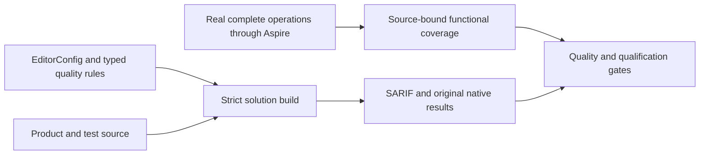

# ADR-033: source-owned code quality and evidence gates

Status: Accepted; implementation and complete qualification remain pending. Related requirements, acceptance criteria and current slice ownership are canonical in [CodeQuality](../Features/CodeQuality.md).

## Decision

Use the owner-selected EditorConfig unchanged, the .NET SDK analyzers at `latest-all`, build-time style checks and warnings-as-errors across every solution project. Keep the eight applicable imported rules, excluding the four whose contracts do not apply to KeyLoad. Own editable Roslyn rules in the central source analyzer project and test them through actual SDK Roslyn compilations with TUnit. Keep compiler SARIF 2.1 reports available for successful and failed builds. Preserve the pinned compiler-host package selection; analyzer tests use SDK Roslyn references rather than a second loader.
Keep `GenerateDocumentationFile` enabled for the native IDE0005 build diagnostic.
Missing public documentation remains an error; no imported suppression list is permitted.

The exact analyzer catalog, semantic rules, test boundaries and source ownership live in the CodeQuality feature specification. Tests execute real product operations or the real compiler/analyzer and assert observable state or diagnostics. Reading implementation source and asserting tokens or implementation shape is not functional proof. Do not use mocks, fakes, stubs or service doubles to replace actual behavior. Generated-code policy, public contracts, error identity, authorization, cancellation, resource bounds and existing operation order remain enforced.

## Requirements and acceptance

The CodeQuality feature is the canonical requirements-to-test map. This ADR retains its current IDs and decision boundaries:

| Requirement | Acceptance criteria retained |
|---|---|
| REQ-CQ-001: strict, unchanged shared editor and SDK analysis | AC-CQ-001 |
| REQ-CQ-002: editable analyzer rules with real compiler cases | AC-CQ-002, AC-CQ-004 |
| REQ-CQ-003: independent compiler SARIF including failed-build diagnostics | AC-CQ-003 |
| REQ-CQ-004: preserving repairs and honest quality qualification | AC-CQ-005, AC-CQ-006, AC-CQ-022, AC-CQ-023, AC-CQ-024, AC-CQ-025, AC-CQ-026, AC-CQ-027, AC-CQ-028 |
| REQ-CQ-005: preserving benchmark prerequisites | AC-CQ-007 |
| REQ-CQ-006: executable numeric maintainability and coverage gates | AC-CQ-008, AC-CQ-009, AC-BC-027 |
| REQ-CQ-007: preserving CLI, query, search, storage, site, and lifecycle behavior | AC-CQ-010, AC-CQ-011, AC-CQ-012, AC-CQ-013, AC-CQ-014, AC-CQ-015, AC-CQ-016 |
| REQ-CQ-008: bounded qualification workflow concurrency | AC-CQ-017, AC-QUAL-001, AC-QUAL-002, AC-QUAL-003 |
| REQ-CQ-009: source-bound functional coverage and uncovered-flow repair | AC-CQ-018, AC-CQ-019, AC-CQ-020, AC-CQ-021, AC-CQ-039, AC-CQ-040, AC-CQ-041, AC-CQ-042, AC-CQ-043, AC-CQ-044, AC-CQ-045, AC-CQ-046, AC-CQ-047, AC-CQ-048 |
| REQ-CQ-010: typed synchronization | AC-CQ-025, AC-CQ-026, AC-CQ-027 |
| REQ-CQ-011: named runtime values | AC-CQ-029, AC-CQ-030, AC-CQ-031, AC-CQ-032 |
| REQ-CQ-012: complete runtime literal analysis | AC-CQ-033 |
| REQ-CQ-013: centralized typed operational options | AC-CQ-034, AC-CQ-035, AC-CQ-036, AC-CQ-037, AC-CQ-038 |
| REQ-CQ-014: complete-operation behavioral test ownership | AC-CQ-049, AC-CQ-050 |

The executable maintainability limits remain 400 source lines per file, 200 code lines per type, 64 code lines per executable unit, and nesting depth 3. KLD0030–KLD0033 remain enabled errors at those boundaries. The numeric compiler fixtures verify the exact legal and rejected boundary and diagnostic span; the same current limit applies to every qualified source cohort.

Functional coverage includes only complete functional operations. Load, stress, performance, and database-comparison tests do not contribute. Preserve the 80% module line, 70% module branch, 90% critical-pipeline thresholds, module no-decrease rule, and source-mapped CRAP requirements. CRAP combines native source-mapped complexity and functional coverage from the same source/build cohort. Missing, stale, skipped, failed, unbound, mixed-cohort, or incomplete results are unmeasured or failed, never zero-filled or relabelled.

Original MTP/TUnit reports, source and compiled identities, module and image identities, settings, failures, and coverage exports remain immutable evidence. Coverage requires the exact source inventory and matching DLL/PDB/MVID/portable-PDB identity; RF3 server contribution comes from the three actual AppHost-owned server processes. Line hits may be unioned only for matching source identities. Native branch outcomes are merged only when original reports identify each outcome; coarse covered/total fractions remain per-run evidence and merged branch coverage stays unmeasured otherwise. Healthy and rejected operations must preserve their original state, errors, cancellation identity, owned-process settlement and cleanup behavior.
Retain the existing evidence admission bounds: native XML is at most 32 MiB, the source inventory at most 5,000 files, and the distinct source-line inventory at most 100,000 locations. Source and run manifests retain their separate 64 MiB and 4 MiB ceilings, and native output retains its 64 KiB bound. Reject DTD/external resolution, paths outside the captured source root, duplicate conflicts, absent identities and invalid counts before producing derived coverage. These limits remain distinct from configurable stream buffers and manifest policy.

## Execution and ownership

The CodeQuality feature owns the current implementation sequence, task graph, exact file ownership, test mapping and report schemas. The integration owner alone joins shared configuration, AppHost, CI, inventories, documentation and cross-slice consumers. Slice owners preserve actual APIs and submit guarded, disjoint changes; an ownership or contract conflict stops the affected stage for review.

Use the Aspire-owned suite entry point for analyzers, unit, scalar, recovery and RF3 operations. Unit and scalar do not require an RF3 topology; RF3 operations use the discovered three-node Docker topology and the real SDK and official MCP client flows. Every process, collector, file reader and application resource must settle under its existing validated bounds before receipt verification or owned-root cleanup. Preserve the primary failure and all cleanup failures; a failed cleanup or missing report cannot produce a successful receipt.

A local build, focused run, static inventory, source review, or one passing cohort is development evidence only. Delivered-source qualification requires the exact Linux CI source SHA, successful required suites, original reports and verified source/image identities. Build, format, analyzer, governance, normal unit, scalar unit, recovery, RF3, functional coverage, and delivery gates remain separate. No skipped suite or unrelated workflow event substitutes for a required gate.

## Rollout and source checkpoint

This ADR changes quality tooling and evidence contracts; it does not change database bytes, SQL or external client protocols, Orleans activation movement, storage authority or RF3 topology. Roll out one reviewed source checkpoint containing its analyzer, tests, settings, inventory and documentation joins. A rollback restores the coherent source/configuration pair and retains every original report; it does not disable a rule, reduce a limit, or relabel prior reports as evidence for changed source.

The decision remains Accepted until the complete implementation and all mapped exact-source gates pass. The current status and original qualification receipts remain in the canonical [implementation status](../implementation/status.json) and [CodeQuality evidence record](../implementation/code-quality.md); these records must bind qualification to its exact source, run, job and original reports.

## Current native analyzer and report admission

TASK-CQ-CURRENT-NATIVE-042 implements REQ-CQ-001/006/009 and AC-CQ-001/008/044/046
under the owning feature contract. Ordered join: freeze the current artifact/report
contract; build the source analyzer in the formatter's actual Debug configuration;
run the unchanged canonical formatter; use native Cobertura `name` identities in
the complete CLI collector/merge oracle; run full Release plus relevant Aspire
flows and exact-source Linux checks. Root owns workflow, assertions and evidence.
Keep80/70/90 coverage thresholds, original counts/union and400/200/64/depth3 rules.
Rollback must retain a coherent source analyzer and strict native-report reader,
never stale artifacts, skipped assertions or synthetic coverage. No database
format, dependency, public API or topology changes belong to this quality stage.

## Complete functional unit contributor partition

TASK-CQ-FUNCTIONAL-UNIT-INVENTORY-043 implements REQ-CQ-009 and AC-CQ-018/020/021.
Keep ordinary unit and scalar suites complete, unfiltered and without coverage
after the authorized physical transfer leaves their assemblies free of benchmark
and comparison cases. Those checks stay with the Benchmarks-owned projects and
workflow. Collect functional unit coverage separately through five bounded
positive selector groups in each mode, with one exact post-transfer current case
inventory. Every permitted functional case belongs to exactly one group;
classify any residual nonfunctional cross-slice case explicitly and record the
new owner for moved benchmark cases without duplicating selector inventories.
Namespace membership alone does not authorize a contributor. Bind the inventory
to current test sources, the same Release compiler-input/DLL/PDB/MVID identities
and actual native TRX.

Ordered stages: root freezes this contract and owning feature; a Luna worker
prepares guarded source and meaningful merge-operation regressions; root joins,
builds, formats and runs Aspire collection; verify all ten unit groups plus
recovery and RF3 before report admission. Reject missing, duplicate, overlapping,
empty, excluded, failed, skipped or source/image-mismatched contributors. Preserve
native per-run branch evidence and every existing bound and80/70/90 threshold.

Exact source ownership and required tests are in CodeQuality's matching task.
Root owns workflow, inventory, identity and report joins. Roll out one coherent
strict descriptor/validator/CI checkpoint; rollback restores that checkpoint's
source/configuration pair, without an alternate reader or reduced qualification.
No numeric coverage or module closure follows from preparing an inventory.

A separate post-descriptor regression invokes the native merge entry point in
`ProductAdmission` mode against the actual generated Product descriptor and TRX
receipts. Product and admission modes share path/tool/bounds checks and
`Read-FcNativeProductPlan`; admission emits only a bounded validation result and
does not invoke collectors, merge reports or write coverage outputs. The
regression admits original evidence, rejects a controlled modified copy only
for its expected validation failure, verifies original bytes remain unchanged,
and admits the originals again. It uses no authored TRX. Ordinary full unit/scalar
operations do not claim to perform this separate admission regression.

The Product descriptor also binds successful full normal and scalar unit
`unitCensus` runs from the same evidence cohort and Release build. Both run with
coverage disabled and bind original TRX/report hashes, exact identities and
source locations, the captured source-manifest digest and test-image receipt.
Normal/scalar census identity sets must agree with each other and with the exact
current functional inventory. In each mode, its five instrumented groups are
disjoint and their union equals both that mode's census and the inventory, with
zero failed/skipped cases. Census files are bounded validation inputs only, never
coverage merge inputs/counts. Product and ProductAdmission both revalidate the
same descriptor/census through `Read-FcNativeProductPlan`; native merge
execution remains unchanged.

Each inventory case also records the original native TUnit `lineNumber` and
`endLineNumber` alongside its exact current source path/hash. Require positive,
ordered line bounds within that source file; both census reports and every
instrumented report must match this exact method/argument source range. Missing
or mismatched ranges reject rather than falling back to path-only ownership.

The descriptor producer takes `-UnitRunStatusPath` pointing to
`functional-coverage.unit-run-status.v1.json` inside the same evidence root,
replacing the former single unit/scalar exit-code parameters. Its strict schema
is `schemaVersion:1`, `sourceRevision`, `sourceManifestSha256`, and `runs`; each
run has exactly `id`, `suite`, `filter`, `coverageEnabled`, `exitCode`, and
`resultsDirectory`. Require exactly twelve unique runs: `unit-census`,
`unit-scalar-census`, `unit-functional-01` through `unit-functional-05`, and
`unit-scalar-functional-01` through `unit-scalar-functional-05`. The two census
filters are empty and coverage is false; each coverage filter equals its exact
inventory selector and coverage is true. Each results directory equals its run
ID and is confined to the evidence root. Capture each integer exit code from
the original native TUnit process; all twelve must be zero. Recovery/RF3 retain their
explicit existing exit-code inputs. Require current source/image parity and
original bounded native reports for every row; the status file alone cannot
prove successful execution. Read at most 64 KiB, within the configured manifest
limit, and reject unknown, duplicate, missing, skipped or malformed entries.
No alternate directory discovery or prior unit-status schema is accepted.
The fixed 64 KiB bound accommodates ten ASCII selectors of at most 4,096
characters and the twelve closed metadata rows. Keep the per-selector bound,
exact schema and configured manifest limit; the former 16 KiB aggregate cannot
represent every admitted selector set. This is a private evidence-format bound,
not a change to operation deadlines, test outcomes or coverage thresholds.

Bind `unitRunStatus` and per-unit/scalar/census `statusId`, consuming all twelve
rows once with exact directory confinement; recovery/RF3 inputs stay separate.
The existing `NativeCoverageMergeTests` case uses new CodeQuality/Helpers
`NativeCoverageProductEvidenceRejection.cs` and
`NativeCoverageProductEvidenceFiles.cs` for its required post-descriptor phase.
Set `KEYLOAD_NATIVE_PRODUCT_ADMISSION_REQUIRED=true` and
`KEYLOAD_NATIVE_PRODUCT_DESCRIPTOR_PATH` together; missing, inconsistent or
invalid required inputs fail. CI validates the bounded
`native-product-admission-phase.v1.json` receipt after the complete native
admit/controlled-denial/immutability/re-admit/cleanup flow. Both absent selects
only ordinary real backup/restore and cannot qualify the separate phase.

TASK-CQ-FUNCTIONAL-UNIT-INVENTORY-043 joins temporary-directory creation to the existing observed admission/cleanup lifetime: the caller retains the exact owned path before creation and attempts bounded cleanup even when creation fails. Check copied native TRX/descriptor bytes against their own format bounds and the configured per-file bound before writing. Preserve original native failure, all cleanup errors, the existing whole-operation case and the required post-descriptor receipt. No runtime fault proof is inferred from source review.

TASK-CQ-FUNCTIONAL-UNIT-INVENTORY-043 inventory validation preserves native multi-case declaring classes and byte-preserving benchmark transfer namespaces. Distinct declaring classes still obey the frozen positive selector identity contract. The exact physical ComparisonTests source path/hash establishes moved-case ownership; preserved UnitTests namespaces are not functional coverage authority. Case identities remain unique and all functional census/positive-group parity and exclusion checks remain mandatory.

The 2026-10-07 report-display amendment to TASK-CQ-FUNCTIONAL-UNIT-INVENTORY-043 records the declared CLR `className` from original TRX separately from exact original MTP `nativeReportClassName` on each functional inventory row. Native TUnit tree selectors use the former; fixture display suffixes remain untouched in the latter. The linked CodeQuality contract freezes the extra field's bounds, one-to-one report/TRX/source joins, unchanged moved-case shape and mandatory successful census/group parity. Ordered stages are contract freeze, private two-script producer repair and native draft reconciliation, one coherent inventory/producer/workflow join, strict build/format/parser checks, and original complete Linux coverage plus ProductAdmission qualification. Root owns integration; the Luna worker owns only `functional-coverage.native-merge.contributors.ps1` and `functional-coverage.native-merge.functional-report.ps1` within the existing stage. Rollback removes the coherent amendment without introducing a fallback alias reader. Public APIs, persisted formats, dependencies and all existing thresholds are unchanged; failed draft evidence remains unqualified.
