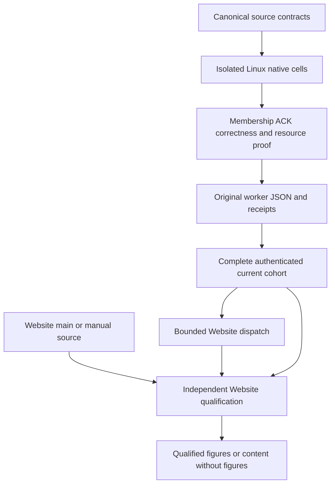

# ADR-034: Native database comparisons and authenticated results

Status: Accepted; complete runtime and publication qualification remains open.
Date: 2026-10-06. Owner: benchmark integrator.
Related: REQ-BC-001–009/019/021/050–058, AC-BC-001–009,
AC-PERF-001–009, AC-ISO-001–009, AC-IMAGE-001–007,
AC-HOST-001–007 and AC-KLEVENT-001–003 in
[BenchmarkComparisons](../Features/BenchmarkComparisons.md).

## Decision

The canonical comparison targets are KeyLoad, PostgreSQL + pgvector, Qdrant,
RabbitMQ, Redis, Neo4j, MongoDB, OpenSearch, KurrentDB, SurrealDB and HelixDB.
The current plan derives 924 workers from its checked-in contracts:
220 controls, 176 scaled cells and 528 vector cells. These are planned workers,
not passing tests or completed measurements. Active scale profiles contain
exactly 100,000 or 1,000,000 actual records, and applicable workload cells measure
at least 100,000 operations. A small control fixture cannot qualify either scale.

[ADR-056](ADR-056-isolated-linux-comparison-cells.md) owns physical
one/three-node isolated cells; [ADR-103](ADR-103-scaled-fair-comparisons.md)
owns the scaled/vector cohort. Derive source inventories, schema versions,
profile parameters and supported dispositions from their canonical contracts.
Single/Replicated library values describe comparison profiles; they do not
establish physical membership. Product KeyLoad execution remains genuine RF3.
A benchmark topology requires its explicitly qualified native contract.

Each database, node count and workload cell uses its own isolated Linux GitHub
runner, native topology and load generator. Name job groups by database. Engines
must not share runners, containers, volumes or measurement sessions. Docker
resources, readiness, test dependencies, execution and joined shutdown belong
to Aspire. Native clients execute the same applicable workload/corpus, operation
schedule, metric/filter/accuracy target and effective resource/durability contract.

Unsupported native/community topologies remain unavailable with their precise
reason; independent standalone instances cannot stand in for a cluster.
Configured node count, observed membership, data-copy placement and acknowledged
copies are distinct facts. Preserve authentic failures and avoid equivalence
claims unsupported by each engine's consistency and durability contract.

## Native topology and caller contracts

| Engine | Required native proof and boundary |
|---|---|
| KeyLoad | Three actual RF3 voters and ready SDK nodes; node-local ZoneTree ownership, persisted authorization and quorum receipts. Process-kill proof does not establish power-loss durability. |
| PostgreSQL + pgvector | Actual native primary/standby membership, configured synchronous quorum and observed replication/WAL state. Exact, HNSW and IVFFlat workloads require their own accuracy and concurrent-update results. No automatic-failover claim follows from a replication probe. |
| Qdrant | Actual peer agreement, collection replication/write-consistency settings and active seeded shard copies. No transactional/WAL equivalence is inferred. |
| RabbitMQ | Connected native nodes and online quorum-queue members; persistent messages, publisher confirms, manual ACK and ordered barriers. |
| Redis | Actual primary/replica membership and AOF settings; checked WAIT/WAITAOF receipts on the same dedicated write connection. Connection replacement cannot preserve an unverified receipt. No sharding, linearizability or automatic-failover claim follows. |
| Neo4j Community | Genuine single-node native operations; native clustering requiring Enterprise remains unsupported. No license activation or simulated cluster. |
| MongoDB Community | Actual data-bearing replica members and primary/secondary health, majority write concern with journaling and declared native read semantics. |
| OpenSearch | Actual connected data/manager nodes, active shard copies, request translog durability, checked active-shard acknowledgements and native document/vector operations. |
| KurrentDB | Actual gossip membership, leader/follower/checkpoint probes, expected-NoStream append and bounded readback. Use the centrally pinned, license-permitted native topology; do not enable unavailable paid clustering. |
| SurrealDB | Genuine centrally pinned native deployment and observed topology under its source-owned capability contract. Unsupported membership or workload cells remain unavailable. |
| HelixDB | Genuine centrally pinned native deployment and observed topology under its source-owned capability contract. Standalone or unsupported configurations cannot be relabelled as replicated. |

Keep `IComparisonTarget` / `IComparisonSession`, native client ownership,
`ClusterEvidence`, corpus hashes, image manifest digests, source revision and
raw per-operation results. Targets own created SDK/transferred HTTP clients;
sessions borrow them. Aspire owns membership bootstrap. HTTPS trust, peer
security and production authorization are mandatory on benchmark paths.

Point reads, writes, queue enqueue/receive/ACK, graph neighbors/traversal,
vector search, stream append/read and intensive CRUD qualify only their defined
native operations. Stream inputs use deterministic event identities, expected
absence, one-event cardinality, normalized first revision and exact JSON
readback outside timing. Duplicate append tests use a distinct event identity
so native idempotent retries cannot masquerade as conflict detection.
KeyLoad and PostgreSQL public session reads must return the actual stored event
or absence through existing SDK/native operations; timing success without public
readback fails AC-KLEVENT-001–003 / AC-PERF-004.

## Source, image and publication contracts

Build exact-source Linux product/load-generator images with existing Docker
Buildx into the job-owned loopback registry. Validate actual manifest bytes,
digest headers and revision labels before allocating consumers. Infrastructure
base/configuration digests or Git revisions are not final product image digests.
Use native Aspire container/image annotations and retain actual owned cleanup.
No host-process or Dockerfile fallback may substitute for a qualified cell.

Validate exactly three distinct KeyLoad HTTP(S) peer origins, with the primary
matching index zero, before client allocation. Bind these discovered resource
endpoints through the AppHost. RabbitMQ management uses the actual resource's
endpoint/user/password references and an owned authenticated client. Invalid
configuration returns a safe diagnostic before allocation; partial construction
must join cleanup. Credentials and private payloads never enter report metadata.

Each worker retains source/run/attempt/target/topology/profile-bound original
JSON, actual corpus counts, correctness, latency/p95/p99, throughput, allocations,
server memory and applicable index-build/recall evidence. The single aggregator
validates the complete source-derived inventory, schemas, provenance and
comparable settings. Terminal failed/null rows may coexist with successful
measurements in a ready authenticated aggregate, but remain visibly unavailable.
Missing, corrupt, mixed-source or unauthenticated inputs cannot refresh metrics.
No fabricated zero or winner is permitted where required comparison evidence
is unavailable.

[ADR-076](ADR-076-current-cohort-publication.md),
[ADR-080](ADR-080-benchmark-failure-isolation.md) and
[ADR-112](ADR-112-independent-website-publication.md) own current publication.
Four workflows remain separate: Build and Tests, Benchmarks, Website and Release.
Benchmarks ends with a bounded dispatch of Website. Website independently
qualifies main/manual source changes, consumes the newest ready authenticated
aggregate when available, and publishes without figures otherwise. It must not
wait for unrelated ordinary CI or fabricate measured inputs.

## Implementation, join and rollback

1. Freeze each workload/topology/image/caller packet against the owning feature
   requirements and exact source contracts. Assign disjoint feature paths to
   bounded coding agents; the integrator owns shared contracts, packages,
   AppHost/workflows and final joins.
2. Implement native clients and real membership/ACK/readback checks before
   measurement. Preserve current operation signatures, source schemas, bounds,
   resource ownership, cancellation and terminal outcomes.
3. Join exact-source reviewed packets, update the complete REQ/AC/task/test
   traceability, and run the canonical solution build, formatter and governance.
   Local functional development uses the Aspire-owned test entry point and
   discovered resources; it is distinct from delivered-source qualification.
4. Run every required exact-source Linux GitHub ordinary/scalar, recovery,
   Docker RF3, comparison, coverage/complexity and publication gate. The genuine
   .NET and official MCP callers remain mandatory for their owning contracts.
   Retain original run/job/artifact identities; no failed or skipped suite passes.
5. Publish figures only from admitted originals and complete current website
   source/coverage/browser/freshness gates. Select optimization from comparable
   measurements, using .NET intrinsics first and Rust only after profiling.
   Preserve scalar correctness, bounded Orleans work, read cuts and ordered apply.

[ADR-043](ADR-043-comparison-library-host.md) owns executable/library separation:
retain the public library assembly, namespaces, registration and native contracts.
Only the sole CLI host owns executable startup and safe terminal lifetime.
[ADR-036](ADR-036-orleans-foundation.md) owns the Orleans foundation; this ADR
cannot authorize experimental APIs or change database execution ownership.

Rollback stops failing qualification/publication and repairs the owning source.
Keep original measurement artifacts immutable; no legacy reader, previous-format
path, alternate topology, weaker bound or host-process fallback is authorized.
Source implementation, local development and a pushed commit alone do not mark
this decision Implemented or establish a performance winner.

## Exact clean source checkout regression

TASK-BC-SOURCE-001 implements REQ-BC-SOURCE-001 / AC-BC-SOURCE-001 in the owning
feature and retains AC-IMAGE-006. Native `verifySourceCheckout` must reject
unignored untracked files as well as tracked changes before Dockerfile checks,
Docker/registry allocation, receipts and GitHub outputs. Use Git's existing
porcelain status with `--untracked-files=all`, retaining repository ignore rules,
revision equality, bounded child execution and the existing exact diagnostics.

Ordered stages: root freezes this contract; a Luna worker adds the real
`SourceCheckoutIdentityTests.CleanSourceIdentityRejectsUntrackedInputAndRecoversWithoutChangingHead`
operation and its `TemporaryGitCheckout` fixture under
`KeyLoad.ComparisonTests/Features/BenchmarkComparisons/UnitContracts/{Cases,Fixtures}`;
root reviews and joins the minimal `prepare-images.mjs` change, builds the
solution, then verifies this case through Aspire in Benchmarks and retains the
original native Git/image results. A real committed temporary checkout must
admit, reject an added untracked source only for the expected dirty diagnostic,
recover after removing that owned file, and preserve HEAD/tracked bytes. A
generated ignored file remains admissible. Existing genuine image export/import
and preflight gates remain mandatory; no Git-only result establishes image
identity or GitHub qualification.

No schema migration or rollout path is introduced. If qualification fails, fix
the narrow source/check pair while retaining original evidence; do not keep an
alternate permissive reader. Root owns docs, integration, source evidence and
delivery; worker edits are confined to the three owned paths. No dependency,
Dockerfile, RF3, receipt-field or public operation change is authorized here.

### TASK-BC-NATIVE-CONTRACT-RESULT-001 — actual TUnit result and canonical proof fixtures

REQ-BC-NATIVE-CONTRACT-RESULT-001 / AC-BC-NATIVE-CONTRACT-RESULT-001 refine existing image safe-failure and AC-ISO-006/007 process gates under ADR117. The comparison host is the native TUnit executable, not the retired CLI. A real child must fail with nonzero native exit and report the original NativeClientWorkloadProducesSuccessfulOriginalReports case plus exact expected safe detail in its bounded drained stdout/stderr result. Confidentiality checks still examine both complete captured streams and deny every existing private canary. No error code, privacy, process drain, clock, timeout or test count is weakened; requiring CLI-only stderr after conversion to native TUnit is obsolete scaffolding.

Controlled aggregate fixtures must generate exact current database-group job names from the existing canonical isolatedJobName function before the real Node aggregation CLI runs. Production exact-name/cohort/job/artifact/proof validators are unchanged. Valid fixture proof must let absent/symlink/foreign raw-worker negatives reach their actual InputError boundary; duplicate/failed/expired/unknown/legacy-mixed metadata negatives remain strict. This repairs test-owned input construction, not genuine GitHub provenance or publication authorization.

Traceability: ComparisonHostBindingsSupport supports all original35 AcImage002/005 and AcPerf002/003 real-child cases; IsolatedAggregateCliFixture supports the four original failing missing/symlink/foreign raw CLI cases; IsolatedGitHubCompleteProgram supports the original ControlledClosed330 valid case and all existing metadata corruptions. Their complete negative/healthy controls and every mandatory benchmark suite remain. Source556/run37891957953 artifact11600972020 original1202/1161PASS/41FAIL remains immutable; fresh focused child+Node cases then complete Linux benchmark contracts qualify the repair. One separate AcScale016 actual Linux host-evidence failure remains OPEN: original raw CPU/mount/cgroup inputs are absent, so no source diagnosis or bound/deadline alteration is claimed.

Owning paths: comparison UnitContracts Helpers/ComparisonHostBindingsSupport.cs, Fixtures/IsolatedAggregateCliFixture.cs, Processes/IsolatedGitHubCompleteProgram.cs; feature/ADR034 documentation only. Order: docs frozen before source → root guarded current-base join → real native child/Node regression execution → full Linux benchmark-contract gate. Rollback source-only; no product format/API/provider/schema change, release or publication. No native child is replaced by an in-process test or fake successful CLI.

### TASK-BC-CANONICAL-WORKER-NAMES-001 — remove active legacy job selection

REQ-BC-CANONICAL-WORKER-NAMES-001 requires completed evidence selection to use only the existing canonical isolatedEvidenceJobName for every current planned worker. No all-legacy fallback or mixed-name acceptance is allowed. The old Benchmark / prefix remains solely an unexpected-worker rejection classifier; immutable historical reports retain their original names and cannot authorize current selection. Existing strict aggregate proof, current plans, source/run/attempt/profile identity, artifact bounds, failed-cell accounting and mandatory suites remain unchanged. This implements the standing root prohibition on active legacy compatibility under ADR034 and ADR076, without a persisted format or provider change.

AC-BC-CANONICAL-WORKER-NAMES-001 maps to IsolatedGitHubCompleteTests.AcIso006ControlledClosed330MetadataRequiresEveryCellAndOneSuccessfulImageJob: existing valid/modern/modern-failed arguments use genuine canonical worker names through the real Node selection then strict proof projection; new legacy argument changes only all worker names and must fail with the original GH.failure at selection, before proof projection. Existing mixed/foreign/duplicate/absent/expired negatives and all330 planned-cell assertions remain. Controlled inputs exercise production validation and never authenticate GitHub or qualify publication.

Ownership/order: freeze this contract before scripts/Features/BenchmarkComparisons/isolated-github-selection.mjs and the existing ComparisonTests UnitContracts Cases/IsolatedGitHubCompleteTests.cs + Processes/IsolatedGitHubCompleteProgram.cs edits; root guarded join, fresh native Node canonical-positive/legacy-negative processes, then complete mandatory Linux benchmark-contract suite. Preserve original556/run37891957953 reports unchanged. No process deadline, drain budget, image/topology, proof validator, public route, threshold, retry or fallback changes. Source-only until fresh exact-source execution; the separate cgroup cause remains OPEN.
