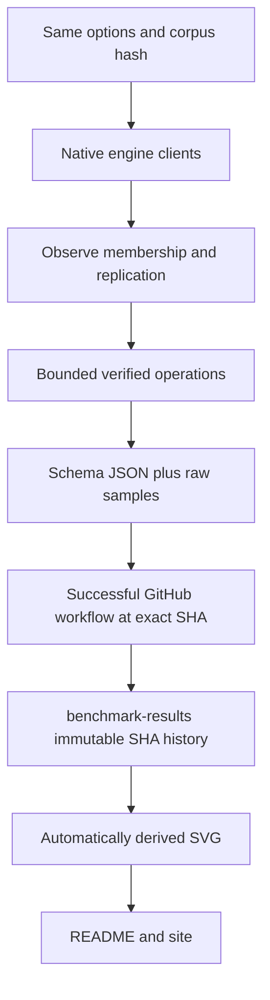
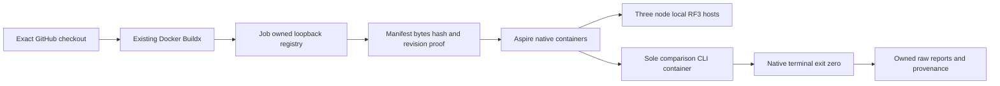
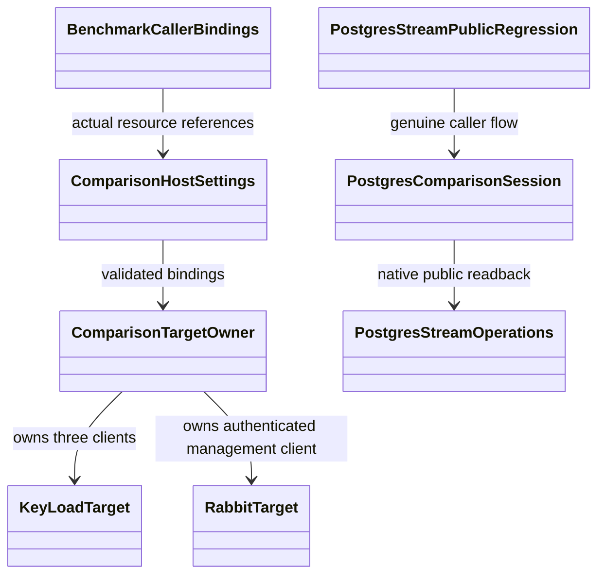

# ADR-034: Reproducible Docker cluster comparisons and GitHub result graphs

Accepted TASK-KLEVENT-001..003 maps REQ/AC-BC-005 and AC-PERF-004 to
AC-KLEVENT-001..003. Exact b21 JSON shows missing KeyLoad public session readback;
no timing/storage weakness is inferred. Tests first use existing actual RF3/SDK;
two source files delegate bounded reads and return null for absence. Root owns
ComparisonTests hook/docs/build/CI; one bounded worker owns only those source/new
regression files. No API/durable/ACK/package migration, source-only rollback,
immutable evidence preserved. Native nine-engine/six-profile35+31 scope remains.

Identity note: ADR-034 owns comparisons. The formerly colliding Orleans foundation document is now [ADR-036](ADR-036-orleans-foundation.md); its identity-correction record explains the preserved root policy's historical “ADR-034 evidence” reference for the two Orleans experimental API calls. That rule remains mandatory and is not modified by this comparison decision.

Status: Accepted. Date: 2026-10-01. Owner: benchmark lead/integrator. Related: REQ-BC-001 through009 and AC-BC-001 through009; [BenchmarkComparisons](../Features/BenchmarkComparisons.md).

## Decision and contracts

Use Single and Replicated comparison profiles. KeyLoad is always real RF3; Single applies to the external engine baselines. Replicated external engines use real native membership and three data copies where free features permit. Neo4j Community replicated cases are unsupported because native clustering requires Enterprise. Do not activate a license, run independent standalone instances and call them a cluster, or claim equivalent durability/consistency across engines.

All engines and the load generator run in Docker under Aspire on its private network. Pin every image digest. Preserve KeyLoad HTTPS trust and peer security; do not disable certificate validation or weaken production options. The concurrent Orleans/Docker implementation owns KeyLoad cluster internals; benchmark code consumes its real SDK/topology rather than adding alternate consensus.

Common scenarios: PointRead, DocumentWrite, VectorExact (float32 exact cosine), QueueCycle (enqueue/receive/ACK), GraphNeighbors, GraphTraverse, StreamAppend and StreamRead. Each engine supports only its implemented real contract. Stream scenarios use one event per stream, deterministic UUID, normalized first revision1, full JSON, expected no existing stream and append readback outside timing. Correctness failures are counted, never discarded.

Target adapter interface stays IComparisonTarget/IComparisonSession. ClusterEvidence records observed node count, data-copy count, state and observations; it is not inferred only from requested configuration. Options include ComparisonTopology. Report source revision, digest, corpus hash, per-operation data and support reasons remain mandatory. Cluster/read/write guarantees are explicit profile strings backed by pre-timing checks.

## Native engine contracts

| Engine | Replicated target / required proof | Acknowledgement / limits |
|---|---|---|
| KeyLoad | Three actual RF3 voters/ready SDK nodes; storage remains node-local. | Existing qualified process-durable quorum; no power-loss/readiness inflation. |
| PostgreSQL + pgvector | Primary plus two streaming standbys, observed replication state and synchronous quorum configuration. | Primary WAL flush plus one standby WAL flush with synchronous_commit=on; no automatic failover claim. |
| Qdrant | Three native peers, collection replication_factor3, write_consistency_factor2 and active copies. | Checked native replication/read consistency; no transactional/WAL equivalence claim. |
| RabbitMQ | Three connected native nodes and three-member online quorum queue. | Publisher confirms, persistent messages, manual ACK and ordered barrier; majority queue contract. |
| Redis | Native primary plus two connected replicas for the first single-shard RF3 comparison; observed replication/AOF settings. | AOF always on all nodes, checked WAITAOF local+one replica on the write connection; no linearizability, sharding or automatic-failover claim. |
| Neo4j Community | Single-node supported; replicated target explicitly unavailable. | No Enterprise features or fake independent-node cluster. |
| MongoDB Community | Three data-bearing replica members, one primary/two healthy secondaries; observed status. | Majority write concern with journal=true, native primary/majority reads; no false linearizability claim. |
| OpenSearch | Three connected data/manager nodes, one primary shard/two replicas, green and all copies active. | Request translog durability, wait_for_active_shards=all and checked write shard results; real-time document GET and exact score-script vectors. |
| KurrentDB 26.1.2 | Three native gossip members, one leader/two followers observed through every node's gossip and probe/checkpoints. Pin `kurrentplatform/kurrentdb:26.1.2@sha256:ef49a58bab8bc4d7b08cd218f1bb85cf230b03edf5d136e98d6e86a3e5100b6a`. | Native expected-NoStream append and bounded read; clustering remains free through26.1 under Kurrent License. Version26.2+ clustering requires a paid license and is excluded. |

Versions and images must be verified from primary upstream sources and centrally pinned. Licensing descriptions must say community/free or source-available where appropriate rather than falsely calling every engine OSI open source.

Primary Kurrent sources: [26.1.2 release](https://github.com/kurrent-io/KurrentDB/releases/tag/v26.1.2), [exact image](https://hub.docker.com/layers/kurrentplatform/kurrentdb/26.1.2/images/sha256-ef49a58bab8bc4d7b08cd218f1bb85cf230b03edf5d136e98d6e86a3e5100b6a), [license boundary](https://kurrentdb.kurrent.io/blog/licensing-in-kurrentdb-v26-2-and-beyond-what-s-free-and-what-s-licensed/).

## Frozen adapter and result packet

- Constructors: `MongoTarget(string connectionString, string runId, string image, ComparisonTopology topology)`, `KurrentTarget(string connectionString, HttpClient[] nodeClients, string runId, string image, ComparisonTopology topology)`, `OpenSearchTarget(HttpClient client, string runId, string image, ComparisonTopology topology)`. Namespace: `KeyLoad.Comparisons.Targets`. Targets own created SDK clients and transferred HTTP clients; sessions borrow them. Membership bootstrap belongs to Aspire, never adapter initialization.
- `BenchmarkDataset.EventId(BenchmarkDocument)` is the single deterministic SHA256-based event UUID mapping. StreamAppend inputs are unique per warmup/repetition/operation. Read up to two events and reject cardinality other than one; normalize native first revision to1 and verify full payload and event identity. Duplicate-NoStream checks use a different event ID to avoid confusing native idempotent retries with conflicts.
- Support matrix: KeyLoad8, PostgreSQL8, Qdrant1, RabbitMQ1, Redis2, Neo4j4 Single/0 Replicated, MongoDB6, OpenSearch3, KurrentDB2. This gives72 cases per repetition,35 supported Single/31 supported Replicated. MongoDB graph uses native adjacency `$graphLookup`; MongoDB/PostgreSQL streams explicitly implement the narrow atomic one-event contract.
- Schema3 keeps existing raw case/sample fields and adds `options.topology`, a mandatory `provenance` object (`runId`, `attempt`, `repository`, `ref`, `workflow`, `profile`) and `loadGeneratorImage`. `sourceRevision`, corpus hash, options, actual engine image digests and observed cluster state remain mandatory. Public profiles are `smoke-single`, `json-1k-c8-single`, `json-16k-c4-single`, `smoke-replicated`, `json-1k-c8-replicated`, `json-16k-c4-replicated`. Publisher requires the complete six-profile set from one successful main workflow. The previous six-engine schema2 baseline may only be shown with its original three profiles and explicit historical topology; it cannot qualify schema3.
- Image digest, configured replication, observed member/copy placement and write-acknowledgement contract are separate facts. Never infer acknowledgement of all three copies from membership. Failed raw samples remain present; unsupported cases have null measurement and empty samples with a precise reason.
- TASK-BC-REPLICAS-006 owns only QdrantTarget/RabbitTarget/RedisTarget and new Qdrant/Rabbit/Redis-prefixed feature helpers. Constructors add optional topology plus all-node HTTP clients for Qdrant, one authenticated management client for RabbitMQ, and two direct replica connection strings for Redis. Root owns their resources/registration. Qdrant validates all-node peer agreement and each local shard's active seeded point count; Rabbit verifies connected nodes and all online quorum queue members; Redis uses a dedicated single-primary write connection per worker, checks native WAITAOF counts and rejects connection replacement across a write/receipt. Direct replica probe reads prove both additional copies before timing. No automatic failover, Redis sharding or equal consistency claim is added.

## Implementation contract

1. Lead writes brainstorm, stable requirements/acceptance, ordered plan and this ADR, then joins highest-capability TASK-BC-ARCH-001 decisions. Publish no unimplemented scenario before adapters/runner correctness are integrated.
2. Root owns Contracts.cs, dataset/runner, registration, packages, shared workflows and docs. Adapter workers own only their exact new feature files; no same-file writes. External resource helpers remain separate from the active shared AppHost/Orleans migration.
3. Implement native MongoDB/KurrentDB/OpenSearch clients and cluster evidence checks with fixed constructor/operation contracts supplied by the lead. Unsupported cases return explicit reasons; no mock database/service target qualifies an engine.
4. Integrate event scenarios and real runtime membership/acknowledgement checks, then compose Single/Replicated Docker profiles through Aspire. Container startup/seed/readiness happens before timing. Check all required image/connection/configuration facts at runtime.
5. Add meaningful TUnit contract/real-engine assertions; run only GitHub Actions tests. Record baseline failures and fix owning paths; never skip a required suite or weaken policy to make CI green.
6. Qualified main CI produces raw JSON/CSV. A publisher selects only successful same-repository non-PR main evidence at the exact SHA, validates completeness/correctness and copies raw JSON to immutable GitHub history. Derived SVGs include source/run/profile/guarantee metadata and link to raw JSON. Latest pointers change only after a complete qualified dataset; failed profiles do not replace evidence.
7. Update README and site from these JSON-derived charts/data. No measured numeric values live in source. Complete successful GitHub publication and browser first-render proof, then DNS/TLS verification at the end as directed by the owner.
8. Optimize only a measured bottleneck after its current owner is joined. Before/after claims require comparable successful CI datasets and unchanged guarantees. Lead inspects all worker diffs/evidence and proves the combined committed source before completion.

Workers receive exact paths, REQ/AC IDs, constructor/result contracts, primary sources, verification commands, forbidden changes, dependencies, completion states and escalation rules. Strongest suitable planner owns architecture/integration/final review; bounded workers use the least expensive capable model. All required results must be complete and reviewed before dependent tasks start. Every gate links to exact GitHub SHA/run/job/artifacts.

## Migration, rollout and rollback

### Accepted digest-backed container execution stage (2026-10-02)

REQ-BC-001/003/005/009/019/021 and AC-PERF-006/009 map to AC-IMAGE-001..007 in
[image acceptance](../../docker-comparison-images.acceptance.md), with the ordered
[task graph](../../docker-comparison-images.plan.md). The integration lead approves
this bounded source stage under the owner's existing full-product authorization;
the nine-engine, native Single/Replicated and complete six-profile gates stay open.

1. TASK-IMAGE-002 owns only new `scripts/Features/BenchmarkComparisons/prepare-images.mjs`,
   `cleanup-images.mjs`, `image-*` helpers and the sole runner's feature Dockerfile.
   Existing Docker/Buildx/Node build, load and push exact-SHA linux/amd64 product
   images to a job-owned registry bound only to127.0.0.1:5000. No external package
   publication, daemon configuration or tool installation. Require local Engine,
   clean tracked source and official GitHub context before builds. Actual registry
   manifest bytes/header/source-label proof produces immutable final digest refs;
   never substitute config IDs, base digests or Git SHA for a manifest digest.
2. Root owns the server Dockerfile and AppHost image/resource joins. Required
   `KeyLoad:ContainerImages:Server` and `Benchmarks:ContainerImages:LoadGenerator`
   full tag+sha256 refs fail safely if absent/invalid. All RF3 nodes and both normal
   and TimeSeries runners use native AddContainer + WithImageSHA256; no ProjectResource
   or Dockerfile fallback. Preserve node aliases/ports/data/security/readiness and
   native runner terminal notification/exit0 under every original deadline.
3. Root owns shared report/provenance contracts and freezes TASK-IMAGE-004's exact
   producer packet before delegation. That packet is now frozen in image acceptance:
   host-private optional ComparisonExecutionIdentity is read last in existing
   settings validation and becomes required when LoadGeneratorImage is supplied;
   it validates actual GitHub source/run/attempt/ref/workflow, accepted profile and
   full server/runner refs before client allocation. Use KeyLoadTarget's existing
   optional image argument and ComparisonReport's existing provenance/image init
   properties. Direct non-container CLI/library metadata stays optional; root owns
   separate TimeSeries producer and every shared contract/test join.
   Forward actual GitHub source/run/attempt/ref,
   actual server/runner refs and private host output mounted at /reports with the
   current supported UID/GID ownership. No world-writable permission workaround.
   Preserve optional embedded-library metadata and separate TimeSeries schema.
4. Root joins both runtime CI jobs: docker-rf3 and comparison-smoke prepare immutable
   images once, retain raw manifests/labels/native lifecycle/test/report artifacts
   and always capture/remove only the owned registry. Existing permissions/actions,
   full suites,15/60-minute job bounds and per-test bounds remain unchanged.
5. Acceptance-derived TUnit config/resource/report assertions precede source and
   actual GitHub registry/container proof closes the runtime criteria. Environment
   failures require real job evidence, never a fake daemon. Root reviews all diffs,
   runs development build/format/static governance, delivers all eligible main
   changes and verifies exact-source full GitHub evidence before qualification.

Upstream manifest bytes were independently hashed against registry digest headers:
registry3.1.2 `ddf754342cfc8acc51a56d5d0ab6af06826461864460636d8bd5c546dab2a7b8`,
SDK10.0.401 `e70cdb7f80b0348f5cb85f19a8f670fca061f033d57eed12fa003d58b0e06317`,
ASP.NET10.0.12 `222759b391a1aaf241166672c8f99b2d4ada452e7b5319f3c6e8f265a37b5ad4`.
These are infrastructure/base pins, not final product-image proof. Source SHA,
actual final manifests and OCI labels are produced by the real GitHub job.

Rollback stops new qualification/publication and preserves immutable evidence;
it cannot reintroduce a host-process measurement fallback. Hard runner loss has
no cleanup guarantee and never counts as success. This ADR remains Accepted until
all required native/topology/profile, coverage and actual verification work joins.

### Accepted caller-composition repair continuation (2026-10-02)

Related REQ-BC-001/002/003/005/009/019/021; AC-PERF-001–009 in
[acceptance](../../performance-composition.acceptance.md) and
[ordered task graph](../../performance-composition.plan.md). The lead approves
this bounded implementation packet under the existing owner-authorized product
work. This decision remains Accepted: full nine-engine/native/full-Docker and
six-profile qualification is still required. No new product public API, schema,
dependency or trust-boundary decision is introduced by these caller repairs.

1. Keep the full current c486 run37060131271 baseline and historical raw failures
   distinct. Author real-child host and existing real-container PG regressions
   before changing the failing source; no local execution.
2. TASK-PERF-002 owns only PostgresComparisonSession.cs, new feature-owned
   PostgresStreamPublicRegression.cs and its PostgresSchemaPublicFlow call. Public
   ReadEventAsync delegates existing native SQL reader; seeded/new/absent/conflict,
   cancellation and following-success assertions retain UUID/revision/cardinality/
   JSON correctness. Root alone owns shared library contracts.
3. TASK-PERF-003 owns host settings/constants/target owner, new host-only helpers,
   and real-child host startup/cleanup/bindings tests. Add immutable exactly-three
   `Benchmarks:KeyLoadEndpoints:0..2` absolute distinct HTTP(S) origins without
   credentials/query/fragment, primary matching index0. Preserve first primary
   then Qdrant setting order and CLI precedence. Missing keys name only their key;
   malformed/duplicate/extra/mismatched peers return safe
   `KeyLoadComparisonEndpointsInvalid` before allocation. Transfer three actual
   clients to KeyLoadTarget once published; preserve partial-construction cleanup.
4. Add `Benchmarks:RabbitManagementEndpoint`, `Benchmarks:RabbitUser`,
   `Benchmarks:RabbitPassword`. Create one Basic-authenticated management client,
   owned by RabbitTarget. TASK-PERF-004 (root only) owns new feature AppHost
   BenchmarkCallerBindings plus its existing composition call, forwarding actual
   ManagementEndpoint/UserNameReference/PasswordParameter and all three node HTTP
   endpoints. No embedded credentials, anonymous probe or inferred native proof.
5. Join reviewed complete disjoint source packets, actual solution Release build,
   canonical formatter/static governance and all-current-main ordinary delivery.
   Exact pushed-SHA GitHub real target/native terminal/full suite evidence remains
   required; no failed or skipped result is qualification. Root reviews integration.
6. TASK-PERF-006/007 retains the full accepted native nine-engine resource graph,
   digest-pinned Docker runner, schema3 provenance and bounded six-profile CI join.
   Freeze each graph/config/digest/ownership packet before its next implementation
   stage; an intermediate six-target source checkpoint is not completion.
7. TASK-PERF-008 maps confirmed SIMD first to .NET intrinsics with scalar correctness
   and portability contracts in the owning slices; Rust requires measured need.
   Native ZoneTree efficiency and bounded Orleans independent-work parallelism
   preserve read cuts, ordered apply, cancellation/backpressure and fault contracts.
   Publish acceleration only from comparable successful GitHub before/after data.

Root owns shared architecture/configuration/CI/evidence, AppHost and integration.
Coding workers use gpt-6-luna/high for the bounded existing C# paths; they cannot
change contracts, add dependencies, run local tests, mutate Git, weaken bounds or
touch other owners. Source artifacts/hash order, review and genuine GitHub tests
are join points. Rollback preserves immutable raw failures/history and stops new
qualification/publication until repaired. No rule, gate or full scope is waived.

ADR-043 / REQ-BC-019 accepts the preserving library/sole-host prerequisite with
AC-HOST-001..006 and the host task graph. Keep the existing public library assembly,
namespace/signatures, Single/Replicated configuration/wire values, registration,
reports, comparisons resource and native topology. Only executable/build ownership
and safe CLI lifetime move; no engine/profile or schema claim follows. The lead
alone joins the exact AppHost generated type/project reference; native and website
owners retain all other source. Host startup regressions precede implementation,
and real GitHub qualification remains mandatory before the decision is Implemented.

New code uses named feature paths; move existing flat benchmark assets only as a verified whole-slice migration. Isolated benchmark engine datasets are disposable; no product schema or persisted format changes are introduced. Keep immutable published results after rollback; stop new publication while repairing a failing profile and preserve the complete required CI matrix. Do not overwrite old evidence or invent replacement numbers. A rollback cannot weaken a mandatory product/test/security rule.

The current baseline is six-engine GitHub CI36926803549 at9c570f8c33a7a9667507a8e1c0ca68860de3be45. Nine-engine/multi-node/full-Docker evidence is pending. The TUnit source migration is present locally and awaits delivered-source GitHub proof. Existing Node-runner/DotNext/host-process and coverage/complexity gaps remain explicit until their owning implementations and GitHub proofs complete.

## Owner-directed isolated producer refinement, 2026-10-03

[ADR-056](ADR-056-isolated-linux-comparison-cells.md), REQ-BC-050..058/AC-ISO-001..009
and its ordered implementation contract supersede the new producer's old combined
Single/Replicated six-profile execution. Actual native1/2/3 × engine × scenario
is one isolated Linux agent, intensive CRUD added, raw per-worker reports retained
and complete authenticated cohort required before site metrics refresh. Earlier
schema2/3 results retain original contracts; no fictional merged host or equivalent
availability acrossRF1/RF2/RF3. Existing native image/ACK/community boundaries remain.
