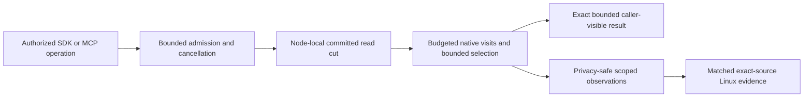

# ADR-035: bounded operation work and resource lifetime

Status: Accepted. Implementation and qualification status is reported by the owning
feature specifications and `docs/implementation/status.json`; this decision does
not claim an unqualified source or measured performance result. Related:
REQ-MP-001..006 / AC-MP-001..012 in
[ResourceExecution](../Features/ResourceExecution.md).

## Decision and invariant

The atomic partition remains the business consistency identity. A node-local
PartitionHost owns mutable ZoneTree state, journals, file locks and apply gates;
Orleans activation state may move but cannot own open storage handles or become
committed truth. Every resource optimization preserves authorization, committed
cuts, atomic outcomes, signatures, cancellation, exact public bytes and RF3,
recovery and restart guarantees.

Bound work before copies, scans, decoding or retained output begin. Prefer a
scoped borrowed visit or bounded page consumed within the existing read gate over
materializing complete scans. Borrowed spans and native views end with their owning
operation; retained values remain owned copies unless a narrower borrowing
contract proves they cannot mutate or escape. Reuse transaction-scoped verified
images, lengths and metadata instead of rereading persisted truth. Compile
selection and scoring metadata once per operation and retain only bounded
selection state. A work limit rejects excess work; it never returns partial
success.

Keep independent resource quantities distinct. Logical examined keys/bytes,
managed allocations, process memory, native residency, physical I/O, client load,
server CPU/RAM, concurrency and backlog require their own observations and
provenance. A logical counter is not an OS-I/O, allocation, RSS or durability
claim. Telemetry is bounded and low-cardinality; it excludes principals, request
IDs, credentials, keys and payloads.

Streaming SDK and report operations receive headers before bounded body reads;
original tasks, readers, cancellation and cleanup remain owned until settlement.
Reports stream to real files rather than creating duplicate complete corpora.
Public JSON, CSV, cursor, signature, stored bytes and serializer options remain
unchanged unless an owning feature contract explicitly freezes a public change.

## Requirement and acceptance map

| Requirement | Acceptance | Owning scope |
|---|---|---|
| REQ-MP-001: review current operation/resource paths and close evidenced defects | AC-MP-001: complete located inventory, source review and independently verified defect closure | ResourceExecution and each affected feature; no source assertion substitutes for an operation |
| REQ-MP-002: bounded consistent read/mutation work without redundant materialization | AC-MP-002..006: same read cut and ordering, bounded visits/candidates/results, exact outcomes and bytes, cancellation/error preservation, and real-store healthy follow-up | StorageRecovery, DocumentStorage, EventStreams, TimeSeries, QueryExecution, Search, GraphTraversal, Messaging and ChangeFeeds |
| REQ-MP-003: bounded cluster lifetime/transfer and crash-safe retention | AC-MP-007/008: owned process/resource settlement and actual recovery/RF3 effects preserve committed state | ClusterReplication, ClusterRouting and StorageRecovery |
| REQ-MP-004: bounded streaming caller/report transport | AC-MP-009/010: actual SDK/Kestrel and report-file flows preserve body/error/cancel semantics and settle all owned operations | ClientApi and BenchmarkComparisons |
| REQ-MP-005: honest integrated qualification and resource measurement | AC-MP-011/012: exact-SHA comparable evidence, correctness and resource assertions, complete joined gates; local/source-only checks remain development evidence | ResourceExecution and the applicable Linux GitHub suites |
| REQ-MP-006: remove avoidable JSON text byte copies and cached-receive request parses | AC-MP-006/009/011/012: strict text/byte and Unicode/error semantics, owned lifetimes, measured allocation boundaries and real replay flows | ResourceExecution, Abstractions and Messaging |

Feature implementations and exact operation limits remain in their canonical
feature specifications. Shared read budgets, counters, admission and API
composition have one integration owner. Local unit and process-recovery runners
use the same Aspire-owned entry point; RF3 acceptance uses the actual Docker
cluster and discovered endpoints with the .NET SDK and official MCP SDK clients.
Tests use TUnit. Only exact-source Linux GitHub artifacts qualify delivered
source, resource measurements or performance comparisons.

## Resource qualification

For every advertised operation family, REQ-RESOURCE-002 / AC-RESOURCE-002
requires an actual workload, topology, read/acknowledgement semantics and an
evidence-derived numeric latency/resource budget. Separate load-generator and
node observations. Exercise success, saturation/rejection, cancellation and
slow-consumer/backpressure cases when applicable through the real callers. Repeat
baseline and candidate with the same source-independent inputs, topology, limits,
warmup, concurrency and acknowledgement/read guarantees. Unknown data is
unavailable, not zero. Neither source limits nor local runs establish a maximum
performance claim.

The required delivered-source gates remain the Release build, TUnit normal and
scalar suites, process recovery, Aspire RF3 SDK/MCP flows, formatter, governance,
coverage and complexity artifacts, plus applicable fault, resource and endurance
work. A process-kill test does not prove power-loss durability. No acceptance
criterion is complete until its actual operation test and required qualification
evidence are joined.

## Consequences and rollback

The database keeps one consistency model and node-local storage authority while
reducing redundant copies, decoding and repeated reads. Every optimization remains
inside its owning feature and preserves its operation/error order. Rollback is a
coherent source revert that leaves persisted data and public contracts unchanged;
it cannot relax correctness, authorization, resource limits or delivery gates.
