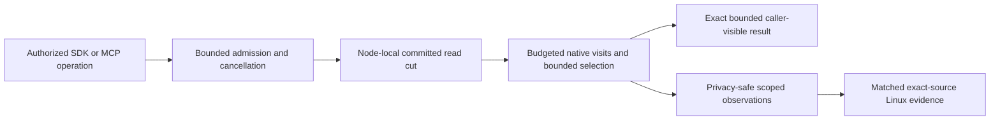

# ADR-035: bounded operation work and resource lifetime

Status: Accepted. Implementation and qualification status is reported by the owning
feature specifications and `docs/implementation/status.json`; this decision does
not claim an unqualified source or measured performance result. Related:
REQ-MP-001..006 / AC-MP-001..012 in
[ResourceExecution](../Features/ResourceExecution.md).

## Decision and invariant

The atomic partition remains the business consistency identity. A node-local
PartitionHost owns mutable ZoneTree state, journals, file locks and apply gates;
Orleans activation state may move but cannot own open storage handles or become
committed truth. Every resource optimization preserves authorization, committed
cuts, atomic outcomes, signatures, cancellation, exact public bytes and RF3,
recovery and restart guarantees.

Bound work before copies, scans, decoding or retained output begin. Prefer a
scoped borrowed visit or bounded page consumed within the existing read gate over
materializing complete scans. Borrowed spans and native views end with their owning
operation; retained values remain owned copies unless a narrower borrowing
contract proves they cannot mutate or escape. Reuse transaction-scoped verified
images, lengths and metadata instead of rereading persisted truth. Compile
selection and scoring metadata once per operation and retain only bounded
selection state. A work limit rejects excess work; it never returns partial
success.

Keep independent resource quantities distinct. Logical examined keys/bytes,
managed allocations, process memory, native residency, physical I/O, client load,
server CPU/RAM, concurrency and backlog require their own observations and
provenance. A logical counter is not an OS-I/O, allocation, RSS or durability
claim. Telemetry is bounded and low-cardinality; it excludes principals, request
IDs, credentials, keys and payloads.

Streaming SDK and report operations receive headers before bounded body reads;
original tasks, readers, cancellation and cleanup remain owned until settlement.
Reports stream to real files rather than creating duplicate complete corpora.
Public JSON, CSV, cursor, signature, stored bytes and serializer options remain
unchanged unless an owning feature contract explicitly freezes a public change.

## Requirement and acceptance map

| Requirement | Acceptance | Owning scope |
|---|---|---|
| REQ-MP-001: review current operation/resource paths and close evidenced defects | AC-MP-001: complete located inventory, source review and independently verified defect closure | ResourceExecution and each affected feature; no source assertion substitutes for an operation |
| REQ-MP-002: bounded consistent read/mutation work without redundant materialization | AC-MP-002..006: same read cut and ordering, bounded visits/candidates/results, exact outcomes and bytes, cancellation/error preservation, and real-store healthy follow-up | StorageRecovery, DocumentStorage, EventStreams, TimeSeries, QueryExecution, Search, GraphTraversal, Messaging and ChangeFeeds |
| REQ-MP-003: bounded cluster lifetime/transfer and crash-safe retention | AC-MP-007/008: owned process/resource settlement and actual recovery/RF3 effects preserve committed state | ClusterReplication, ClusterRouting and StorageRecovery |
| REQ-MP-004: bounded streaming caller/report transport | AC-MP-009/010: actual SDK/Kestrel and report-file flows preserve body/error/cancel semantics and settle all owned operations | ClientApi and BenchmarkComparisons |
| REQ-MP-005: honest integrated qualification and resource measurement | AC-MP-011/012: exact-SHA comparable evidence, correctness and resource assertions, complete joined gates; local/source-only checks remain development evidence | ResourceExecution and the applicable Linux GitHub suites |
| REQ-MP-006: remove avoidable JSON text byte copies and cached-receive request parses | AC-MP-006/009/011/012: strict text/byte and Unicode/error semantics, owned lifetimes, measured allocation boundaries and real replay flows | ResourceExecution, Abstractions and Messaging |

Feature implementations and exact operation limits remain in their canonical
feature specifications. Shared read budgets, counters, admission and API
composition have one integration owner. Local unit and process-recovery runners
use the same Aspire-owned entry point; RF3 acceptance uses the actual Docker
cluster and discovered endpoints with the .NET SDK and official MCP SDK clients.
Tests use TUnit. Only exact-source Linux GitHub artifacts qualify delivered
source, resource measurements or performance comparisons.

## Resource qualification

For every advertised operation family, REQ-RESOURCE-002 / AC-RESOURCE-002
requires an actual workload, topology, read/acknowledgement semantics and an
evidence-derived numeric latency/resource budget. Separate load-generator and
node observations. Exercise success, saturation/rejection, cancellation and
slow-consumer/backpressure cases when applicable through the real callers. Repeat
baseline and candidate with the same source-independent inputs, topology, limits,
warmup, concurrency and acknowledgement/read guarantees. Unknown data is
unavailable, not zero. Neither source limits nor local runs establish a maximum
performance claim.

The required delivered-source gates remain the Release build, TUnit normal and
scalar suites, process recovery, Aspire RF3 SDK/MCP flows, formatter, governance,
coverage and complexity artifacts, plus applicable fault, resource and endurance
work. A process-kill test does not prove power-loss durability. No acceptance
criterion is complete until its actual operation test and required qualification
evidence are joined.

## Consequences and rollback

The database keeps one consistency model and node-local storage authority while
reducing redundant copies, decoding and repeated reads. Every optimization remains
inside its owning feature and preserves its operation/error order. Rollback is a
coherent source revert that leaves persisted data and public contracts unchanged;
it cannot relax correctness, authorization, resource limits or delivery gates.

## KL014 internal response-nullability implementation amendment

Related REQ-CLIENT-002/005 and AC-MP-009/AC-CLIENT-005 in ClientApi. Preserve native streaming deserialize and strict required-constructor/nested nullability. An explicit internal allowNullResult parameter defaults false; only read operations may allow a root null. Exact reviewed sites: Client KeyLoadClient ordinary document GET/message inspection; Features/DocumentStorage session GET; Features/Messaging QueueTransferClient intent/receipt and RecurringSagaClient schedule/saga; Features/BlobStorage metadata/upload info. All other reads and every write require a typed value. Existing safe transport problems classify unavailable values; no reflection, route inference, public API/schema changes or automatic retry.

Ordered stages: freeze ClientApi requirement/test map and this amendment; update single ClientApi transport/facade and nine native sites; retain actual Kestrel write unknown/retry full receipt test; add all-nine absent-read plus nonnullable Status null/malformed rejection/full healthy result; private guarded review; root joins/builds/normal+scalar native tests; current Linux fixture-owned RF3 cold bootstrap and SDK/official MCP committed-interruption stable replay evidence. Tests live in UnitTests Features/ClientApi/Cases; cold bootstrap remains IntegrationTests ClientApi and interruption remains ClusterRouting. Root owns shared source/compiler/Git joins; private author owns exact-site inventory and bounded fullflow oracles. Dependencies unchanged, no migration or persistent format changes, homogeneous internal recompile. Rollback coherent source only and retain original failures. Acceptance status remains open until authentic current required gates.

### KL014 HTTP complete-oracle repair stage

REQ-CLIENT-002/005 and AC-MP-009/AC-CLIENT-005: retain original R792 eight native failures. Complete independently literal HTTP request/Status values must compare using existing strict public JSON bytes, not internal Orleans reference-graph bytes. Exact pinned native StringCodec records/tracks reference identity; authored repeated strings and JSON-decoded equal strings can therefore have different native encodings without a wire-value change. Change only those two complete comparisons in UnitTests Features/ClientApi KeyLoadClientNullReadTests/NullWriteTests, preserving native fullreceipt/document comparisons, all null/unknown/ID/body/header/healthy/cleanup assertions and required supporting-control classification. No graph-shaping fixtures, product serializer, dependency, schema, public API or migration changes.

Stages: source/exactoriginal failure review → docs/this amendment → private guarded minimal two-case repair → root joins/focused native Unit rebuild → actual normal/scalar fourcase runs with originals and immutable source/assembly binding → final complete solution build, census/PE/PDB source binding and current Linux whole-task gates. Root sole source/compiler/formatter/Git owner; author owns source/failure review and native runs on explicit grant. Rollback coherent source only; original failures immutable. No acceptance/coverage/production claim from this repair.

### KL014 interrupted RF3 stable replay continuation

REQ-CLIENT-005 / AC-CLIENT-005 retains the four existing ClusterRouting RequestCqrsPhaseFaultTests and their actual SDK/official MCP fault observations. Ordered stage: freeze the ClientApi complete retry/conflict/healthy continuation contract; extend Assertions/RequestCqrsFaultReceiptOracle and add Assertions/RequestCqrsFaultReplayContinuation; guarded root join and native compilation; execute the same four bounded Aspire-owned RF3 cases; retain current Linux original reports and source/image binding. Both client paths compare full literal public DocumentResult JSON and full original receipt JSON, reject changed-content original IDs, and prove that replay after a fresh-ID healthy write cannot revert the document. Persisted principal, deadline, original fault markers, retirement, resource admission and joined cleanup remain owned by the unchanged scenario.

Dependencies, public API, storage format and deployment unchanged; no migration. Root exclusively owns source/compiler/Git joins and author owns guarded assertions and exact originals. Rollback removes this coherent assertion-only delta without modifying data. Original failures remain immutable; implementation and qualification status remain separate.

KL014 receipt-owner follow-on freezes native administrator placement/status witnesses around the healthy fresh-ID command, complete independent expected receipt and bounded monotone same-owner position under REQ-CLIENT-005 / AC-CLIENT-005. Existing scenario passes its already owned administrator into the receipt oracle; no new credentials, resources, requests bypassing native clients or lifecycle owners. DocumentSession SDK Get and official GetDocumentRequest validate the actual healthy token against complete literal document after commit. Ordered guards apply only after the sealed R1 fullflow packet, then root build and actual current Linux fourcase execution; source-only, rollback assertion delta only.

### TASK-CLIENT-NATIVE-KESTREL-OBSERVATION-002

REQ-CLIENT-002/005 / AC-MP-009 / AC-CLIENT-005 and ADR-035 retain the
original five failed normal Kestrel cases at source556c/run37891957916. Each
started its real host and SDK send, but no handler entry or response was observed
before the original caller/first-chunk bound expired. The same-ID write retry
then received the already-cancelled original token; its failure is consequential,
not evidence that the intended null/malformed200 response was delivered. The
concurrent large chunked native Kestrel case passed after10.143s. These are actual
observations, not evidence of a CPU, proxy, transport or timeout cause.

Ordered source contract: attach an ILoggerProvider only to the existing observed
fixture-owned Kestrel application, retain its existing native category/level
filters, and record only exact closed native Kestrel category, actual EventId,
LogLevel and monotonic elapsed facts. The existing combined observation bound64
and explicit saturation remain unchanged. The provider does not call the native
state formatter or inspect state, exception message, scope, URI, headers, bodies,
credentials or user payload. The host's original LoggerFactory lifetime owns the
provider; it has no separate process, worker, timer or disposable transport.
Existing output/cleanup failures remain combined with the initiating failure.

Output states whether any admitted native server events were observed and that
no native log-level override was applied. An empty native event set cannot prove
no socket/HTTP activity: original native filters may suppress those events. No
connection callback, diagnostic liveness request, retry, fallback, proxy change,
transport/default, bound/deadline increase, skipped case or global native20
reduction is introduced. All five existing full null/read/retry/cancellation and
healthy-flow assertions remain unchanged. The existing required ordinary
transport controls must run on the fresh source in normal/scalar; authentic
original complete-suite failures remain failures until fresh originals prove the
complete flows. This passive diagnostic does not qualify database/RF3/coverage,
CPU pressure or an unobserved causal branch. Root alone joins/builds/executes.

### TASK-CLIENT-NATIVE-KESTREL-REQUEST-LIFECYCLE-003

REQ-CLIENT-002/005, AC-MP-009/AC-CLIENT-005 and ADR035: preserve every original five Kestrel full operations/typed arguments, JSON null/malformed200 write outcome, exact same-ID request bytes/header/retry, nine nullable endpoint paths, complete healthy typed response and genuine original cancellation. No SDK/ManagedCode/product contract change is justified by this source evidence.

Authentic059 normal records show successful earlier JSON-null reads and successful stable write retry, followed by original caller-token cancellation; the later healthy Get begins already cancelled. Normal has approximately5.6s gaps; scalar approximately2s later-send gaps. These timings prove cancellation, NOT a CPU/GC/proxy/dependency cause. Earlier case success plus actual nullable Send(...allowNullResult:true) excludes treating these failures as a general null codec defect.

The fixture currently sends read responses without receiving the original JsonContent POST body. Actual DocumentApi and other typed API routes bind/receive that native request before execution. Correct only the fixture: receive the original complete JsonElement request for all nullable POST read endpoints before original response; for write-following Get receive its actual GetDocumentRequest under the same RequestAborted. Keep all response bytes/status/content type, commands/header capture, production SDK and original5s CTS unchanged. No consumer workaround to a demonstrated dependency defect is introduced, and no scheduling causal claim is made.

For the incomplete real Kestrel response, bind RequestAborted evidence directly to its SAME native token via one scoped CancellationTokenRegistration for the actual first handler. The closed completion signal proves native RequestAborted cancellation, not catch progress or SDK caller cancellation. Keep existing Write/Flush/release/SDK result and actual first/second handler settlement, original5s waits, catch/failure propagation and finally joins; dispose the native registration within that handler. No context.Abort, fake exception, new clock/timer, retry or limit change. The original timeout remains historical failed evidence; this is an actual signal ownership correction, not an inferred historical cause.

Native source reads and checkOnly preview/reconstruction are source-only. Root must reproduce the original normal5 and scalar2 then full current-source Linux suites and real SDK/MCP RF3 mandatory gates. If original cancellation still occurs, it remains a failure; never extend deadlines or serialize ordinary independent controls to manufacture PASS.
