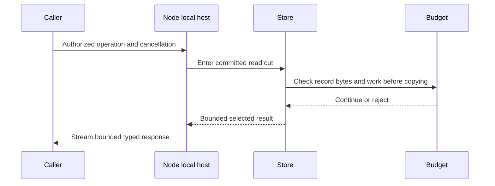
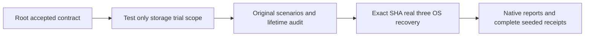

# ADR-035: bounded operation work and resource lifetime

Status: Accepted. Owner: KeyLoad lead. Owner direction: repair memory/performance
and excessive-read defects across the current product. REQ-MP-001..005 and
AC-MP-001..012 are defined in ResourceExecution and its working acceptance.

## Decision and invariant

The database's atomic partition remains the business consistency identity;
node-local PartitionHost/store owns mutable data, journals and gates. Orleans
activation state is temporary and cannot own files or serve as durable truth.
All fixes preserve committed cuts, authorized visibility, exact search ranks,
idempotent outcomes, signatures and RF3/recovery guarantees.

Bound resource work at the boundary where copies/read work begin. Prefer scoped
range visitors or bounded pages consumed inside the read gate to complete scan
materialization. Retain storage ownership copies until an explicit borrowed-value
contract prevents mutation/escape. Compile query selection/scoring metadata once
per operation and retain only bounded selection state. Reuse transaction-scoped
verified images/counters/raw lengths rather than rereading durable truth.

HTTP SDK transport receives headers before streaming JSON; response lifetime
covers decoding, cancellation and bounded error parsing. Reports stream files
instead of duplicating the complete sample corpus as strings. Resource assertions
use real counters/budgets; benchmarks use exact same-topology GitHub measurements.

TASK-MP-008B preserves the current ComparisonReport JSON contract and serializer
options, CSV column order, escaping, every attempt, error/timeout and queue-stage
value. JSON is serialized directly to a real output FileStream; CSV is written
one row at a time with bounded writer buffering. Existing Markdown returns a
summary of cases, not raw attempts, and its owned-string caller contract remains
until separate consumers use the public operation. Cancellation is checked before creating
files and throughout output; a cancelled write is not a qualified report. No
sample-retention, runner, workload, adapter, schema or measurement-scope change is
authorized to the report worker. Tests use actual files with UTF-8/quote/newline,
all-attempt roundtrip and cancellation evidence; CI owns execution.

## Ordered implementation contract

1. Lead captures authoritative dirty source/index baseline, writes brainstorm,
   acceptance and plan, and joins read-only inventories for every surface.
2. TASK-MP-008 ClientApi may proceed independently: only shared SDK transport plus
   new matching test/helper files. No feature API/wire change, no fake HTTP handler;
   real Kestrel and RF3 evidence. Lead owns ClientApi feature/contract review.
3. TASK-MP-005 lead finalizes exact storage visitor/cursor/metrics signatures and
   lifetime before Query/Core writes. Test prefix/end/after/overlay/cancel/byte
   semantics on real ZoneTree first; any public contract delta is recorded here.
4. TASK-MP-006 owns QueryExecution/Search files/tests; TASK-MP-007 owns assigned
   Core feature files/tests. Shared budget/provider/API files remain lead-owned.
5. Before TASK-MP-009 retention/peer writes, specify snapshot publication authority,
   safe deletion/in-flight leases, crash interruption, protocol/admission budgets,
   active-path implementation and rollback. No new storage/protocol design by a worker.
6. TASK-MP-010 joins all reviewed diffs and repairs required build/format/coverage/
   complexity prerequisites. No analyzer suppression or test weakening.
7. TASK-MP-011 runs GitHub real TUnit/recovery/RF3 SDK/MCP and resource profiles,
   retaining SHA/run/jobs/artifacts and closing every acceptance item. Remain
   Accepted until every required implementation and qualification gate is met.

Workers receive exact ownership/AC/test duties and stop on contract ambiguity,
overlap, data/security semantics or actual dependency defect. No local tests or
benchmarks, global installation or forced/protection-bypassing delivery. Shared
contracts and central docs/config have a single owner.

## Implementation, rollback and verification

### Accepted TASK-MP-007I document image reuse

MP-012 / REQ-DSTORE-005 / AC-DSTORE-005 extends AC-MP-006/011/012. The current
atomic mutation loop reads and decodes a document before its handler; each CRUD
handler reads it again; the loop rereads and decodes the staged final record. For
successful no-index Put/Patch/Delete this is three borrowed point lookups, including
avoidable complete JSON decode/read work. Preserve the outer pre-read before all
handler validation so existing failure/authorization order stays exact.

Define internal readonly record structs in Features/DocumentStorage:
DocumentMutationContext(byte[] Key, DocumentRecord? Before) and
DocumentMutationResult(MutationReceipt Receipt, DocumentRecord After).
The lead constructs the key and decodes Before exactly once inside the current
atomic transaction, then passes that same context to the existing private Put,
Patch and Delete handlers. Their existing other arguments stay; return the receipt
and exact constructed/staged final record. Delete returns its persisted tombstone,
not null. Do not reread the document key in a handler or after staging.
These private gate-scoped carriers do not escape, cache globally or expose mutable
storage buffers. A later mutation of the same document reads the prior staged
result normally; never reuse an image across mutations or transaction boundaries.

Use those exact Before/After objects for the existing outbox record and visibility
comparison. Preserve canonical JSON, receipt/order/index and unique checks, row and
field authorization, explicit replacement, revision, tombstone, time, visibility
epoch, outbox budget/reset and replay. Other mutation families stay unchanged with
null document images. Build receipts directly in the final immutable builder with
capacity equal to the already bounded mutation count; no intermediate array/list
copy. No serializer, public wire/signature, format or durability change.

1. memory_reads_review writes real TestDatabase/ZoneTree DocumentStorage regressions
   first, owns only the Put/Patch/Delete portions of Documents.cs, their target
   Features/DocumentStorage/DocumentMutationCommands.cs replacements/carriers and
   NEW DocumentStorage image/read counter tests. Remove replaced handlers once.
   No index/read algorithm, shared fixture/dispatcher/docs/config/native edits.
2. Lead alone integrates AtomicMutationApplication.cs and shared receipt builder
   after the worker carrier/handler source joins. Worker source-ready does not
   count as combined compiler proof. All other shared commit/outcome changes remain
   with the lead; formatter scopes remain disjoint.
3. Counter tests compare quiescent no-index large-versus-small documents with
   named metadata tolerance: new Put has no payload-size point-read amplification;
   replacement/Patch/Delete read one previous payload, with no final staged decode.
   Count and byte assertions must fail the current three-lookup path. Cover exact
   before/after/outbox bytes, tombstone/revision/order, same-ID sequential batch,
   missing/CAS/unique/quota/authorization failures and healthy subsequent command.
   Existing real-store/recovery/RF3 flows remain required; no mocks or local runs.
4. Lead reviews every diff, strict actual-dependency build/format/governance and
   exact delivered-SHA GitHub TUnit/recovery/RF3 SDK/MCP/resource evidence before
   closing MP-012. Changes are source-only; rollback handlers and caller together
   as one verified unit, never introduce an alias or duplicated old implementation.

The worker stops on ambiguous ownership/error order, changed persisted bytes,
escaping context, unbounded retained state or dependency defects. Lead owns all
shared contracts/config/docs and integration. Numeric coverage/complexity and
measured resource claims remain pending until real compatible GitHub evidence.

### Accepted TASK-MP-007J JSON text conversion and cached-receive reuse

MP-035 / REQ-MP-006 / AC-MP-006/009/011/012 removes avoidable owned UTF8
arrays in Core Payload<T> and the public OperationResult.Get<T> caller. The
integration lead adds JsonDefaults.Deserialize<T>(string value), retaining the
existing byte-span overload and exact strict options/converters. Encode with
Encoding.UTF8's existing replacement fallback, then invoke that byte overload on
only the written span. The official serializer's direct string API is not
equivalent for raw unpaired UTF16 surrogates; preserve the existing replacement,
escaped Unicode, number spelling, null/default/base64 and error semantics.
Fingerprint the original PayloadJson exactly as before, never the replaced text.
The new overload rejects a null argument before borrowing; Get<T> still rejects
stored errors first and maps absent Json to the existing JSON null/corruption path.

Use one private official ArrayPool<byte>.Create with a named 262144-byte maximum
retained array and two arrays per bucket. Compute exact UTF8 byte count before
Rent, encode once, and clear the borrowed array before Return in finally on every
exit, including encoding/parse failures. Larger input uses the same Rent/Return
path; the official configured pool does not retain oversized arrays. No shared
unbounded pool, custom decoder, escaping buffer, opaque payload cache, public
borrowed bytes or new dependency. The .NET10 bucket implementation retains under
1 MiB of array data for this configuration, plus fixed metadata; outstanding loans
and owned DTO data remain separate. This reduces allocation churn for reusable
sizes, not complete-payload transient materialization or established process RSS.

For cached queue receives, decode the successful cached result before its request
as today; decode the request once only when deliveries are nonempty, then reuse
the immutable Lane during that loop. Empty cached deliveries must not gain a new
parse. For cached subscription receives, decode the result, parse its Subscription
once before Group lookup/generation validation, then reuse it for each lease.
Preserve policy/incarnation/fingerprint checks, result errors, lease fencing,
reauthorization/validation order, errors and stored bytes. Fresh authorization-to-
dispatch DTO parsing remains a separate open typed-handoff design; do not invent
an object cache or widen this repair.

1. memory_reads_review owns only NEW ResourceExecution JSON text/protocol and
   allocation TUnit cases. Author them before implementation using public
   OperationResult/JsonDefaults and real TestDatabase receive/replay entry points.
   Include literal and escaped Unicode/unpaired-surrogate replacement, malformed
   JSON, required null/default collection/base64, stored-error-before-invalid-JSON,
   absent result corruption, retained owned DTOs across subsequent parses, and
   large above-pool-size result correctness. Compare exact established byte/wire
   behavior rather than an invented serializer or dependency double.
2. Warmed same-thread allocation cases at reusable sizes exercise Get<T>, with
   an isolated TUnit scheduling scope and assertions outside the measured loop.
   A repeated malformed parse must release its loan and permit the healthy next
   call. These CI checks prove managed allocation boundaries only; no runtime
   tests, benchmark or fake pool/clock/handler runs locally.
3. Lead alone owns Contracts.cs overload/Get<T>, the new shared pooled-text helper
   under Abstractions/Features/ResourceExecution, Core OperationProtocol and
   cached-receive CommandOutcomes regions, all central docs/config and caller join.
   Preserve public byte overload/wire names and remove the replaced GetBytes calls.
   Review every buffer lifetime and error-order diff; build real dependencies,
   formatter/governance, then exact-SHA GitHub suites before closing MP-035.

Rollback text helper/overload and both callers together as one reviewed unit;
persisted state remains unchanged. Stop on changed fingerprint/error/Unicode behavior or
uncertain ownership. Related primary contracts: [configured ArrayPool](https://learn.microsoft.com/en-us/dotnet/api/system.buffers.arraypool-1.create?view=net-10.0),
[.NET10 configured pool source](https://raw.githubusercontent.com/dotnet/runtime/v10.0.0/src/libraries/System.Private.CoreLib/src/System/Buffers/ConfigurableArrayPool.cs),
[UTF8 replacement behavior](https://learn.microsoft.com/en-us/dotnet/api/system.text.encoding.utf8?view=net-10.0).

### Accepted TASK-MP-007H source-read contract

Messaging REQ-MSG-009 / AC-MP-005/006/012 defines exact unified topic/stream
read authority, borrowed records and complete cursor-envelope accounting. The
budgeted read-view adapter is a shared ResourceExecution primitive within the store
action; it changes no storage format or provider authority. SourceHead/cursor
wrappers keep validation for other callers, while ReadEventSource reuses its one
validated resource. Subscription state and publish/queue transitions are unchanged.

Ordered stages: real-store source and adapter regressions first; implement adapter
against the accepted IKeyValueView contract; join borrowed SourceRecord and validated
head/cursor reuse; join optional caller cancellation and complete output counting;
inspect strict source/formatter diagnostics; lead joins public token forwarding and
exact GitHub qualification. Worker scope is the stated EventSources regions and new
Messaging/ResourceExecution helper/test files only. Lead owns shared ReadExecutionBudget
internal token accessor and documented CreateView capability, docs, API/grain/
contract joins and final combined proof.
Incorrect persisted identity/position becomes explicit Corruption; valid records,
signatures, cursor purpose/authority, generations, projection and format remain.
Revert this source stage together if needed; persisted state remains unchanged.

### Accepted TASK-MP-006C analytical-read admission contract

ResourceExecution defines one atomic, fail-fast MaxConcurrentQueries allowance
owned by each DatabaseEngine, shared by QueryEngine and SearchEngine instances.
No static cache, wait queue, role trust, persistence or wire change is introduced.
The new partial DatabaseEngine admission source and gate live in its canonical
ResourceExecution slice; no edits to the concurrent owner's DatabaseEngine.cs.
Positive-limit validation and exactly-once owned reservations keep authority and
count lifetime explicit; the current count is observational, not physical I/O.

Ordered implementation: author real-store mixed-entry and release regressions;
implement the constant-cardinality atomic gate/reservation; join all five analytical
entry points; inspect dependency/source/formatter diagnostics; run exact-SHA GitHub
TUnit and RF3 regressions before any passing claim. TASK-MP-006C worker owns only
the new Core helper/partial/test files and QueryEngine/LiveQueries/SearchEngine
admission joins. Lead owns shared docs and all other integration. Revert this
source stage as one unit if needed; persisted state remains unchanged.
Existing constructor/entry signatures and results remain intact. Invalid zero/
negative limits fail construction explicitly; saturation and cancellation precede
expensive validation, store gate waits and ranking. Independent engines attached
to independent databases retain independent allowances.

### Accepted TASK-MP-011A diagnostics contract

ResourceExecution specifies the exact per-instance owned/borrowed point and
examined-range counters, fresh session identity, saturation and non-atomic snapshot
limits. No physical I/O or per-operation attribution under concurrent RF3 is
claimed. Counters record constant-cardinality logical work before copies/observer
rejection, including fetched cancelled/cap-rejected work; Scan/fallback cannot
double count. Existing budgets/ReadBytes and provider gates remain unchanged.

Ordered join: worker authors real ZoneTree point/range/error/cancel regressions and
new StorageRecovery snapshot/counter helpers; lead alone adds existing provider
leaf instrumentation and public local snapshot method, reviews every diff and
joins strict development/static and exact GitHub proof. Session counters reset on
reopen; persisted data and wire state remain unchanged by this source-only stage.
No server route/report schema, physical-I/O instrumentation, keys/payload/path
labels or shared abstraction changes are delegated. Saturation is verified by
arithmetic source review if reaching Int64.MaxValue with real storage is infeasible;
this explicit exception cannot establish numeric runtime coverage. Node and
replica scopes require a later trusted telemetry contract before publication.

### Accepted scoped storage contract for TASK-MP-005

`IKeyValueView.ReadValue(byte[] key, StorageValueReader reader,
StorageReadObserver? observer = null)` invokes the span reader at most once for a
found value; the observer receives examined key/value byte count before the reader,
including key bytes for a missing lookup. `Get` retains its owned-copy semantics.

`IKeyValueView.VisitRange(byte[] prefix, int maxRecords,
StorageRecordVisitor visitor, byte[]? afterKey = null, byte[]? untilKey = null,
StorageReadObserver? observer = null, CancellationToken cancellationToken = default)`
visits ordered logical records inside the existing gate. Bounds are prefix,
exclusive after and exclusive until; visitor false stops without examining the
next record. StorageScanResult reports delivered Records, HasMore (a true record-
limit lookahead), StoppedByVisitor and examined ReadBytes. A matching lookahead and
an examined overridden/deleted baseline value consume work; observers run before
any returned key/value copy or callback. Backend/native allocation for one record
is distinct from managed page-copy accounting and must not be claimed eliminated.

Both methods validate inputs/cancellation, retain the provider's 100,000 examined
entry and 64 MiB scan-work caps, and cannot leak span/iterator lifetime beyond the
store read/commit action. Existing Scan materializes an owned page through this
same canonical visit implementation for callers that require a page; it is an
active distinct caller contract, not a second algorithm or compatibility fallback.

Transaction changes use a sorted range-capable collection and a single ordered
merge with the baseline. Stage/replace/delete/reset and serialized mutation order,
frame checksum/limits/prepared payload remain identical. Only relevant staged keys
participate; raw matching baseline work is charged even when a staged tombstone
replaces it. Physical scan exhaustion fails instead of silently truncating results.
No persisted format or external database JSON changes in this stage.
The examined-entry cap counts matching baseline and staged entries, including
tombstones, overridden baseline entries and true lookahead. A replaced key costs
two examined entries. A key-only stage peek is charged when selected. Exhaustion
may reject a 100,000-record request before completion; it never silently truncates.

An ordered transaction merge may prefetch one baseline record to compare its key
with a staged key. Charge that examined record immediately before any staged
callback, even if the callback stops. No further iterator advance or observer work
occurs after visitor false. This does not claim zero native prefetch; ReadBytes
contains the bounded prefetched work and Records only delivered logical records.

Ownership join: lead alone edits shared abstraction/common-budget contracts and
root-owned budget tests; TASK-MP-005A (memory_reads_review) owns ZoneTree provider
read/transaction scan implementation and its new StorageRecovery TUnit files.
The provider worker cannot edit contracts, checkpoints, core/query or docs.
Borrowed callbacks may not mutate the transaction during a range visit; owned
Scan pages remain the appropriate contract for iterate-then-mutate consumers.
This prevents invalidating the staged range cursor and does not relax atomicity.

The shared ReadExecutionBudget exposes the same gate-scoped VisitRange with its
own cumulative byte/deadline/cancellation observer. Its owned Read/Scan callbacks
copy only after the observer accepts a record; typed ReadRecord decodes the
borrowed span directly. ReadBytes is logical examined key/value work, not OS I/O.
CheckResult counts the exact current JSON serializer output through a counting
Stream, preserving Unicode escaping and converters without allocating a complete
result byte array. Serializer token buffers still exist; feature selection and
input-value limits must bound those tokens separately. No hard process-memory
claim follows from this counter. Cancellation/error propagation cannot retain a
store gate or change committed position.
MeasureResult<T> returns the same exact bounded serializer byte count so a feature
can limit incremental selected output before retaining the full result. It uses
the same cancellation/deadline and MaxBatchBytes; no separate permissive limit.

### Accepted EventStreams read contract for TASK-MP-007A

ReadStream adds optional caller cancellation; lead owns HTTP forwarding. Start one
ReadExecutionBudget before entering the read gate. Preserve authorization, stream
generation, retention/revision failures, order, head/cut/HasMore and payload/header
redaction. Charge head lookup and event range key/value work. Decode/project each
record directly in VisitRange; no owned raw page. Bound the cumulative standalone
projected-record byte count before retaining another event, then check the exact
complete StreamPage including all metadata. Standalone counts are a lower bound
on the complete array/envelope, so this early check cannot reject a valid result;
final exact measurement governs boundary acceptance. No append/dedup/schema change.
Worker owns Events.cs ReadStream and new EventStreams helpers/tests only; shared
budget, DatabaseEngine operation clock and server endpoints remain lead-owned.
Tests precede implementation on real persisted state and include empty/exact-limit,
over-limit metadata, redaction, retained generation/revision, cancel and healthy
following operations; all execution in GitHub.

### Accepted TimeSeries range contract for TASK-MP-007B

Keep the existing inclusive UTC `from` and `until` behavior and timestamp/sequence
order. The lower seek is the timestamp prefix; all sequence suffixes at `from`
are greater than that seek. The exclusive upper seek is a UTC timestamp one tick
after `until`; if `until.UtcTicks` is DateTimeOffset.MaxValue.UtcTicks, the series
prefix supplies the natural end without overflow. Construct the next tick in UTC
so a nonzero offset near the local DateTime maximum cannot overflow.

Use one ReadExecutionBudget before entering the gate, readonly VisitRange with
that exclusive upper bound, and decode/project only selected matching records.
Charge the raw key/value work including true result-limit lookahead within the
range. Bound standalone projected sample byte totals before retaining another
sample; CheckResult validates the exact complete array and metadata at the end.
ReadSamples accepts optional caller cancellation; Clock.GetUtcNow governs the
existing principal-expiry check without altering Orleans/runtime time. No append,
dedup, tag policy, schema, wire or timestamp semantics change. Lead owns this
region and new TimeSeries helper/tests; Query/Search workers must not edit
GraphAndSeries.cs while this stage is active. Real-store tests precede code and
exercise narrow ranges with large excluded values, min/max/offset/equal timestamps,
byte/cancel failures, exact result boundary and a healthy following operation.

### Accepted QueryExecution contract for TASK-MP-006

SQL/AST Execute and live-query entry points accept optional caller cancellation;
the lead forwards HTTP RequestAborted. Each operation starts one
ReadExecutionBudget before parsing/adaptation and shares it through the read cut.
Index scans charge index key/value work plus each dereferenced document; full
scans decode directly from scoped spans. Candidate overflow fails rather than
returning a partial success. No raw candidate page/second eligible-document array
is retained. Authorization and parameter/field-use binding precede candidate work.

Compile all predicate/order/projection JSON paths once per operation. The lead
adds a JsonData.Scalar(JsonElement, ReadOnlySpan<string>) overload preserving the
existing string-pointer semantics; the query evaluator may consume prepared paths
while its existing callers remain supported. Parse each candidate JSON once for
filter/order preparation, encode each scalar order key and ID tie-breaker once,
then dispose the JSON document. Mixed-type ordering uses the existing KeyCodec
byte order and descending directions exactly; predicate three-valued semantics
and type-mismatch errors remain unchanged.

Retain at most min(MaxScanRecords, cursorOffset + limit) eligible candidates in a
bounded worst-first heap. Count the complete eligible set to decide continuation;
sort only retained candidates using prepared keys, checking the same budget during
selection/sort/projection. All default ID ordering and cursor page concatenation
must match the existing canonical order. Project only requested rows; charge the
complete final QueryPage including signed cursor and metadata with CheckResult.
Explain keeps its access-path selection and candidate-bound validation. Cursor
identity/hash/schema/policy/source/read-generation/cut rules remain unchanged;
expiry uses the injected operation clock with the same five-minute duration.

LiveQueries is adapted only where it calls the changed shared execution helper
and forwards cancellation/checks; change-feed storage internals remain a separate
scope. Public JSON and persisted formats are unchanged. Worker owns QueryEngine,
QueryAst evaluator, LiveQueries and new QueryExecution helper/test files; shared
Core JSON overload, server routing and docs remain lead-owned. Real tests precede
implementation and must cover exact scalar order/ties/cursor concatenation,
authorization/redaction, point/index/full-scan budgets, negative/cancel and result
metadata. GitHub owns execution; a development build does not prove the cases.

### Accepted Search contract for TASK-MP-006B

REQ-SR-001..005 in Search map to AC-MP-003/004/005/012. Lead first provides
DatabaseEngine.VisitVisibleDocuments(view, principal, partition, collection,
budget, Action<DocumentRecord>) and VisitVisibleVectors(view, principal, partition,
collection, field, budget, Action<DocumentRecord, VectorRecord>). These existing-cut
callbacks decode one visible owned record at a time through scoped VisitRange.
They cannot mutate/escape the read cut. Existing owned-array helpers reuse the
canonical visitors; no copied raw scan page or alternative visibility algorithm.

The worker retains exact BM25 corpus statistics and query-term counts/identities,
not full corpus documents. Missing/nonmatching fields still contribute corpus
count/length and query terms retain existing normalization/order. Vector query
validation/norm preparation happens once; only the chosen metric is computed with
the same SIMD/scalar accumulation grouping. Candidate spaces/revisions/row policy,
branch ordinal-ID ties, text-then-vector fusion and weights remain exact. Complete
branch rank metadata is required before hybrid fusion; premature branch truncation
would change ranks and is forbidden.

A bounded final heap selects at most Limit identities; selected document point
reads and projection occur under the same cut and are charged to the same budget.
This explicitly exchanges at most Limit additional point reads for removal of
full-corpus payload retention. Update only the existing shared-budget calculation
to count those real reads, retaining both single-branch success and hybrid failure.
Bound incremental projected output then measure the complete result. Cancellation,
candidate/read/text/result budgets and following-call health have real-store tests.

Ordered stages: lead writes contracts and Core visitors; worker writes failing
real-store tests, Query Search helpers/entry point, then static review/build;
lead reviews/joins Core+Query+server and exact GitHub proof. Source/wire/data are
unchanged; rollback reverts implementation without changing persisted state. No public
SDK schema, admission policy, consensus or clock-runtime change is in worker scope.
Search admission remains separately open in the full resource inventory.

### Accepted portable SIMD validation stage, TASK-MP-006D

Accepted TASK-RUNTIME-SEARCH-BYTES-W3 preserves the existing REQ-SR-001 /
AC-MP-003/011/012 allocation and stored-byte oracle. Its actual failing baseline
is Ubuntu788-case run37021991878 atfa80c701, expected1048576 versus1048511.
Read-only tracing proves complete persisted records include a shared command's
UpdatedAt and native JSON emits variable fractional-second width. Exact failed
ticks are unavailable, so the cause remains a supported inference until the
corrected fixture qualifies. First preserve the failing assertion and snapshot
the test source. A worker changes only SearchResourceTests.cs to use one actual
captured UTC time in two separate uniquely identified batches and assert real
persisted time equality before measuring. Every original exact byte, allocation,
hit payload and score condition remains; no provider, clock, counter, threshold
or production change. Lead alone owns docs, joined enabled build/format and
multi-OS GitHub reports; source rollback restores only fixture coordination.

REQ-SR-002 / AC-MP-004/011/012 / AC-SEARCH-001 add edge qualification around the
existing public metric and persisted search behavior. The lead accepts the
validation-only optimization under the owner's operation-efficiency objective.
On 2026-10-02 the owner confirmed the earlier SMID wording means SIMD, .NET
intrinsics first and Rust only after profiling. The mapped owning Search stage is
[AC-SIMD-001–004](../Features/Search.md) with its
[ordered protected-source task graph](../Features/Search.md).
Root independently verified unchanged c486 run37060131271's five metric cases
passing on each of three OS unit suites (871/871 each), and real RF3 SDK/MCP46/46.
Windows recovery20errors and two native comparison completion errors remain open;
this relevant source baseline does not declare the full run green. The lead alone
owns Validate and shared CI; other independent workers own disjoint host/PG caller
repairs and read-only failure diagnosis. Normal and disabled-hardware invocations
retain distinct native results directories. No accumulation, dependency, trust,
public API or persisted-format change is accepted by this continuation.

1. `simd_search_tests` owns only NEW `UnitTests/Features/Search/`
   `VectorMetricValidationTests.cs` and `VectorMetricGoldenTests.cs`; write
   public-score and actual ZoneTree search assertions first. Cover dynamic vector
   width/block/tail, NaN and both infinities in either operand, length bounds and
   mismatch, invalid metric precedence, zero, signed zero and finite extremes.
   Existing score grouping is the baseline; do not introduce an alternate score
   algorithm or fake store. Lead owns shared docs/CI and reviews every source.
2. Qualify the unchanged production baseline at the test-source SHA through the
   canonical GitHub workflow. Local tests/load/AppHost execution are forbidden.
   Retain exact run/job/source and test counts; source builds do not qualify tests.
3. After baseline and integrated caller-correctness gates pass, the lead changes
   only `Query/Features/Search/PreparedSimilarity.cs:Validate`: keep length first,
   use full portable Vector blocks with strict abs(value) < +Infinity, preserve
   the scalar IsFinite tail. Do not change Create/Score/error constants or any
   Vector.Widen/Vector.Dot/scalar metric reduction.
4. GitHub normal hardware and DOTNET_EnableHWIntrinsic=0 invocations qualify the
   same metric edge cases, alongside all existing unit/recovery/RF3 SDK/MCP and
   comparison gates. No skip or fixed hardware width counts as proof.

Join is the reviewed exact-source baseline/candidate/error and actual store
outcome; CI evidence includes fallback invocation and zero skipped cases. This
internal change leaves CLR, wire and storage contracts unchanged. Rollback
reverts only the finite-validation loop and retains the acceptance regressions.
No measured gain is declared without TASK-MP-011B matched RF3 server/resource
artifacts and evidence-derived budgets; hardware availability affects performance,
not validity or portability.

### Accepted Core work-reuse stages

TASK-MP-007G implements REQ-MSG-008 / AC-MP-006/012: Topic Publish validates one
resource and reads one TopicHead, preserving absent-head/generation/error order,
tail/retention/stored-byte quotas, duplicate comparison and atomic producer rollback.
The existing event payload is serialized once and reused. Worker writes real-store
boundary/error/rollback regressions before changing only assigned EventSources
private regions and new matching Messaging helpers; stream SourceHead and public
read/cursor contracts remain exact. Lead reviews/joins build/static/GitHub proof;
provider counters are separate. No format/API change; source revert is
compatible. Queue and public SourceRecord/read work have separate ownership stages.

TASK-MP-007F implements REQ-MSG-007 / AC-MP-006/012 exactly as Messaging:
serialize enqueue once, carry actual borrowed stored-body lengths, reuse one
lane-counter value through each bounded loop, and pass one validated processing
lease into the common delivery transition. No body presence/corruption validation
may be removed. Keep direct and processing error precedence, scope checks before
inbox replay, quota-releasing ACK staged before effects, FIFO/time/generation/
projection/signature and atomic rollback semantics. Persisted bodies/wire are
identical; source revert leaves persisted entries unchanged. Framework quota tests do
not establish measured point-read reduction without MP-011 provider counters.

Ordered join: write real-store boundary/state/error/replay regressions first,
implement only assigned private Messaging.cs regions and new matching helper
files, then lead reviews/joins and performs actual build/static/GitHub proof.
Worker cannot edit EventSources, Sign/Verify/Inspect, DatabaseEngine or contracts;
the lead serializes any new shared signature. Existing tests are never weakened.

TASK-MP-007E canonical JSON implements REQ-MP-002 / AC-MP-006/012 through the
ResourceExecution shared primitive. JsonData public signatures, validation limits,
ordinal ordering, duplicate errors, decimal G29 validation and raw-number SHA-256
fingerprints remain exact. SerializeToDocument uses the same JsonDefaults options
and a pooled shared input buffer; a canonical writer streams into a borrowed
IncrementalHash adapter. Flush complete values at a named 64 KiB pending-byte
threshold; the largest token and property-sort metadata remain allocated. Validate
decodes the used MemoryStream buffer without a complete ToArray clone. No new
post-canonical size limit or wire/persistence change is authorized.

Ordered join: lead accepts fixtures/contract and owns JsonData; worker writes
golden, invalid-input, real-store replay and allocation-growth regressions first,
then new matching canonical-writer/hash-stream helpers; lead reviews and connects
the helpers, performs combined development build/static gates, and joins exact-SHA
GitHub TUnit/recovery/RF3 proof. Worker cannot edit other source/contracts/docs.
Framework Stream inheritance is confined to the hash adapter's required API;
the caller owns hash disposal. Rollback is a source revert with identical stored
fingerprints/signatures and requires no data conversion.
JsonData quality join also relocates its existing pointer parse/escape algorithm
to lead-owned Features/ResourceExecution/JsonPointerPaths, preserving public
wrappers, pointer bounds, escaping and patch behavior; normative path/patch tests
precede the move. This keeps the shared type within mandatory size limits without
an analyzer suppression or a second algorithm. The .NET 10.0.12
[SerializeToDocument implementation](https://raw.githubusercontent.com/dotnet/runtime/v10.0.12/src/libraries/System.Text.Json/src/System/Text/Json/Serialization/JsonSerializer.Write.Document.cs)
confirms the shared pooled input buffer, and
[Utf8JsonWriter](https://raw.githubusercontent.com/dotnet/runtime/v10.0.12/src/libraries/System.Text.Json/src/System/Text/Json/Writer/Utf8JsonWriter.cs)
requires explicit Flush to send its pending stream buffer.

TASK-MP-007C implements REQ-GRAPH-005 / AC-MP-005/006/012 exactly as GraphTraversal:
gate-scoped boolean vertex and collection authority caches, scoped adjacency reads,
all-candidate visit accounting and incremental/exact result bounds. No vertex JSON
cache, hidden expansion, mutation or wire change. Worker owns Traverse only plus
new matching helper/tests; lead serializes the GraphAndSeries.cs integration join.

TASK-MP-007D implements REQ-FEED-006 / AC-MP-006/012 exactly as ChangeFeeds:
borrow one point payload, decode/validate sequence and partition, carry owned key
and raw length, and subtract that raw length when purging the same validated entry.
The canonical entry iterator is reused by feeds/projections; their serialized
response-budget semantics stay. Point reads avoid transaction-range mutation and
preserve gaps, pins, filters, receipts, signatures and rollback.

The projection batch reader also passes its already-read `OutboxHead.Tail` into
the entry reader, so it does not perform a second head lookup. For accepted batch
entries, `StoredBytes` may replace a fresh `JsonDefaults.Serialize(entry)` only
after the real-store regression proves the persisted bytes equal the exact
re-serialized entry bytes for a large Unicode document and that the exact/one-byte-
under `MaxBytes` boundary is unchanged. The same regression proves one bounded
single-entry batch performs exactly four borrowed point reads (principal,
consumer, head and outbox entry). No response schema, cursor, filter, progress,
error-order or persisted-format change is allowed.

The lead owns `ProjectionOutbox.cs`, `StoredOutboxReader.cs` and the new
`ProjectionReadWorkTests.cs` while the UnitTests build worker edits only existing
diagnostic files. First add the real ZoneTree compatibility/read-count test, then
make the two private read-work changes. A dependency-enabled development build is
allowed; TUnit/recovery/RF3 execution remains GitHub Actions only. Rollback is a
source revert leaves stored entries and public byte-budget behavior unchanged.

The historical purge reader receives `min(head.Tail, ThroughSequence)` as its inclusive end,

The purge reader receives `min(head.Tail, ThroughSequence)` as its inclusive end,
including an empty range for a no-op/already-reclaimed prefix. No retained entry
beyond that end is decoded or validated; gaps and metadata corruption inside the
requested prefix still roll back the whole purge. Compute AtomicPartitionId once
per iterator. A real-store regression temporarily corrupts the next retained
entry, proves prefix/no-op purge succeeds without reading it, restores the entry
and consumes it through the projection API. No checksum, pin, response budget,
producer, wire or persisted-format change accompanies this read-work repair.

Both stages write real-store regression cases before code, then development
build/static review; lead inspects every diff and joins actual GitHub unit/recovery/
RF3 SDK/MCP proof. Persisted/wire formats stay unchanged; revert source changes without
data conversion on owner-directed rollback. Shared contracts, docs and CI have
one integration owner. They do not close the unrelated mutation/queue/cluster work.

Streaming/sort/copy changes keep persisted/wire formats. Durable retention or
protocol changes require a further exact contract here before implementation;
published cut/committed prefix/in-flight transfer protection cannot be omitted.
Rollback is an owner-directed source revert. Existing dirty work stays intact; pending Orleans activation movement cannot be counted as live proof.

Testing methodology and per-criterion assertions are in the acceptance matrix.
Verification: strict Release build, formatter/governance, CI TUnit real stores and
network, real process recovery, Docker/Aspire RF3 public SDK/MCP, resource/coverage/
complexity artifacts. No mocked verification, invented performance, endurance or
power-loss claim is allowed.

Accepted private-write stage TASK-MP-016P, REQ-STORAGE-009 / AC-MP-006/012 /
AC-PSW-001..004: ZoneTreeTransaction owns one prepared StorageMutation[] per staged
generation, reused by its existing payload serializer and facade apply path.
Accepted Stage and Reset invalidate both array/payload; rejected oversized Stage
retains the valid set. Keep key/value ownership copies, sorted order, callback/gate,
header/payload/checksum/flush/apply/observer and poison/recovery semantics exact.
No journal publisher, public signature, dependency or persisted/wire format change.
The economical worker owns only transaction, exact facade projection call and NEW
StorageRecovery PreparedTransactionTests, authored before implementation. Lead owns
shared documentation, whole source review and all enabled gates. The ordered plan,
test/error/no-op/byte/ownership matrix and current baseline/source-debt evidence are
in [StorageRecovery](../Features/StorageRecovery.md). Rollback
the coherent cache source unit without data conversion or weakened analysis. Exact-
SHA GitHub unit/recovery/Docker RF3 SDK/MCP remains mandatory; source is not a measured
allocation win, numeric coverage or power-loss proof.

## AC-MP-011 extension: per-operation RF3 budgets and Orleans cost

Owner direction makes whole-system operation efficiency and RF3 scalability a
first-priority requirement. REQ-MP-005 / AC-MP-011 and
REQ-RESOURCE-002 / AC-RESOURCE-002 therefore require each advertised operation
family to have a measured workload, explicit numeric resource/latency/throughput
budgets, and exact read/acknowledgement semantics. Budget values are derived from
repeated same-topology baseline/candidate runs; they are not guessed from source
limits or client-side measurements.

Ordered stages:

1. After a correctness-qualified candidate SHA exists, capture the matched RF3
   baseline for documents, events, messaging, reads/search, graph, time-series,
   blob, and administrative operations which are actually advertised.
2. Add bounded low-cardinality per-operation and per-hop evidence for admission,
   request/read/command grains, quorum barrier, apply/store work and backpressure
   where each path uses those stages. Separate load-generator resources from each
   database node's CPU, allocations/GC and working set. Never label metrics with
   request IDs, tenants, users, credentials, keys or payloads.
3. Add contract tests for metric names/labels and real RF3 SDK/MCP flows covering
   success, saturation/rejection, cancellation and slow-consumer behavior where
   applicable. Do not use metrics doubles as runtime proof.
4. Repeat baseline and candidate profiles with identical source-independent
   workload inputs, topology, limits, warmup, concurrency and acknowledgement/read
   guarantees. Record numeric thresholds and raw artifact provenance before
   making performance claims.
5. Update the operation matrix, README and status only from exact-SHA GitHub
   evidence; no local test/benchmark result can qualify the feature.

The implementation task is TASK-MP-011B in
`ADR-035-memory-performance.md`; it depends on TASK-MP-010's integrated correctness,
build and governance joins. The lead is the sole owner of shared
`src/KeyLoad.ServiceDefaults/` instrument registration,
`src/KeyLoad.Orleans/Features/ClusterRouting/` hop instrumentation,
`benchmarks/KeyLoad.Comparisons/Features/BenchmarkComparisons/` workload/report
integration, shared contracts, ADR/acceptance/status evidence and final review.
Feature owners implement their own operation budgets and correctness in the
canonical feature slices. Planned tests are
`tests/KeyLoad.UnitTests/Features/ResourceExecution/` for metric names, bounds and
label privacy;
`tests/KeyLoad.IntegrationTests/Features/ClusterRouting/ActivationMovementScenario.cs`
for observed real RF3 movement and node-local storage identity;
`tests/KeyLoad.ComparisonTests/Features/BenchmarkComparisons/` for matched
operation profiles; and its `TimeSeries/` slice for repeated read/append/aggregate
comparisons. Each advertised SDK/MCP operation family must join real caller
success, authorization, overload/rejection, cancellation and applicable
backpressure behavior to metric assertions without changing its public contract.

Persisted KeyLoad EventStreams and Orleans runtime Streams are separate contracts.
The existing KeyLoad stream read/replay path is qualified through its persisted
store and cursor. This amendment does not authorize a new Orleans pub/sub provider.
That provider requires a separate REQ/AC and ADR covering provider durability,
delivery/replay/ordering, restart, backpressure and its real RF3 tests before its
files or task plan are added.

After tests-first source integration, verification order is enabled Release
solution build, `dotnet format KeyLoad.slnx --verify-no-changes --no-restore`,
repository governance, then the complete GitHub `ci.yml` exact-SHA run for TUnit,
process recovery, RF3 SDK/MCP, repeated profiles, coverage and complexity evidence.
Keep run/job URLs and raw per-node/per-operation JSON in the workflow artifacts.
Numeric thresholds enter the operation matrix only after matched repeated
baseline/candidate artifacts pass correctness with the same topology and
acknowledgement/read guarantees. Local checks are development evidence only.

Rollback of instrumentation requires no persisted-data conversion and must not
remove existing correctness budgets or request isolation. Rollback of an
operation-level optimization is confined to that owning slice and must preserve
its persisted format, exact outcomes and established budgets.

## Accepted TASK-MP-008C progressive report output

REQ-MP-004/REQ-BC-010 and AC-MP-010/012 preserve ADR-044 public immutable contracts.
Run37005805424 is the failing cancellation baseline; source and native .NET 10
serializer review confirm custom synchronous array converters prevent incremental
async output. Keep those shared strict read/write converters unchanged. Add only
private report/case write views exposing Cases and Samples as native async
enumerables over owned immutable arrays, with exact scalar metadata/order and
default-array JsonException. Never materialize another samples list/array or a
whole-report UTF-8/string buffer. Targets remain under their original converter.

Ordered stages: worker authors stronger real-file regressions and snapshots their
source; adds internal helpers under Comparisons/Features/BenchmarkComparisons;
lead changes only ReportWriter's JSON serialization join and shared docs; reviews
public schema/lifetime/memory boundaries; enabled solution build, format/governance;
complete exact-SHA GitHub qualification. Worker owns only new StreamedComparisonReport,
StreamedComparisonCase and necessary bounded async-array helper files plus
UnitTests/Features/BenchmarkComparisons/ReportFileTests.cs. Lead owns ReportWriter,
central composition, contracts/docs/CI/status. No source Contracts, shared converter,
producer, measured report schema, workflow permission or timeout changes.

Existing byte-exact small report/roundtrip/CSV assertions gain nonnull provenance
and image metadata. The existing 80MiB-input cancellation case cancels inside the
actual early-growth observer, retains its ten-second bound and verifies a canceled
write, partial JSON below one quarter of complete raw error bytes, and absent
Markdown/CSV. No fake stream, file hook, synthetic dependency or full-output oracle.
These resource/correctness assertions do not claim measured peak allocation or
latency. Rollback reverts only the internal write projection/join; no persisted
format, public CLR or schema change. Required evidence includes tests-first
source snapshot, reviewed diff and exact CI report/job/SHA; remain Accepted until
all actual gates pass.

## Accepted exact-CI test-fixture repairs

TASK-RUNTIME-ADMISSION-W implements REQ-MP-002/005 and AC-MP-004/011/012 using
only AnalyticalAdmissionTests.cs and new RealZoneTreeWriteGateHold.cs in UnitTests
Features/ResourceExecution. A no-change real Commit holds the exclusive store gate;
the shared read-holder remains untouched for its read-lifetime callers. Preserve
existing bounded waits, saturation, cancellation, cleanup and follow-up assertions.
TASK-RUNTIME-JSON-ORACLES-W changes only JsonTextProtocolTests.cs,
EmbeddedBenchmarkContractTests.cs and TopicPublicationTests.cs. Native serializer
exception, canonical stored order and typed exact-byte equality reflect existing
AC-MP-006/012 and ADR-041/047 contracts. Input remains unsorted and no semantic
assertion is removed. Existing failed run37005805424 is the tests-first baseline.

Both workers own disjoint named test files; lead owns shared docs and integration.
Ordered verification is source lifetime/oracle review, enabled solution build,
formatter/governance and full exact-SHA GitHub UnitTests and regressions. No new
API, data format, package, timeout or authority change. Rollback reverts only
the corresponding fixture/oracle changes, retaining the original production paths.

TASK-RUNTIME-Kestrel-W additionally owns only
UnitTests/Features/ClientApi/KeyLoadClientTransportTests.cs for REQ-CLIENT-002 and
AC-MP-009/012. Replace the full 1 MiB pre-cancellation write with a bounded partial
initial chunk and named handler/write/flush coordination, surfacing unexpected
handler faults. Keep the response incomplete and all five-second waits, actual
cancellation/request-abort/reuse assertions and original transport mapping. The
macOS failed run37005805424 is its tests-first baseline; source lifecycle review,
enabled build/format and full multi-OS GitHub suites qualify this fixture repair.
No production, data or API change; rollback changes only test coordination.

### Accepted TASK-RUNTIME-QUEUE-W2 join

REQ-MSG-007 and AC-MSG-001/002/004/005, AC-MP-006/011/012 retain the existing
TASK-MP-007F borrowed ready-index contract. Run37015193756/ad594642 provides the
failing baseline: one delivery examines257 ready-index entries, and the real
absent-body fixture now propagates the correctly preserved Corruption exception.
Ordered stages: tests-first actual stored expired/live/256 ceiling and missing-body
no-effects assertions; bounded read-only visitor capture then post-visitor atomic
transitions; lead source/numeric review; enabled solution build/formatter/static
governance; full exact-SHA GitHub unit/recovery/RF3 suites and retained artifacts.
runtime_storage_research owns only QueueReadyClaims.cs and a necessary new
same-slice input helper, ReadyQueueRangeTests.cs and QueueBodyAccountingTests.cs.
Lead alone owns docs, shared contracts and final join. No changes to256 ceiling,
FIFO, message/byte/in-flight limits, time, counters, lease/signature/security/error
order, persisted shapes or public APIs. Missing-body Corruption remains fail-closed;
malformed-body Validation and healthy restoration remain tested. Source rollback
reverts only this traversal/fixture repair. Runtime/perf
qualification remains pending until the exact new SHA passes.

### Accepted TASK-RUNTIME-CANCEL-W2 real fixture refinement

REQ-MP-004, REQ-CLIENT-002 and AC-MP-009/010/012 use run37015193756/ad594642
as the preserved failing baseline. Native async Cases/Samples serialization is
already present; a delayed real-file observer starts too late to establish early
cancellation on Linux/macOS. Arm a dedicated real-file observer before the writer
and cancel directly on first positive file length. Preserve20000×4096 bytes,
the10second observer deadline, OperationCanceledException, less-than-quarter raw
output and absent Markdown/CSV. No production serializer hook, fake stream or
corpus/cutoff/timeout change is permitted.

The macOS Kestrel failure is the five-second RequestAborted wait after the client
returns its cancelled result. Coordinate one further bounded actual response
write/flush after that result, leaving the1MiB response incomplete, then require
actual RequestAborted and successful same-client subsequent call. Keep first
64KiB chunk, cancellation classification, all five-second bounds, fixed stage
evidence and observed handler/client cleanup; no client transport defect is
inferred from the current logs. protocol worker owns only ReportFileTests.cs,
necessary new same-slice file observer helper, KeyLoadClientTransportTests.cs and
MidBodyCancellationResponse.cs. Lead owns docs/integration. Ordered verification:
failed exact-SHA baseline, scoped fixtures, source lifetime/numeric/privacy review,
enabled solution build/formatter/governance, complete multi-OS GitHub suites and
retained reports. No persisted/public contract change; rollback is fixture-only.

The enabled join found KLD0031: the transport test type includes its two nested
fixture implementations and totals 290 code lines. Lead numeric integration owns
new ClientApi/MidBodyCancellationResponse.cs and KeyLoadClientKestrelServer.cs,
moving those cohesive real response/lifecycle helpers out of the test type without
partial classes, assertions or policy exceptions. Pass the existing next NodeStatus
and chunk size explicitly; preserve every byte, stage, timeout and cleanup call.
Review the extraction before the next enabled build and full GitHub tests.

## Accepted runtime problem-body repair

TASK-RUNTIME-ERROR-DECODING-W implements REQ-CLIENT-002 and AC-MP-009/012.
Exact run37005805424 provides the existing failing real-Kestrel regression:
malformed error JSON escapes bounded Problem decoding and is classified as a
transport read failure. The lead owns only Client/Features/ClientApi/
BoundedProblemReader.cs, this contract and ClientApi evidence. Catch JsonException
at Problem deserialization and return null, preserving the established null/
oversized fallback. Do not catch cancellation or I/O, change success decoding,
valid server details, command identity or the 65,536-byte bound.

Ordered stages are failing CI baseline; accepted source repair; enabled solution
build, formatter and static governance; complete exact-SHA GitHub verification.
The existing ErrorBodiesArePreservedWhenValidAndBoundedWhenNullMalformedOrOversized
test proves valid, malformed, null and oversized responses over real Kestrel and
the original write ID. Source rollback changes no data, package or public contract. Read-only workers own independent failure families; this small shared
transport/error join stays with the lead to serialize contract and evidence edits.

## Accepted preserving storage crash-trial admission stage

REQ-STORAGE-014 / AC-RC-001..004 / TASK-REC-ADMIT-002 confines the repair to
test infrastructure. The exact c486 Windows cancellation baseline is recorded in
[the complete native receipt](../implementation/runtime-qualification-37060131271.json).
Ordered implementation: freeze acceptance; one bounded four-slot shared storage
trial owner; acquire before each original15s/20s deadline; retain every real
CrashHost stage and recovered-cut/retry/metadata assertion; release after cleanup;
write seeded success rows only after atomic/durable assertions with actual
occupancy evidence; root review/build/format/static join; ordinary all-scope main
delivery; full three-OS GitHub suite and1000seeded success rows per OS.

The worker owns RecoveryTests.cs, ProjectionRecoveryTests.cs,
SubscriptionRecoveryTests.cs and new Features/StorageRecovery private helpers.
Root owns docs/shared evidence/config/Git and final review. Replica-process
fixtures, production APIs/data/ownership, dependencies, fault points and all
existing bounds are preserved. Rollback removes only admission/receipt
extensions together. Rare environmental admission/launch/
cleanup failure paths require explicit lifetime review, with no synthetic process
verification. Current artifacts establish cancellation under overlap; precise
resource causality and candidate qualification remain pending.

