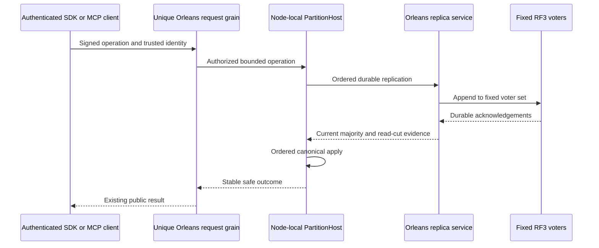

# ADR-036: Orleans foundation and client-driven qualification

Status: Accepted; implementation and delivered-source qualification remain in progress. Owner: KeyLoad lead. Original decision date: 2026-10-01; current contract: 2026-10-06. Related requirements: REQ-REP-001..006 in [ClusterReplication](../Features/ClusterReplication.md), REQ-ROUTE-001..010 in [ClusterRouting](../Features/ClusterRouting.md), and REQ-TEST-001..003 in [TestInfrastructure](../Features/TestInfrastructure.md). Related decisions: [ADR-007](ADR-007-replica-consensus-bootstrap.md), [ADR-082](ADR-082-native-cqrs-streams.md), [ADR-110](ADR-110-native-orleans-execution-primitives.md), [ADR-116](ADR-116-first-release-current-format.md).

The owner policy’s ADR-034 evidence reference remains in force for the distributed-directory and activation-repartitioner opt-ins; this foundation decision defines their two-call composition scope. ADR-034 remains the separate cluster-comparisons decision. ORLEANSEXP005 scope is governed by ADR-110.

## Decision

Orleans is KeyLoad's cluster, request-routing and activation-movement foundation. The server uses one fixed RF3 voter group for the production database. It does not add a second clustering stack or make one silo a required primary. Every public database operation enters its own distinct Orleans request grain and calls the relevant database capability. Writes route to the canonical atomic-partition actor; reads use an independent request-scoped read actor. Distributed grain directory and activation repartitioning are enabled; moving a grain activation never transfers node-local stores, file locks, journals or apply ownership.

`PartitionHost` owns the physical node's current canonical and replica stores, locks, replication log, snapshot/catch-up resources and ordered apply gate. Replica coordination uses Orleans-hosted per-silo services and signed, bounded native calls. A command is acknowledged only after its required durable majority barrier; each public read passes a current-term quorum barrier before reading persisted authorization or data. The signed request binds its unique request identity, current incarnation, authenticated persisted principal, operation kind, stable command identity where applicable, exact encoded payload and expiry. Apply remains ordered against canonical state. Recovery uses the current verified snapshot plus ordered tail and preserves stable command outcomes and replicated authorization. Current backup/restore and failure recovery retain their owning StorageRecovery and BackupRestore contracts; neither a benchmark run nor activation movement is a recovery proof.

Persisted database identity and authorization remain authoritative. The internal cluster principal is protected, is not a public API credential, and may apply only the permitted membership operations. Clients cannot supply trusted roles. Signed replica messages bind their purpose, method, sender/recipient, incarnation, freshness and nonce; strict bounds and replay admission preserve reserved capacity for consensus and membership control. Error translation preserves active caller cancellation, safe domain errors, read ownership loss and possibly-dispatched command uncertainty without retrying an operation or claiming storage damage. Bounded diagnostics use only closed stage/category/error values and an operation identifier; they never retain caller payload, principal identity, credentials or raw exception text.

Default-deny grain-call enforcement admits only declared application transitions. Native system-target calls do not enter application telemetry tracking as ordinary grain calls; any required filter repair belongs in the owning Graph dependency and must be published before KeyLoad consumes it, with no consumer-side bypass. The owner-authorized experimental opt-ins are narrowly scoped: ORLEANSEXP003 and ORLEANSEXP001 apply only to the distributed-directory and activation-repartitioner configuration calls; ORLEANSEXP005 applies only to the matching native journal provider, Durable Jobs integration, registration and tests under ADR-110. No global analyzer suppression or unrelated diagnostic suppression is allowed. Journal metadata remains RF3-authoritative and separate from creator-authorized business effects. The exact per-method use of StatelessWorker, OneWay, interleaving, Durable Jobs, Grain Services, local lifecycle services and telemetry remains governed by ADR-110 and its feature-level acceptance. The selected native journal-backed Durable Jobs path remains pending its owning implementation and runtime gates. Selection of a native primitive does not change ordered data effects or establish its runtime qualification. Orleans runtime Streams and persisted KeyLoad EventStreams remain distinct delivery contracts. Native CQRS result and long-operation streams remain a separate ADR-082 product workstream using the owning Communication APIs; they do not justify a parallel dispatcher or alter current SQL, .NET SDK, or official MCP interoperability contracts.

## Stable requirements and acceptance

The feature specifications own full tests and observable predicates. This ADR retains their stable traceability:

| Requirement family | Required outcomes |
|---|---|
| REQ-REP-001..006 / AC-REP-001..006 | Orleans carries replication and snapshot traffic; node-owned state is process durable before acknowledgement; fixed RF3 majority and current-term read barriers hold; snapshot plus tail recovery preserves a complete cut; persisted principals remain authoritative; bounded anti-replay admission protects control traffic under load. |
| REQ-ROUTE-001..010 / AC-ROUTE-001..010 | Unique request identity, directory/movement, multi-silo membership, declared call graph, partition/placement identity, bounded private diagnostics, correct RPC failure outcomes, client transport and cancellation semantics remain intact. |
| REQ-TEST-001..003 / AC-TEST-001..003 | TUnit/Microsoft.Testing.Platform remain the .NET test stack; Docker RF3 tests run under Aspire with real .NET and official MCP SDK clients; generated locks, local data, secrets and test artifacts remain out of source control and Docker context. |
| AC-AUTH-002, AC-AISQL-011, AC-AISQL-013, AC-CLIENT-010, AC-DIAG-001..004, AC-TEST-007 and AC-MP-012 | Persisted authorization through recovery, initial RPC read/write uncertainty, incoming-token cancellation, client-visible error/privacy, bounded diagnostics, retained original test reports and configured coverage/complexity evidence remain governed by their owning feature specs. |

Current native replication and request behavior have no compatibility fallback for prior KeyLoad formats or wire generations. Use the single current strict format and reject unsupported input as specified by ADR-116. External SQL/client protocol interoperability and official MCP interoperability remain separate public compatibility requirements; they are not prior-KeyLoad-format support.

## Lifecycle, rollout and verification

Startup orders node-local storage ownership, authenticated discovery, native membership and Orleans admission so that transport readiness alone never implies a committed read cut. Shutdown stops admission, drains accepted operations and background work, then releases physical stores and locks in their owning order. A failed or canceled native silo start is not reused in-process unless the native runtime contract proves complete rollback; failed-start recovery must observe the real owned process/container boundary. Any bounded wait retains and observes its original work, and a timeout is not reported as successful cleanup.

A source rollout uses one coherent current implementation across the fixed voter set and its current data directories. It preserves the current snapshot/backup format, node authority, authentication, ordered effects and current request contracts. Rollback uses the matching coherent source checkpoint and does not mix independent storage authorities.

Development builds and Aspire-owned tests may run locally under the required AppHost entry point; their results are development evidence. Qualification requires the exact delivered source on Linux GitHub Actions: the enabled full Release build, formatting and analyzers, TUnit normal/scalar suites, real process recovery, Docker/Aspire RF3, actual SDK/MCP operation and failure flows, plus configured coverage/complexity evidence. Keep run, job, SHA and original report/artifact identities. Source review or a historical run cannot close a current gate. Power-loss durability and endurance remain separate until their own fault evidence passes.

The owning feature specifications are the canonical implementation and test plans. The ADR remains Accepted until every mapped requirement, implementation and exact-source evidence gate is complete.

## TASK-REP-COHORT-TERMINAL-DISCRIMINATOR-001

REQ-REP-004 / AC-REP-004; REQ/AC-TEST-007; TASK-REP-COHORT-TERMINAL-DISCRIMINATOR-001; ADR036. This is bounded diagnostic evidence, never readiness, membership or authorization authority.

Original b392 17 final prerequisite observations pass transport, configured non-null leader, positive term/commit, materialized coverage and stop at false cohort. They cannot distinguish local protocol/current-reader/transport, fresh peer incompatibility, or insufficient fresh ready observations. Preserve the exact original ordered short circuit and majority predicate.

Introduce native-local readonly ReplicaCohortAdmissionStatus with one closed enum and six integer counts (required majority, evaluated remote, fresh remote, missing remote, expired remote, ready including local). Codes: NotObserved, GrainFactoryUnavailable, HostUnavailable, DiscoveryStopping, LocalProtocolMismatch, LocalReaderMismatch, LocalTransportUnavailable, PeerProtocolMismatch, PeerReaderMismatch, InsufficientFreshReady, Compatible. No identities, addresses, strings, payload, roles, credentials, exceptions or timestamps. Missing and expired derive from the exact existing cache lookup/TTL/removal, not another read.

Old public bool property retains its signature and result and delegates the same evaluation, discarding a value-type status. Add only native diagnostic method on existing discovery client, no inter-grain/publicHTTP/MCP/persistence formats, serializer aliases/Ids or trusted inputs. Discovery stopping and node unavailable are closed codes. Server captures exact status in existing prerequisite observation at the same gate; final existing generated Warning event1016 adds code/counts. No extra event, log loop, discovery request, timer, deadline, allocation of observer state or option. Default status values are native structs; only existing startup observation instance remains.

Original cache checks, native auth/signature/current contract/current incarnation, fixed voter mapping, placement, majority, startup task and shutdown stay unchanged. Both valid and invalid current-layout admission remain strict; separate sealed042 directory repair is not Linux-cause proof.

Map original89 cases and existing complete public/cohort negative→healthy/cold flows to fresh Linux RF3 evidence. Root runs original six owners and all deadlines and authenticates new reason plus complete operation/cleanup outcomes. Unit getter assertions are not qualification and no synthetic provider/discovery test is introduced. Original b392 remains failure. Join docs first, then existing guarded sources and exact new diagnostic files. Rollback only observation additions, no stored-format migration.

### TASK-NATIVE-COHORT-WHOLE-CONTROLS-001 — genuine signed admission/refusal controls

REQ/AC-REP-001 and REQ/AC-REP-004 and REQ/AC-TEST-007 map to RequestCqrsCohortObservationWholeFlowTests: SignedReadinessRefusalPreservesOriginalIdentityThenFreshMajorityAdmits, SignedFirstInvalidPeerOverridesReadyMajorityThenExactRecordsRepairAdmission, and OriginalSignedCacheNaturallyExpiresThenUnavailableRefusalAndFreshHealthyAdmission. The existing three-silo Orleans fixture and original three Kestrel peers supply actual nonce-bound native bytes signed by ReplicaEnvelopeAuthenticator. Production discovery verification/cache/admission evaluates every operation; tests never populate its cache.

Preserve the same configured voter/cluster/incarnation/silo identities, 1.5-second lower-election TTL, original RPC limits and 20-second whole-case deadline. Compare all closed branch counts with absence of observation-triggered HTTP work, retain actual OwnershipLost plus exact original NoLeader/IncompatibleCohort/InvalidDiscovery safe details, then restore exact original signed records and require fresh native address resolution and compatible admission. Natural expiry removes the original cache entries before fresh healthy resolution. Supporting TestCluster/signed HTTP flows are distinct from mandatory exact-source Docker RF3 startup and KL042/KL079 SDK/official MCP/Linux gates; no source/test declaration is a PASS. No schema/alias/field-ID/authority/provider change.

### TASK-KL079-COLD-NATIVE-COHORT-ACQUISITION-001

REQ/AC-FEED-005, REQ/AC-REP-004 and REQ/AC-TEST-007: catalog prerequisite must actively obtain missing/expired genuine signed native cohort observations rather than waiting for unrelated outbound replica work. Catalog startup currently precedes RuntimeJournalStartup acquisition; incoming replica RPC does not fill the private discovery cache. A current cold follower may therefore materialize leader heartbeats while its own cache is empty. This is a source-proven liveness counterexample; original b392 seventeen RoleFollower/cohortFalse observations do not identify the historical branch and remain failed/unknown.

At the same original cohort short circuit, after all existing native consensus guards, await the existing owned signed EnsureCompatibleCohortAsync with the original readiness token/RPC deadline/current-contract/MAC/fixed-voter/TTL checks. Only its exact existing OwnershipLost/NoLeader maps to an insufficient-ready value for the unchanged heartbeat poll; all other original errors and cancellation propagate. After actual acquisition/work settlement, evaluate the same closed predicate/status, which remains mandatory before admin auth/catalog bootstrap/admission. No cache injection, extra loop/retry, new provider/endpoint/option, relaxed majority, changed clock/deadline or persisted/public schema.

RequestCqrsColdStartupAcquisitionTests.ColdFollowerAcquiresItsOwnSignedCurrentCohortWithoutUnrelatedOutboundWork and OriginalUnavailableAndIncompatibleRefusalsAndCallerCancellationPrecedeHealthyAdmission execute genuine existing3-silo/Kestrel nonce/native-MAC operations with complete original identity/address and refusal→healthy assertions, zero-request cancellation, all counts and joined client/endpoint/signer cleanup. Supporting native tests do not replace original exact-source Linux KL079 full SDK/official MCP/Q1 snapshot/tail/privacy/reconnect/revocation/cold operation or KL042 whole restore gates. Selectors/old b392 TRX identities are retained separately; fresh current native UID/image/runtime outcomes are required. Join discriminator13 → signed-cohort5 → this guarded successor; no source declaration is qualification.
