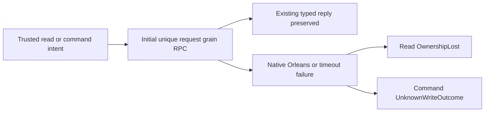
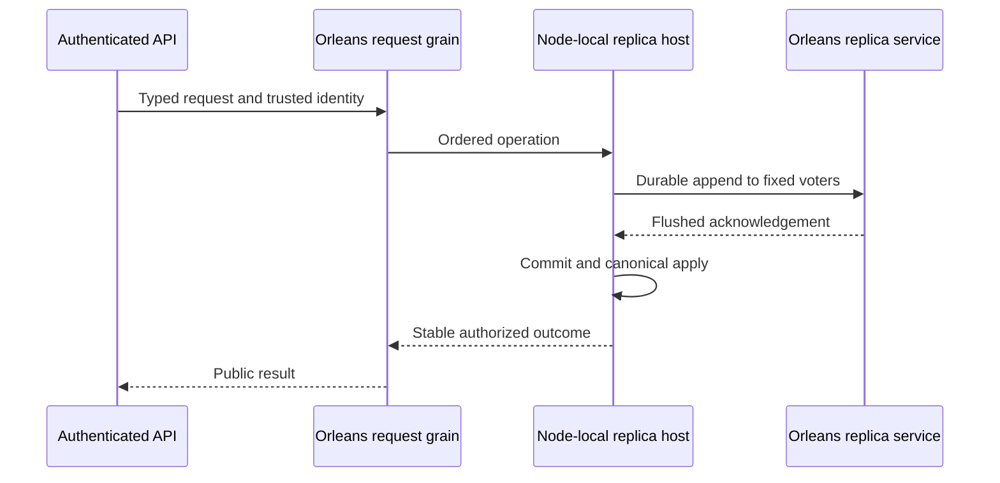

# ADR-036: Orleans foundation and client-driven qualification

Status: Accepted, implementation in progress. Date: 2026-10-01. Owner: KeyLoad lead. Authority: direct owner instructions for Orleans-only clustering, request grains, distributed directory/migration, TUnit, Docker/Aspire and SDK/MCP clients.

Identity correction: this uncommitted document originally collided with the comparisons decision ADR-034. On 2026-10-02 it became ADR-036; the full decision and implementation obligations are preserved. Existing policy links to ADR-034 comparisons remain unchanged. See the [decision index](README.md).

Preserved-policy reference conflict: root `AGENTS.md` still names “ADR-034 evidence” in its experimental Orleans opt-in rule. That historical foundation reference resolves to this ADR-036 through this identity correction; the comparisons decision [ADR-034](ADR-034-cluster-comparisons.md) cross-links it. The mandatory rule, its two-call scope, diagnostics and priority remain unchanged. AGENTS.md has not been rewritten to conceal the stale number. Any future policy-text correction must preserve every obligation and follow explicit rule-specific owner direction.

Related requirements: REQ-REP-001 through 005, REQ-ROUTE-001 through 003, REQ-TEST-001 through 003; their same-numbered ACs are defined in the linked feature specs.

Accepted TASK-AISQL-011 initial-RPC failure classification (2026-10-02) maps
REQ/AC-ROUTE-009 and AC-AISQL-011 to baseline37065200835/b21c9ee. Initial native
Orleans placement/directory failures can occur outside the existing safe reply
factory and reach generic HTTP/MCP RecoveryRequired. The baseline's exact class
and phase were not retained, so this is not a proven attribution. Classify
only native OrleansException/TimeoutException around the initial RPC await:
server-derived reads -> OwnershipLost; possibly dispatched commands ->
UnknownWriteOutcome. Preserve KeyLoadException/domain RecoveryRequired, caller
cancellation, signed envelopes, stable IDs, one request actor and fixed safe
details. No retry or diagnostic weakening. Root owns the two trusted intent joins
in CanonicalOperationGateway and DatabaseCredentialResolver. One bounded worker
owns OrleansNode.cs, a new Server/Features/ClusterRouting/OrleansRpcFailure.cs and
UnitTests/Features/ClusterRouting/OrleansRpcFailureTests.cs. Ordered stages:
first author actual-native-exception classification/negative/privacy cases;
implement narrow helper and RPC catch; root joins both callers and reviews;
GitHub full build/format/units/scalar/recovery and stopped-replica RF3/replay prove
the exact SHA. No persisted format or wire enum migration; rollback removes this
classification and the internal intent parameter together. Qualification pending.

Failure-only diagnostics use LoggerMessage with request GUID, a closed native-RPC
category (Orleans or timeout), and mapped ErrorCode. Never retain/log the exception
object, exception text, signed envelope or identity. Success has no new diagnostic
allocation. The new helper owns these constants/categories; existing protocol
constants and global diagnostics policy remain unchanged.

TASK-ROUTE-DIAGNOSTICS is an accepted internal observability refinement for

Accepted TASK-DIAG-001..004 (REQ/AC-CLIENT-010, REQ/AC-ROUTE-008,
AC-DIAG-001..004) supplements initial-RPC classification with closed HTTP
dispatch phase/category, nullable operation GUID and UTC failure timestamp.
Root owns credential/gateway markers and all IntegrationTests/CI/docs joins;
one bounded worker owns only ServerErrorMiddleware, new ClientApi
RequestFailureDiagnostic-prefixed helpers and new matching UnitTests. Tests
precede implementation; actual middleware/provider checks preserve public
domain/generic/cancellation responses and exclude raw secrets/exception text.
Reserved per-node capture stays within80lines/8192bytes; kill receipts record
action times separately. No retry, ACK, format, topology or public API change.
Rollback removes this source-only evidence stage together. Full exact-SHA
GitHub unit/recovery/RF3 SDK+MCP is the join; cause and qualification stay open.

REQ/AC-ROUTE-008 and AC-ROUTE-001/003. Stage/category/error enums and a GUID are
the complete log contract; never pass raw exceptions, JSON, tokens, principal IDs
or arbitrary runtime strings. Success uses only a stack-local stage enum. Existing
KeyLoadException error code/detail is retained; private stage metadata is added
only on failures. Root owns RequestGrain, CommandPartitionGrain,
DatabaseReadGrain, GrainCommandExecutor, GrainRequestAuthority, GrainPayloadJson and GrainReplyFactory
joins. A bounded worker owns only new ClusterRouting diagnostic helper/enum and
UnitTests files. Ordered stages: author actual-provider privacy/reply regressions;
add helpers; lead joins closed stage updates and error mapping; enabled build and
format; full GitHub UnitTests/RF3 with exact SHA and fault log artifacts. No database,
public API or persisted-format migration; rollback removes only this metadata/log
path while retaining the original safe replies. The stage log helps locate a
rejection and does not by itself qualify a repaired runtime failure.

TASK-RUNTIME-ARTIFACTS-W is an accepted retention-path refinement for
REQ/AC-TEST-001/002/005 and AC-MP-012. The native TUnit reports in run37005805424
were written to root TestResults and omitted by scoped analyzer/RF3 globs. Lead
adds the actual root report path alongside every existing path. Comparison reports
use a separate artifact, preserving the measured archive schema and all CI gates.
Ordered verification is source review, static governance, then downloaded full
HTML reports and SARIF bound to the new exact run/job/SHA. This infrastructure
path has manual actual-CI artifact evidence; no synthetic test or passing-runtime
claim substitutes for it. Rollback removes only the added report globs/step.

TASK-RUNTIME-RESOURCE-W preserves REQ/AC-ROUTE-001 by giving the existing
RequestIdReceiptTests scenario a unique tenant. Resource catalog identity omits
partition key; run37005805424 proved a legitimate incompatible orders definition
collision with an earlier RF3 leader-loss fixture. Worker owns only that fixture
scope construction. Keep every SDK retry/parallel actor-ID assertion and product
migration rejection. Source review/build/format precede full exact-SHA RF3;
no production or persisted-format change, rollback is test-scope only.

Accepted TASK-RUNTIME-RECEIPTS-W maps REQ/AC-TEST-007 and AC-MP-012 to the actual
run37015193756. Lead first reviews unchanged bounded RF3 redaction, source
resource ownership and complete native-runner assertions. Then retain up to32
sequential failure files in addition to the last-failure view, retain comparison
reports after app stop and before data deletion, and give the existing matrix
recovery step a successful-build/noncancelled condition. No failed step is ignored,
native exit replaced, capture cap widened or extra local qualification executed.
The exact next GitHub run/job/SHA and downloaded first-failure/report/recovery
receipts are the join and explicit environmental verification exception. Source
rollback removes only receipt retention/step scheduling; production data and
contracts need no migration. Source helpers stay in their canonical test slices;
root alone owns shared ci.yml, docs and integration.

Host integration contract: `Server/Features/StorageRecovery/PartitionHost` owns
two physically separate ZoneTree stores, canonical `database` and replica
`replica`, with one immutable voter configuration and incarnation. It constructs
the durable log, checkpoint transfer, ordered materializer and consensus facade,
bootstraps the persisted administrator only before exposure, and disposes in the
reverse dependency order after HTTP/admission and Orleans membership stop. The
HTTP listener starts before Orleans for authenticated runtime discovery. The
membership table awaits local transport attachment, then retries quorum acquisition
under the silo startup cancellation token; transport readiness alone is not a
read barrier. The admission worker starts before silo membership needs its control
writes. No IMembershipTable factory eagerly resolves its own replica client.

## Decision and implementation contract

Cluster-control authorization uses a protected database-persisted principal,
`keyload-internal-cluster`, with no public API credential. Public administrators
remain independently revocable. Public principal/API-key configuration cannot
modify or issue a credential for that identity, and only that identity may apply
Membership; it may not apply data or public security operations. TASK-ROUTE-AUTH
supplies real-store regressions under AC-AUTH-002/003; the lead integrates engine
guards and fresh-node bootstrap. Membership cannot depend on a public root key.

1. Establish historical full-suite baseline from main CI; preserve prior durable-store and client semantics. Read-only architecture review checks Orleans Grain Service bootstrap before delegated implementation.
2. Replace external DotNext cluster packages/log/state machine with a node-owned, fixed-voter replication host. Votes, appends, barriers, forwarding and bounded snapshot chunks use Orleans per-silo Grain Services. Signed silo-address discovery only discovers the current runtime address; it cannot vote, append or commit.
3. Store term/vote/log/commit metadata using the existing checksummed atomic storage adapter, in an independently owned replica directory. The host, not migrating grain activations, owns file locks, durable acknowledgement and ordered apply. Majority acknowledgement and current-term read barriers remain mandatory.
4. Use the replica service during membership bootstrap, enable Orleans distributed directory and activation repartitioning, and route each public database request through its own grain. Protect internal envelopes and preserve database authorization before exposing outcomes.

The owner's explicit distributed-directory and activation-repartitioning instruction
opts into Orleans 10.3.1's two experimental APIs. Native compiler consent is confined
to the two composition calls for ORLEANSEXP003 and ORLEANSEXP001 respectively; no
global NoWarn or analyzer-severity change is permitted. This is the feature-specific
consent required by [the .NET experimental API contract](https://learn.microsoft.com/en-us/dotnet/fundamentals/syslib-diagnostics/experimental-overview)
and [the Orleans directory API](https://learn.microsoft.com/en-us/dotnet/api/orleans.hosting.corehostingextensions.adddistributedgraindirectory?view=orleans-10.0).
5. Migrate all .NET tests to TUnit without weakening assertions. Rebuild the RF3 fixture around Docker/Aspire and real .NET and official MCP SDK callers. Replace obsolete DotNext-specific tests with equivalent current-host acknowledgement, snapshot and real-process fault scenarios.
6. Remove obsolete packages, code, configuration and current-architecture claims in the same coherent change. Old implementation remains recoverable from Git; no runtime compatibility fallback is retained. Historical evidence remains labelled historical.
7. Join all disjoint worker diffs, build/analyze/format and static-check the combined source. Push a reviewable validation ref and run all required GitHub Actions suites. Publish stable main only after the required gates pass. Record exact SHA/run/jobs/artifacts; power-loss/endurance remain unqualified.

Ownership: lead alone owns central config, shared contracts, docs and final integration. TASK-TEST-MIGRATE owns only existing test sources; TASK-REP-LOG owns only the new ClusterReplication durable-log/snapshot slice after contracts are fixed; transport research is read-only. Task graph, permissions, start/join conditions and test mapping are in the [execution plan](../implementation/orleans-foundation.plan.md).

TASK-ROUTE-REQUEST freezes generated request/reply contracts before delegated writes.
Every public operation uses a unique, non-reentrant GUID request actor; it invokes a
canonical atomic-partition command actor or an independent GUID read actor. Signed
exact base64url UTF8 avoids nested JSON escaping and binds incarnation, persisted
principal, operation kind, stable command ID and expiry. Each read requires its own
quorum cut and persisted authorization. Node administration is a borrowed local
interface guarded by persisted administrator authority. Bounded JSON replies carry
typed safe errors rather than exception objects. Public HTTP remains an adapter.
One physical RF3 group does not establish automatic sharding/distributed queries.

TASK-REP-LIFECYCLE serializes transport attachment against the first shutdown and
caches a single drain/dispose task. An already closed host cannot attach transport
or publish readiness. Every follower/snapshot/checkpoint and accepted inbound or
foreground operation drains before physical stores are released, including when
maintenance faults; repeated DI/owner disposal observes the same terminal task.
Snapshot recovery precedes final protected-principal catalog validation. A verified
pending snapshot cannot replace the catalog after its only authorization check.
Real-store shutdown and interrupted-image regressions map to AC-REP-004/AUTH-002.

TASK-QA-CONTRACTDOC extracts existing shared contracts into canonical feature files
only to keep documented source within maintainability limits. Namespaces, original
constructor signatures, enum values and public serialized property/discriminator
names remain unchanged. Existing source-layout debt follows ADR-032; this extraction
does not redefine a public API or permit analyzer suppression.

After the read-only lifecycle review, TASK-REP-ORLEANS owns the disjoint new Orleans ClusterReplication service/transport slice against the frozen `IReplicaEndpoint` and `IReplicaTransport` boundaries. Lead owns consensus, node materialization and host integration. The wire envelope contains generated-serializer `byte[]` payloads, authenticated with incarnation, voter, method, recipient runtime address, timestamp and nonce; command payload bytes remain exact across the dedicated replica codec. The service attaches its lazily resolved client in `GrainService.Init` at RuntimeGrainServices, without quorum waiting or an IMembershipTable dependency cycle. Consensus remains available through membership shutdown and drains at RuntimeStorageServices.

Snapshot ingress has a separate node-owned serialized transfer gate. An authenticated current leader may abandon an incomplete conflicting upload with `ResetIncoming`; a complete verified installation is recovered before any abandonment. Ordinary `Begin` remains fenced against a different pending transfer. This prevents an orphaned old-leader upload from permanently blocking catch-up after leadership changes without discarding a materialized or verified cut.

REQ/AC-REP-006 adds bounded configurable anti-replay pools. Critical consensus/control calls have reserved capacity separate from application Forward, read barriers and data Appends. Payload classification occurs only after MAC/scope verification and uses the existing database control-kind policy. Nonces stay unique across methods until their full validity expires. Data throttling returns ResourceExhausted and triggers a bounded empty leader heartbeat; it cannot consume vote/noop/membership reserve. Pure cryptographic regressions complement, and do not replace, real RF3 saturation/failover tests.

Rollout: development-version cluster migration uses new independent data directories for qualification. Existing snapshot/backup canonical format is preserved; old DotNext protocol directories are rejected with an explicit migration error rather than interpreted. Destructive production migration/restore is not part of this implementation. Rollback is to the prior Git commit and its matching isolated development data, never mixed consensus metadata.

Testing methodology: TUnit validates exact durable metadata and failure boundaries against real storage; CrashHost is killed at acknowledgement/install boundaries; Docker/Aspire RF3 client tests cover happy path, minority denial, leader loss, stable-ID retry, authorization, snapshot catch-up and request routing migration. Changed critical-flow coverage must be measured in CI before claiming policy thresholds. All required source, docs, tests, quality gates and CI evidence must exist before this ADR becomes Implemented.

AppHost builds the repository Dockerfile and runs node1/node2/node3 as actual
container resources with separate `/data` mounts, internal HTTP8080/silo11111, and
stable DNS voter origins. External clients use Aspire-allocated endpoints; no
container namespace PID is interpreted as a host PID. TASK-TEST-DOCKER preserves
existing scenarios using actual managed-container kill/restart, bounded logs and
JSON topology/fault receipts. Required Docker RF3 qualification is a dedicated
Linux CI job; unit and process recovery remain mandatory on Linux/macOS/Windows.

Native failed-start boundary: exact Orleans10.3.1 Silo source has no automatic
lifecycle rollback when membership startup fails or is cancelled. Provider disposal
does not prove the partially opened listener was unbound. KeyLoad withdraws runtime
discovery and drains its borrowed replica endpoint before disposing dependencies,
then fails and exits the one-start server process; process termination releases the
remaining native handles. Do not invoke internal lifecycle stages or reuse that
silo in-process. Real no-quorum startup cancellation, bounded process exit and
Docker restart on the same directory/port are mandatory failure evidence. No
same-process native-listener recovery is claimed from a source review or build.

Graph bootstrap contract (REQ/AC-ROUTE-006): preserve default-deny application
enforcement, client -> IRequestGrain only, and declare the two exact ExecuteAsync
edges from IRequestGrain to ICommandPartitionGrain and IDatabaseReadGrain. The
current Graph package tracks custom Grain Services by assembly name and then
invokes normal telemetry grains before membership is Active. Fix that defect in
the owning Orleans.Graph repository: default !TrackOrleansCalls excludes the
public native context.TargetId.IsSystemTarget() identity, preserving ordinary
application enforcement and the explicit tracking opt-in. Do not permit all
application calls, pretend a system target is IGrain, or duplicate its filters in
KeyLoad. Scoped upstream regression/checks/canonical patch/release/feed receipt
must join before the consumer package pin and real enforced-graph RF3 proof.

Discovery replacement contract (REQ/AC-REP-001/005/006): remove legacy HTTP Raft
headers, generic body streaming/spooling and IHttpMessageHandlerFactory ownership.
The only HTTP peer request is a bodyless GET of /internal/silo, without query or
content. PeerSecurity takes ReadOnlyMemory<byte> secret, TimeProvider clock,
optional connect timeout and a bounded replay capacity; it copies its secret once.
Sign(HttpRequestMessage) and CreateHandler() share one signature algorithm.
ValidateAsync(HttpRequest,CancellationToken) rejects any body, including an
unframed byte, before nonce admission. Versioned purpose/method/authority/path/
timestamp/nonce are authenticated. Fixed capacity and inclusive expiry prevent
unbounded replay state or premature removal of future-dated valid nonces.
TASK-REP-DISCOVERY owns new replication helpers and security regression sources;
the lead alone updates the two native-discovery composition callers. Existing
native envelope bounds and real transfer recovery replace legacy body tests.
Obsolete provider tests may be removed only with an assertion/scenario migration
matrix and equivalent current durable-log/snapshot tests, filling any found gap.

TASK-GRAPH-OWNING accepted handoff: the clean sibling Orleans.Graph checkout is
at fcc4cb7cd8a1f5a30bfd067b9a4d1d819424a0df, current canonical version10.0.5.
Its scoped next patch is10.0.6, subject to a fresh feed-conflict check. The worker
owns only RequestContextHelper's native-identity condition/import, genuine native
test-cluster fixtures/regressions, focused release notes and canonical version.
An early Init RPC records the real bounded outcome instead of throwing out of
silo startup; the test requires target execution while Starting and no application
graph history. Test default silo-side and ordinary-grain-origin service calls,
normal allowed/denied application enforcement, and explicit tracking in an isolated
running fixture by temporarily setting the actual singleton TrackOrleansCalls=true
and restoring it in finally. No transport/filter doubles or global AllowAll fixture.
Release guard changes are limited to format verification before tests and removing
continue-on-error from publication; these enforce existing owning/delivery rules.
Enable the existing inactive CodeQL workflow for fresh checks. Branch CI, owning
format/build/tests and required security/coverage evidence precede stable delivery;
then inspect every canonical publication step and verify the intended feed's
actual package before consumer update. Preserve any later unrelated changes and
never bypass protections. Publication failure remains a dependency blocker.

The early-start witness uses the public ISiloLifecycle.HighestCompletedStage,
recorded by the actual service target during the awaited Init RPC: completed stage
is at least RuntimeInitialize and strictly before RuntimeGrainServices completion.
Native10.3.1 sets its Starting state at RuntimeInitialize and becomes Active/Running
later. SystemStatus is internal, so do not read it through reflection or claim a
public SystemStatus assertion. The public-stage witness proves real execution
before Active without adding a framework stub or unsupported inspection API.

Legacy recovery test join preserves source and installed canonical Position before
tail apply, stable generation/node identity, old-versus-new applied cuts, image/
intent cleanup, and second reopen. Add a genuine foreign-incarnation Begin case:
the incoming descriptor fails Validation before transfer/files/canonical effects;
a mismatched physical canonical/log authority fails TokenInvalidated. Invalid
private unacknowledged incoming metadata is reclaimed under the new format while
the existing verified canonical cut remains unchanged. Published image corruption
or absence still fails closed. This replaces old DotNext-only incoming/append
interfaces, not their durable-data guarantees. Test replay expiry at numeric
boundaries through the actual internal replay algorithm, plus genuine signed
request cases; a test friend assembly does not expose a public test API or clock.

TASK-REP-DATA-BOUNDS adds genuine native-authenticator regressions for Append and
Forward exceeding MaximumPayloadBytes (MaxAppendBytes plus bounded protocol
metadata). A correctly MAC-signed oversized envelope must fail ResourceExhausted
before nonce admission; a valid payload using the same nonce must still admit into
the configured single-entry application pool, and a signed failure reply verifies
against its originating request. Outbound SignRequest rejects the same bound.
These complement decoded-control limits, append JSON/log bounds and RF3 sockets;
they replace the legacy oversized generic-body assertion without a fake handler.

TASK-REP-SCHEMA joins the accepted ADR-041 contract migration in the undeployed
native protocol. ReplicaConfiguration.VoterIds and AppendRequest.Entries become
ImmutableArray; snapshot chunks and generated peer payload/signature/secret
properties become ReadOnlyMemory<byte>. Durable log Read returns its final immutable
batch, Append takes IReadOnlyList<ReplicaEntry>, and its point read is ReadEntry.
The mutable encoded state key is internal storage infrastructure. Generated aliases,
field IDs, enum values, signature bytes, public/durable JSON array/base64/tombstone
forms and persisted versions stay unchanged. This changes CLR and native field
types before first qualification; rebuild all binaries/voters together, never run
mixed schema binaries or claim compatibility with an already deployed native wire.
Root alone owns contracts and typed caller integration; workers may add meaningful
XML/style corrections without changing signatures or algorithms. Ordered log,
ownership, checksums, memory admission, real MAC and recovery tests remain required.

TASK-QA-REPLICA documents and formats the new Replication slice after this schema
handoff. TASK-QA-ORLEANS documents/formats the new Orleans routing and replica
slices, including exact constructor parameters, public method/member contracts,
named machine keys, braces and typed catches. Their disjoint source ownership
excludes shared schema/config/docs and root-owned HTTP adapters. Routine required
argument guards may reject null before effects; algorithm, scope, scheduler,
serialization, file/lock ownership and wire identities may not change. Root owns
strict integrated build/SARIF and all resulting non-routine design decisions.

TASK-REP-SCHEMA-TESTS delegates only the existing native ClusterReplication test
consumers after the lead freezes the signatures above. Use Payload.Span for actual
codec/text reads, explicit owned byte arrays at read-only snapshot input boundaries,
immutable append batches, ReadEntry for durable-log lookups and ReadOwnedValue for
owned storage lookups. Keep a fixture-owned credential array for zeroing on dispose;
do not cast a public read-only memory view back to mutable memory. Preserve every
assertion, exact signed bytes, failure priority, nonce retry and real-process path.
No production/configuration changes, fake dependencies or local test execution.

TASK-REP-STRICT joins the actual ten strict-build diagnostics without suppression.
The six mechanical fixes preserve shutdown authority, snapshot barriers and
encoded keys: mark admission Task.Run as CancellationToken.None because its owned
lifetime drives draining; hold one private owned applied-key buffer; rename the
shadowed snapshot stream; simplify the existing null guard; discard the unused
first timestamp output; remove the unused import. ReplicaMaintenance uses one
cached LoggerMessage delegate with the existing bounded failure message and no
exception-object serialization; the actual poison/readiness state stays unchanged.

TASK-REP-JITTER extracts only election timeout selection into the internal
ReplicaElectionTimeout.Select(ReplicaConfiguration) helper. Draw system secure
64-bit bytes, mask to RoundUpToPowerOf2(width)-1 and reject samples at or above
width. Width is positive after existing configuration validation, and at most
long.MaxValue because both timing endpoints are positive. Preserve lower-inclusive,
upper-exclusive tick semantics, no integer-millisecond narrowing, no extra package
or injectable RNG. Recovery tests use the real RNG for one-tick, power-of-two edge
and maximum positive TimeSpan ranges before the production helper joins.

TASK-REP-DISPOSE uses the independently reviewed ownership order: close activity,
cancel, observe all accepted calls and maintenance, drain all detached follower,
snapshot and checkpoint work, then dispose leader/snapshot/follower gates exactly
once. Consensus keeps its cached stop result and never disposes a gate at quorum
early return or Grain Service Stop. Materializer gains one cached terminal dispose
task; a cohesive internal shutdown helper observes cancellation and the real worker
to completion, wakes waiters, drains its apply gate and releases both gates and the
lifetime even if the worker fails. Preserve the failure for every disposal caller.
Unexpected apply-loop exceptions are recorded under the existing signal lock before
the final wakeup and then rethrown, so the worker's fault remains observable without
leaving a waiter on an unfulfilled new signal. Existing expected-error behavior and
safe public RecoveryRequired errors are retained. Real ZoneTree JournalFlushed
observers provide deterministic pause/fault boundaries; no fabricated worker is
substituted. The helper also keeps cleanup within the current type-size limit.
The lead reviews the helper and physical-host integration. No store release before
terminal drain, artificial worker/log/store doubles or local test execution. These
contracts do not promise a deadline for uncancellable filesystem or native-host
disposal; the distinct pre-Active bounded-process review remains open.
The existing per-stage fault observation moves intact into ReplicaShutdownStage;
Consensus still awaits every same stage in the same order and accumulates the same
failures. This keeps the synchronization ownership additions within the actual
200-line type limit without dividing one type into partial declarations.
Consensus additionally caches the complete protocol-disposal task, not only the
stop/drain task. Concurrent disposal callers await the same terminal result until
leader, snapshot, follower and lifetime cleanup finishes. The cohesive
ReplicaProtocolDisposal helper releases those resources after terminal drain,
including a faulted drain, preserving the original shutdown failure for callers.
Actual ZoneTree Commit converts its JournalFlushed observer exception into
UnknownWriteOutcome, so that fixture proves expected-error waiter fencing, not an
unexpected apply-worker fault. A separate complementary pure shutdown-helper test
uses a genuine Task running an actual missing-file open with real CTS, channel and
semaphores. It validates preservation of that filesystem failure and terminal gate
cleanup without substituting a database, durable log, replica transport or worker
inside a running node. The frozen internal helper signature is
ReplicaMaterializerShutdown.DisposeAsync(CancellationTokenSource,
ChannelWriter<bool>, Task, SemaphoreSlim, SemaphoreSlim, Action). Its callbacks are
terminal signal observations only. Active node fault/shutdown remains a separate
Docker qualification requirement; the pure helper case cannot satisfy it alone.

TASK-QA-ORLEANS-STRICT joins the actual Orleans strict-build diagnostics. The
delegated mechanical scope removes only compiler-identified unused imports, adds
pre-effect constructor null guards and uses Length == 0 for the existing decoded
empty string check. Root alone handles native scheduling and error contracts:
Grain Service continuations stay on their captured Orleans context; per-operation
cancellation reaches ReadEventSource; graph labels freeze into the existing owned
array once at its method boundary. Native interface metadata uses the actual
Orleans.CodeGeneration.VersionAttribute with unchanged aliases/version.

The request-envelope CLR property becomes EncodedPayload, accurately describing
base64url bytes rather than a URI. JsonPropertyName fixes its wire name to the
existing payloadBase64Url, retaining field Id 7, field order, exact signed JSON and
payload encoding. All native caller/test references join; an independent fixed
wire-shape regression precedes the change. No suppressed URI diagnostic or mixed
schema rollout.

Request/read/command and replica adapters convert only enumerated recoverable
boundary failures: KeyLoadException, OperationCanceledException, JsonException,
ArgumentException, IOException, UnauthorizedAccessException, TimeoutException,
InvalidOperationException, NotSupportedException, OverflowException and the actual
Orleans.Runtime.OrleansException family. Unknown/fatal exception types propagate
to the native runtime/outer safe HTTP boundary instead of being silently consumed.
The same safe codes/details and command unknown-outcome semantics are retained.
One shared internal classifier avoids diverging catch filters; cached logging
delegates emit only bounded static messages and the defined method enum, never the
exception object or exception text. Existing signed failure and SDK denial/retry
cases stay mandatory; this is not permission to return raw framework exceptions
or weaken the HTTP error boundary.

TASK-REP-DISPOSE-REVIEW independently reviews the joined cached disposal helpers,
gate ownership and physical-host ordering without write permission. The review
must check repeated/concurrent callers, all fault paths and terminal publication;
its source findings do not qualify actual running-node shutdown.

TASK-QA-SERVER-STRICT corrects the actual integrated server diagnostics without
changing public operation shapes. Four handlers returning Task<IResult> must bind
as strongly typed route handlers rather than RequestDelegate, so ASP.NET writes
their results. Add the existing Query contract namespace, retain the original
OrdinalIgnoreCase path-segment comparison explicitly, and remove only exact
compiler-proven unused imports. Root owns server lifecycle/error handling and
visibility changes; all real SDK responses and denial flows remain required in CI.

Server strict lifecycle join: application-only composition types become internal;
only KeyLoad.UnitTests receives a friend assembly for genuine physical-host and
bounded helper regressions. This does not change the REST/SDK wire or expose a
runtime control endpoint. Instantiate the two middleware classes explicitly once
when composing the actual pipeline, preserving error-before-identity ordering.
Separate typed JSON and HTTP-body error catches retain safe validation/capacity
responses; unexpected errors still reach the outer bounded safe-error boundary.

OrleansNode registers one startup task under its lifecycle monitor and caches one
stop task. Stop waits for actual startup completion, including failure, before
touching the native host. This replaces the owned asynchronous registration gate
with monitor-protected task ownership, so there is no semaphore to dispose while
another lifecycle caller waits or releases it. Caller cancellation bounds only
that caller's wait; no uncancellable native-disposal deadline is claimed. The
existing one-start rule, early discovery publication, routing-after-start, discovery
withdrawal, replica drain and host disposal order remain unchanged.

TASK-SERVER-FAILURE-OBSERVER freezes an internal ServerFailureObserver.ObserveAsync
(Func<Task>, List<Exception>) helper. Invoke each real stage inside an async task,
observe it to completion without throwing, then retain every actual fault or its
task cancellation. This captures synchronous stage throws without shifting native
work to Task.Run and replaces broad consumed exception catches. ServerApplication
retains and cleans up acquired owners after startup fails; its expected application
stop cancellation is ignored only under the existing stop-token predicate. Pure
helper regressions use actual filesystem operations and cancellation; they cannot
qualify running-node failure/shutdown, which remains an RF3 CI gate.

The registration task is published before native startup can execute: a private
asynchronous-continuation signal releases StartCore only after the lifecycle
monitor has stored the startup task. Even a reentrant native callback cannot
observe an unregistered start or race it with stop.
Stop uses the same prepublication signal, including when startup is already
terminal, so a synchronous native callback cannot register a second shutdown.
The application explicitly awaits that complete cached stop with no caller token
before HTTP/provider/partition release; it never depends on DI disposal order to
finish a native owner after an earlier caller timeout or outer-provider failure.

Independent physical-owner review found that nested finally cleanup preserved
release ordering but could mask an earlier native failure. The same observer gains
a synchronous Action overload (invoked inline through its actual async wrapper)
and ThrowIfAny(IReadOnlyList<Exception>): retain the sole original error with
ExceptionDispatchInfo, or throw AggregateException containing every collected
failure. PartitionHost constructor rollback and ordered disposal, plus
PartitionStores rollback and close, use these phases in their existing order.
No owned store is released before its producers terminate and no cleanup failure
replaces a previously recorded failure. Real filesystem helper regressions cover
success, synchronous faults and single/multiple terminal emission; actual node
cleanup faults remain a separate RF3 qualification requirement.
Physical log/store close phases directly await the terminal apply/log stage before
their actual Dispose calls. PartitionStores closes both real native stores before
its actual FileStream.DisposeAsync releases the directory lock. The preceding
stage has already been observed, so a fault cannot skip the next close or disappear
from the accumulated failures. These explicit ownership barriers also give the
strict disposal analyzer a direct resource-close call chain; no rule is suppressed
or weakened. See the [native CA2213 ownership rule](https://learn.microsoft.com/en-us/dotnet/fundamentals/code-analysis/quality-rules/ca2213).

TASK-TEST-DOCKER-DISCOVERY joins the fixture's obsolete diagnostic caller to the
only permitted signed GET /internal/silo using TimeProvider.System. Read response
headers first, reject an oversized declared body, and consume at most the fixed
diagnostic byte ceiling plus one byte before any text materialization. A truncation
or unavailable response remains an explicit diagnostic state, never qualification
success. Existing 80-line/8KiB final diagnostic bounds, actual resource identity,
configured RF3 topology, SDK scenarios and owned cleanup stay intact. Cohesive
fixture helpers may move under ClusterReplication or TestInfrastructure to satisfy
type/function limits; no product endpoint or test double is introduced.

TASK-TEST-CRASH-STRICT joins the genuine process helper to strict source policy.
Executable-only fixture types become internal and namespaced; only RecoveryTests
receives a friend assembly. Program remains the thin argument dispatcher; the
existing canonical storage, projection and subscription crash mechanics move to
cohesive StorageRecovery helpers within limits. Preserve every original argv mode,
marker string, fixed ID/key/JSON byte shape, operation order, arming rule and durable
pause location. Named constants reuse those exact bytes; TimeProvider.System
supplies the same UTC business timestamps. Outside synchronous durable observers,
await the real stdout flush and infinite system-timer pause until the parent kills
the actual process. Synchronous fault callbacks still stop before returning past
the declared commit boundary. No fake process, cancellation-induced false ACK,
lost regression, alternate framework or local CrashHost execution is permitted.

TASK-TEST-DOCKER-FIXTURE-STRICT preserves the joined real Docker fixture while
meeting mandatory XML, system-clock, named-literal and code-size policy. Cohesive
log/diagnostic ownership may move to matching ClusterReplication/TestInfrastructure
helpers, with no partial-class split. Actual allocated endpoints, SDK credentials,
signed discovery, private data-root permissions and startup/disposal order remain
unchanged. This source-quality task neither adds hard lifecycle supervision nor
claims RF3 qualification; those real-client fault gates remain pending.

## Accepted bounded comparison startup evidence

TASK-RUNTIME-COMPARISON-DIAGNOSTICS-W implements REQ/AC-TEST-002/005 and
AC-MP-012. Run37005805424 shows all recorded direct wait gates healthy, then an
uncreated Waiting comparison runner at eight minutes; correlated DCP watch
timeouts are not established causality. Native ResourceNotificationService
WatchAsync and TryGetCurrentState provide passive evidence. Add one internal
ComparisonTests/Features/BenchmarkComparisons/ComparisonResourceDiagnostics
helper with a 128-record ring over nine fixed resource names; retain only native
timestamps, a clearly labeled local observation sequence, closed state/health
categories and exit code. Enabled compilation proves the pinned native snapshot
version/readiness members are internal, so omit them as unavailable rather than
reflecting them or fabricating values.
Never retain raw health descriptions, properties, environments, URIs, credentials
or exception text. Output only on the existing cancellation/timeout path, capped
at 80 lines/8KiB on test-runner stderr. Observation/output faults must not replace
the original exception; cancel and observe the collector before application
disposal. No measured archive/report, public product API, dependency, timeout,
success predicate or startup sequencing change is authorized.

Ordered stages: read-only native API/source and failed-run research; this accepted
contract; worker owns only the new helper, lead joins ComparisonTests.cs; review
privacy/bounds/lifetime and preserve original failure; enabled solution build and
format/governance; full exact-SHA GitHub qualification with original run/job/log
and any actual failure diagnostic. Environmental branches use source review and
real CI evidence rather than faked snapshots/providers. Rollback removes only
passive capture and failure output; product/storage/schema/topology are unchanged.
Keep this ADR Accepted while qualified comparison startup remains unresolved.

The passive diagnostic worker may separate the closed lifecycle-record formatting
into one additional internal ComparisonLifecycleRecord.cs helper to keep each type
under 200 code lines. Do not consume broad exception catches: wrap actual output
and cancellation in asynchronous tasks, await and observe their native fault state
without propagating it, and never replace the primary failure. Use the existing
system TimeProvider for receipt time. Lead numeric integration additionally moves
the existing evidence-directory/report-copy methods into the new internal
ComparisonTestEvidenceFiles.cs helper under the same slice, preserving every
path, filename and call order. These are source-quality preserving joins;
the bounds/privacy/manual environmental evidence contract above is unchanged.
