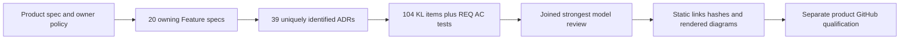

# ADR-037: Повний каталог функцій і архітектурних рішень

Status: Accepted, documentation complete locally and independently reviewed; GitHub delivery pending. Date: 2026-10-02. Owner: KeyLoad documentation lead. Related: [RepositoryGovernance](../Features/RepositoryGovernance.md), REQ-DOCS-001–008 / AC-DOCS-001–008, [acceptance](../Features/RepositoryGovernance.md), [plan](../Features/RepositoryGovernance.md).

## Контекст і рішення

Власник прямо вимагає весь продукт описати Feature-специфікаціями та ADR. Наявний великий дизайн не замінює owning specs: бракує восьми функцій і standalone ADR-001–031; вузькі resource-repair документи не описують усю baseline поведінку. Два ADR-034 створено паралельно й ще не зафіксовано в Git.

Додаємо рівно 20 канонічних Feature-файлів, зберігаємо початкові ADR-001–031 з продуктової специфікації, доповнюємо існуючі docs та створюємо повні індекси з трасованістю всіх 104 KL-задач. Архівні/design choices не отримують неявного implementation approval: unresolved algorithm/provider/wire/format — Proposed; source-present і GitHub-qualified — різні стани. Documentation completion не змінює жоден ADR на Implemented.

ADR-034 лишається порівняльними бенчмарками, на які вже посилаються mandatory policies. Orleans foundation отримує ADR-036, усі doc references оновлюються, факт виправлення записується в ADR index. ADR-038 описує required, але ще не визначений customer-facing BlobStorage; ADR-039 — required official MCP/agent integration без вигаданих tool names/routes.

## Альтернативи й наслідки

- Лише загальний дизайн: менше файлів, але немає feature ownership і stable acceptance trace; відхилено.
- Копіювання великого дизайну: дублює джерело та плутає майбутнє із source; відхилено.
- Реалізувати missing capabilities одночасно: змішує документальний scope з невирішеними public contracts; відхилено для цього task.

Наслідок: читач має конкретні behavior/decisions/source/test links; автори підтримують один owning spec на функцію. Усі старі правила та IDs зберігаються. Статуси продукту продовжує визначати `implementation/status.json`, а qualification — exact GitHub evidence.

## Implementation contract

1. Strongest planner gpt-6-astra ultra читає root/local policies, поточні docs/spec/source й фіксує REQ-DOCS/AC-DOCS, scope, точні ADR slugs та unresolved boundaries. Root записує brainstorm → acceptance → plan → Feature/ADR contract до delegated writes. Це документальне approval від власника не є дозволом реалізувати Proposed API.
2. Перед початком зберегти snapshot наявних документів і full SHA256 усіх 27 AGENTS.md. Root один володіє існуючими файлами, shared links, README/Architecture, index/catalog, BlobStorage і ADR-036–039. Source, test, packages, workflows та policies не змінюються цим task.

   Shared-checkout preservation contract: immutable original hashes лишаються в evidence catalog. Якщо інший owning task додає policy text, root не відновлює старий файл поверх його роботи й не приховує drift. До final verification спершу уточнює AC-DOCS-007/plan, записує original/current full hashes та перевіряє повне збереження старого тексту/правил; strongest review joins це evidence. Only independently verified additive changes допустимі для цього audit; unexplained drift, scope loss або rule weakening блокують завершення. Цей task не має policy write ownership.
3. TASK-DOC-AUTHOR-004: gpt-6-luna high A, тільки нові DocumentStorage/Messaging/GraphTraversal і ADR-001–016. TASK-DOC-AUTHOR-005: gpt-6-luna high B, тільки нові ChangeFeeds/BackupRestore і ADR-017–031. Search та Authorization з'явилися від concurrent owner до authoring; worker зупинився без змін, root оглянув їх і взяв у scope існуючих файлів, зберігши старі IDs. Start — всі попередні contracts існують; workers читають `docs/AGENTS.md` і точний frozen packet. Ownership розділений.
4. Кожен Feature має observable positive/negative/edge/error AC, canonical slice/N/A, current/planned boundary, реальні test method/file links або explicit planned test. Кожен ADR має REQ/AC, ordered implementation stages, exact current/target paths, integration owner, prerequisites, migration/rollout/rollback, GitHub verification і diagram. Proposed зупиняє dependent implementation до вирішення його відкритих контрактів.
5. Workers повертають всі paths/hashes, evidence/source/test mappings та terminal complete/blocked/failed/cancelled. Ambiguous semantics, overlap, невідомий endpoint/provider, missing source або policy conflict → stop/escalate. Partial/blocked/failed packet не unblock join. Root оглядає кожен документ, виправляє інтеграційні references і joins обидва complete results.
6. TASK-DOC-REVIEW-007 gpt-6-astra ultra проводить незалежний full-file review; root виконує combined Feature/ADR/KL/REQ/AC/link/hash/whitespace/governance checks та render кожної Mermaid діаграми існуючим cached CLI. Жодних skills/tool installation, локальних продуктових tests/builds/containers/benchmarks або worker commit/push.
7. Записати результат документальних AC й pending delivery в `implementation/documentation-coverage.json`. Product/source status і реальні GitHub runtime gates не змінюються на passing. Будь-яка подальша реалізація запускається тільки за своїм owning Feature/ADR contract та root qualification policy.

## Міграція, rollout і rollback

Документальна міграція: додати missing files, доповнити existing sections без втрати REQ/AC, виправити foundation identity та dependent links. Жодного runtime/persisted format migration. ADR-032 layout debt не стає compliant через опис target paths. Rollback нового тексту потребує review і не видаляє старі правила, вимоги або immutable CI artifacts; номер виправленого рішення не використовується повторно.

## Verification і межі

REQ/AC-DOCS-001–008 → task rows у плані → file/ID/104-KL/static source-test checks + manual complete-content review exception. `node scripts/Features/RepositoryGovernance/verify.mjs`, `git diff --check`, full 27-policy hashes, local links і всі Mermaid renders обов'язкові. Existing historical CI `36926803549` / `9c570f8c33a7a9667507a8e1c0ca68860de3be45` не кваліфікує dirty checkout. Повні TUnit, recovery, RF3 SDK/MCP, code-quality/coverage/complexity, power-loss та endurance gates залишаються окремими pending доказами продукту.
