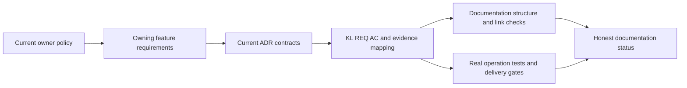

# ADR-037: Повний каталог функцій і архітектурних рішень

Status: Accepted documentation contract; product implementation and delivered-source qualification remain independently tracked.
Owner: KeyLoad documentation lead. Related: [RepositoryGovernance](../Features/RepositoryGovernance.md), REQ-DOCS-001–008 / AC-DOCS-001–008, [acceptance](../Features/RepositoryGovernance.md), [current implementation status](../implementation/status.json).

## Контекст і рішення

Кожна non-trivial capability має owning feature specification, stable `REQ-*` and
measurable `AC-*`, canonical slice map, applicable ADRs, and traceability to
actual automated evidence or an explicit evidence exception. The canonical
governance contract indexes 25 owning Feature specifications, the
current ADR index contains 111 decision files, and traceability covers all 104 KL
items. These counts are checked against their owning sources rather than copied
from a historical snapshot. Documentation approval does not authorize a Proposed
API or mark product code implemented.

Keep all existing requirements, IDs, feature ownership and architecture boundaries.
The documentation catalog records all current KL items and maps each requirement
to its acceptance criteria, ADR, task and evidence source without presenting source
presence as runtime proof. Product delivery and qualification status remain owned
by `implementation/status.json` and exact-source Linux evidence.

## Альтернативи й наслідки

- Тільки загальний дизайн: немає feature ownership та acceptance trace; відхилено.
- Копіювання великого дизайну: дублює джерело та плутає майбутнє з поточним; відхилено.
- Реалізувати unresolved capabilities як наслідок документального review: це
  перетворює опис на неавторизоване API-рішення; відхилено.

Canonical feature specs own behavior. This ADR defines their catalogue and
traceability contract; the product does not become qualified because its docs or
static checks pass.

## Implementation and maintenance contract

1. `REQ-DOCS/AC-DOCS-001–008` are preserved and mapped below. The documentation
owner maintains `docs/Features/`, `docs/ADR/README.md`,
   `docs/Architecture.md`, and the traceability links while preserving stable IDs,
   current source boundaries, explicit Proposed/pending states and applicable
   owner policy. Do not retain completed worker assignments, temporary review
   chronology or per-run reports as active implementation instructions.
2. Every feature `REQ-*` maps to one or more `AC-*`; each AC maps to real test
   methods/files or a narrowly stated evidence exception. Each ADR retains its
   related REQ/AC, ordered current implementation/verification responsibilities,
   exact ownership and rollout/rollback constraints. A missing acceptance mapping
   is reported as a gap, not filled by an inferred test.
3. Static documentation governance checks only structural facts such as required
   files/sections, stable IDs, mapped test/evidence links, catalogue entries and
   local Markdown destinations. It does not assert product behavior from source
   text. Privacy, authorization, state, fault and user-visible behavior are proved
   by the owning feature's real complete-operation tests; documentation evidence
   must not expose credentials, user payloads or private inventories.
4. `node scripts/Features/RepositoryGovernance/verify.mjs`, review of local links,
   index/ID consistency, hashes and renderable Mermaid diagrams are documentation
   checks owned by the integration lead. Static success is not a product test or
   runtime qualification. Local development tests use the canonical Aspire-owned
   entry and remain development evidence; delivered-source qualification uses the
   required exact-source Linux GitHub jobs.
5. Status remains `Accepted` until the documentation mappings and required review
   evidence are complete. Product/source state and runtime qualification never
   change to passing as a side effect of this documentation decision.

## Документальні зміни, rollout і rollback

Documentation changes update the canonical source and dependent links together,
without dropping requirements, criteria, ownership, privacy constraints or
immutable evidence. They do not change runtime or persisted format. Existing
architecture layout debt remains debt until the owned source moves and its required
verification passes. Rollback must preserve current rules, requirements, IDs and
immutable CI originals.

## Verification і межі

REQ/AC-DOCS-001–008 map to structural document checks and complete-content review;
AC-DOCS-007 specifically retains the policy-hash and drift-preservation oracle.
product behavior retains its own real TUnit, process-recovery, RF3 SDK/MCP,
code-quality, coverage/complexity, endurance and power-loss gates. The integration
lead records the actual check and evidence source. No historical CI receipt,
source-text assertion or documentation-only result qualifies the current product.
