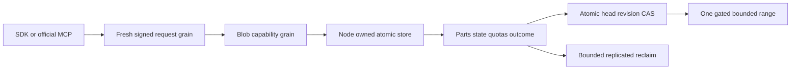

# ADR-038: Canonical chunked BlobStorage and bounded reads

Status: Accepted; implementation/qualification pending. Date:2026-10-02.
Owner: KeyLoad integration owner. Related: [BlobStorage](../Features/BlobStorage.md),
REQ/AC-BLOB-001–007, [acceptance](../Features/BlobStorage.md),
[execution graph](../Features/BlobStorage.md), ADR-035/036/039/041/042.
Acceptance is the integrator's decision within the authorized full rewrite;
it is not passing storage, RF3, coverage or endurance evidence.

## Decision and actual ownership

Store raw bounded binary parts, versioned part metadata, upload/version state,
heads and quotas in the existing canonical IAtomicStore. Six commands use
DatabaseEngine.Apply, existing fingerprint/outcome, trusted EvaluatedAt, redo
transaction and replica watermark. Do not add parts to Mutation or projection
outbox. Initial blobs have no cross-feature mutation batch/change-feed/projection
contract. Physical file/gate ownership stays in PartitionHost; every public call
uses a fresh signed request grain and ordinary capability grain, never membership
principal authority. Separate object-provider files require a second atomicity
protocol and are rejected here. Cartograph can serve existing ManagedCode backup
archives; authoritative user parts use the canonical store.

## Frozen public contracts

DTO: Abstractions/Features/BlobStorage, namespace KeyLoad, XML-documented immutable
records, ReadOnlyMemory<byte> strict base64 and ImmutableArray collections.
No caller-supplied principal/roles/time. Preserve existing enum numbers; append
ResourceKind.BlobStore, OperationKind.BeginBlobUpload/WriteBlobPart/
CompleteBlobUpload/AbortBlobUpload/DeleteBlob/ReclaimBlob. Append capability bits
BlobRead30/BlobWrite31/BlobDelete32/BlobManage33; All contains bits0..33.
ResourceDefinition gains nullable BlobPolicy omitted when null to preserve exact
nonblob JSON/fingerprints. Null BlobStore policy means immutable v1 defaults.
Configured-definition changes that alter the resource identity are rejected by the existing strict checks.

| DTO | Exact positional fields / contract |
|---|---|
| BlobRef | PartitionRef Partition, string Resource, string Id |
| BlobPolicy | init MaxBlobBytes=67108864; MaxReservedBytes=268435456; MaxObjectKeys=4096; MaxVersions=8192; MaxUploads=128; UploadTtlSeconds=3600 |
| BeginBlobUploadRequest | Guid CommandId, BlobRef Blob, Guid UploadId, long Length, long ExpectedRevision, RowAccess? Access=null |
| WriteBlobPartRequest | Guid CommandId, BlobRef Blob, Guid UploadId, int Ordinal, ReadOnlyMemory<byte> Bytes, string Sha256 |
| CompleteBlobUploadRequest | Guid CommandId, BlobRef Blob, Guid UploadId, string ExpectedIntegrityHash |
| AbortBlobUploadRequest | Guid CommandId, BlobRef Blob, Guid UploadId |
| DeleteBlobRequest | Guid CommandId, BlobRef Blob, long ExpectedRevision |
| ReclaimBlobRequest | Guid CommandId, BlobRef Blob, Guid UploadId, int MaxParts=128 |
| BlobMetadataRequest | BlobRef Blob |
| BlobUploadInfoRequest | BlobRef Blob, Guid UploadId |
| BlobReadRequest | BlobRef Blob, long ExpectedRevision, long Offset, int Count |
| BlobListRequest | PartitionRef Partition, string Resource, int Limit=100, string? AfterId=null |
| BlobUploadInfo | BlobRef Blob, Guid UploadId, long DeclaredLength, long ExpectedRevision, int NextOrdinal, long StoredBytes, DateTimeOffset ExpiresAt, BlobUploadStatus Status, string IntegrityHash |
| BlobUploadStatus | Active=0, Complete=1, Aborted=2, Expired=3 |
| BlobMetadata | BlobRef Blob, long Revision, Guid? VersionId, long Length, int PartCount, string? IntegrityHash, RowAccess Access, DateTimeOffset UpdatedAt, bool Deleted=false |
| BlobReadResult | BlobMetadata Metadata, long Offset, ReadOnlyMemory<byte> Bytes |
| BlobListPage | ImmutableArray<BlobMetadata> Items, string? NextAfterId |
| BlobReclaimResult | Guid UploadId, int DeletedParts, int RemainingParts, long ReleasedBytes, bool Complete |
| BlobCommitResult<T> | CommitReceipt Receipt, T Value; receipt Mutations is empty; existing token/durability semantics |

Begin/write/abort return BlobCommitResult<BlobUploadInfo>, complete/delete return
BlobCommitResult<BlobMetadata>, reclaim returns BlobCommitResult<BlobReclaimResult>.
Metadata/upload info are nullable after scoped authority. Missing initial revision0
head or upload returns null. Deleted positive-revision metadata returns Deleted,
null version/hash and length/count0 so callers can recreate with the tombstone
revision. Listing excludes revision0/deleted. Missing/deleted range is NotFound.
Existing typed ErrorCode/safe details and structured HTTP/MCP actual request ID
apply. CommandId remains stable on retries; execution GUID is always fresh.
UploadId is nonempty caller-generated scoped identity, never bearer authority.

Ten POST routes under /v1/blobs: /uploads/begin, /uploads/parts, /uploads/complete,
/uploads/abort, /delete, /reclaim, /metadata, /uploads/info, /range, /list.
Exact MCP names: keyload_blobs_begin_upload, keyload_blobs_write_part,
keyload_blobs_complete_upload, keyload_blobs_abort_upload, keyload_blobs_delete,
keyload_blobs_reclaim, keyload_blobs_metadata, keyload_blobs_upload_info,
keyload_blobs_read_range, keyload_blobs_list. Canonical arguments remain {request:DTO}.
Four reads: read-only/idempotent/nondestructive. Six commands: stable-ID idempotent;
complete/delete/reclaim destructive. Begin/part/abort leave published bytes intact.
Register all ten operations in the canonical catalog with their exact schemas
and effect hints. The initial public tool list contains only the three gateway
tools; authorized on-demand discovery and invocation follow
[ADR-104](ADR-104-mcp-gateway-tool-discovery.md).

## Limits, quotas and lifecycle

BlobLimits: RawPartBytes=65536, MaxRangeBytes=65536, MaximumBlobBytes=1073741824,
StoreMaxReservedBytes=1073741824, StoreMaxObjectKeys=8192, StoreMaxVersions=16384,
StoreMaxUploads=1024, MaxReclaimParts=128, MaxListItems=100.
Configured resource bounds are positive and <=store ceilings;
MaxBlobBytes<=MaxReservedBytes, object length0..MaxBlobBytes, TTL60..86400 seconds.
Part count ceil(length/65536)<=16384. Apply time is replicated EvaluatedAt.
Nonnull RowAccess OwnerId/ProjectId use the existing database identifier contract:
at most256 UTF-8 bytes, nonblank and without control characters. Encoded private
head/state records are at most16384 bytes, checked before effects or persisted
decoding. Invalid caller metadata is Validation; oversized persisted metadata is
Corruption. This bound prevents valid uploads from producing an uncommittable
restore page; it does not change other features' row metadata format.

Begin atomically reserves declared raw length, one upload/version slot and one
head-key slot for a new name at resource/store levels. Revision0 head is a hidden
placeholder. Head-key slots persist through deletion/abort to retain identity/CAS
history; they count toward MaxObjectKeys. Multiple uploads share the head but
reserve separate versions/uploads; complete uses original ExpectedRevision.
ConfigureResource initializes counters in that canonical transaction. Missing
initialized counters, negative/overflow/inconsistent state, unknown format or
unmatched raw records fail closed. First global initialization must prove blob
prefixes/catalog evidence empty and consistent, never reset existing feature state to zero.
The initial catalog proof visits at most10000 delivered records under the native
examined-record/byte limits. Existing BlobStore evidence is Corruption; an
unfinished proof is BudgetExceeded and cannot initialize counters.
Begin checks ExpectedRevision immediately and uses Access ?? existingHead.Access
?? new RowAccess(). Complete checks the then-current head RowAccess as well.
Nonempty indexes/field/header policies and event-authoritative BlobStore
configuration are Validation in v1; no unenforced policy is silently accepted.

Parts are contiguous from ordinal0. Nonfinal length is exactly65536, final length
is exact remaining bytes, never empty. Write verifies SHA256 and atomically stores
raw/meta/advanced state. Earlier ordinal with identical recorded bytes/length/hash
is a no-charge duplicate; changed content is Conflict. Gap/invalid ordinal, length,
hash or declared overflow is Validation/Conflict. New parts require Active,
unexpired upload. Stored-command replay rechecks current capability/creator/row/
PolicyEpoch, without old effects/expiry reapplication. Reclaimed upload authority
is unavailable: upload-target commands return TokenInvalidated rather than bypass
missing row/creator state. Reusing a reclaimed UploadId creates a new lifetime
identified by immutable BeginCommandId; replay requires the current outcome's
private v1 stamp to match or returns TokenInvalidated. No unbounded retired-ID table.

Complete checks accepted length/count and caller's expected chain, performs O(1)
head CAS, publishes revision+1, marks this version current and previous retired.
It does not rescan the full file or promise discovery of latent unrelated disk
corruption. Complete consumes active-upload slot; bytes/version remain charged.
Delete requires positive current expected revision, publishes tombstone revision+1
and retires old current version. Neither operation releases old bytes early.

Abort marks Active Aborted, including expired uploads, and releases unused
reservation and active-upload slot once. Reclaim targets one version and1..128
parts; current or unexpired Active state is Conflict. At trusted expiry mark
Expired and release unused reservation/upload slot once, then delete raw/meta
pairs from the persisted reclaim cursor. Release exactly deleted logical bytes;
final deletion removes version state and version slot. Missing/corrupt parts fail
closed. Reclaim already-removed state is empty Complete after BlobManage scope
check. Reclaim always checks actual current head VersionId; an absent referenced
state is Corruption. Its final/absent replay lifetime follows the current command-outcome contract.
Never mutate inside VisitRange. Logical deletion is not physical compaction.

Global reservation covers blob payload, not other features/outcome metadata,
provider overhead, physical free space or encoded snapshots. Existing complete
store snapshot limit(default4GiB) independently applies. Maximum-size qualification
must include actual snapshots and empty-replica recovery; do not claim unlimited
database/snapshot size. Outcomes use shared bounded-metadata retention work, not a
second blob result log or reuse of retired command IDs.

## Integrity and persisted layout v1

Hashes are exactly64 lowercase hex. Part hash=SHA256(raw bytes).
Named IntegrityAlgorithm=sha256-chain-v1, distinct from whole-file SHA256.
H0=SHA256(KeyCodec.Encode("blob-chain-v1", incarnation.ToString("N"), tenant,
database, transactionDomain, partitionKey, resource, blobId, uploadId.ToString("N"), declared
length Int64,65536 Int64)). Hnext=SHA256(previous32bytes || ordinal Int32 big-endian
|| length Int32 big-endian || partSHA32bytes),72bytes. Public BlobIntegrity methods
InitialHash(Guid,BlobRef,Guid,long), PartHash(ReadOnlySpan<byte>) and
NextHash(string,int,int,string) and Matches(string,string) are the sole shared implementation and have
independent golden vectors. Empty blob completes with H0. Fixed-time comparison
follows strict decoding. Different incarnation/scope/upload/layout/order changes
chain; work is O(1) per part/complete.

Named KeyCodec v1 prefixes: blob-head-v1, blob-state-v1, blob-part-v1,
blob-partmeta-v1, blob-quota-v1, blob-global-v1. Head/state/part/meta scope is
tenant/database/transactionDomain/partitionKey/resource/blobId, then upload
N-string and ordinal Int64 for parts. Resource quota excludes PartitionKey and
blobId, aggregating all partition keys of the configured resource. The global
key has only its prefix. State/quotas include FormatVersion=1 and store Incarnation. State includes creator,
RowAccess, immutable BeginCommandId and IntegrityIncarnation, declared length, expected revision, expiry, count/bytes/chain,
disposition, remaining reservation and reclaim cursor. Head points to upload ID;
part metadata contains exact length/hash. Checked counters and validated decoded
records are mandatory; raw parts are not JSON. One helper family owns formats.

## Authority and bounded reads

BlobRead: metadata/range/list. BlobWrite: begin/part/complete/abort/upload info.
BlobDelete: delete. BlobManage: reclaim. Validate current principal, BlobStore,
full tenant/database/resource/domain first. Begin/Complete/Delete require current
head RowAccess; Begin also checks chosen upload access. Complete additionally
requires its selected upload's RowAccess and creator. Only creator/admin targets
an upload. Write/Abort/UploadInfo/Reclaim check the selected upload's persisted
RowAccess and creator; a later head ACL does not prevent cleanup of that creator's
retained version. Current head structure/linkage still forbids reclaiming its
actual published VersionId. A revoked principal or grant remains denied for every
path. BlobManage grants cleanup, not raw
read. BlobRead uses CanReadRow: requested unreadable object PermissionDenied,
listing skips it. No scope can grant another tenant; caller roles stay untrusted.
An ordinary published head must validate its selected state pairing before any
read or command proceeds. Missing current state is Corruption, including a Begin
for another UploadId; no new reservation or outcome may hide that structural fault.

One Store.Read cut owns principal/resource/head/version/parts/result. Offset0..length,
count0..65536 and offset<=length-count without overflow. ExpectedRevision positive
and equal current head, otherwise RevisionConflict. A range visits <=2 parts,
charges before decode/copy, verifies exact part length/hash and copies only desired
bytes. Missing/corrupt chunk is Corruption, never partial success. Shared budget,
cancellation/deadline and response size checks apply. No whole-object traversal.
Multiple calls keep revision and can fail after overwrite; retained-version
cross-call reads are not promised. The existing gate excludes reclaim during read.

List limit1..100 examines <=2*limit head candidates and stops its visitor before
native lookahead at that bound or when Limit visible items are reached. It filters
hidden/deleted/unreadable and returns exclusive last-visited AfterId. A final empty
page may have an advancing cursor when rows are hidden. Cursor is a bounded
validated ID, not historical snapshot/authority; ordering is KeyCodec UTF8 order.

## Implementation and qualification

[Plan](../Features/BlobStorage.md) freezes task/owner/dependencies.
Root owns contracts/shared adapters; workers own disjoint new feature files.
First real provider/golden AC tests, then engine, current-authority configuration/
dispatch, fresh-grain routes, SDK/native MCP, recovery and RF3 callers.
Abort/reclaim use explicit finite cleanup control classification, no new unlimited
lane. Existing quality/Client owner returns before shared-scope edits.

First use atomically creates v1 state; nonblob JSON/data are unchanged. Unknown
marker/state version is FormatUnsupported; missing initialized state is Corruption.
Canonical snapshots contain raw/meta/head/state/counters together. Same-incarnation
reopen and InstallSnapshot preserve chains. Restore validates the complete current
snapshot and fails closed on missing, corrupt or inconsistent blob state.
Restore to a new authority incarnation runs the bounded, resumable current-format
normalization in [ADR-011](ADR-011-current-native-format.md) before readiness.
Rebind authority-bearing metadata; abort active uploads and release unused
reservation and active-upload slots exactly once. Preserve published bytes,
head revisions, part and chain hashes, BeginCommandId and IntegrityIncarnation.
Persisted phase/cursor/accounting fences survive restart and prevent service until
every current state, head, quota and resource account is verified.
Rollback requires a source
release that supports the current stored format or a verified current-format
backup, with its actual data-loss boundary recorded; live blob data is never
deleted to enable startup.

Required exact-SHA GitHub evidence: complete format/build/analyzers/governance,
TUnit contract/provider, actual flush/ACK kill/reopen/corruption/quota, Docker/Aspire
RF3 .NET and official MCP flows for all ten blob operations through the gateway,
leader-loss retry, empty replica/rejoin,
bounded memory/control progress, changed-code coverage, faults/endurance artifacts.
Compilation and process-kill are not power-loss or production proof. All AC pending.

# Current first-release BlobStorage format operation proof

TASK-BLOB-CURRENT-FORMAT-007 maps REQ-BLOB-007/AC-BLOB-007 and existing ADR-038 to real persisted ConfigureResource → exact current complete JSON (including immutable VectorProfiles[]) → same outer command-ID native result replay with full-store/position invariance → legitimate document write/read. This is current first-release format, not legacy or migration compatibility. Nullable BlobPolicy stays omitted when null; no product omission/fallback change. Existing stable enum/capability numeric identities are asserted inside the completed native configuration/blob operation flows, not standalone getter/metadata tests.

REQ-BLOB-001/002/005/007 and AC-BLOB-001/002/005/007 also map to native default BlobStore configuration → oversized declared length rejects Validation and leaves target metadata/upload absent (first logged rejection may retain outcome/clock once under ADR-002) → exact same-ID failure bytes plus stable full post-failure image/position → small real upload/write/publish with complete independent metadata and partial bytes → same command-ID publication replay/no extra effect → joined native store close/reopen with full canonical image/position and identical complete metadata/range → healthy full read.

Remove exactly obsolete ordinary identities BlobStorageCompatibilityTests.AcBlob007AppendsBlobEnumsAndCapabilitiesWithoutRenumberingExistingValues and BlobStorageCompatibilityTests.AcBlob007ResourceWithoutBlobPolicyRetainsItsCanonicalJsonBytes. New cases are functional complete native operations; root must reconcile genuine post-build census UID/source ranges/classifications. Do not fabricate IDs/counts/PASS. Existing integrity golden controls remain separate. No production behavior, limits, format decoder, dependencies or authorization changes.
