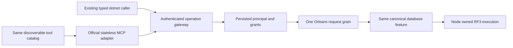

# ADR-039: Official MCP SDK і agent access до canonical operations

Status: Accepted for implementation; runtime and delivery qualification pending. Date: 2026-10-02. Owner: ClientApi lead / KeyLoad integration owner. Related: [ClientApi](../Features/ClientApi.md), REQ-CLIENT-004–007 / AC-CLIENT-004–007; [Authorization](../Features/Authorization.md), [BlobStorage](../Features/BlobStorage.md), [TestInfrastructure](../Features/TestInfrastructure.md).

## Accepted runtime root-name framing refinement

TASK-RUNTIME-MCP-FRAME-W maps REQ-CLIENT-006 and AC-MCP-003/005/007 to the actual
run37005805424 lone-surrogate-name failures. Only McpFrameInspection.cs changes:
retain previous root-id value's encoded-length check, reset root-id state for each
token, then classify a root id using the single safely decoded property name in
AddProperty. Keep count/name budgets before decode, duplicate detection, escaped
id spelling, scalar/native ids, valid surrogate pairs and fixed safe errors.
Existing malformed name/value and escaped-id exact-boundary tests are the
tests-first baseline. One bounded worker owns that file; lead owns shared docs,
source review, enabled build/format/governance and exact GitHub UnitTests/RF3
qualification. No broad catch, dependency change, wire/data migration or public
schema change. Rollback removes only the internal classification repair.

## Контекст і запропонований напрям

Accepted TASK-RUNTIME-MCP-FRAME-W3 implements REQ/AC-CLIENT-009 with
AC-MCP-001/004/005/007 and AC-MP-009/012. The pinned SDK
[McpHttpClient source](https://github.com/modelcontextprotocol/csharp-sdk/blob/6fa3825973949a9c4f0cd8af344e15a8db09dc35/src/ModelContextProtocol.Core/Client/McpHttpClient.cs)
uses JsonContent, whose [.NET10 implementation](https://github.com/dotnet/runtime/blob/v10.0.12/src/libraries/System.Net.Http.Json/src/System/Net/Http/Json/JsonContent.cs)
does not compute Content-Length. Existing maximum-capacity allocation and
projection exceed the default control pool for this path. Preserve the maximum
wire bound and conservative equations while charging the actual retained frame
owner after bounded incremental reading. Pre-read ingress still covers maximum
growth; no header claim can bypass framing or authority. This changes private
buffer lifetime/allocation only, with no accepted revision, quota, default-pool,
native dispatch, public result or data-format change.

Ordered stages: retain tests-first real owner/state regression source; implement
bounded unknown-length buffer growth in McpFrameBody and actual retained-capacity
handoff in McpRequestState; root reviews overrun/zeroing/cancellation and every
held owner, runs enabled build/format, then qualifies full exact-SHA GitHub unit
and RF3 default official SDK discovery/tool/authority paths. One economical
worker owns only these two production files, existing McpFrameBodyTests and a
new cohesive ClientApi admission regression file. Root alone owns shared docs,
CI, commit and integration. Stop on required contract/protocol changes. Source
rollback reverts both owner/handoff changes together; this ADR remains Accepted
until every required gate passes.

Accepted TASK-RUNTIME-MCP-DIAGNOSTICS-W implements REQ/AC-CLIENT-008 with
AC-MCP-003/005/007. First retain tests-first source for actual rejected headers,
body comparisons and private metadata through the real Microsoft EventSource
logger. Then split the existing combined predicates without changing their
ordering or semantics, attach closed stage enum metadata on failure, and add a
bounded closed method/stage formatter. Root alone joins logging in
McpHttpPipeline, reviews every predicate and coordinates the real logging
EventSource filters. The worker owns only McpTransportGuard.cs, new ClientApi
diagnostic enums/formatter and new same-slice tests/capture helper. No business
dispatch, composition, frames, accepted revision, SDK package or public reply
change. Exact-SHA GitHub unit tests and retained initial discovery plus fallback
receipts are the join; this ADR remains Accepted while official RF3 calls fail.
No persisted/wire migration, source rollback removes only diagnostic metadata
and logging. Unknown metadata is sanitized, logging never receives exceptions,
headers, body, arbitrary method/target text or private identities.

Root policy вимагає простий agent API та інтегрований official MCP C# SDK server для всіх database/search/storage operations, з real .NET SDK і official MCP SDK клієнтами в Docker/Aspire RF3 тестах. Поточні HTTP operations у [ApiEndpoints](../../src/KeyLoad.Server/Features/ClientApi/Transport/ApiEndpoints.cs) і [KeyLoadClient](../../src/KeyLoad.Client/KeyLoadClient.cs) існують; завершеної official MCP/agent surface не знайдено.

Напрям: протокольні adapters належать ClientApi, а business behavior/requirements залишаються в owning DocumentStorage/EventStreams/Messaging/GraphTraversal/TimeSeries/Search/ChangeFeeds/BlobStorage slices. Ідентичність береться з persisted server credentials; model/tool arguments не можуть підмінити trusted roles. Кожна операція викликає окремий Orleans request grain за ADR-036 і використовує ту саму canonical authorization, bounds, outcomes та unknown-write retry semantics.

Прийнято official SDK 2.2.0, native stateless Streamable HTTP `/mcp`, explicit
typed version-one catalog нижче та shared canonical Orleans gateway. Простий
agent API — той самий discoverable tool catalog; окремого engine/session authority
немає. Acceptance і execution graph: [acceptance](../Features/ClientApi.md),
[brainstorm](../Features/ClientApi.md),
[plan](../Features/ClientApi.md).

У Server centrally pin `ModelContextProtocol.AspNetCore` 2.2.0; official integration
caller uses `ModelContextProtocol.Core` 2.2.0. Source was reviewed at official tag
[v2.2.0](https://github.com/modelcontextprotocol/csharp-sdk/releases/tag/v2.2.0),
commit 6fa3825973949a9c4f0cd8af344e15a8db09dc35. Native public composition is
AddMcpServer/WithHttpTransport with HttpServerSessionMode.Stateless and MapMcp.
Use WithListToolsHandler/WithCallToolHandler and no competing reflection-discovered
ToolCollection. The shared host registers IHttpContextAccessor explicitly.

DatabaseIdentityMiddleware continues resolving the persisted bearer credential on
every request. Its principal stays in HttpContext.Items, never caller arguments or
captured initialization/session state. Do not add RequireAuthorization without a
real authentication scheme. Every tool effect uses a fresh GUID request grain,
then the existing capability/partition grain with a reloaded persisted principal.

## Frozen catalog and wire contract

ADR-098 adds its direct and SQL graph-path tools as additive version-one reads;
AC-MCP-001 independently verifies the complete 66-name catalog, typed schemas
and effect hints. The two PMAP tools use strict generated request/result schemas:
bind is `{ commandId, request }` with version, expectedRevision, complete
partition and physicalShardId, while read is `{ request }` and returns the full
same-view placement witness including ordered voters and both directory and row
revisions. Persisted administrator authorization remains enforced by the existing
request-grain path. Runtime RF3 confirmation remains pending.

Outer arguments are strict: a body-bearing tool accepts only `request`; the four
header-command-ID tools additionally require nonempty GUID `commandId`. No-body
tools accept `{}`. Write identities inside canonical DTOs remain unchanged:
Receive/ReceiveSubscription use request.RequestId; other commands use
request.CommandId. MCP request IDs and Orleans actor IDs never replace them.

| Stable tool name | Canonical request | Result | Existing lane route / capability |
|---|---|---|---|
| keyload_documents_get | GetDocumentRequest | DocumentResult or null | /v1/documents/get; Document |
| keyload_streams_read | ReadStreamRequest | StreamPage | /v1/streams/read; Stream |
| keyload_events_read | ReadEventSourceRequest | EventSourcePage | /v1/events/read; EventSource |
| keyload_subscriptions_status | GetSubscriptionRequest | SubscriptionInfo | /v1/subscriptions/status; Subscription |
| keyload_messages_inspect | InspectMessageRequest | MessageInspection or null | /v1/queues/inspect; Message |
| keyload_graph_traverse | TraverseRequest | GraphTraversal | /v1/graph/traverse; Traverse |
| keyload_graph_shortest_path | GraphShortestPathRequest | GraphShortestPathResult | /v1/graph/shortest-path; GraphShortestPath |
| keyload_query_graph_path | SqlGraphPathRequest | GraphShortestPathResult | /v1/query/graph-path; SqlGraphPath |
| keyload_admin_partition_placement_bind | BindAtomicPartitionPlacementRequest | bool | /v1/admin/partition-placement/bind; BindAtomicPartitionPlacement |
| keyload_admin_partition_placement_read | AtomicPartitionPlacementReadRequest | AtomicPartitionPlacementResolution | /v1/admin/partition-placement/read; AtomicPartitionPlacement |
| keyload_series_read | ReadSamplesRequest | SampleRecord array | /v1/series/read; Samples |
| keyload_query_execute | QueryRequest | QueryPage | /v1/query; Query |
| keyload_query_ast | AstQueryRequest | QueryPage | /v1/query/ast; AstQuery |
| keyload_query_capabilities | none | QueryCapabilityManifest | /v1/query/capabilities; QueryCapabilities |
| keyload_changes_read | ReadChangeFeedRequest | ChangeFeedPage | /v1/changes/read; ChangeFeed |
| keyload_query_live_start | StartLiveQueryRequest | LiveQuerySnapshot | /v1/query/live/start; LiveQueryStart |
| keyload_query_live_read | ReadLiveQueryRequest | LiveQueryPage | /v1/query/live/read; LiveQueryRead |
| keyload_outbox_status | GetOutboxStatusRequest | OutboxStatus | /v1/admin/outbox/status; OutboxStatus |
| keyload_projections_read | ReadProjectionBatchRequest | ProjectionBatch | /v1/admin/projections/read; ProjectionBatch |
| keyload_search_execute | SearchRequest | RankedDocument array | /v1/search; Search |
| keyload_admin_backup | none | BackupReceipt | /v1/admin/backup; Backup |
| keyload_admin_admission | none | NodeAdmissionStatus | /v1/admin/admission; Admission |
| keyload_admin_status | none | NodeStatus | /v1/status; NodeStatus |
| keyload_documents_commit | CommandRequest | CommitReceipt | /v1/commands; Batch |
| keyload_messages_receive | ReceiveRequest | ReceiveResult | /v1/queues/receive; Receive |
| keyload_messages_complete | DeliveryCommand | CommitReceipt | /v1/queues/delivery; Delivery |
| keyload_messages_process | ProcessingRequest | CommitReceipt | /v1/queues/process; Processing |
| keyload_resources_configure | ConfigureResourceRequest + outer commandId | ResourceDefinition | /v1/admin/resources; ConfigureResource |
| keyload_principals_configure | ConfigurePrincipalRequest + outer commandId | PrincipalRecord | /v1/admin/principals; ConfigurePrincipal |
| keyload_credentials_configure | ConfigureApiKeyRequest + outer commandId | boolean | /v1/admin/api-keys; ConfigureApiKey |
| keyload_admin_dispatch | boolean request + outer commandId | boolean | /v1/admin/dispatch; SetDispatch |
| keyload_subscriptions_configure | ConfigureSubscriptionRequest | SubscriptionInfo | /v1/subscriptions/configure; ConfigureSubscription |
| keyload_subscriptions_seek | SeekSubscriptionRequest | SubscriptionInfo | /v1/subscriptions/seek; SeekSubscription |
| keyload_subscriptions_receive | ReceiveSubscriptionRequest | ReceiveSubscriptionResult | /v1/subscriptions/receive; ReceiveSubscription |
| keyload_subscriptions_complete | SubscriptionDeliveryCommand | CommitReceipt | /v1/subscriptions/delivery; SubscriptionDelivery |
| keyload_subscriptions_process | SubscriptionProcessingRequest | SubscriptionProcessingResult | /v1/subscriptions/process; SubscriptionProcessing |
| keyload_subscriptions_pause | SetSubscriptionPausedRequest | SubscriptionInfo | /v1/subscriptions/pause; SetSubscriptionPaused |
| keyload_projections_configure | ConfigureProjectionConsumerRequest | ProjectionConsumerInfo | /v1/admin/projections/configure; ConfigureProjectionConsumer |
| keyload_projections_commit | CommitProjectionBatchRequest | ProjectionBatchResult | /v1/admin/projections/commit; CommitProjectionBatch |
| keyload_projections_release | ReleaseProjectionConsumerRequest | ProjectionConsumerInfo | /v1/admin/projections/release; ReleaseProjectionConsumer |
| keyload_outbox_purge | PurgeOutboxRequest | OutboxHead | /v1/admin/outbox/purge; PurgeOutbox |

Authenticate and Membership are internal and absent. Batch retains all ten
canonical mutation discriminators. Backup is a physical side effect, despite
read-dispatch routing; ReadOnly/Idempotent annotations must be explicit per entry.
Stable canonical commands are retryable only with the same ID and payload; a
conflicting payload is rejected. Backup retries may create additional archives.

Input schemas describe actual canonical JSON including nullable values, required
constructor parameters, strict immutable arrays, base64 byte memory, enums and
polymorphism. Decode with JsonDefaults.Options and enforce outer keys explicitly.
Schemas do not themselves authorize or validate an operation. Custom converter
schemas use the reviewed private schema-only options projection and native exporter
in the plan. Runtime decoding keeps canonical options; no enum handling is narrowed.

Success StructuredContent is one bounded object `{result, requestId}`: `result`
contains the exact canonical result JSON and requestId is the new execution GUID.
Failures use IsError=true and `{error, requestId}` with a safe Errors.Problem value;
requestId is null if execution never started. Output schemas cover this wrapper
and nullable/array/primitive canonical values. TextContent is a short summary,
never a second full serialized result. The total MCP response has its own explicit
bounded envelope limit above the existing 16 MiB canonical reply limit.

## Admission, cancellation and resources

Before native SDK parsing, a separate bounded ingress lease reserves the framed
body and parse working set. A strict UTF8/JSON resource preflight bounds
depth/tokens/properties and rejects duplicate names in a private bounded wire
buffer; it does not implement the MCP protocol. Incoming SDK filters then acquire
the existing HttpAdmissionGovernor using the actual catalog route and full frame
byte count, binding the fresh principal before typed arguments allocation.
Whitespace and RPC metadata count toward the existing body ceiling, including the
64KiB default control-frame ceiling. A memory-only supplement covers retained
native frame/output transformations; it adds no command/authority quotas.
Only after canonical plus supplemental coverage replaces ingress may ingress
release. It does not wait for database execution. Delivery/SubscriptionDelivery/
SetDispatch preserve the control reserve and heavy reads preserve their working
set. Control replies are bounded64KiB; data replies retain the existing16MiB
canonical ceiling. Owned body/result documents and leases survive native
SerializeToNode/SSE writes until the middleware pipeline and actual session drain
finish. Exact named component accounting is in the plan; source reservations are
not a measured heap guarantee. Ingress exhaustion fails closed for all callers;
the control-progress guarantee applies to execution data saturation.

Stateless calls pass native handler cancellation and RequestAborted. Cancellation
notifications on another stateless HTTP request cannot target an earlier call.
Disconnected accepted writes retain UnknownWriteOutcome/same-command retry
semantics. SDK disposal awaits actual handlers. SDK full-JSON Trace and
raw-exception logging are disabled for its category; safe KeyLoad diagnostics do
not contain keys or private payloads. Error sanitization is reviewed before join.

Blob resources remain gated by ADR-038 acceptance and implementation. Their URIs
must be opaque and authorization checked on each read, with bounded range/page
limits. Native BlobResourceContents.FromBytes receives raw bytes; official clients
use DecodedData, avoiding double base64. Native resources/read has no IsError;
unresolved URIs use safe protocol InvalidParams for the current revision. No
unfinished blob tool or resource may be advertised. The current source catalog
contains 50 operations: the base 37 below, ten implemented-source BlobStorage
tools whose names/routes/contracts are frozen by ADR-038, and three additive
read-only [AdminDashboard](ADR-051-admin-dashboard.md) tools. All runtime and
delivery gates remain pending; a catalog count does not qualify blob semantics.

## Альтернативи, rationale й наслідки

- Окремі implementations бізнес-операцій для MCP/agent: відхилено, порушують canonical authority й parity.
- Trusted roles із caller/tool payload: заборонено mandatory policy.
- Саморобний MCP protocol замість official C# SDK: не відповідає requested integration.
- Implicit tool discovery/protocol drift during implementation: rejected; the table above and the SDK compatibility review freeze this version.

Єдиний набір operations спрощує AC parity і захищає від role escalation. Accepted
means the integration owner has frozen implementation contracts; it does not
declare MCP coverage, runtime qualification or future blobs complete.

## Implementation contract

1. The table freezes the base typed operations; ADR-038 freezes the ten additional current BlobStorage tools. Root resolves admission/schema review findings before dependent runtime implementation. Any further unfinished blob operation remains gated by its owning accepted contract and implementation.
2. Shared protocol composition належить Server/ClientApi; `.NET` DTO shape не змінюється неявно. Нові helpers/tests mirror `Features/ClientApi/`, business tests — owning feature. Existing `src/KeyLoad.Server/ApiEndpoints.cs` та Client transport лишаються tracked ADR-032 layout debt, а не compliant layer-first target.
3. AC-CLIENT-004/005 and AC-MCP-001–007 map to real operation/error/retry regressions; AC-MCP-008 retains genuine large/range storage after BlobStorage acceptance. The .NET SDK adds its missing BackupAsync and SetDispatchAsync surfaces for complete parity.
4. Workers мають окремі adapter/schema, SDK caller/tests та owning-feature operation scopes після contracts; один lead owns shared packages/host/API docs. Новий tool contract, trust weakening, missing upstream SDK contract або overlap → stop/escalate. Join усіх complete reviewed source і evidence перед qualification.
5. Canonical GitHub Actions build/analyze/format, TUnit, process recovery та RF3 suites використовують actual .NET/MCP clients без doubles; фіксують exact source SHA/run/jobs/artifacts і parity кожного exposed operation. Capability manifest не advertises unfinished operations.

Prerequisites: ADR-036 Orleans request/host lifetime, Authorization current principal/policy epoch, ResourceExecution budgets, owning operation contracts; BlobStorage додатково ADR-038 accepted implementation.

## Migration, rollout, rollback та verification

Accepted qualification repair TASK-RUNTIME-MCP-W maps REQ-CLIENT-006,
AC-MCP-001/003/005/007 and AC-ROC-006 to actual run37005805424 at6949fa0.
The official client must retain default protocol negotiation for discovery-first
stateless HTTP; pinning the client revision disables its server/discover path and
forces an initialize handshake which the current stateless protocol does not use.
Keep the server's current protocol, official transport and per-request persisted
bearer authentication unchanged. Do not pin an older revision or emulate protocol.

The worker owns only IntegrationTests/ClientApi/McpOfficialClient.cs and UnitTests/
ClientApi/McpPaginationTestData.cs, McpToolPaginationTests.cs,
McpTransportGuardTestData.cs. Retain the 65,536-byte cap, exact cursor/one-byte-short
assertions, former index36 continuation plus current terminal index46, out-of-range
index47, all47 unique tools and every negative/authority scenario. A present empty
header is one empty StringValues element; a no-values header is absent in this
abstraction. Mutate a copied native Tool to a different valid object input schema,
because its public setter rejects default/invalid schemas before isolation can be
tested. Add no reflection discovery, new catalog source or protocol workaround.

Ordered stages: accepted contracts and actual failure baseline; preserving test
vectors/caller repair; lead source review/build/formatter/static checks; complete
exact-SHA GitHub UnitTests and real official SDK RF3 caller gates. Rollback reverts
these test/caller changes; no product/data/wire migration. If native negotiation
still fails, retain bounded sanitized discovery status/error evidence without keys.
No passing or all-operation parity claim is made before actual qualification.

This additive version-one adapter does not change database schema or existing HTTP
JSON. Tool names and wrappers are versioned; later incompatible contracts require
an explicit version/ADR. Credential deployment uses existing persisted API keys,
never an adapter-only secret store. Rollback removes the adapter but cannot undo
committed commands. Timeout/cancellation is not rollback. Existing HTTP source
and tests are a baseline, not official MCP evidence. All new runtime gates remain
pending; this ADR is Accepted, not Implemented.

TASK-MCP-EVENT-PARITY is an accepted test-only implementation refinement for
REQ/AC-EVENT-004/005/006 and AC-MCP-002/005/007. The economical worker owns only
new `IntegrationTests/Features/EventStreams/McpEventStreamTests.cs` and cohesive
new scenario/tokens/assertion helpers. The lead owns the resource-scoped overload
of `ClientApi/McpPersistedIdentity.cs`, docs, source review and complete GitHub RF3
qualification. Ordered stages: public SDK setup and event/retry/replay/error tests
first; lead helper/source join; enabled build/format; exact-SHA GitHub all-client
RF3 run and retained artifacts. Compare canonical event bytes and explicit event
identity/order/head/continuation. Every actual read cut covers the append receipt;
sequential quorum cuts cannot regress. Required persisted membership heartbeats
can advance the physical cut between independent requests, and the current public
request cannot pin that cut. No fake transport, direct-store proof, fixture changes,
new provider or runtime contract. This adds no persisted/public format migration;
rollback removes only these tests/helper overload together. A failure or blocked
cluster does not qualify the EventStreams capability.
