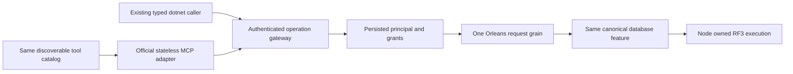

# ADR-039: Official MCP SDK і agent access до canonical operations

Status: Accepted for implementation; runtime and delivery qualification pending. Date: 2026-10-02. Owner: ClientApi lead / KeyLoad integration owner. Related: [ClientApi](../Features/ClientApi.md), REQ-CLIENT-004–007 / AC-CLIENT-004–007; [Authorization](../Features/Authorization.md), [BlobStorage](../Features/BlobStorage.md), [TestInfrastructure](../Features/TestInfrastructure.md).

Current tool discovery uses the three native gateway meta tools and static agent
resource/prompt guidance specified in [ADR-104](ADR-104-mcp-gateway-tool-discovery.md).
Canonical typed operations, persisted authorization, official SDK transport and
signed Orleans execution remain governed by this ADR.

## Accepted runtime root-name framing refinement

TASK-RUNTIME-MCP-FRAME-W maps REQ-CLIENT-006 and AC-MCP-003/005/007 to the actual
run37005805424 lone-surrogate-name failures. Only McpFrameInspection.cs changes:
retain previous root-id value's encoded-length check, reset root-id state for each
token, then classify a root id using the single safely decoded property name in
AddProperty. Keep count/name budgets before decode, duplicate detection, escaped
id spelling, scalar/native ids, valid surrogate pairs and fixed safe errors.
Existing malformed name/value and escaped-id exact-boundary tests are the
tests-first baseline. One bounded worker owns that file; lead owns shared docs,
source review, enabled build/format/governance and exact GitHub UnitTests/RF3
qualification. No broad catch, dependency change, wire/data or public schema change. Rollback removes only the internal classification repair.

## Контекст і запропонований напрям

Accepted TASK-RUNTIME-MCP-FRAME-W3 implements REQ/AC-CLIENT-009 with
AC-MCP-001/004/005/007 and AC-MP-009/012. The pinned SDK
[McpHttpClient source](https://github.com/modelcontextprotocol/csharp-sdk/blob/6fa3825973949a9c4f0cd8af344e15a8db09dc35/src/ModelContextProtocol.Core/Client/McpHttpClient.cs)
uses JsonContent, whose [.NET10 implementation](https://github.com/dotnet/runtime/blob/v10.0.12/src/libraries/System.Net.Http.Json/src/System/Net/Http/Json/JsonContent.cs)
does not compute Content-Length. Existing maximum-capacity allocation and
projection exceed the default control pool for this path. Preserve the maximum
wire bound and conservative equations while charging the actual retained frame
owner after bounded incremental reading. Pre-read ingress still covers maximum
growth; no header claim can bypass framing or authority. This changes private
buffer lifetime/allocation only, with no accepted revision, quota, default-pool,
native dispatch, public result or data-format change.

Ordered stages: retain tests-first real owner/state regression source; implement
bounded unknown-length buffer growth in McpFrameBody and actual retained-capacity
handoff in McpRequestState; root reviews overrun/zeroing/cancellation and every
held owner, runs enabled build/format, then qualifies full exact-SHA GitHub unit
and RF3 default official SDK discovery/tool/authority paths. One economical
worker owns only these two production files, existing McpFrameBodyTests and a
new cohesive ClientApi admission regression file. Root alone owns shared docs,
CI, commit and integration. Stop on required contract/protocol changes. Source
rollback reverts both owner/handoff changes together; this ADR remains Accepted
until every required gate passes.

Accepted TASK-RUNTIME-MCP-DIAGNOSTICS-W implements REQ/AC-CLIENT-008 with
AC-MCP-003/005/007. First retain tests-first source for actual rejected headers,
body comparisons and private metadata through the real Microsoft EventSource
logger. Then split the existing combined predicates without changing their
ordering or semantics, attach closed stage enum metadata on failure, and add a
bounded closed method/stage formatter. Root alone joins logging in
McpHttpPipeline, reviews every predicate and coordinates the real logging
EventSource filters. The worker owns only McpTransportGuard.cs, new ClientApi
diagnostic enums/formatter and new same-slice tests/capture helper. No business
dispatch, composition, frames, accepted revision, SDK package or public reply
change. Exact-SHA GitHub unit tests and retained initial discovery plus fallback
receipts are the join; this ADR remains Accepted while official RF3 calls fail.
No persisted/wire change; source rollback removes only diagnostic metadata
and logging. Unknown metadata is sanitized, logging never receives exceptions,
headers, body, arbitrary method/target text or private identities.

Root policy requires a simple agent API and the official MCP C# SDK server for
all database, search and storage operations. Current source includes the official
stateless MCP host, canonical typed operation adapters, three gateway tools and
static resource/prompt guidance. Actual SDK and official MCP caller parity,
authorization, resource bounds, recovery and RF3 delivery remain required
qualification gates.

Напрям: протокольні adapters належать ClientApi, а business behavior/requirements залишаються в owning DocumentStorage/EventStreams/Messaging/GraphTraversal/TimeSeries/Search/ChangeFeeds/BlobStorage slices. Ідентичність береться з persisted server credentials; model/tool arguments не можуть підмінити trusted roles. Кожна операція викликає окремий Orleans request grain за ADR-036 і використовує ту саму canonical authorization, bounds, outcomes та unknown-write retry semantics.

Use the centrally pinned official SDK 2.2.0, native stateless Streamable HTTP
`/mcp`, the canonical typed operation inventory and shared Orleans execution.
The agent-facing API is the three-tool discovery/schema/invocation flow under
ADR-104, with fresh persisted authorization for each invocation. Acceptance і execution graph: [acceptance](../Features/ClientApi.md),
[brainstorm](../Features/ClientApi.md),
[plan](../Features/ClientApi.md).

У Server centrally pin `ModelContextProtocol.AspNetCore` 2.2.0; official integration
caller uses `ModelContextProtocol.Core` 2.2.0. Source was reviewed at official tag
[v2.2.0](https://github.com/modelcontextprotocol/csharp-sdk/releases/tag/v2.2.0),
commit 6fa3825973949a9c4f0cd8af344e15a8db09dc35. Native public composition is
AddMcpServer/WithHttpTransport with HttpServerSessionMode.Stateless and MapMcp.
Use WithListToolsHandler/WithCallToolHandler and no competing reflection-discovered
ToolCollection. The shared host registers IHttpContextAccessor explicitly.

DatabaseIdentityMiddleware continues resolving the persisted bearer credential on
every request. Its principal stays in HttpContext.Items, never caller arguments or
captured initialization/session state. Do not add RequireAuthorization without a
real authentication scheme. Every tool effect uses a fresh GUID request grain,
then the existing capability/partition grain with a reloaded persisted principal.

## Canonical operations and wire contract

ADR-098 adds its direct and SQL graph-path tools as additive version-one reads;
AC-MCP-001 independently verifies the current complete 68-name catalog, typed schemas
and effect hints. The two PMAP tools use strict generated request/result schemas:
bind is `{ commandId, request }` with version, expectedRevision, complete
partition and physicalShardId, while read is `{ request }` and returns the full
same-view placement witness including ordered voters and both directory and row
revisions. Persisted administrator authorization remains enforced by the existing
request-grain path. Runtime RF3 confirmation remains pending.

Outer arguments are strict: a body-bearing tool accepts only `request`; the four
header-command-ID tools additionally require nonempty GUID `commandId`. No-body
tools accept `{}`. Write identities inside canonical DTOs remain unchanged:
Receive/ReceiveSubscription use request.RequestId; other commands use
request.CommandId. MCP request IDs and Orleans actor IDs never replace them.

| Stable tool name | Canonical request | Result | Existing lane route / capability |
|---|---|---|---|
| keyload_documents_get | GetDocumentRequest | DocumentResult or null | /v1/documents/get; Document |
| keyload_streams_read | ReadStreamRequest | StreamPage | /v1/streams/read; Stream |
| keyload_events_read | ReadEventSourceRequest | EventSourcePage | /v1/events/read; EventSource |
| keyload_subscriptions_status | GetSubscriptionRequest | SubscriptionInfo | /v1/subscriptions/status; Subscription |
| keyload_messages_inspect | InspectMessageRequest | MessageInspection or null | /v1/queues/inspect; Message |
| keyload_graph_traverse | TraverseRequest | GraphTraversal | /v1/graph/traverse; Traverse |
| keyload_graph_shortest_path | GraphShortestPathRequest | GraphShortestPathResult | /v1/graph/shortest-path; GraphShortestPath |
| keyload_query_graph_path | SqlGraphPathRequest | GraphShortestPathResult | /v1/query/graph-path; SqlGraphPath |
| keyload_admin_partition_placement_bind | BindAtomicPartitionPlacementRequest | bool | /v1/admin/partition-placement/bind; BindAtomicPartitionPlacement |
| keyload_admin_partition_placement_read | AtomicPartitionPlacementReadRequest | AtomicPartitionPlacementResolution | /v1/admin/partition-placement/read; AtomicPartitionPlacement |
| keyload_series_read | ReadSamplesRequest | SampleRecord array | /v1/series/read; Samples |
| keyload_query_execute | QueryRequest | QueryPage | /v1/query; Query |
| keyload_query_ast | AstQueryRequest | QueryPage | /v1/query/ast; AstQuery |
| keyload_query_capabilities | none | QueryCapabilityManifest | /v1/query/capabilities; QueryCapabilities |
| keyload_changes_read | ReadChangeFeedRequest | ChangeFeedPage | /v1/changes/read; ChangeFeed |
| keyload_query_live_start | StartLiveQueryRequest | LiveQuerySnapshot | /v1/query/live/start; LiveQueryStart |
| keyload_query_live_read | ReadLiveQueryRequest | LiveQueryPage | /v1/query/live/read; LiveQueryRead |
| keyload_outbox_status | GetOutboxStatusRequest | OutboxStatus | /v1/admin/outbox/status; OutboxStatus |
| keyload_projections_read | ReadProjectionBatchRequest | ProjectionBatch | /v1/admin/projections/read; ProjectionBatch |
| keyload_search_execute | SearchRequest | RankedDocument array | /v1/search; Search |
| keyload_admin_backup | none | BackupReceipt | /v1/admin/backup; Backup |
| keyload_admin_admission | none | NodeAdmissionStatus | /v1/admin/admission; Admission |
| keyload_admin_status | none | NodeStatus | /v1/status; NodeStatus |
| keyload_documents_commit | CommandRequest | CommitReceipt | /v1/commands; Batch |
| keyload_messages_receive | ReceiveRequest | ReceiveResult | /v1/queues/receive; Receive |
| keyload_messages_complete | DeliveryCommand | CommitReceipt | /v1/queues/delivery; Delivery |
| keyload_messages_process | ProcessingRequest | CommitReceipt | /v1/queues/process; Processing |
| keyload_resources_configure | ConfigureResourceRequest + outer commandId | ResourceDefinition | /v1/admin/resources; ConfigureResource |
| keyload_principals_configure | ConfigurePrincipalRequest + outer commandId | PrincipalRecord | /v1/admin/principals; ConfigurePrincipal |
| keyload_credentials_configure | ConfigureApiKeyRequest + outer commandId | boolean | /v1/admin/api-keys; ConfigureApiKey |
| keyload_admin_dispatch | boolean request + outer commandId | boolean | /v1/admin/dispatch; SetDispatch |
| keyload_subscriptions_configure | ConfigureSubscriptionRequest | SubscriptionInfo | /v1/subscriptions/configure; ConfigureSubscription |
| keyload_subscriptions_seek | SeekSubscriptionRequest | SubscriptionInfo | /v1/subscriptions/seek; SeekSubscription |
| keyload_subscriptions_receive | ReceiveSubscriptionRequest | ReceiveSubscriptionResult | /v1/subscriptions/receive; ReceiveSubscription |
| keyload_subscriptions_complete | SubscriptionDeliveryCommand | CommitReceipt | /v1/subscriptions/delivery; SubscriptionDelivery |
| keyload_subscriptions_process | SubscriptionProcessingRequest | SubscriptionProcessingResult | /v1/subscriptions/process; SubscriptionProcessing |
| keyload_subscriptions_pause | SetSubscriptionPausedRequest | SubscriptionInfo | /v1/subscriptions/pause; SetSubscriptionPaused |
| keyload_projections_configure | ConfigureProjectionConsumerRequest | ProjectionConsumerInfo | /v1/admin/projections/configure; ConfigureProjectionConsumer |
| keyload_projections_commit | CommitProjectionBatchRequest | ProjectionBatchResult | /v1/admin/projections/commit; CommitProjectionBatch |
| keyload_projections_release | ReleaseProjectionConsumerRequest | ProjectionConsumerInfo | /v1/admin/projections/release; ReleaseProjectionConsumer |
| keyload_outbox_purge | PurgeOutboxRequest | OutboxHead | /v1/admin/outbox/purge; PurgeOutbox |

Authenticate and Membership are internal and absent. Batch retains all ten
canonical mutation discriminators. Backup is a physical side effect, despite
read-dispatch routing; ReadOnly/Idempotent annotations must be explicit per entry.
Stable canonical commands are retryable only with the same ID and payload; a
conflicting payload is rejected. Backup retries may create additional archives.

Input schemas describe actual canonical JSON including nullable values, required
constructor parameters, strict immutable arrays, base64 byte memory, enums and
polymorphism. Decode with JsonDefaults.Options and enforce outer keys explicitly.
Schemas do not themselves authorize or validate an operation. Custom converter
schemas use the reviewed private schema-only options projection and native exporter
in the plan. Runtime decoding keeps canonical options; no enum handling is narrowed.

Success StructuredContent is one bounded object `{result, requestId}`: `result`
contains the exact canonical result JSON and requestId is the new execution GUID.
Failures use IsError=true and `{error, requestId}` with a safe Errors.Problem value;
requestId is null if execution never started. Output schemas cover this wrapper
and nullable/array/primitive canonical values. TextContent is a short summary,
never a second full serialized result. The total MCP response has its own explicit
bounded envelope limit above the existing 16 MiB canonical reply limit.

## Admission, cancellation and resources

Before native SDK parsing, a separate bounded ingress lease reserves the framed
body and parse working set. A strict UTF8/JSON resource preflight bounds
depth/tokens/properties and rejects duplicate names in a private bounded wire
buffer; it does not implement the MCP protocol. Incoming SDK filters then acquire
the existing HttpAdmissionGovernor using the actual catalog route and full frame
byte count, binding the fresh principal before typed arguments allocation.
Whitespace and RPC metadata count toward the existing body ceiling, including the
64KiB default control-frame ceiling. A memory-only supplement covers retained
native frame/output transformations; it adds no command/authority quotas.
Only after canonical plus supplemental coverage replaces ingress may ingress
release. It does not wait for database execution. Delivery/SubscriptionDelivery/
SetDispatch preserve the control reserve and heavy reads preserve their working
set. Control replies are bounded64KiB; data replies retain the existing16MiB
canonical ceiling. Owned body/result documents and leases survive native
SerializeToNode/SSE writes until the middleware pipeline and actual session drain
finish. Exact named component accounting is in the plan; source reservations are
not a measured heap guarantee. Ingress exhaustion fails closed for all callers;
the control-progress guarantee applies to execution data saturation.

Stateless calls pass native handler cancellation and RequestAborted. Cancellation
notifications on another stateless HTTP request cannot target an earlier call.
Disconnected accepted writes retain UnknownWriteOutcome/same-command retry
semantics. SDK disposal awaits actual handlers. SDK full-JSON Trace and
raw-exception logging are disabled for its category; safe KeyLoad diagnostics do
not contain keys or private payloads. Error sanitization is reviewed before join.

Blob resources remain gated by ADR-038 acceptance and implementation. Their URIs
must be opaque and authorization checked on each read, with bounded range/page
limits. Native BlobResourceContents.FromBytes receives raw bytes; official clients
use DecodedData, avoiding double base64. Native resources/read has no IsError;
unresolved URIs use safe protocol InvalidParams for the current revision. No
unfinished blob tool or resource may be advertised. The current canonical
inventory contains 68 operation names, including the ten BlobStorage operations
frozen by ADR-038 and the read-only [AdminDashboard](ADR-051-admin-dashboard.md)
operations. The complete independent schema/effect oracle is
[McpCatalogExpectations](../../tests/KeyLoad.IntegrationTests/Features/ClientApi/Helpers/McpCatalogExpectations.cs).
All operations are reached through authorized on-demand gateway discovery and
invocation; the initial public list contains three gateway tools. A catalog count
cannot qualify operation semantics or replace runtime and delivery gates.

## Альтернативи, rationale й наслідки

- Окремі implementations бізнес-операцій для MCP/agent: відхилено, порушують canonical authority й parity.
- Trusted roles із caller/tool payload: заборонено mandatory policy.
- Саморобний MCP protocol замість official C# SDK: не відповідає requested integration.
- Implicit tool discovery/protocol drift during implementation: rejected; the table above and the SDK compatibility review freeze this version.

Єдиний набір operations спрощує AC parity і захищає від role escalation. Accepted
means the integration owner has frozen implementation contracts; it does not
declare MCP coverage, runtime qualification or future blobs complete.

## Implementation contract

1. The table maps current core operations; the independent full catalog oracle and each owning feature freeze the complete names, schemas and effects. ADR-038 owns the ten BlobStorage operations. Root resolves admission/schema review findings before dependent runtime implementation. Any further unfinished blob operation remains gated by its owning accepted contract and implementation.
2. Shared protocol composition належить Server/ClientApi; `.NET` DTO shape не змінюється неявно. Нові helpers/tests mirror `Features/ClientApi/`, business tests — owning feature. Current host composition and typed transport stay in their owning ClientApi slices; existing structural debt remains governed by ADR-032.
3. AC-CLIENT-004/005 and AC-MCP-001–007 map to real operation/error/retry regressions; AC-MCP-008 retains genuine large/range storage after BlobStorage acceptance. The .NET SDK adds its missing BackupAsync and SetDispatchAsync surfaces for complete parity.
4. Workers мають окремі adapter/schema, SDK caller/tests та owning-feature operation scopes після contracts; один lead owns shared packages/host/API docs. Новий tool contract, trust weakening, missing upstream SDK contract або overlap → stop/escalate. Join усіх complete reviewed source і evidence перед qualification.
5. Canonical GitHub Actions build/analyze/format, TUnit, process recovery та RF3 suites використовують actual .NET/MCP clients без doubles; фіксують exact source SHA/run/jobs/artifacts і parity кожного exposed operation. Capability manifest не advertises unfinished operations.

Prerequisites: ADR-036 Orleans request/host lifetime, Authorization current principal/policy epoch, ResourceExecution budgets, owning operation contracts; BlobStorage додатково ADR-038 accepted implementation.

## Rollout, rollback та verification

Accepted qualification repair TASK-RUNTIME-MCP-W maps REQ-CLIENT-006,
AC-MCP-001/003/005/007 and AC-ROC-006 to actual run37005805424 at6949fa0.
The official client must retain default protocol negotiation for discovery-first
stateless HTTP; pinning the client revision disables its server/discover path and
forces an initialize handshake which the current stateless protocol does not use.
Keep the server's current protocol, official transport and per-request persisted
bearer authentication unchanged. Use the pinned official SDK's native negotiation without protocol emulation.

The official caller retains native default negotiation and per-request persisted
authentication. ADR-104 now owns discovery tests: exactly three meta tools, the
65,536-byte cap, nonempty cursor and one-byte-short rejection, fresh mutable Tool
isolation, and complete canonical operation/schema parity through native graph
search and invocation. Every existing negative/authority scenario remains. A
present empty header is one empty StringValues element; a no-values header is
absent in this abstraction. No reflection discovery, duplicate catalog source or
protocol workaround is permitted. The current discovery contract is exercised
through its real native tools and cursor boundaries.

Ordered stages: accepted contracts and actual failure baseline; preserving test
vectors/caller repair; lead source review/build/formatter/static checks; complete
exact-SHA GitHub UnitTests and real official SDK RF3 caller gates. Rollback reverts
these test/caller changes; no product/data/wire change. If native negotiation
still fails, retain bounded sanitized discovery status/error evidence without keys.
No passing or all-operation parity claim is made before actual qualification.

This additive version-one adapter does not change database schema or existing HTTP
JSON. Tool names and wrappers are versioned; later incompatible contracts require
an explicit version/ADR. Credential deployment uses existing persisted API keys,
never an adapter-only secret store. Rollback removes the adapter but cannot undo
committed commands. Timeout/cancellation is not rollback. Existing HTTP source
and tests are a baseline, not official MCP evidence. All new runtime gates remain
pending; this ADR is Accepted, not Implemented.

TASK-MCP-EVENT-PARITY is an accepted test-only implementation refinement for
REQ/AC-EVENT-004/005/006 and AC-MCP-002/005/007. The economical worker owns only
new `IntegrationTests/Features/EventStreams/McpEventStreamTests.cs` and cohesive
new scenario/tokens/assertion helpers. The lead owns the resource-scoped overload
of `ClientApi/McpPersistedIdentity.cs`, docs, source review and complete GitHub RF3
qualification. Ordered stages: public SDK setup and event/retry/replay/error tests
first; lead helper/source join; enabled build/format; exact-SHA GitHub all-client
RF3 run and retained artifacts. Compare canonical event bytes and explicit event
identity/order/head/continuation. Every actual read cut covers the append receipt;
sequential quorum cuts cannot regress. Required persisted membership heartbeats
can advance the physical cut between independent requests, and the current public
request cannot pin that cut. No fake transport, direct-store proof, fixture changes,
new provider or runtime contract. This adds no persisted/public format change;
rollback removes only these tests/helper overload together. A failure or blocked
cluster does not qualify the EventStreams capability.

## Native official-client schema evidence

TASK-MCP-NATIVE-SCHEMA-EVIDENCE supports existing REQ/AC-CLIENT-006 and AC-MCP-001.
Root freezes the bounded diagnostics contract in ClientApi. A Luna worker owns
only new `IntegrationTests/Features/ClientApi/Helpers/NativeMcpSchemaEvidence.cs`
and additive capture calls in existing `McpDiscoveryTests`,
`GraphIncomingMcpSchemaTests` and `PartitionQueryMcpSchemaTests`. Root reviews,
joins, builds and executes those unchanged assertion flows through actual Aspire
Docker RF3 and the official C# MCP client, then retains original GitHub artifacts.

Capture only the three exact tool input schemas and the exact shortest-path and
partition-query output schemas before the existing assertions:
at most 64 KiB UTF-8 per object, with at most 1 KiB safe name/context/filename/size/
SHA-256 sidecar. The current-source R154/R155 output failures require retaining
the two actual `Tool.OutputSchema` objects before any further oracle correction.
Use a fixed output filename marker and exact official SDK capture source;
missing/non-object outputs fail, and all five objects total at most 320 KiB per
capture set. Use the existing repository-root helper and unique owned files
under uploaded `artifacts/qualification/mcp-schema-evidence/`; reject unknown
names, invalid objects, excess size and failed writes. No credential, caller
payload, private catalog, production logger, alternate schema or synthetic
response is introduced. Public API, persistence and dependencies are unchanged.
Original failed assertions remain failures. Fix their owning schema/oracle only
after actual payload evidence establishes the defect; no compatibility reader
or permissive integer/nullability fallback is authorized.

TASK-MCP-NATIVE-SCHEMA-ORACLE implements REQ/AC-CLIENT-006, AC-MCP-001 and
REQ-GRAPH-010 / AC-GRAPH-009 using original876c run37546085722 input captures and
the unchanged JsonDefaults.Web decoder/exporter. Root freezes and joins the
ClientApi contract; ci_failure_evidence Luna owns only the existing
IntegrationTests GraphIncomingMcpSchemaAssertions,
PartitionQueryMcpSchemaAssertions, McpGraphPathInputSchemaAssertions and
McpGraphPathSchemaAssertions.
First review exact integer string/integer, Labels array/null and optional
computed AtomicPartitionId string/null projections against native metadata.
Then correct exact-set oracles, rejecting duplicates/extra types while retaining
all required fields, item schemas, hints, bounded references and actual official
SDK discovery/invocation flows. The four required PartitionRef constructor
identity fields and recomputed authority are unchanged. Input/output use the
same native exporter options; source review cannot qualify an uncaptured output
execution. Root joins full build/quality review and actual Aspire RF3/Linux
originals. No public API, persistence, topology, dependency or trust change,
compatibility reader or permissive type fallback is introduced. Rollback restores
only prior test oracles; original failed outcomes remain historical failures. The original259/884 follow-up
repairs only the open parameters-dictionary observation (omitted additionalProperties
is open, an explicit false remains closed; explicit values must be boolean/object)
and the exact non-nullable string/integer output type set. No labels-input or
public exporter change accompanies this correction.

The current-source R158/R159 native output captures additionally freeze
QueryRow.RedactedFields array/null with string items, computed
PartitionRef.AtomicPartitionId string/null beside four required scalar identity
strings, and GraphPath.Hops string/integer/null. Correct only the matching output
oracles with exact sets and no duplicates, extra types or malformed entries.
Keep all other field, required-member, item, reference-depth, hint and catalog
checks. Root retains the original captures and failures, rebuilds and verifies
the same official SDK/RF3 flows and Linux delivery; capture or source review alone
does not qualify these corrections. No production or dependency change is made.
The R162 discovery flow also exposes the placement helper's old four-property
PartitionRef oracle. Its same native McpSchemaFactory projection requires the
same five-property/four-required-identity contract and exact computed string/null
set. McpPartitionPlacementSchemaAssertions joins the scoped test-only correction;
keep exact integer string/integer sets and strict scalar string/boolean fields.
The actual full discovery case, including placement schemas and all hints, must
pass before this source inference is qualified. The production path is unchanged.

TASK-MCP-NATIVE-FAILURE-CODE maps REQ/AC-CLIENT-006 and AC-MCP-003/005/007 to
the existing official-client success/error flows. Root owns the ClientApi
contract and join; ci_failure_evidence Luna changes only McpCallerAssertions.cs.
Reuse the existing closed enum validation to append actual safe errorCode and
its mapped HTTP status to the unchanged failed-success assertion, bounded below
128 UTF-8 bytes. Unknown/malformed envelopes use fixed Unclassified text; no
detail, result, request ID, credentials, new signature or alternate decoder.
First review the native envelope, then build and execute real Aspire RF3 flows,
retaining exact-source Linux originals. The known timeout failure remains
unqualified until its actual cause and full saga outcomes are verified. No
production/trust/persistence/dependency change. Rollback removes only the reason.

TASK-CLIENT-ADMIN-SDK-PARITY is accepted before source integration under the linked
ClientApi REQ/AC-CLIENT-004/005/006 and BackupRestore AC-BACKUP-001 observable
archive outcome. The ClientApi feature freezes exact new SDK signatures, bodyless
POST selection, stable dispatch command-ID header, persisted authority, backup
non-idempotence/unknown-write behavior and current transport reuse. No server
route, MCP schema, storage format, dependency, second dispatcher, trusted role,
timeout or automatic retry changes. BackupRestore and Messaging own their public
extensions and actual SDK/official-MCP RF3 business cases; ClientApi owns existing
internal method selection and route constants. Root owns docs/shared joins and
native gates; Luna owns the guarded source packet. Order: freeze contract, review
and join the exact eight source paths, full build/format, genuine owned RF3
archive restore and dispatch authority/replay flows, original Linux source-bound
qualification, stage commit/push. Rollback removes only the new SDK adapters,
optional internal override and regressions; canonical server/MCP behavior stays
current. No development-format migration is introduced. Preserve primary and
joined cleanup failures, exact original outcomes and the existing broad gates.
The observed archive portion does not close bounded streaming/peak memory,
cluster-cut/reconciliation or AC-BACKUP-004; member denial does not qualify
revocation/cancellation parity. This decision remains Accepted until all its
required implementation and qualification exist.

### KL014 cold bootstrap SDK qualification ownership

TASK-KL014-COLD-BOOTSTRAP-SDK-001 under REQ/AC-CLIENT-004/005 and REQ/AC-TEST-010 adds fixture-only operation proof, with no product API/format/topology change. Implement docs first, then ClientApi integration Cases/Helpers/Assertions/Processes; root joins, builds/format verifies, and executes actual new fresh Aspire RF3 case plus existing Unknown recovery. Rollback removes only this authored regression. Existing ClusterFixture owns startup/readiness/private profile/node resources/joined shutdown; CLI borrows discovered endpoint/private profile and owns only its original process/readers through existing AppHost process settlement policy. Source absent-root admission is distinct from clean Linux qualification. No alternate coordinator, image whitelist, trusted roles, receipt authority or migrations.

R3 fixture-only refinement captures a fixed typed actual pre-builder selected-root existence observation in ClusterFixture and ClusterReplication/Models; it does not expose a generic callback or new product diagnostics. The case asserts that actual pre-start observation plus full native startup/SDK/CLI/cleanup flows. Covered selection remains the original closed eleven, with existing strict ledger admission.

## Closed owned diagnostic parity (TASK-MCP-OWNED-SAFE-DETAIL-PARITY-001)

REQ-CLIENT-006 / AC-CLIENT-006 and AC-MCP-003/005/007 require the actual SDK and
MCP/Q1 CALL safe diagnostics to agree for the accepted owned failures. Preserve
the exact owned ordinal pairs listed in this contract: `TokenInvalidated` / `The document session token belongs
to another incarnation.` and `Validation` / `The declared vector profile does
not match the configured field.`. The native MCP invocation forwards the actual
server-owned KeyLoad detail to this closed selector, which returns a fixed owned
literal; arbitrary, null, mismatched-code and private details retain the existing
generic code-derived response. No roles, model identity, field path, payload or
exception detail is reflected. Wrapper bytes, request identity, status, summary,
resource reservation and joined owner lifetime remain unchanged.

Implementation: ClientApi McpToolDispatcher -> McpRequestState -> McpReplyOwner
-> McpReplyWriter -> McpReplyProtocol. Native `McpOwnedDiagnosticWholeFlowTests`
executes real ZoneTree document session rejection and direct/projection vector
failed receipts/replay/no-effects followed by literal healthy results and the
actual bounded MCP reply writer. The supporting unknown-detail control remains
non-product evidence. Root must rerun the existing official SDK/MCP/Q1 RF3
foreign-incarnation and configured-vector-profile cases; source/unit evidence
does not qualify those transports. No schema/catalog, fallback, timeout,
authorization or failure-retention contract changes. Rollback removes this
closed mapping and its forwarding/tests, restoring generic diagnostic loss.

### Exact additional session categories from the existing RF3 oracle

The unchanged DocumentSessionReadRf3Assertions.RejectedAsync tests five real rejected tokens; besides foreign incarnation, its actual Core path requires exact TokenInvalidated literals `The document session token belongs to another atomic partition or placement.`, `The document session token position must be positive.`, and `The document session token is beyond the current quorum-applied cut.`. Add only these exact code/literal pairs. This closes the same operation parity repair; no arbitrary detail or new diagnostic category is admitted. Native wholeflow executes all five token failures and healthy reads under one unchanged store cut.

## Exact scope-denied diagnostic follow-on (TASK-MCP-SCOPE-DENIED-PARITY-002)

REQ-CLIENT-006 / AC-CLIENT-006 and AC-MCP-003/005/007 under ADR-039 also preserve
exact `PermissionDenied` / `The principal cannot perform this operation in this
scope.` from the actual persisted AuthorizationPolicy and unchanged
CrossTenantRf3ErrorAssertions.McpAsync oracle. This adds exactly one closed
code/literal pair, returning an owned constant; arbitrary text, suffix, private
data and mismatched code remain the prior fixed safe response. No row/entity,
field, grant, payload or credential is disclosed. New
`McpScopeDeniedDiagnosticWholeFlowTests` performs a real persisted principal
denial before invalid-token diagnostics, complete native store/cut invariance,
native bounded MCP problem parity, then fresh persisted epoch/grant and literal
healthy session read. Original official SDK/MCP cross-tenant wholeflow remains
required; no source/runtime qualification or acceptance closure is inferred.
This packet layers on TASK-MCP-OWNED-SAFE-DETAIL-PARITY-001, retaining its exact
five pairs, wrapper ownership/budgets/summary and existing generic fallbacks.

### Official caller current-revision admission (2026-10-08)

REQ-CLIENT-006 and AC-CLIENT-006 / AC-MCP-001/003/007 require actual official SDK calls to select the already frozen 2026-07-28 stateless protocol explicitly. The fixture must not silently fall back to an older initialize protocol after discovery fails. This changes caller configuration only; persisted authentication, exact server header/body revision checks, discovery deadlines, signed execution and resource cleanup remain authoritative.

`McpDiscoveryTests.AcMcp003UnsupportedOfficialProtocolRejectsThenCurrentCallerExecutes` submits an actual older-version official handshake to the same discovered node, requires HTTP400, then creates a current-revision official client and executes two canonical capability operations with complete equal JSON values and distinct execution IDs. Existing malformed metadata and revision controls remain unchanged. This is ordinary RF3 evidence, not a new covered-cohort admission.

Original run37744013727 retains a PerformInitializeHandshake failure and the generic metadata HTTP400. Its real wave rejection captures are empty and raw logs omit the guard event; the rejected field and triggering discovery failure are unobserved. SDK2.2.0 defaults can fall back when ProtocolVersion is null. Explicit current selection prevents that masking but does not establish resolution of the initiating discovery failure. Fresh exact-source Linux RF3 execution remains required.

### Canonical command-content conflict safe parity (2026-10-08)

REQ-CLIENT-006 / AC-CLIENT-006 and AC-MCP-003/007 preserve the owned native `Conflict` detail `The command ID was already used with different content.` only for that exact ordinal code/literal pair. Arbitrary text, suffixes and wrong-code pairs retain existing generic safe mapping. Persisted authorization still precedes fingerprint disclosure; no caller roles or private payload enter the diagnostic.

`McpCommandConflictDiagnosticWholeFlowTests.NativeReplayConflictKeepsOwnedProblemAndStateThenHealthyCommand` runs real ZoneTree commit, exact same-ID native receipt replay, changed-content conflict, full retained storage/position invariance, actual MCP reply encoding/privacy negatives, then an independently literal revision2 healthy operation. Existing official SDK/MCP `Kl015ForeignWritesScansAndIndexesAreDeniedAndAuthorizedReceiptRemainsStable` retains its complete conflict/no-disclosure and healthy read oracle. Original run37744013727/source59e85625 failure remains historical; this source repair is not execution or KL015 closure.

### TASK-MCP-CATALOG-COMPLETE-76-001 implementation contract

AC-MCP-001/003/006/007 and AC-BLOB-006 preserve all ten blob tools and the
independent complete public catalog. [ClientApi](../Features/ClientApi.md) owns the exact76
tuple/schema/effect and negative→healthy decode contract. Original55f normal/scalar
failures remain immutable; initial gateway discovery remains three tools. Root
joins docs-first ClientApi Contracts literal inventory and Helpers executable
assertions, then existing six McpCatalogTests/four BlobAgentCatalogTests identities
with native normal/scalar metadata and full current-source qualification gates.
No product API, dependency or authorization change; rollback is fixture/docs only.
No source-only count or schema review establishes runtime or RF3 acceptance.

### TASK-MCP-CATALOG-COMPLETE-76-DERIVED-001 — exact native computed partition projection

REQ-CLIENT-006 / AC-MCP-001/003/006/007 retain every76 independent name/route/effect capability, all closed nested fields/required sets, receipt/owner scalar constraints and missing/null/unknown/empty-identity negative→complete healthy native decode flows. The actual R878 native observer confirms movement input and output PartitionRef each expose exactly four required nonnullable constructor strings plus optional getter-only atomicPartitionId with exact string/null type set. This is the same native exporter contract previously frozen for computed partition metadata; it is not caller authority or a nullable actual computed result. CommitToken.atomicPartitionId remains a separate required nonnullable string.

The NEW independent movement assertion incorrectly applied the constructor nonnull rule to the derived field. Repair that test oracle only: preserve exact five properties/four required names; retain nonnull assertions for all four constructor strings; require derived exact string/null set, no duplicate/extra types. Actual movement descriptor.Decode must accept omitted, null or forged string metadata but produce the complete original typed native payload with getter recomputed from the four original constructor identities. This cannot forge partition scope, native command identity or authority. All previous outer/nested unknown/null/empty rejections and complete healthy decode assertions remain.

Ownership/ordered stages: freeze ClientApi/ADR039 trace first; change only Unit ClientApi Helpers McpMovementCatalogSchema.PartitionAsync and McpMovementCatalogDecode supporting real descriptor flow; root alone joins/formats/builds and reruns the original normal/scalar catalog identity plus mandatory current-source Linux gates. No product, exporter, SDK, protocol, alias/Id, endpoint, persisted authorization, limit or retry change. Original R877 normal/scalar44PASS1FAIL and original R878 metadata remain immutable; test source repair alone is not acceptance. Rollback is confined to these oracle/docs changes; no storage migration. Native RF3 operation remains separately required.

### TASK-MCP-CATALOG-COMPLETE-76-ENUM-001 implementation contract

REQ-CLIENT-006 / AC-MCP-001/003/007 map to the independently frozen movement enum branches in [ClientApi](../Features/ClientApi.md). Retain exactly two native branches: input mode string/examples with four literal names, output phase enum-only with ten literal names, and int32 numeric minimum/maximum in each. Preserve nonnull semantics, every complete operation/schema/decode assertion, and the unchanged native exporter/parser. Root first freezes this contract, then repairs only Unit ClientApi Contracts/McpMovementCatalogProtocol and Helpers/McpMovementCatalogScalarSchema, compiles and reruns the same normal/scalar native tests and required Linux gates. The original R88044PASS1FAIL remains immutable. No dependency, transport, persisted format, authorization, rollout or migration change; rollback is test/docs only. All current-source runtime qualification remains open until original results exist.

## Accepted native MCP failure diagnostic contract

TASK-MCP-PIPELINE-DIAG-001 implements REQ/AC-MCP-PIPELINE-DIAG-001 through the [exact ClientApi ownership/privacy/stages/tests](../Features/ClientApi.md#task-mcp-pipeline-diag-001--owning-native-failure-evidence). At the original two catches, event5 publishes only closed stage/ErrorCode/actual method category; preserve original first failure and diagnostic failures in their native ledger. Missing request method reports Other. Root owns integration/docs/CI/Git; whole-task owner obtains actual original failing-branch evidence and repairs its proven cause. Contract→source→coherent Linux compilation/native discovery→actual branch observation→complete official SDK normal/scalar-caller RF3 outcomes/cleanup. No negotiation/schema/payload/data/quota/retry/fallback changes. Rollback removes observation only; source diagnostics do not establish causality, runtime branch coverage or acceptance. ADR remains Accepted.
