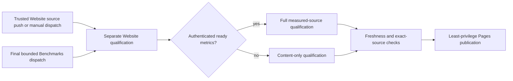
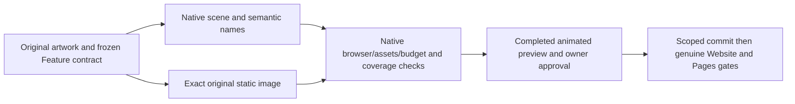

# ADR-040: static product website, conceptual Three.js and qualified evidence

Status: Accepted. Website and renderer source are present. Implementation and
qualification status are owned by the active [implementation status](../implementation/status.json);
this decision does not claim delivery acceptance. Owner:
BenchmarkComparisons. Related REQ-BC-011..018, 024/025, 027..029 and
REQ-BC-WEB-001..007 and REQ/AC/TASK-BC-PRESENTATION-005 in
[BenchmarkComparisons](../Features/BenchmarkComparisons.md), with current vector
and workload details in [VectorQualification](../Features/BenchmarkComparisons/VectorQualification.md)
and [ScaledWorkloads](../Features/BenchmarkComparisons/ScaledWorkloads.md).

## Decision

Deliver a semantic, responsive static product site in the canonical
BenchmarkComparisons slice. Product text, navigation, accessible evidence and a
poster remain available without JavaScript, browser graphics, reduced motion or
WebGPU. The lazy Three.js figure is conceptual: it must not imply live node
readiness, replication timing, traffic or measurement values. The current hero
illustrates composable models around one database; it does not depict physical
RF3 membership. Logical partitions remain distinct from physical hosts that own
node-local storage.

Use the pinned same-origin Three.js 0.186.1 MIT distribution, one lazy
WebGPURenderer and its native WebGL2 backend selection; use public lifecycle/error
APIs and no CDN or compatibility shim. Keep procedural geometry only. Bound the
renderer to one canvas, DPR <= 1.5, <= 1,000,000 drawing-buffer pixels, <= 30 draw
calls and <= 120,000 triangles. The owner explicitly requests sufficient polygons
for smooth detailed model silhouettes. Render on initialization, resize and bounded
input; animate only while visible, playing and permitted by motion preferences.
A paused or reduced-motion pose settles within 500 ms with no idle loop. Stop
hidden/offscreen work, honor
reduced/coarse motion, and dispose unpublished resources after canceled
initialization. Resize-to-zero, repeated disposal, pageshow restoration and
unrecoverable graphics failure leave the static poster and text usable. Physical
graphics-device loss that is not actually exercised remains unverified.

## Evidence and product integrity

The numerical explorer consumes only a complete authenticated current aggregate
selected by the current evidence pipeline. It keeps existing arithmetic, failure
denominators, null/unsupported values, units, labels and presentation behavior.
It clears dependent values and provenance together on invalid, unavailable,
rapidly superseded or failed loads; stale generations cannot republish. The
published output must not contain synthetic, mixed, partial, stale or
unauthenticated measurements. An unavailable metrics cohort produces an accurate
content-only site with no numeric catalogue, aggregate or figures. Ready metrics
enrich content only after the original run, exact source, artifacts, real native
image identities, actual caller workload and all current provenance checks
authenticate successfully. The native engine and caller evidence remains bound to
the measurement itself under the current comparison contract; the website never
infers it from a label, source setting or synthetic row.

Keep the pinned renderer's original distribution and license bytes, hashes and
sizes in the feature inventory. Authored JavaScript remains at most 40 KiB gzip
and authored CSS at most 20 KiB gzip; vendor bytes and compression are accounted
separately. Authored modules, static assets, builder output, source identities,
renderer usage and measured inputs are validated by the existing site tests and
evidence contracts. Confine same-origin report/run paths, require unique identities
and exact raw SHA-256, and do not treat a supplied run URL as authentication. The
browser and coverage collectors must use real generated files and native Node/Chrome
observations, not a DOM/fetch mock or fabricated receipt.

REQ-BC-024 / AC-BC-024 requires exact-source authored JavaScript coverage of at
least 80% executable lines and 70% available V8 block outcomes, plus at least 90%
line coverage for every current critical measurement, validation, build and
provenance module. Missing source, range, browser-session mapping or native report
fails closed. Each browser session needs its own mapped authored evidence; one
session cannot hide another session's empty or unmapped receipt. Native V8 ranges,
source hashes, runtime identity and branch interpretation remain independently
bound. Functional coverage excludes load, stress, performance and comparison
runs. Source-mapped CRAP and existing no-decrease/code-quality gates remain
mandatory under [ADR-033](ADR-033-code-quality.md); CRAP is unmeasured until
complete functional coverage and same-cohort complexity evidence exist.

REQ-BC-025 / AC-BC-025 requires the real available Chrome process, BCL CDP and
WebSocket, isolated emitted site files/HTTP, actual controls and visible
caller-facing outcomes, native coverage, bounded diagnostics and joined child
process/readers. Browser startup, CDP, coverage shutdown and original process exit
are one owned lifetime. Missing Chrome, incomplete source coverage or unexpected
console errors fail. Visual composition and physically unavailable graphics-loss
behavior retain only the explicit manual evidence boundary; manual review does not
qualify numerical coverage.

## Workflow and publication contract

Build and Tests, Benchmarks, Website and Release remain four distinct workflows.
Build and Tests owns the full solution build and required ordinary, scalar,
recovery and Aspire RF3 suites. Website runs independently on trusted own-main
source pushes and manual dispatch; it does not wait for Build and Tests or a
successful benchmark job. The final Benchmarks job sends one bounded dispatch to
the separate Website workflow after aggregation dependencies settle, including
when benchmark checks or aggregation fail. That dispatch may carry only an
optional authenticated producer run id for bounded completion waiting. Website
authenticates the original run and independently selects a ready current producer;
the supplied id is not measurement authority. There is no workflow-run
completion subscription. Workflow-source checks prove declared configuration, not
that hosted Actions executed or Pages published; those outcomes require actual
run/job/artifact and provider evidence.

On a ready authenticated cohort, Website qualifies the matching complete
measured artifact and publishes the corresponding output after freshness checks.
When no ready producer exists, it qualifies and may publish content-only output
without measurements. Malformed, corrupt, expired, duplicate, foreign, changed or
incomplete selected evidence fails closed without silent fallback. A changed
website source or selected producer tuple requires fresh qualification. The final
Pages step uses least privilege and retains the actual source, test/coverage,
artifact, freshness and provider receipt. The site does not trigger DNS or database
deployment.

## Acceptance and current status

| Requirement | Acceptance boundary |
|---|---|
| REQ-BC-011 | Responsive product purpose and navigation at the exact required desktop/tablet/mobile widths; no overflow or clipped controls |
| REQ-BC-012 | One pinned bounded conceptual Three renderer with real init/cancel/disposal/resize/pause behavior |
| REQ-BC-013 | Accessible semantic labels/focus and usable no-JavaScript, reduced-motion, coarse-pointer and unavailable-graphics content |
| REQ-BC-014 | Preserve all six accepted scenarios, eleven metrics, per-run median/failure arithmetic, unsupported values and display behavior |
| REQ-BC-015 | Atomic report/provenance state; corrupt, rapid, failed or unavailable loads cannot mix data or leave stale downloads |
| REQ-BC-016 | Canonical feature assets, exact vendor/raw bytes, isolated clean output, <=40 KiB authored JS and <=20 KiB authored CSS gzip |
| REQ-BC-017 | Centrally pinned TUnit site suite with real bounded Node process; only exact-source GitHub execution qualifies |
| REQ-BC-018 | Exact site/measured source and evidence provenance; no inference from an old source or incomplete producer |
| REQ-BC-024 | >=80% authored JS lines, >=70% available V8 block outcomes, >=90% lines for each critical module, source-mapped CRAP and no-decrease gates |
| REQ-BC-025 | Real available Chrome/CDP against emitted files, actual browser controls and per-session mapped native coverage |
| REQ-BC-027 | Current pinned website analyzer dependency and exact source/pipeline validation |
| REQ-BC-028 | Optional authenticated current aggregate, complete archive/source/freshness and publication authority |
| REQ-BC-029 | Current shared KeyLoad visual identity without changing evidence semantics |
| REQ-BC-PRESENTATION-005 | Original-artwork native composition, eight model platforms, one agent, eight cables, no generic clients/scene logo; exact original static fallback and meaningful native/browser/owner proof |
| REQ-BC-WEB-001..007 | Independent Website source/manual runs; optional ready metrics or accurate content-only output; bounded final Benchmarks dispatch; complete mode-specific qualification, freshness and provider publication |

The feature specification owns detailed contracts, module inventory, executable
cases and test mappings. The active-source status file reports current qualification. Local development
checks do not qualify delivered source; only exact-source Linux GitHub evidence
with no skipped required cases does.

Every local build, static check, browser review and Aspire-owned development test
is labeled development evidence. Delivered-source qualification is exact-SHA
Linux GitHub evidence with no skipped required cases. The real site suite uses
TUnit and actual Node and Chrome processes through the owner's test workflow.
Package, data format, public API, RF3 topology, benchmark workload and database
storage decisions remain outside this ADR.

## Consequences and rollback

Readers receive a fast static product experience with optional genuine evidence;
the renderer remains a bounded conceptual enhancement. Website can update its
content when benchmark evidence is unavailable without inventing a numeric result.
Rollback restores a coherent site asset/source set and retains the last verified
publication and immutable inputs. It never restores a publisher bypass, synthetic
metrics or weakened coverage, source, browser or provenance gates.

## Current original-artwork presentation contract, 2026-10-09

REQ/AC/TASK-BC-PRESENTATION-005 in the Feature specification supersedes the earlier
carousel, silo/grain, client-box and repeated-mark hero illustrations. The owner
selected `site/Features/BenchmarkComparisons/assets/agent-context.png` directly:
a central three-layer steel/glass database, human agent above it, upper-left
table/SQL, upper-right graph, left-middle time series, right-middle vector cloud,
lower-left event orbits, front-left queued cards, front-right file folders and
lower-right document pages. Eight actual native cables join the eight model
platforms to the database. Preserve detailed smooth geometry, finished bevels,
studio lighting and peach/lilac/periwinkle reflections within the updated
120,000-triangle bound. The live canvas uses procedural native geometry, never a
raster plane. The original artwork supplies the accessible static fallback.
No generic client boxes, repeated scene logo, visible client/silo captions or
alternative silo/grain interpretation remain in this current contract.

The actual geometry graph supplies `data-scene-models=8`, `data-scene-agents=1`,
`data-scene-links=8` and `data-scene-clients=0`; attributes do not fabricate RF3
membership. All nine model names remain in a semantic sr-only list, with SQL
combined visually with the table. Existing renderer/vendor fidelity, no external
requests, native motion/pause/visibility/disposal, responsive accessibility and
coverage gates remain unchanged. No packages are added. Database RF3 topology,
request grains, node-local storage, SQL conformance and measurement semantics
are outside this presentation task.

Ordered implementation and join contract:

1. Establish Feature REQ/AC/TASK-BC-PRESENTATION-005 and this ADR before source writes.
2. Root constructs and batches native geometry in `scene-geometry.mjs`, integrates
   semantics in `index.html`/`scene.css` and actual graph attributes through
   `scene-lifecycle.mjs`/`scene-observers.mjs`; existing lifecycle behavior remains.
3. The disjoint fallback worker updates only the canonical builder asset inventory
   and original fallback path; the test worker updates only the existing native
   BenchmarkComparisons TUnit/Chrome scene/asset assertions. The contract worker
   owns only the Feature specification and this ADR. Root reviews every join.
4. Native tests inspect actual rendered desktop/mobile frames, geometry counts,
   original fallback delivery, accessible names, motion/pause and renderer budgets.
   Screenshot/motion judgment remains the explicit visual-composition exception.
5. Show the completed local animated preview and obtain owner approval before
   commit/push under site policy. Genuine exact-source Linux Website qualification
   and a real Pages provider receipt remain separate delivery gates.

Rollback restores the coherent reviewed native scene, accessible semantics,
fallback inventory and matching assertions through a source revert while preserving
unrelated work, immutable original evidence and all publication/coverage gates.
It does not retain a second renderer or use a still image as the live scene.

Current stage: native implementation and the exact original-artwork fallback are
present. The 2026-10-09 owner-requested Website build repair aligns the existing
asset and browser assertions with this composition while preserving motion,
fallback, accessibility, coverage and publication gates. Manual browser evidence
and successful scoped compilation/static building are recorded in the Feature.
Content-only Linux qualification and Pages publication passed for revision
`1963cd255c538a2577bb9e582c761c1ade9d6f33` in
[Website run 37987385285](https://github.com/managedcode/KeyLoad/actions/runs/37987385285),
with all five native site cases passing and the same revision in the live
publication receipt. Owner visual approval remains separate. Neither this
content-only publication nor earlier local results qualify database behavior or
benchmark measurements.
