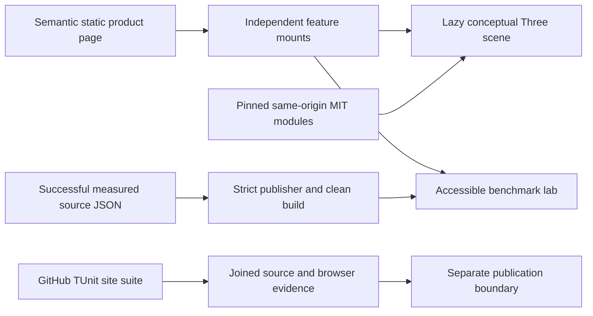
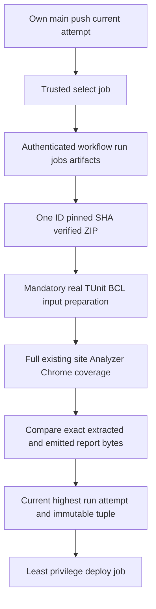
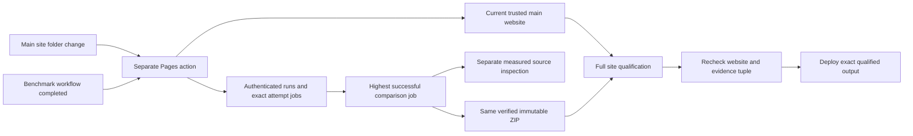

# ADR-040: Static product website, conceptual Three.js and qualified evidence

Status: Implemented for the website scope; exact-H GitHub qualification, automatic publication and strongest final review complete. Date: 2026-10-02. Owner: website lead. Related: REQ-BC-011–018 / AC-BC-011–018, [BenchmarkComparisons](../Features/BenchmarkComparisons.md), [acceptance](ADR-040-static-site-threejs-evidence.md), [plan](ADR-040-static-site-threejs-evidence.md), ADR-021/032/034.

## Context and decision

The owner requests a website design appropriate for KeyLoad and real Three.js. Keep plain static HTML/CSS/ES modules, introduce a product-first editorial composition and a conceptual RF3 architecture figure, retain the complete numerical benchmark explorer and move feature-owned assets into the canonical BenchmarkComparisons slice. A framework/backend migration would add unrelated boundaries and risk evidence parsing; a CSS-only repaint would not explain the product or satisfy Three.js.

Three.js is a lazy independent architectural decoration. Three physical hosts own storage; logical atomic partitions remain distinct. It never depicts live readiness, replication timing, traffic or benchmark values. DOM content, poster, captions and links carry the facts. The numeric explorer uses only successful raw GitHub schema2 evidence until the separately accepted schema3 publisher qualifies all required profiles. No invented winner, stale mixed state, partial invalid report or current-source qualification claim.

## Dependency, renderer and preservation contract

Pin Three.js0.186.1 MIT from [official npm distribution](https://registry.npmjs.org/three/-/three-0.186.1.tgz), source commit9b4a2ac29c63ccb43fd51c5661f2f873ac2c39b8. Expected SHA512 integrity: `sha512-blFeqb49wRCSGUGj7gtpfnSGHy2lwDk94RhUmS1c/hTby70kvChbWpkJ4Pm1390LqzzvTmzgXKHPEafJwCb8jA==`. Vendor only original build/three.webgpu.js, build/three.core.js and LICENSE under site/Features/BenchmarkComparisons/vendor/three/0.186.1, with file hashes, bytes and gzip sizes in a manifest. No package/framework/global installation or browser CDN. Preserve unmodified distribution bytes and license; this narrowly documented exception to authored LOC/type/function/literal limits applies only to those third-party files. The shared workspace additionally records upstream `space-before-tab` handling for the pinned vendor files in `.gitattributes`. Earlier isolated A–E validation candidates retained their parent attributes; exact H includes the separately reviewed attributes integration, preserving all original vendor bytes. Preserve the hash-verified distribution bytes; authored files receive ordinary checks. Repository-authored wrappers obey all limits. Upgrade replaces the versioned directory coherently after full hash/browser/CI review; no second legacy renderer is retained.

Use WebGPURenderer, await init and node materials. The [native renderer](https://threejs.org/manual/pages/webgpurenderer) selects WebGPU or its own WebGL2 backend; no custom compatibility fallback. Use public onDeviceLost/onError from the [pinned renderer source](https://raw.githubusercontent.com/mrdoob/three.js/9b4a2ac29c63ccb43fd51c5661f2f873ac2c39b8/src/renderers/common/Renderer.js), not private backend/device access. Intentional device.destroy is ignored by the [pinned backend loss handler](https://raw.githubusercontent.com/mrdoob/three.js/9b4a2ac29c63ccb43fd51c5661f2f873ac2c39b8/src/renderers/webgpu/WebGPUBackend.js); it cannot be presented as actual public loss qualification.

Procedural geometry, no external model/texture/font/control package, shadow maps, postprocessing or compute. One renderer/canvas; DPR≤1.5, drawing buffer≤1M pixels, draw calls≤30, triangles≤5K. Render on init/resize/bounded pointer input, settle≤500ms, no perpetual idle loop. Reduced/coarse motion remains static; hidden/offscreen/pagehide stops work. Cancelled asynchronous init must dispose unpublished resources. Resize-to-zero, repeat disposal and pageshow restoration are explicit. Unrecoverable graphics errors stop only decoration and expose the always-present poster/text, with no reload/retry loop. This progressive static/graphics composition is the new complete UI, not retention of an obsolete implementation.

## Evidence and test boundaries

Root freezes safe catalog/report/run paths and DOM hooks in contracts.mjs. Same-origin confined run paths, unique IDs, structural schema2 validation, exact raw SHA256 and allowlisted repository run URLs prevent arbitrary URL/input use. Authenticated successful-run verification remains the publisher parent's job; a passed URL is not authorization evidence. Every profile load clears/disables all report surfaces together, aborts previous work and rejects late generations. Preserve median per-run arithmetic, failure denominators, null/unsupported values, metric units, generator labels and existing logarithmic semantics.

Introduce independently buildable KeyLoad.SiteTests with existing centrally pinned TUnit1.72.10/MTP/net10/BCL and central analyzers, no Core dependency. Its bounded real Node child process imports production modules; independent C# oracle asserts authentic successful-CI reports and controlled invalid input cases. Node is the production JS runtime, not a second test runner. Preserve all old median/repetition/failure/unsupported/order intentions before deleting measurements.test.mjs. Qualification runs only GitHub Actions; local build/static review/manual browser preview do not qualify tests, coverage or publication. Visual quality and real browser/device lifecycle have the explicit evidence exception in AC-BC-011/012/013; physically unexercised GPU loss remains unverified.

Raw-hash acceptance additionally invokes the production `loadReport` through an actual ephemeral static HTTP listener over builder-emitted files. A copied raw file is deliberately changed without changing its catalog hash, so the genuine fetch/hash pipeline must reject it. This is a real static hosting path with confined file access and bounded teardown, not a substitute service or mock dependency. It executes only in GitHub with the rest of TUnit; corrupt copies never become public output.

## Implementation contract and join

1. Root records brainstorm→acceptance→plan, Feature BC011–018, this ADR and strongest COMPLETE TASK-SITE-PLAN-001 before delegated writes. User scope authorizes design/Three dependency, not backend/schema/runtime/publication changes.
2. Root alone owns contracts.mjs, bootstrap.mjs, build-site.mjs, scripts/build.mjs, vendor, workflows, shared docs, new SiteTests policy/project, solution/governance inventory and superseded-file removal. Create new local AGENTS before project code.
3. TASK-SITE-VISUAL-002 owns feature index.html/styles.css/tokens.css/assets/cluster-poster.svg only. TASK-SITE-SCENE-003 owns cluster-scene.mjs/scene-geometry.mjs/scene-lifecycle.mjs/scene-observers.mjs/scene.css only after vendor proof. The additional observer helper is a reviewed scope extension to preserve the mandatory 400-line authored-file limit while isolating listener/observer ownership; it does not change the public mount or dependency contracts. Both gpt-6-luna high; exact root DOM/mount contracts, no same-file writes.
4. TASK-SITE-TEST-004 owns only SiteTests/Features/BenchmarkComparisons test files after policy/project/probe protocol. Tests derive from acceptance before evidence code. TASK-SITE-EVIDENCE-005 owns measurements.mjs/measurement-loader.mjs/benchmark-lab.mjs/benchmark-chart.mjs/benchmark-profiles.mjs only, after frozen test assertions. No new parser schema or dependency invention.
5. Each worker returns complete/blocked/failed/cancelled, all paths/hashes, source/static evidence and unresolved issues. Missing APIs, policy conflict, overlap, changed contract or scope expansion stops dependent work. Partial/unverified output cannot join.
6. Root joins every COMPLETE packet, reads every diff, integrates a coherent canonical asset/build migration and removes replaced flat site files only after proof. Validate vendor/raw bytes, syntax, limits, links, clean output and policy inventory; build a disposable authentic-evidence preview.
7. Root records real first-render desktop/tablet/mobile, keyboard/controls/error/provenance and scene lifecycle/browser observations. GitHub executes the full relevant TUnit site suite at exact source SHA; preserve run/job/artifacts and measured-source SHA. Strongest TASK-SITE-REVIEW-007 reviews all combined files/evidence, fixes are rejoined and affected checks repeated.
8. Record source/static/manual/GitHub/coverage/publication states separately. Existing Pages checks out measured source; a future two-revision public design/data contract requires separate review. No public deploy or DNS action is included here. This ADR stays Accepted until every required gate actually has evidence.

Mount contracts: mountBenchmarkLab({root,catalogUrl}) returns {dispose}; asynchronous mountClusterScene({host,motionButton}) returns {dispose,setMotionEnabled}. Neither imports the other. DOM hooks are root-frozen and shared constants own authored boundary values. Import specifiers and static HTML/CSS/asset source are declarative syntax; implementation comparisons, paths, labels and resource limits use named symbols.

### Mandatory coverage and real-browser gate

Strongest coverage analysis is COMPLETE; unconfigured coverage is a pending gate, never an exception to root thresholds. REQ/AC-BC-024/025 extend the same slice before additional writes. Normal Node processes inherit NODE_V8_COVERAGE; the real system Chrome process exposes precise Profiler coverage through BCL CDP/WebSocket. All qualification still runs in GitHub TUnit. Check and retain browser availability/version; do not install a browser or package, fabricate DOM/fetch, use node:test, import node:internal APIs or reduce sandbox protections.

The required authored source inventory is every .mjs emitted by the feature plus build-site.mjs and site/scripts/build.mjs. Exclude only unchanged official vendor, test infrastructure and non-JavaScript assets. Match Node file URLs and browser same-origin emitted paths to exact physical source bytes/hashes; validate UTF-16 offsets (including Unicode/CRLF), nested/out-of-bounds/crossing ranges and differing subprocess partitions. Merge execution over real runs, count executable nonblank/noncomment source lines using the most specific interval execution state, and report V8 block-range branch semantics explicitly. Never label byte coverage as line coverage. Missing source coverage fails. The first retained numerical result is the baseline.

Enforce aggregate authored JavaScript≥80% lines and≥70% available V8 block branches. Critical measurements.mjs, measurement-loader.mjs, build-site.mjs, benchmark-lab.mjs and benchmark-profiles.mjs each require≥90% lines, explicit successful/rejected-operation tests and all existing assertions. Native coverage/report converter regressions use real Node-produced ranges with independently known branch outcomes; include uncalled/nested functions, differing partitions, malformed ranges, Unicode/CRLF, missing files and changed source bytes. The after-session hook joins all bounded child processes before producing/failing the deterministic report; no concurrently incomplete report can pass.

TASK-SITE-COVERAGE-008 owns new SiteCoverage-prefixed C# helpers/tests only. TASK-SITE-BROWSER-009 owns new SiteBrowser-prefixed C# helpers/tests and the existing real static-file host MIME/teardown boundary only. Their contracts are frozen before writes; no overlap with completed original test/probe files. Root owns workflow/feature/ADR/plan and final integration. BCL Chrome tests assert actual generated UI and numeric/provenance correspondence, atomic error/retry and lifecycle using real files and browser actions. Retain native ranges/browser version/source metadata. Manual composition/device review is additional evidence and cannot qualify numerical coverage. Required COMPLETE packets and exact-source GitHub gates precede strongest final review.

## Migration, consequences and rollback

Strongest TASK008 converter review requires TASK-SITE-COVERAGE-REPAIR-013 before
join. Preserve native receipt identity/hash and scriptId (optional context) in
source-specific snapshots rather than flattening functions from every process.
Resolve the deepest function/block for each offset within each snapshot, then OR
the independent execution states. V8 may omit a child range whose counter equals
its parent; a global narrowest-range contest would let one process's zero suppress
another process's positive inherited execution. Physical function source/span owns
identity; names remain metadata. Observed native child intervals own the branch
denominator. An explicit identical positive range proves an outcome; an omitted
range requires positive effective state throughout that canonical interval inside
the same physical function snapshot. A positive outer explicit outcome is not
disproved merely by an unexecuted descendant, and unrelated module execution is
never proof of a function outcome.

The worker owns only SiteCoverage-prefixed source/tests, reusing existing process
output/cleanup helpers without editing them. Real choose(true/false) Node receipts
must prove statement lines4/6 covered, neverCalled line8 uncovered, exact totals
and reversed-order equivalence. Select malformed/crossing targets by exact fixture
URL, not native array position; replace invented equal function spans with real
separate/nested-function fixtures. Bound and drain both process pipes before exit,
kill/join on failure and retain source/hash/native evidence. Root reviews the full
coherent packet and integrated compiler/GitHub thresholds; no excluded source,
synthetic measured data or weakened80/70/90 threshold is authorized.

Strongest incremental REVIEW007 found real defects in the authored Browser009
packet before qualification: CDP params wire naming, MIME case, Promise waits,
media feature shape, unsupported/completion oracle formatting, lazy startup order,
client-abort handling, stale-profile/linear-log geometry assertions and actual
renderer/error/coverage receipt proof. TASK-SITE-BROWSER-REPAIR-012 owns only
SiteBrowser-prefixed tests/helpers and SiteStaticFileHost. It writes/strengthens
acceptance assertions before preserving repairs, retains native coverage before
each navigation and at completion, requires a genuine supported positive renderer,
and records actual runtime errors including consoleAPICalled. No production,
measurement, schema, package, policy or threshold change is authorized. Root joins
all source/format/build/GitHub evidence; original009 COMPLETE source is not a green
gate. Every source packet must close findings before strongest final acceptance.

Root's actual Chrome Page.getFrameTree observation additionally confirmed that
frame.url omits the fragment and urlFragment contains #benchmarks. The bounded
TASK012 follow-up must compare frame.url plus its optional urlFragment with the
requested URL while preserving frameId/loaderId and complete-document/exact-href
checks. Existing fresh generated-page navigation exercises this real contract in
GitHub; no synthetic browser receipt or unconditional ready predicate is accepted.

The candidate's required analyzer dependency additionally follows REQ/AC-BC-027
and the Accepted ADR-033 website substage, with native collector18.11.2 and the
exact source/pipeline contract. TASK011 owns disjoint new tooling/tests; root owns
workflow/pins/docs and waits for its COMPLETE packet plus real numeric evidence.
This does not broaden website delivery into product/RF3 coverage qualification.

Migrate site/index.html/app.js/styles.css/measurements.mjs and scripts/measurements.test.mjs to the accepted feature/template/TUnit surfaces as one reviewed change; keep scripts/build.mjs as a thin executable composition entry and favicon as a shared asset. Add SiteTests to the solution, architecture and current governance inventory without changing existing policy text. ADR-032 old layout debt is closed only for the migrated site, not for unrelated backend/tests.

Benefits: a clear product identity, same-origin bounded graphics, accessible evidence and an independently runnable site qualification gate. Costs: a lazy vendor payload recorded separately and another centrally governed TUnit project; browser/device review is still necessary. Rollback restores the prior coherent asset/build set and evidence access, retains immutable measured artifacts, and never weakens policy/tests or mixes incompatible module versions. At this historical design stage, Core, quality/coverage, schema3/cluster comparisons, DNS and publication remained distinct pending gates; the scoped website closure below records the fulfilled website qualification and publication.

### Native equal-span function contract

The [V8 native coverage implementation](https://raw.githubusercontent.com/v8/v8/main/src/debug/debug-coverage.cc)
explicitly permits a script wrapper and uncalled inner function with identical
spans; native report order is nesting order and the inner function is last.
TASK013 must preserve that order and resolve equal-span ties to the native
innermost function within each snapshot. Apply this selection to line resolution,
explicit outcome checks and omitted-child inference, so script execution cannot
prove an uncalled inner function executed. Names remain metadata and span-based
branch denominators stay unchanged. A real Node single-function source with no
trailing newline proves native equal spans/order and uncovered function state;
retain the existing Unicode/CRLF9/8line2/2branch and reversed-receipt regressions.
Only source review/build and exact-SHA GitHub execution can join this correction.

Native converter regression evidence must survive temporary-directory teardown.
TASK013 retains unchanged real fixture source, original Node receipts, stdout and
raw SHA256/identity metadata under a separate converter-fixtures subtree of
KEYLOAD_SITE_COVERAGE. These files are uploaded for review and never enter the
production node/ or browser/sessions/ coverage denominators. Preserve original
native bytes and cleanup of owned temporary files; mutated malformed/crossing
copies must not be labeled or retained as actual executed native evidence. Root
reviews the retained packet and actual GitHub converter assertions before join.

Read-only hosted-runtime preflight confirms that validation discovers Chrome and
configures browser/native coverage roots. The separate legacy publish job lacks
these required site-suite inputs and checks out the measured revision, which may
predate this suite. It is not a qualified delivery path for the redesigned site.
Publication remains explicitly deferred: a future approved two-revision release
must use qualified website source, independently authenticated measured evidence
and the complete browser/native coverage inputs. Do not run publish or count its
existing configuration as passing publication; no validation test may be skipped
to bypass this boundary.

### Observed portability repair implementation contract

Related REQ/AC-BC-016/017/024/025: actual run36994330874 proves that historical
gzip length is not vendor byte identity. The accepted repair preserves original
vendor/manifest bytes and all fixed identity checks, validates historical
compression as a positive safe integer, and measures current compression in the
separate CLI `compression` receipt frozen in ADR-040-static-site-threejs-evidence.md.

1. Root records the actual failing positive-build/browser baseline, acceptance
   schema and exact bounded task graph. Strongest contract review must be COMPLETE
   before writes; no hosted missing gzip value is invented.
2. TASK-SITE-VENDOR-PORTABILITY-019 (gpt-6-luna high) owns only build-site.mjs plus
   new SiteVendorBuildTests/SiteVendorTestScope/SiteVendorTokens. Tests first use
   actual isolated unchanged source/vendor/authentic reports, retain successful
   metadata portability and identity/byte/hash/length/invalid-gzip rejections.
3. TASK-SITE-BUILDER-DIAGNOSTICS-020 (gpt-6-luna high) owns only SiteBuildSupport,
   SiteBrowserSession, SiteBuildTests, SiteEvidenceValidatorTests and new
   SiteBuilderDiagnostics/SiteBuilderDiagnosticsTests/SiteBuilderTokens. Persist
   actual bounded completed-process receipts under the evidence sibling directory,
   correct the pre-Chrome failure label and strengthen intended negative errors.
   Preserve all process APIs, bounds, timeout/cancellation/drain/cleanup contracts.
4. Both scopes preserve vendor, measurements, analyzers, configuration, workflow,
   source inventories and thresholds. Unknown contract, overlap, dependency or
   limits issue stops/escalates; do not silently expand ownership.
5. Root joins all COMPLETE source/hash/assertion packets, strongest full review,
   development build/format/static checks, ordinary exact-source candidate and
   complete real GitHub qualification. Site/native80/70/90 and every real browser
   assertion remain mandatory. Missing/partial/failed evidence blocks final007.

No runtime/database migration. Rollback restores the coherent builder/test source
set while retaining original vendor/raw reports and failed-run artifacts. A
reversion cannot qualify the still-failing builder. Publication remains separate
until the owner's subsequent fresh-evidence extension is frozen and qualified.

### Fresh-evidence publication implementation contract

The owner's subsequent request introduces REQ/AC-BC-028 in the same canonical
slice. [Publication brainstorm](ADR-040-static-site-threejs-evidence.md),
[acceptance](ADR-040-static-site-threejs-evidence.md) and [plan](ADR-040-static-site-threejs-evidence.md)
preserve the earlier design task's scope records; this new workflow task resumes
publication implementation. DNS remains excluded. Mandatory measured-source
checkout is preserved: site/measured SHA fields are separately recorded and equal
for publication. Manual candidate validation cannot deploy.

1. TASK-SITE-PUBLICATION-PLAN-023 strongest read-only planning and exact recorded
   contract approval precede every021/022 write. AC028's complete positive/negative/
   edge/error/test/operational matrix controls execution. No policy weakening.
2. TASK-SITE-GITHUB-EVIDENCE-021 (gpt-6-luna high), after019 source completion,
   owns only four NEW production modules github-evidence-contracts/runs/proof.mjs
   and github-evidence.mjs plus six NEW SiteGitHubRunSelectionTests,
   SiteGitHubJobArtifactTests, SiteGitHubEvidenceDigestTests,
   SiteGitHubEvidenceFreshnessTests, SiteGitHubEvidenceScope, SiteGitHubEvidenceTokens.
   Exact CLI/errors/receipt and captured metadata fields are frozen in acceptance.
   Real bounded Node/native execution; tests first with authentic captures and
   controlled mutations. No HTTP/ZIP parser, fabricated API, arithmetic or existing
   source/config/docs changes. All four modules require critical90 coverage.
3. TASK-SITE-GITHUB-ARCHIVE-022 (gpt-6-luna high), after020 refreshed completion,
   owns only six NEW SiteGitHubArchiveSetup/Reader/Receipt/Tests/RejectionTests/Tokens.
   Actual verified ZIP/BCL inputs: preflight complete exact9file set and optional
   unique empty profile dirs before output; reject links/aliases/traversal/unknown/
   size violations, bound streams, retain unchanged ZIP/raw-file hashes. No optional
   standalone production extractor or pre-extracted/fallback qualification path.
4. Root owns024 shared integration: pages.yml select→fullqualify→deploy, policy/
   protocol/docs, dedicated actual-source environment, mandatory input before/after
   hooks, closed four-module source inventory/critical90, final raw/provenance
   receipt. Do not edit ci.yml, runtime/TimeSeries, README or global status scopes.
5. Workflow code/selection use trusted github.workflow_sha. Authenticated APIs read
   full workflow/runs, exact-attempt jobs and artifacts; validate own main/push/
   workflow/SHA/current attempt, all successful jobs and unique comparison-smoke.
   Required successful unique step names are `Run dotnet test --project
   tests/KeyLoad.ComparisonTests --no-build --no-restore --configuration Release`,
   `Measure 1 KiB documents, eight clients and three graph hops`, and
   `Measure 16 KiB documents, four clients and five graph hops`. Actual numbers
   remain metadata. Artifact digest/size/workflow_run/creation interval bind its
   immutable ID; no nonexistent artifact job/attempt fields or digest-warning pass.
6. Publish requires the highest main-push run number/current attempt itself fully
   successful. Newer failed/cancelled/pending blocks refresh; older wake-ups cannot
   roll back live evidence. Recheck complete run/attempt/SHA/job/artifact/digest
   immediately before deploy and retain timestamp; no claim of atomic CI lock.
7. Root joins every COMPLETE packet/full diff/hash/test matrix, strongest source
   review, enabled build/format/static governance, then ordinary exact-source
   candidate and complete real GitHub/native/browser thresholds. Failed/partial
   workers block dependants; limits/unknown APIs/contracts escalate, never bypass.
8. Actual automatic transport/cross-job transfer/permissions, qualified MAIN
   producer, provider deployment and live JSON/UI matching remain operational
   gates. Publish data/publication.json with real source/run/job/artifact/report/
   qualification provenance. No source review or controlled fixture is a deploy
   receipt. ADR stays Accepted until every required evidence gate is satisfied.

No database/persisted-format migration. Rollback restores coherent workflow/site,
retains last verified live evidence and every immutable failed/successful receipt,
and never restores a bypass. Historical success15 cannot qualify current
database source/schema3/readiness.

### Owner-directed website-only contract revision, 2026-10-02

The owner explicitly directed finishing only the website, with its separate action
triggered by site folder changes or completion of benchmark work. This supersedes
the earlier conservative-B and equal-site/measured-SHA publication task restrictions
recorded above and in local AGENTS.md. Those records remain intact; no website
qualification threshold, report validation, trust check or prior unrelated rule is
weakened. Successful-run wording now means the actual successful comparison job;
never falsely label a failed enclosing workflow successful.

Implementation contract for REQ/AC-BC-028 under TASK021/022/024:
1. Strongest023 approves the revised exact acceptance/plan before021 writes. Four
   Node modules and six evidence tests retain their disjoint ownership. Exact
   select needs_attempt/selected/unavailable states and capture trail are in the
   updated acceptance; root owns authenticated bounded REST collection.
2. Descending main-push run numbers and attempt history choose the highest actual
   successful comparison-smoke job. Missing/pending/cancelled/failed comparisons
   continue to earlier attempts/runs. Required successful steps remain the exact
   three names above. Once successful comparison is selected, missing/expired/
   ambiguous artifact or invalid report fails there, never silently falls back.
   Required inaccessible history fails. Monotonic selection assumes retained
   Actions history; administrative deletion is outside that guarantee.
3. Current trusted-main website, measured report source and control workflow source
   are sibling checkouts, never nested. Measured checkout is inspected for producer
   definition/provenance only, without database build/tests. Dedicated actual site
   SHA drives every source/coverage receipt; all existing site gates remain.
4. Root024 adds main site/** push trigger, retains workflow_run and manual modes,
   removes whole-CI-success conditions, and rechecks both latest trusted-main website
   SHA and full immutable selected measurement tuple immediately before deployment.
   A changed snapshot requires fresh qualification; previous live output remains.
5. Exact same-ZIP preparation/raw rechecks, complete native/source/Chrome coverage,
   metadata receipt and final publication.json remain mandatory. Actual producer
   job/automatic consumer/provider/live proof closes this website task without
   waiting for independently owned database/performance implementation gates.
6. Rollback retains prior coherent source and verified public evidence. No data,
   database deployment or DNS migration. All worker diffs/evidence join at024 and
   strongest final review; this ADR remains Accepted pending required live proof.

Actual authenticated artifact11193564650 inspection corrects the earlier inferred
exact-nine ZIP shape: verified SHA25682aa46027dd143e3da6678e81ac881511068ac2329074ce59640952ad43ffdb2,
357910 compressed bytes, exactly12 regular entries (three profiles × results.json,
samples.csv, results.md, runner.log), 3469609 uncompressed bytes. Strongest023
independently confirmed these bytes. TASK022 MUST preflight exactly these12 files,
retain/hash every input, and publish/compare only the existing9 report files.
Runner logs are qualification evidence, never measurement inputs. This explicit
source-shape correction supersedes the earlier nine-entry assumption without
allowing unknown files, weakening confinement/bounds or changing the producer.

Native source compatibility under AC-BC-028/8 is strongest-approved TASK025: one
internal Get-CoverageSourceRevision resolver in existing PowerShell shared tooling.
Present dedicated KEYLOAD_SITE_SOURCE_REVISION is exclusive; empty/malformed
values fail without fallback. Truly absent dedicated input preserves strict
GITHUB_SHA for existing non-Pages callers, avoiding unrelated ci.yml edits. Main
Verify starts revision null and resolves inside try; both inventory paths reuse
the same resolver. Pages mandates verified actual HEAD; SiteTests never fallback.
Eight disjoint native files and child-process-only positive/absent/invalid/changed/
missing-source TUnit regressions are frozen in the plan. No thresholds, source
denominators, collector, XML bytes, or previous assertions change. Root joins all
diffs/build evidence, strongest review and real native GitHub proof before completion.

Root024 centralizes authenticated REST collection in the bounded slice-owned `collect-github-evidence.sh`, called by qualification and predeploy recheck. Node gates retain their four-module pure local-capture boundary. The collector owns authenticated metadata bytes, exact-attempt search, bounded timeouts and proof orchestration; immutable ZIP download remains once in qualification. Actual workflow transport/permissions/callback proof is the explicit AC028 operational evidence requirement, not a fabricated API fixture or shell coverage claim. Root owns source review and real integration.

TASK026 strongest-approved test-only E-run repair maps existing AC-BC-016/025: preserve product sorting and all assertions, qualify catalog by unique IDs plus independent explicit large/small/smoke order. The actual PostgreSQL GraphNeighbors json-16k-c4 p50 median0.47499999999999964 displays correctly as0.47; C# custom double formatting rounded an intermediate15-digit value incorrectly to0.48. Independent display oracle uses R invariant shortest decimal, decimal.Parse(Float invariant), decimal.Round(2,AwayFromZero), then existing en-US format/null marker. Eight named boundary regressions and unchanged complete real-browser flow prove it. Exactly SiteBuildTests.cs, SiteBrowserBehaviorTests.cs, SiteBrowserUiTokens.cs; ordered tests-first→sourcejoin→root build→strongest review→full GitHub Chrome/native gates. No production arithmetic/data changes or coverage waiver.

Final AC028 integration closes fail-closed boundaries identified by root/strongest
source review. Root024 proves equality and retains hashes of all four executed
control metadata modules and the collector against the qualified website source;
reuses that pinned control revision at deployment. Root024 validates extraction
schema, archive binding, reports root and all twelve canonical unique rows before
materializing TSV, counts all twelve rechecks and preserves nine final raw-byte
comparisons. TASK021 expects identities from actual authenticated captures/ZIP,
locates producer steps/jobs by exact name and keeps controlled history/error
inputs distinct from provider proof. TASK022 accepts only consistent validate/false
or publish/true archive receipts with lowercase positive bounded ZIP identity;
validation cannot publish. Full-suite non-skipped TRX hashes/counts and actual
Pages outcome/returned URL extend the retained operational receipts. These
contracts preserve every existing threshold/assertion; tests-first source fixes,
root integration/build, strongest review and actual GitHub/provider joins remain
required in that order. No exception authorizes fake data or a skipped gate.

Strongest022 source review completes the frozen archive edge/error methodology:
the valid optional-empty-directory format case preserves all twelve authenticated
file bytes and adds only an empty profile directory; it is controlled BCL input
validation, never provider qualification. Malformed copies stay rejection-only.
A BCL NoCompression copy with only a known central uncompressed-size field
corrupted exercises actual streamed/declared mismatch through PrepareAsync;
no production parser or substitute dependency is added. Confined extracted-input
mutation exercises actual VerifyUnchangedAsync without global environment changes.
TASK022 retains its exact six-file ownership, stages tests/source/static packet
before root build and strongest join, then full GitHub qualification. The original
authenticated ZIP alone feeds the real website/browser/publication flow.

TASK030 closes the final source-review malformed-input contract under
REQ/AC-BC-028/2,4,5,9.029 owns tests first; root records the real exact-SHA red
GitHub baseline before a bounded economical030 worker edits only the existing
four github-evidence modules. Require positive unique IDs across all jobs/artifact
pages, exactly three named step records with distinct positive numbers, complete
canonical nonduplicate lowercase-hash metadata records including mandatory
captures/selected attempt pair and paired extra trail, ordered parseable job and
artifact times, and positive bounded archive/artifact byte identity. Preserve
commands, receipt schema, error families, valid inputs, module inventory and all
thresholds. Root owns integration/build/format/provenance; strongest source and
exact-SHA GitHub full-suite/coverage joins precede deployment. Missing input fails
closed; rollback retains prior verified public evidence and coherent validator
source. This ADR stays Accepted until actual workflow/provider/live evidence.

TASK032 is the bounded existing-control repair under REQ/AC-BC-014/025. Strongest
source review found undefined METRIC_ID.throughput on queue-phase metric→nonqueue
scenario transition. Economical worker owns only SiteBrowserBehaviorTests.cs
tests-first and benchmark-lab.mjs after the actual red GitHub baseline. Real
Chrome selects QueueCycle ACK then PointRead for each authentic profile and checks
the independent throughput oracle and disabled queue metrics. Replace the
undefined reference with existing CONFIG.defaultMetric. No arithmetic, renderer,
vendor, source inventory, threshold or deployment boundary changes. Root and
strongest join exact source/build/format and full GitHub browser evidence.

TASK034 is a test-oracle correction under REQ/AC-BC-016. Actual F4 full-suite
regression looks for `output/site/Features/...`, but the accepted builder emits
`output/Features/...`. Ordered implementation contract: root records real failing
TRX and this contract; economical worker owns only SiteAssetTokens.cs and
SiteBuildArtifacts.cs, adds a distinct named emitted-feature prefix and changes
exactly three output-path uses; root inspects source/byte/vendor assertions and
serial development build/format; strongest reviews the two-file diff; complete
GitHub native/Site/Chrome/coverage qualification joins before delivery. Keep all
repository source prefixes, fifteen authored assets, four vendor files, raw
report/hash checks and seventeen-source/nine-critical coverage inventory. No
builder, API, dependency, data, renderer or deployment migration; rollback is the
coherent two-file caller restoration with failure evidence retained. Existing
complete-preview test is the positive regression; no helper-mirroring test or
qualification waiver is added. Other implementation owners remain disjoint.

TASK035 completes AC-BC-028's existing bounded history rejection matrix. The
capable caller worker owns only SiteGitHubEvidenceDigestTests.cs and adds a
controlled10001-complete-pair receipt case to the real archive CLI regressions,
keeping required original captures/selected pair and every existing assertion.
Reuse MaxPairs and canonical path helpers; E_ARCHIVE rejection proves the
receipt's structural bound without fake transport or performance data. Root
reviews the single-file diff, serialized development build/format, strongest
source join and complete real GitHub gates in that order. No data/contract/API/
deployment migration or threshold change; production ownership stays with030.

### Native browser zero-delta implementation contract

REQ/AC-BC-024/025/028 retain valid CDP empty browser arrays as original hashed
zero-contribution receipts. The official Profiler array contract and actual G
initial-blank receipt establish the source error; Node-empty/non-array/malformed
remain rejected. Every browser session independently requires mapped authored
functions; another valid session cannot hide an empty-only or unmapped-only one.
All17sources,9critical gates,80/70/90 thresholds, origins/source hashes and raw
evidence remain mandatory. No Chrome capture filtering or report-schema change.

Ordered stages: root records G full-suite baseline and acceptance; strongest
approves this contract; TASK037 gpt-6-sol high owns tests-first ONE post-Complete
Behavior call plus NEW SiteBrowserCoverageAssertions/Fixture/Tokens; TASK036
gpt-6-luna high then owns ONLY NativeRanges/ArtifactReader and named error token
in CoverageTokens if needed; root joins all terminal diffs/hashes, serial build/
format/governance; strongest source review; complete exact-source real GitHub
Analyzer/native/Site/Chrome/coverage before main/provider/live final join.
Tests use unchanged ReadAsync and owned converter-fixtures copies of the actual
complete browser session, manifest and mapped Node bytes, without global env
mutation or fake execution. Positive retains every byte/hash with zero empty
credit; controlled second sessions prove empty-only/anonymous-only/missing/
non-array/foreign-origin and empty Node rejection even beside valid evidence.
Ownership, dependencies, commands, terminal states and required evidence are
tracked in ADR-040-static-site-threejs-evidence.md. No public API/data/runtime/dependency
migration. Rollback restores the coherent parser/reader/tests and previous verified
public output, retaining failed evidence; this ADR remains Accepted until actual
publication and complete acceptance evidence exist.

## Scoped implementation evidence, 2026-10-02

REQ/AC-BC-011–018/024/025/027/028 are implemented and qualified at exact H `6a82c86d0113270335368bbfbff0080ea1c1800a`, with strongest TASK-SITE-REVIEW-007 documentation/evidence join COMPLETE. [Canonical status and immutable receipts](../implementation/site-design.json) bind complete GitHub validation37011817610, automatic push37013009381 and workflow_run37014111869 to118+70 non-skipped tests, unchanged native and JavaScript source/critical gates, actual predeploy tuple, original12/final9 raw files and exact35-file Pages output. All previously failed attempts remain retained.

Both automatic publications succeeded at https://www.keyload.cloud/; current provider evidence confirms the authorized www/HTTPS update and live apex301 redirect. Live HTML/publication/catalog/raw-report bytes match qualified output. Manual desktop/mobile/WebGPU observations supplement the real GitHub Chrome qualification and preserve the narrower physical-device-loss exception. Schema3/advanced benchmarks, database/RF3/endurance/power-loss qualification and production readiness are separate; their status is not changed by this ADR closure. DNS was not modified.

Implementation ownership and ordered stages above remain the executed contract. Rollback retains the coherent prior verified website and immutable evidence; it never restores a publisher bypass or suppresses tests/freshness. This immutable H as-of record may be delivered in one docs-only descendant without attributing H tests to that descendant; subsequent automatic qualification remains source-accurate in Actions.

## Owner-directed isolated aggregate evidence stage, 2026-10-03

REQ-BC-055..058/AC-ISO-006..009 and [ADR-056](ADR-056-isolated-linux-comparison-cells.md)
define the next producer/consumer contract. Successful authenticated complete
aggregate plus every actual worker/job/artifact replaces the old singular
comparison-smoke producer for schema4. Site source still qualifies independently;
retain all raw/archive/freshness/native/browser/coverage gates and historical
formats exactly. New aggregate formats cannot be published until coupled tooling,
closed inventories, test evidence and actual provider/live receipt exist. Required
TASK-ISO-006/010/011/012 ownership/stages/rollback and tests are inADR056; statusAccepted.

## Accepted native Chrome session admission (2026-10-05)

The following root-reviewed contract is accepted before source integration; runtime qualification remains pending.

# Private candidate: ADR-040 / TASK-SITE-CHROME-ADMISSION

## Decision

Treat a complete real Chrome session as a native bounded test resource. Use a
separate capacity-one admission instance for Chrome sessions in each TUnit
process. Do not share the existing capacity-two Node child pool: isolated-site
build/projection work can precede browser start, and a shared pool would couple
the two resource lifetimes. Reuse the existing native FIFO/cancellation and
fail-closed unsettled-child semantics only through a distinct browser pool and
an ownership path that joins the Chrome process, CDP socket and instrumentation
before completing its lease.

The only current Chrome launch caller is
`SiteBrowserChrome.StartAsync`; acquire before its version subprocess so every
actual launch passes admission. Transfer the same lease with the original
`SiteBrowserProcessStart` owner into the returned `SiteBrowserChrome`. Startup
failure before process creation releases only after the original startup task
and owned cleanup have settled. Once launched, only successful original CDP /
coverage shutdown and observed original process exit settle the lease. Preserve
the permit on cleanup failure/unjoined original work by poisoning the browser
pool, which rejects queued sessions. Do not synthesize completion, detach an
original task, or release on timeout.

`SiteBrowserSession.CompleteAsync` already completes/stops native coverage
before disposing Chrome. Preserve that order. On failed sessions the original
owned Chrome process teardown closes its instrumentation before releasing the
permit. Preserve all current report, keyboard, numeric, accessibility,
provenance, source-coverage and renderer assertions.

The real keyboard failure receives failure-only, strictly bounded observations
from actual `Input.dispatchKeyEvent` acknowledgements and selected-control
state after each known key. Do not record report values, payloads, query data or
unbounded console/browser events. The assertion remains the same and the
telemetry is diagnostic only.

## Ordered task, ownership and tests

`TASK-SITE-CHROME-ADMISSION` is tests/source work after root accepts this
contract; root owns this ADR/feature edit, integration, full gates and final
evidence.

1. Source owner: add a browser-session-specific pool in
   `tests/KeyLoad.SiteTests/Features/BenchmarkComparisons/Helpers/` with the
   exact one-active/64-queued/20-minute contract. Reuse
   `SiteHeavyChildAdmission` only as a separately instantiated pool, not its
   shared Node instance. Update `Helpers/SiteHeavyChildLease.cs` only to permit
   a new original child after the prior child and its output captures have
   settled; reject overlapping unsettled children. The browser version probe
   and Chrome child use the same reservation sequentially.
2. Source owner: change only `Helpers/SiteBrowserChrome.cs` and
   `Processes/SiteBrowserProcess.cs` to acquire before the version process,
   track/settle its real output readers and original exit, transfer ownership
   with the actual Chrome process owner, then complete coverage/socket teardown
   and observe that same process before release. All failed/unjoined native
   cleanup fails closed.
3. Source owner: add one real Chrome TUnit admission/cancellation/lifecycle
   case under `Cases/`; it uses the configured browser path and CDP, verifies
   the queued/canceled original caller and successor start after native owner
   settlement, with bounded task coordination and no sleep or synthetic
   provider/process.
4. Source owner: add fixed-size, failure-only safe evidence in
   `Assertions/SiteIsolatedBrowserKeyboardAssertions.cs`, leaving ArrowUp,
   Enter, the exact selected value and independent row oracle intact.
5. Root reviews the complete packet and immutable hashes, joins it, then runs
   the actual Aspire-owned strict build/format/governance and full TUnit/site /
   Chrome / native coverage gates. Browser resource admission alone makes no
   speed claim and does not diagnose the original keyboard miss.

Rollback restores the owned helper/callers/test and their contract together;
there is no product, persisted-data, dependency, website rendering, workflow or
publication migration.

# Proposed ADR-040 r2 amendment — original waiter withdrawal oracle

Accepted candidate delta: REQ/AC-BC-CHROME-001 clarification and bounded
waiter-membership oracle in `REQ-AC-r2-amendment.md`.

The current native `SiteHeavyChildAdmission.Waiter` already stores the original
caller token and the pending `LinkedList<Waiter>` is bounded to 64. Add only an
internal read-only method that scans that list under its existing `_sync` lock
for `CancellationToken.Equals` against the supplied unique linked token. The
browser-specific `SiteBrowserSessionAdmission` wrapper is the only caller/API
surface. The observation creates no new queue, registry, subscription, retained
identity, timing mechanism or diagnostic output and does not change how waiters
are admitted, cancelled, withdrawn, granted or rejected. The scan is bounded by
the already enforced queue cap.

The real Chrome test asserts that its exact token is in the pending queue
before cancellation and absent after the actual canceled acquisition has
settled with the original token. Preserve aggregate counts and all real Chrome,
CDP, coverage and original-process ownership checks from r1. No global
serialization or weakened acceptance is introduced.

Implementation owns only the native helper, browser wrapper and existing
browser lifecycle case enumerated in the feature amendment. Root owns review,
join and actual Aspire/browser verification. Rollback removes only the
observation and its exact test assertions. The observer proves membership and
withdrawal for that token; it does not claim concurrent-launch performance,
keyboard root cause or CI qualification.

### Browser lease transfer at factory return

The reviewed browser session factory admits one actual browser lease before the version child, endpoint/Chrome startup and CDP/coverage setup. Its lexical `using` owns all failure paths. Immediately before a successful return it marks that same lease transferred to the returned native process owner; only the factory's scope disposal consumes this transfer marker, leaving the actual lease held until the returned owner settles its original process, CDP and HTTP resources. Existing non-browser callers never set this marker. This is an ownership-transfer marker, not a readiness, exit or coverage proof. Failed setup follows the existing resource joins and bounded pool poison rule. AC-ISO-009's real cancellation/successor/native PID regression remains the evidence; the keyboard assertion retains its exact predicate and prints only bounded observed failure diagnostics through native TUnit output.
