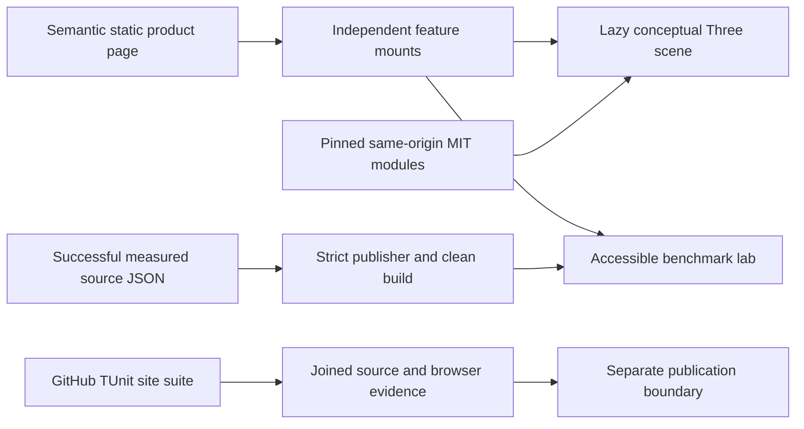

# ADR-040: Static product website, conceptual Three.js and qualified evidence

Status: Accepted; implementation and GitHub site qualification in progress. Date: 2026-10-02. Owner: website lead. Related: REQ-BC-011–018 / AC-BC-011–018, [BenchmarkComparisons](../Features/BenchmarkComparisons.md), [acceptance](../../site-design.acceptance.md), [plan](../../site-design.plan.md), ADR-021/032/034.

## Context and decision

The owner requests a website design appropriate for KeyLoad and real Three.js. Keep plain static HTML/CSS/ES modules, introduce a product-first editorial composition and a conceptual RF3 architecture figure, retain the complete numerical benchmark explorer and move feature-owned assets into the canonical BenchmarkComparisons slice. A framework/backend migration would add unrelated boundaries and risk evidence parsing; a CSS-only repaint would not explain the product or satisfy Three.js.

Three.js is a lazy independent architectural decoration. Three physical hosts own storage; logical atomic partitions remain distinct. It never depicts live readiness, replication timing, traffic or benchmark values. DOM content, poster, captions and links carry the facts. The numeric explorer uses only successful raw GitHub schema2 evidence until the separately accepted schema3 publisher qualifies all required profiles. No invented winner, stale mixed state, partial invalid report or current-source qualification claim.

## Dependency, renderer and preservation contract

Pin Three.js0.186.1 MIT from [official npm distribution](https://registry.npmjs.org/three/-/three-0.186.1.tgz), source commit9b4a2ac29c63ccb43fd51c5661f2f873ac2c39b8. Expected SHA512 integrity: `sha512-blFeqb49wRCSGUGj7gtpfnSGHy2lwDk94RhUmS1c/hTby70kvChbWpkJ4Pm1390LqzzvTmzgXKHPEafJwCb8jA==`. Vendor only original build/three.webgpu.js, build/three.core.js and LICENSE under site/Features/BenchmarkComparisons/vendor/three/0.186.1, with file hashes, bytes and gzip sizes in a manifest. No package/framework/global installation or browser CDN. Preserve unmodified distribution bytes and license; this narrowly documented exception to authored LOC/type/function/literal limits applies only to those third-party files. The root `.gitattributes` also ignores only upstream `space-before-tab` findings in these exact two JavaScript files so generic diff checks do not mutate the hash-verified distribution; authored files receive ordinary checks. Repository-authored wrappers obey all limits. Upgrade replaces the versioned directory coherently after full hash/browser/CI review; no second legacy renderer is retained.

Use WebGPURenderer, await init and node materials. The [native renderer](https://threejs.org/manual/pages/webgpurenderer) selects WebGPU or its own WebGL2 backend; no custom compatibility fallback. Use public onDeviceLost/onError from the [pinned renderer source](https://raw.githubusercontent.com/mrdoob/three.js/9b4a2ac29c63ccb43fd51c5661f2f873ac2c39b8/src/renderers/common/Renderer.js), not private backend/device access. Intentional device.destroy is ignored by the [pinned backend loss handler](https://raw.githubusercontent.com/mrdoob/three.js/9b4a2ac29c63ccb43fd51c5661f2f873ac2c39b8/src/renderers/webgpu/WebGPUBackend.js); it cannot be presented as actual public loss qualification.

Procedural geometry, no external model/texture/font/control package, shadow maps, postprocessing or compute. One renderer/canvas; DPR≤1.5, drawing buffer≤1M pixels, draw calls≤30, triangles≤5K. Render on init/resize/bounded pointer input, settle≤500ms, no perpetual idle loop. Reduced/coarse motion remains static; hidden/offscreen/pagehide stops work. Cancelled asynchronous init must dispose unpublished resources. Resize-to-zero, repeat disposal and pageshow restoration are explicit. Unrecoverable graphics errors stop only decoration and expose the always-present poster/text, with no reload/retry loop. This progressive static/graphics composition is the new complete UI, not retention of an obsolete implementation.

## Evidence and test boundaries

Root freezes safe catalog/report/run paths and DOM hooks in contracts.mjs. Same-origin confined run paths, unique IDs, structural schema2 validation, exact raw SHA256 and allowlisted repository run URLs prevent arbitrary URL/input use. Authenticated successful-run verification remains the publisher parent's job; a passed URL is not authorization evidence. Every profile load clears/disables all report surfaces together, aborts previous work and rejects late generations. Preserve median per-run arithmetic, failure denominators, null/unsupported values, metric units, generator labels and existing logarithmic semantics.

Introduce independently buildable KeyLoad.SiteTests with existing centrally pinned TUnit1.72.10/MTP/net10/BCL and central analyzers, no Core dependency. Its bounded real Node child process imports production modules; independent C# oracle asserts authentic successful-CI reports and controlled invalid input cases. Node is the production JS runtime, not a second test runner. Preserve all old median/repetition/failure/unsupported/order intentions before deleting measurements.test.mjs. Qualification runs only GitHub Actions; local build/static review/manual browser preview do not qualify tests, coverage or publication. Visual quality and real browser/device lifecycle have the explicit evidence exception in AC-BC-011/012/013; physically unexercised GPU loss remains unverified.

Raw-hash acceptance additionally invokes the production `loadReport` through an actual ephemeral static HTTP listener over builder-emitted files. A copied raw file is deliberately changed without changing its catalog hash, so the genuine fetch/hash pipeline must reject it. This is a real static hosting path with confined file access and bounded teardown, not a substitute service or mock dependency. It executes only in GitHub with the rest of TUnit; corrupt copies never become public output.

## Implementation contract and join

1. Root records brainstorm→acceptance→plan, Feature BC011–018, this ADR and strongest COMPLETE TASK-SITE-PLAN-001 before delegated writes. User scope authorizes design/Three dependency, not backend/schema/runtime/publication changes.
2. Root alone owns contracts.mjs, bootstrap.mjs, build-site.mjs, scripts/build.mjs, vendor, workflows, shared docs, new SiteTests policy/project, solution/governance inventory and superseded-file removal. Create new local AGENTS before project code.
3. TASK-SITE-VISUAL-002 owns feature index.html/styles.css/tokens.css/assets/cluster-poster.svg only. TASK-SITE-SCENE-003 owns cluster-scene.mjs/scene-geometry.mjs/scene-lifecycle.mjs/scene-observers.mjs/scene.css only after vendor proof. The additional observer helper is a reviewed scope extension to preserve the mandatory 400-line authored-file limit while isolating listener/observer ownership; it does not change the public mount or dependency contracts. Both gpt-6-luna high; exact root DOM/mount contracts, no same-file writes.
4. TASK-SITE-TEST-004 owns only SiteTests/Features/BenchmarkComparisons test files after policy/project/probe protocol. Tests derive from acceptance before evidence code. TASK-SITE-EVIDENCE-005 owns measurements.mjs/measurement-loader.mjs/benchmark-lab.mjs/benchmark-chart.mjs/benchmark-profiles.mjs only, after frozen test assertions. No new parser schema or dependency invention.
5. Each worker returns complete/blocked/failed/cancelled, all paths/hashes, source/static evidence and unresolved issues. Missing APIs, policy conflict, overlap, changed contract or scope expansion stops dependent work. Partial/unverified output cannot join.
6. Root joins every COMPLETE packet, reads every diff, integrates a coherent canonical asset/build migration and removes replaced flat site files only after proof. Validate vendor/raw bytes, syntax, limits, links, clean output and policy inventory; build a disposable authentic-evidence preview.
7. Root records real first-render desktop/tablet/mobile, keyboard/controls/error/provenance and scene lifecycle/browser observations. GitHub executes the full relevant TUnit site suite at exact source SHA; preserve run/job/artifacts and measured-source SHA. Strongest TASK-SITE-REVIEW-007 reviews all combined files/evidence, fixes are rejoined and affected checks repeated.
8. Record source/static/manual/GitHub/coverage/publication states separately. Existing Pages checks out measured source; a future two-revision public design/data contract requires separate review. No public deploy or DNS action is included here. This ADR stays Accepted until every required gate actually has evidence.

Mount contracts: mountBenchmarkLab({root,catalogUrl}) returns {dispose}; asynchronous mountClusterScene({host,motionButton}) returns {dispose,setMotionEnabled}. Neither imports the other. DOM hooks are root-frozen and shared constants own authored boundary values. Import specifiers and static HTML/CSS/asset source are declarative syntax; implementation comparisons, paths, labels and resource limits use named symbols.

### Mandatory coverage and real-browser gate

Strongest coverage analysis is COMPLETE; unconfigured coverage is a pending gate, never an exception to root thresholds. REQ/AC-BC-024/025 extend the same slice before additional writes. Normal Node processes inherit NODE_V8_COVERAGE; the real system Chrome process exposes precise Profiler coverage through BCL CDP/WebSocket. All qualification still runs in GitHub TUnit. Check and retain browser availability/version; do not install a browser or package, fabricate DOM/fetch, use node:test, import node:internal APIs or reduce sandbox protections.

The required authored source inventory is every .mjs emitted by the feature plus build-site.mjs and site/scripts/build.mjs. Exclude only unchanged official vendor, test infrastructure and non-JavaScript assets. Match Node file URLs and browser same-origin emitted paths to exact physical source bytes/hashes; validate UTF-16 offsets (including Unicode/CRLF), nested/out-of-bounds/crossing ranges and differing subprocess partitions. Merge execution over real runs, count executable nonblank/noncomment source lines using the most specific interval execution state, and report V8 block-range branch semantics explicitly. Never label byte coverage as line coverage. Missing source coverage fails. The first retained numerical result is the baseline.

Enforce aggregate authored JavaScript≥80% lines and≥70% available V8 block branches. Critical measurements.mjs, measurement-loader.mjs, build-site.mjs, benchmark-lab.mjs and benchmark-profiles.mjs each require≥90% lines, explicit successful/rejected-operation tests and all existing assertions. Native coverage/report converter regressions use real Node-produced ranges with independently known branch outcomes; include uncalled/nested functions, differing partitions, malformed ranges, Unicode/CRLF, missing files and changed source bytes. The after-session hook joins all bounded child processes before producing/failing the deterministic report; no concurrently incomplete report can pass.

TASK-SITE-COVERAGE-008 owns new SiteCoverage-prefixed C# helpers/tests only. TASK-SITE-BROWSER-009 owns new SiteBrowser-prefixed C# helpers/tests and the existing real static-file host MIME/teardown boundary only. Their contracts are frozen before writes; no overlap with completed original test/probe files. Root owns workflow/feature/ADR/plan and final integration. BCL Chrome tests assert actual generated UI and numeric/provenance correspondence, atomic error/retry and lifecycle using real files and browser actions. Retain native ranges/browser version/source metadata. Manual composition/device review is additional evidence and cannot qualify numerical coverage. Required COMPLETE packets and exact-source GitHub gates precede strongest final review.

## Migration, consequences and rollback

Strongest TASK008 converter review requires TASK-SITE-COVERAGE-REPAIR-013 before
join. Preserve native receipt identity/hash and scriptId (optional context) in
source-specific snapshots rather than flattening functions from every process.
Resolve the deepest function/block for each offset within each snapshot, then OR
the independent execution states. V8 may omit a child range whose counter equals
its parent; a global narrowest-range contest would let one process's zero suppress
another process's positive inherited execution. Physical function source/span owns
identity; names remain metadata. Observed native child intervals own the branch
denominator. An explicit identical positive range proves an outcome; an omitted
range requires positive effective state throughout that canonical interval inside
the same physical function snapshot. A positive outer explicit outcome is not
disproved merely by an unexecuted descendant, and unrelated module execution is
never proof of a function outcome.

The worker owns only SiteCoverage-prefixed source/tests, reusing existing process
output/cleanup helpers without editing them. Real choose(true/false) Node receipts
must prove statement lines4/6 covered, neverCalled line8 uncovered, exact totals
and reversed-order equivalence. Select malformed/crossing targets by exact fixture
URL, not native array position; replace invented equal function spans with real
separate/nested-function fixtures. Bound and drain both process pipes before exit,
kill/join on failure and retain source/hash/native evidence. Root reviews the full
coherent packet and integrated compiler/GitHub thresholds; no excluded source,
synthetic measured data or weakened80/70/90 threshold is authorized.

Strongest incremental REVIEW007 found real defects in the authored Browser009
packet before qualification: CDP params wire naming, MIME case, Promise waits,
media feature shape, unsupported/completion oracle formatting, lazy startup order,
client-abort handling, stale-profile/linear-log geometry assertions and actual
renderer/error/coverage receipt proof. TASK-SITE-BROWSER-REPAIR-012 owns only
SiteBrowser-prefixed tests/helpers and SiteStaticFileHost. It writes/strengthens
acceptance assertions before preserving repairs, retains native coverage before
each navigation and at completion, requires a genuine supported positive renderer,
and records actual runtime errors including consoleAPICalled. No production,
measurement, schema, package, policy or threshold change is authorized. Root joins
all source/format/build/GitHub evidence; original009 COMPLETE source is not a green
gate. Every source packet must close findings before strongest final acceptance.

Root's actual Chrome Page.getFrameTree observation additionally confirmed that
frame.url omits the fragment and urlFragment contains #benchmarks. The bounded
TASK012 follow-up must compare frame.url plus its optional urlFragment with the
requested URL while preserving frameId/loaderId and complete-document/exact-href
checks. Existing fresh generated-page navigation exercises this real contract in
GitHub; no synthetic browser receipt or unconditional ready predicate is accepted.

The candidate's required analyzer dependency additionally follows REQ/AC-BC-027
and the Accepted ADR-033 website substage, with native collector18.11.2 and the
exact source/pipeline contract. TASK011 owns disjoint new tooling/tests; root owns
workflow/pins/docs and waits for its COMPLETE packet plus real numeric evidence.
This does not broaden website delivery into product/RF3 coverage qualification.

Migrate site/index.html/app.js/styles.css/measurements.mjs and scripts/measurements.test.mjs to the accepted feature/template/TUnit surfaces as one reviewed change; keep scripts/build.mjs as a thin executable composition entry and favicon as a shared asset. Add SiteTests to the solution, architecture and current governance inventory without changing existing policy text. ADR-032 old layout debt is closed only for the migrated site, not for unrelated backend/tests.

Benefits: a clear product identity, same-origin bounded graphics, accessible evidence and an independently runnable site qualification gate. Costs: a lazy vendor payload recorded separately and another centrally governed TUnit project; browser/device review is still necessary. Rollback restores the prior coherent asset/build set and evidence access, retains immutable measured artifacts, and never weakens policy/tests or mixes incompatible module versions. Current Core, quality/coverage, schema3/cluster comparisons, DNS and publication remain distinct pending gates.

### Native equal-span function contract

The [V8 native coverage implementation](https://raw.githubusercontent.com/v8/v8/main/src/debug/debug-coverage.cc)
explicitly permits a script wrapper and uncalled inner function with identical
spans; native report order is nesting order and the inner function is last.
TASK013 must preserve that order and resolve equal-span ties to the native
innermost function within each snapshot. Apply this selection to line resolution,
explicit outcome checks and omitted-child inference, so script execution cannot
prove an uncalled inner function executed. Names remain metadata and span-based
branch denominators stay unchanged. A real Node single-function source with no
trailing newline proves native equal spans/order and uncovered function state;
retain the existing Unicode/CRLF9/8line2/2branch and reversed-receipt regressions.
Only source review/build and exact-SHA GitHub execution can join this correction.

Native converter regression evidence must survive temporary-directory teardown.
TASK013 retains unchanged real fixture source, original Node receipts, stdout and
raw SHA256/identity metadata under a separate converter-fixtures subtree of
KEYLOAD_SITE_COVERAGE. These files are uploaded for review and never enter the
production node/ or browser/sessions/ coverage denominators. Preserve original
native bytes and cleanup of owned temporary files; mutated malformed/crossing
copies must not be labeled or retained as actual executed native evidence. Root
reviews the retained packet and actual GitHub converter assertions before join.
