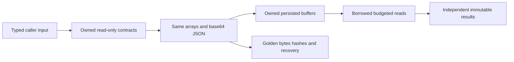

# ADR-041: read-only public collections with stable wire bytes

Status: Accepted implementation contract; implementation and qualification pending.
Owner: KeyLoad integration lead under the existing strict-analysis and complete
memory/read-work repair directions. Related: ADR-033, ADR-035, ADR-036.

## Problem and decision

The dependency-enabled strict build found 49 CA1819 array-property diagnostics
and CA1716 on IKeyValueView.Get. These block compiling the product under mandatory
analysis. Public mutable DTO arrays and repeated dense-vector conversions also
conflict with the resource goal. Wire/persistence/fingerprints must survive together.

Use ImmutableArray<T> for 41 ordinary ordered Abstractions sequences and three
float-vector properties. Nullable arrays become nullable immutable arrays, retaining
null versus empty. Required initialized properties use []; default immutable arrays
are invalid where the former required array could not be null. Freeze caller arrays
once through [.. values]; materialize result builders directly into their final
immutable collection. No per-candidate vector ToArray. PreparedSimilarity holds
read-only memory and uses spans with the same SIMD/scalar summation grouping.
The equivalent public Core AuthorizedDocumentChangePage<T>.Changes sequence also
uses ImmutableArray<T> in the owning ChangeFeeds slice. Its generic projection
builder freezes once; JSON array shape, cursor/cut, redaction and order stay exact.

Use ReadOnlyMemory<byte> for KeyValueRecord.Key/Value, StorageMutation.Key and
StoreIdentity.SigningKey; StorageMutation.Value is ReadOnlyMemory<byte>? so null
tombstones remain distinct from empty values. A strict byte-memory converter
rejects null for nonnullable buffers and uses the official reader/writer base64
operations; the nullable wrapper still retains null tombstones. This is a read-only
API view, not deep immutability: the provider
still owns buffers and public scan results remain independent of provider state.
Trusted deserialized frame buffers may be used without recopying keys; caller
buffers cannot become mutable store truth. Signing consumes private key spans.
The public provider configuration ZoneTreeStoreOptions.SigningKey uses nullable
ReadOnlyMemory<byte> as well. Null still requests a newly generated key; an explicit
key is cloned once on store initialization and compared by span against persisted
identity. Caller mutation after construction cannot change the store identity or
signatures. Existing identity/reopen checks and a caller-buffer mutation regression
cover this provider configuration extension.

Accepted runtime repair TASK-RUNTIME-STORAGE-W / AC-ROC-002/004/005 and
AC-PSW-002..004 restores that nullable-null contract at the owning producer.
Run37005805424 at6949fa0 demonstrates Delete projected as a live empty value by
ZoneTreeTransaction.PrepareChanges. The worker first authors NEW real-store
StorageRecovery/TombstoneValueTests, then changes only that projection to preserve
an explicit nullable null. Keep legitimate empty Put, reader/replay/format/version,
cache/copy and flush/apply order, and null frame overhead=2 identical. Lead owns
docs/source review/build/formatter and exact-SHA full GitHub unit/process recovery/
RF3 SDK/MCP joins. WAL byte equality, borrowed/owned absence, range, empty value,
reopen and snapshot counts are mandatory. No historical empty-row rewrite is
safe without provenance; rollback reverts the projection and keeps regressions.

The lead owns strict converter registration in JsonDefaults and new Abstractions
Features/ResourceExecution converter files. ImmutableArray conversion delegates
the complete element/array protocol to System.Text.Json's T[] serializer with the
same options. Only freshly deserialized private arrays may be attached through
ImmutableCollectionsMarshal.AsImmutableArray; serialization borrows the backing
array without mutating or exposing it. No extra full-array copy, custom JSON array
parser or default-to-empty fallback. Reject JSON null and IsDefault on the required
immutable type. Nullable wrappers continue to accept null; an explicitly present
default immutable value remains invalid. Missing required constructor parameters
remain rejected by RespectRequiredConstructorParameters. The tests-first fixtures
cover these negative paths before schema migration.

Rename the one owned point-read contract to ReadOwnedValue(byte[] key). Remove
Get from that interface/implementations and update semantic storage callers once.
No alias, shim, duplicate lookup algorithm or severity change. Borrowed ReadValue
and owned Scan remain distinct active contracts. Unrelated log/JSON/private helper
Get methods are outside this rename.

This intentionally changes CLR property/constructor/interface signatures. Rebuild
all solution consumers together; external compiled consumers must recompile for
the development API. Type/namespace names, JSON names/order, enum values, array/
base64 forms, nullable defaults, signatures and persisted format versions stay
identical. No compatibility or data-migration claim follows from compilation.

The Client query factory also moves from KeyLoadQuery<T>.From to the non-generic
KeyLoadQuery.From<T> to resolve the actual strict CA1000 prerequisite. Keep the
same initial AST and instance builder behavior, with an internal constructor and
one factory under Client/Features/QueryExecution. Remove the old static member;
adapt real QueryAdapter/LiveQuery/RF3 SDK callers and README examples together.
This is an explicit development CLR migration; the generated query JSON stays
identical. No alias, second builder algorithm or analyzer suppression.

The public KeySpace.Applied/Clock properties expose read-only byte memory with
unchanged canonical encoded bytes. Core keeps assembly-private cached input
buffers for trusted gated lookup/write calls; external storage callers create
their owned byte[] once at that API boundary. No new key format or public mutable
array property. ReadExecutionBudget orders its optional business clock before the
CancellationToken, retaining parameter names and the system-clock default; all
named/positional callers join to satisfy CA1068 without a constructor shim.

## Requirements and acceptance

| Requirement | Acceptance and pass/fail | Tests/evidence |
|---|---|---|
| REQ-ROC-001: all located Abstractions properties expose read-only collections | AC-ROC-001: no exported property returns an array; all 49 findings resolved without suppression | Real reflection contract test and strict dependency-enabled build |
| REQ-ROC-002: exact wire/signed/persisted identity | AC-ROC-002: handcrafted base64/tombstone/empty/nullable/vector/polymorphic sequence fixtures round-trip to identical bytes and hashes; invalid required null/missing/default values reject | TUnit serializer/fingerprint goldens and existing retry/frame/recovery suites |
| REQ-ROC-003: owned input/results and efficient dense vectors | AC-ROC-003: freeze once, independent scan buffers, no per-score array conversion, unchanged exact ranks/scores | Real ZoneTree ownership and Search golden/allocation cases; source allocation review |
| REQ-ROC-004: one accurate owned-read API | AC-ROC-004: ReadOwnedValue retains hit/miss/independent buffers; no interface Get or alias | Interface/reflection and real provider read/counter cases, combined compile |
| REQ-ROC-005: all callers and persisted policies migrate together | AC-ROC-005: SDK/query/core/storage/security/replication/tests/comparisons compile with unchanged success/negative/error behavior | Exact GitHub full TUnit/recovery/RF3 SDK/MCP; no skipped/fake qualification |
| REQ-ROC-006: honest source migration and delivery | AC-ROC-006: strict build/format/governance and delivered-SHA CI succeed; docs disclose CLR break/evidence | Lead combined review, exact SHA/run/jobs/artifacts |

UI N/A: programmatic contracts. Wire/format conversion N/A: exact compatibility is
mandatory. Compilation is not throughput or resource proof; AC-MP-011 remains.

## Ordered implementation and ownership

1. Lead accepts this rationale/criteria/plan before coding. Full existing-main CI
   36936319423 is historical only. A compile-only temporary C# probe verifies
   nullable ImmutableArray collection expressions, AsMemory, SIMD span constructor
   and byte-memory interop; no program/test execution or runtime proof.
2. TASK-MP-010E authors NEW UnitTests/Features/ResourceExecution collection/wire/
   ownership regressions first, then edits only Abstractions property types and
   the ReadOwnedValue declaration. Preserve all existing XML/docs and concurrent
   contract extraction. No consumer/config/docs worker edits.
3. Lead reviews the schema diff and owns integration. Assign disjoint Core/Query/
   Security and Storage/Client/test caller stages only after schema joins. Serialize
   EventSources/BudgetedReadView after TASK-MP-007H. Protect native routing/replication
   and comparison owners until their completed results are inspected and joined.
   TASK-MP-010F-W owns Query and Security.Project plus matching query/search tests;
   TASK-MP-010G-W owns ZoneTree/Client plus matching storage/client unit tests;
   its provider scope includes the nullable signing-key option and its ownership
   regression, without weakening identity verification or key-length rules.
   It also owns the non-generic Client query factory; TASK-MP-010F-W adapts its
   already assigned QueryAdapter/LiveQuery unit callers, and the lead integrates
   native RF3 callers and README examples.
   TASK-MP-010H-W owns Core business source plus matching business unit tests.
   This includes the explicitly identified generic ChangeFeeds page sequence and
   its existing real-store projection/continuation assertions.
   The lead alone integrates DatabaseEngine, KeySpace, ReadExecutionBudget and
   BudgetedReadView, native/recovery/comparison joins and shared docs/config.
4. Lead's strict converter stage must join before property migration. Required-
   default validation retains typed rejection and persisted policy.
   IAuthorizationPolicy.Project takes IReadOnlyList<SensitiveFieldPolicy>, allowing
   array and immutable resource-policy callers through one existing algorithm.
   Keep its out-array projection buffer within an owned result boundary.
5. Compile actual dependencies with every analyzer, inspect every error, then
   format/static gates. GitHub runs full TUnit/recovery/RF3 SDK/MCP and resource
   assertions for the delivered SHA; development checks do not qualify runtime.
6. Update requirement/task/test/evidence chain, inspect every worker diff and
   combined state, deliver stable scoped source under existing authorization.
   Stay Accepted until every AC/gate is met.

Workers stop on ambiguity/overlap, unsupported serializer/default behavior, extra
vector copies, changed golden bytes/hashes or dependency defects. No local tests,
stale-reference build, new package, force/protection bypass or severity change.
Lead owns shared contracts/config/docs and final integration/review.

## Rollout, rollback and verification

### Accepted maintainability join

TASK-MP-010K extends the already owned Query scope to extract SqlParser's current
tokenization and precedence-expression responsibilities into cohesive internal
Features/QueryExecution helpers. Do not rewrite its dialect. Keep token limit
evaluation, escaping, quoted identifiers, alias binding, precedence/depth, parameter
handling and every unsupported/invalid/budget error in the same order. Author
direct parser golden/negative boundary cases first; existing real-store SQL/AST
regressions remain required. Every new helper/type stays within 200 LOC, functions
within 50, files within 400 and nesting within three, with named syntax/budget
constants. The sole public SqlParser API stays the same. Lead reviews extraction
and combined build/CI; no worker exception or skipped assertions.

TASK-MP-010I additionally extracts DatabaseEngine's oversized shared source into
cohesive commit/outcome, authorization, operation dispatch and resource-validation
units. New feature-owned helpers use their canonical Features paths. Preserve
transaction reset/retry/watermark ordering, principal policy, configured clock,
exact errors and fingerprint bytes. Add first real-store command/outcome/invalid
collection cases when behavior guards change. No before-image optimization is
mixed into this prerequisite stage; its distinct inventory item remains open.
The lead alone owns these shared files, registration and consumer joins.
Exact lead-owned extraction files: Core DatabaseEngine.cs, AtomicCommandCommit.cs,
CommandOutcomes.cs, OperationProtocol.cs, OperationDispatcher.cs,
AtomicMutationApplication.cs; Features/Authorization/DatabaseAuthentication.cs,
CommandAuthorization.cs and PrincipalConfiguration.cs;
Features/ResourceExecution/ResourceConfiguration.cs;
Features/Messaging/SubscriptionCommandDispatch.cs;
Features/ChangeFeeds/ProjectionCommandDispatch.cs; and
Features/ClusterReplication/MembershipContracts.cs. These hold extracted existing
behavior only. ResourceProtocolFailureTests covers explicit null resource,
retention and queue-policy protocol inputs through the real commit path. Existing
RespectNullableAnnotations rejection must persist a Validation outcome without
partial catalog effects, and retry/watermark/fingerprint behavior must survive the
extraction. This is regression coverage of the existing serializer boundary; it
does not establish a newly reproduced null-protocol defect.

The existing DatabaseEngine partial type exceeds type_max_loc across its legacy
business files. Cohesive source extraction does not make that aggregate compliant.
Record this bounded existing deviation under exception_policy: owner integration
lead, affected existing DatabaseEngine partial declarations only, removal target
2026-11-01. The target is a <=200-LOC shared engine coordinating typed feature
handlers under their canonical slices with the same node-local atomic transaction
and persisted authorization boundary. Do not expand this deviation with new
behavior or claim the aggregate type limit passes. In this prerequisite stage,
split shared responsibilities, enforce <=400 files and <=50 functions, and retain
the aggregate-type migration as open complexity evidence. Verification requires
the real numeric gate plus full real-store/recovery/RF3 behavior after extraction.

TASK-MP-010H-W/010F-W/010G-W may split their already assigned compact legacy test
files into cohesive internal TUnit classes under the owning Features paths when
the mandatory formatter exposes existing size/style/documentation errors. Preserve
every test and assertion, names or stable AC links, and real fixture setup. Delete
the replaced root test declaration in the same change; no copied parallel suite.
This is an explicit migration to ADR-032's target, not an exception to its layout.
Workers do not edit any unassigned test, shared fixture, docs, config or policy.

The lead's narrow BenchmarkComparisons join owns only the three changed DTO inputs
in Targets/KeyLoadTarget.cs: PutVector values, seeded graph CommandRequest mutations
and SearchRequest vector. Freeze the existing input sequence once into its required
immutable contract; preserve generated data, IDs, options, workload topology,
ranking/oracle/report behavior and every existing comparison assertion. Other
comparison implementation, profiles and reporting remain with their current owner.
Existing actual KeyLoad RF3 comparison scenarios and strict compilation prove the
join in GitHub; a compile fix is not a new performance measurement.

### Accepted UnitTests caller prerequisite join

TASK-MP-010O-W extends AC-ROC-003/004/006 and AC-MP-012 without a new product
contract. analyzer_tests owns only root FrameBudgetTests and its target
Features/StorageRecovery replacement/helpers, plus
Features/ResourceExecution/ReadBudgetAllocationTests. Allocate each test's owned
byte[] request key once, construct the existing read-only StorageMutation from it,
and use ReadOwnedValue for retained comparison/assertion reads. Preserve all twelve
base64 boundary trials, exact WAL header/payload offsets and bytes, rejection and
unchanged-position/state assertions, and every existing read/result/cancellation
allocation bound. Move/split the frame suite into its canonical slice, remove the
old declaration, keep internal TUnit types and exact scenario discovery. No
assertion weakening, doubles, production/config/native/comparison edits or local
test execution. These are known compile mismatches, not observed failing tests.
The lead alone owns shared TestDatabase visibility/constants/real-system-clock
prerequisites and the exact ordered-byte wire assertion. Tests can compile only
after their real benchmark/server/native dependencies join; disabled-reference
builds are not proof. Runtime evidence remains exact-SHA GitHub qualification.

Rebuild all solution binaries together and deploy only after exact GitHub proof.
Valid persisted JSON/frame data needs no conversion. Rollback restores contracts
and all consumers as one verified source unit, with no shim or mixed binaries.
Invalid required null/default input rejects explicitly; nullable fields retain
their old null meaning. Real retry/fingerprint/frame/checksum/process-recovery,
hidden/redacted policy and RF3 SDK/MCP regressions are required. Coverage/complexity
remain mandatory and unverified until compatible collection/gates run.

Primary guidance: [CA1819](https://learn.microsoft.com/en-us/dotnet/fundamentals/code-analysis/quality-rules/ca1819),
[CA1716](https://learn.microsoft.com/en-us/dotnet/fundamentals/code-analysis/quality-rules/ca1716),
[JSON collections](https://learn.microsoft.com/en-us/dotnet/standard/serialization/system-text-json/supported-types),
[converter null handling](https://learn.microsoft.com/en-us/dotnet/standard/serialization/system-text-json/converters-how-to),
[owned immutable array attachment](https://learn.microsoft.com/en-us/dotnet/api/system.runtime.interopservices.immutablecollectionsmarshal.asimmutablearray?view=net-10.0),
[byte-memory base64 converter](https://github.com/dotnet/runtime/blob/v10.0.0/src/libraries/System.Text.Json/src/System/Text/Json/Serialization/Converters/Value/ReadOnlyMemoryByteConverter.cs).
