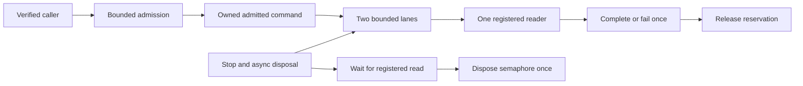

# ADR-042: explicit command admission and inbox resource ownership

Status: Accepted implementation contract; implementation and qualification pending.
Owner: ResourceExecution for the admission implementation; root owns shared integration, review and delivered qualification.
Related: ADR-033, ADR-035, ADR-041; ResourceExecution AC-MP-006/012 and
REQ-RESOURCE-001 / AC-RESOURCE-001.

## Decision and acceptance

`AdmittedCommandInbox` is the current bounded two-lane admission queue in
`src/KeyLoad.Core/Features/ResourceExecution/Commands/`. It owns one registered
reader, command-lane signals and the reservation transfer to each `AdmittedCommand`.
The current public CLR declarations are the top-level `AdmittedCommand`,
`CommandAdmissionLease` and `HttpAdmissionLease`; current callers use these APIs
without compatibility aliases. Preserve persisted JSON, operation identity, quotas
and per-lane FIFO. The maximum control burst remains eight before a waiting data
command.

The inbox implements IAsyncDisposable. Stop is idempotent, rejects new commands,
fails queued commands with the existing UnknownWriteOutcome detail and wakes its
one reader. Disposal first stops, then waits for an already registered read to
leave the semaphore, and only then disposes it exactly once. Register reads and
disposal under the same gate; subsequent reads/enqueues reject disposed state.
No blocking synchronous wait, forced host clock, unbounded channel or polling loop.
One active reader is the documented capability; a concurrent second reader rejects
without consuming a signal. A dispatched AdmittedCommand remains its consumer's
responsibility until Complete, Fail or Dispose, each releasing the reservation
once. Disposal of an unresolved command uses the same unknown-outcome failure.
Track the reader with a boolean during normal traffic. Allocate a drain completion
signal only when disposal actually encounters an active reader; no completion
source per read. A warmed prefilled real-inbox allocation case measures only the
read/drain-registration window on the same thread, with no assertions, enqueues
or payload construction inside the measured loop. Its named small allocation
ceiling of 512 bytes catches per-command lifecycle allocations. This is a bounded
regression oracle, not a throughput or process-RSS claim. Pre-canceled reads must still cancel before
claiming reader ownership or dequeuing work, including after Stop.

Reserve validates principal and nonnegative byte/character inputs before quota
mutation. Inbox validates operation/principal identity before reserve. HTTP Begin
validates path and framing before reserve; Bind requires a verified principal and
permits exactly one successful binding. Cancellation/failure must leave every
counter unchanged or release its acquired reservation. Retain separate control
and data capacity, aggregate byte accounting and tenant/principal scope removal.
Name existing constants and error details once, with no budget or route changes.

| Requirement | Pass/fail acceptance | Automated evidence |
|---|---|---|
| REQ-ADM-001: explicit bounded reservation transfer | AC-ADM-001: completion/failure/disposal releases once; rejected/canceled admission changes no quota; data saturation leaves control capacity | ResourceExecution `CommandAdmissionGovernorTests`, `HttpAdmissionGovernorTests` and `AdmissionOwnershipTests` |
| REQ-ADM-002: correct inbox lifecycle | AC-ADM-002: FIFO and burst eight are exact; Stop fails queued work; waiting reader exits before DisposeAsync completes; repeated disposal is safe; disposed/concurrent-reader calls reject | ResourceExecution `AdmittedCommandInboxTests` and `AdmittedCommandReadAllocationTests` with bounded task coordination |
| REQ-ADM-003: integrated current API | AC-ADM-003: all callers use the current declarations; actual dependency-enabled build and format pass; GitHub TUnit/full gates pass at delivered SHA | Current caller inventory, full Release build/format, exact-source Linux TUnit and required recovery/RF3 run/jobs/artifacts |

## Current ownership and verification contract

1. `src/KeyLoad.Core/Features/ResourceExecution/Commands/` owns the inbox, lanes,
   admitted command and reservation leases. The current server/HTTP callers remain
   in their owning slices and use these same declarations; do not add a parallel
   queue, dispatcher or alternate routing path.
2. The owning ResourceExecution TUnit cases exercise actual governors, inboxes,
   leases and database fixtures. Preserve positive queue/FIFO/burst flows and
   negative argument, quota, principal, cancellation, stopped/disposed and
   concurrent-reader flows. No source-text behavior checks or test-only production
   hooks substitute for the real operation.
3. Local unit and process-recovery tests use the canonical Aspire-owned entry and
   are development evidence. Delivered qualification requires exact-source Linux
   GitHub Build and Tests, recovery and RF3 jobs, with the RF3 path using the real
   .NET and official MCP clients.
4. Root owns shared contracts/configuration, caller integration, complete review
   and delivery. Keep this ADR Accepted until every applicable criterion and
   delivered-source gate has actual evidence.

A source overlap or need to change public behavior, quota/error order, persisted
format, reader semantics, or any numeric bound is outside this contract and requires
its owning decision before implementation.

## Rollout and rollback

These are the current internal CLR declarations and callers; they do not change
the persisted or wire format. Revert an owned change only as a verified source unit.
Runtime tests use actual governors, inbox and database fixtures without mocks, fakes,
sleeps or frozen host time. Coverage and complexity remain unqualified until their
actual configured Linux GitHub gates.

Primary guidance: [CA2000 ownership transfer](https://learn.microsoft.com/en-us/dotnet/fundamentals/code-analysis/quality-rules/ca2000)
and [async disposal](https://learn.microsoft.com/en-us/dotnet/standard/garbage-collection/implementing-disposeasync).

## Physical catalog startup control admission

TASK-ADM-CATALOG-BOOTSTRAP implements the ResourceExecution refinement of
REQ-RESOURCE-001 / AC-RESOURCE-001 and REQ-ADM-001 / AC-ADM-001. Original Linux
run37541109923 rejects `BootstrapPhysicalShardCatalog` during node1 startup at
`PhysicalShardCatalogStartup.SubmitBootstrapAsync`; its ordinary data ceiling is
4,096 bytes, exactly the governor's envelope floor, and serialized bootstrap
work cannot fit. Node2's subsequent unavailable-majority error is secondary.
The initial catalog mutation must use the existing bounded control reserve.
It remains administrator-authenticated, authorized and RF3 committed through
the same unique request grain; no admission or credential bypass is introduced.

Root freezes this contract, the worker changes only
`src/KeyLoad.Core/Features/ResourceExecution/Commands/CommandAdmissionGovernor.cs`
and its existing `CommandAdmissionGovernorTests.cs`, then root reviews and joins
strict build/format, focused normal/scalar governor operations and the unchanged
actual Aspire RF3 admission case. Add only the existing bootstrap operation kind
to the reserved classifier; preserve every lane ceiling and shared replication
or inbox consumer. The regression executes full data/control reserve,
rejection, exact lease release and healthy reuse, rather than asserting the
classifier result alone. Delivered qualification requires the original Linux
SDK/control/RF3 flow; source or local governor success cannot establish it.
No wire, storage, deployment, format or dependency change is needed. Rollback
removes only this operation's classifier inclusion and its matching regression;
the original startup failure remains unqualified until real execution passes.

## Native runtime-journal startup control admission

TASK-ADM-RUNTIME-JOURNAL-BOOTSTRAP extends the existing catalog startup reserve
under REQ/AC-RESOURCE-001 and REQ/AC-ADM-001. R199's actual RF3 admission flow
fails in RuntimeJournalStartupRequests.BootstrapAsync:4096-byte data capacity
cannot retain its ordinary envelope plus payload. The complete closed action,
shape, native authority, bounds and negative matrix are frozen in the linked
ResourceExecution feature before code. Reserve only the exact authenticated
native BootstrapIdentity shape; ordinary RuntimeJournal actions remain data.
No kind-wide exemption, caller role/purpose trust, data-budget change or journal
provider replacement is accepted. The signed request, persisted administrator,
protected identity, reauthorization, ordered apply and RF3 contracts stay exact.

Ordered implementation: root freezes contract; worker uses native bounded
inspection and current shape checks, then joins operation-aware reservation in
Core ResourceExecution/Commands, immutable admitted lane reuse in inbox/command
and CommandInboxLanes, and matching post-authority replica classification in
Replication/ClusterReplication/Admission/ReplicaNativeOperationAdmission.cs.
Worker adds whole-operation ResourceExecution unit cases/helpers with genuine
issued native operations, state preservation, saturation/release and healthy
reuse. Root independently reviews the guarded source, runs full Release,
normal/scalar focused operations and formatter/governance, then uses a fresh
verified image for the unchanged real SDK/MCP admission RF3 case and original
Linux qualification. Existing journal authority/signature/purpose and recovery
regressions remain mandatory. Capture lane once and preserve all fairness and
shutdown ownership; never materialize an unbounded ordinary body to classify it.

No storage/wire/dependency/public API rollout is required. Rollback removes only
this narrow classifier/reservation integration and matching regressions; no data
rewrite, migration or alternate representation exists. Until actual required
native gates pass, this accepted repair is source work pending qualification.
Full admission/mixed-load/performance and other feature gates remain open.
