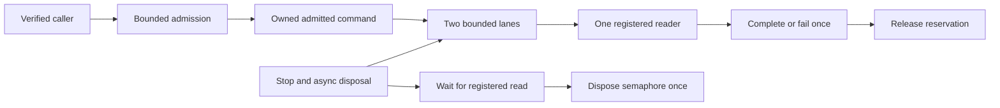

# ADR-042: explicit command admission and inbox resource ownership

Status: Accepted implementation contract; implementation and qualification pending.
Owner: integration lead under the strict-analysis and resource-repair directions.
Related: ADR-033, ADR-035, ADR-041; ResourceExecution AC-MP-006/012 and
REQ-RESOURCE-001 / AC-RESOURCE-001.

## Decision and acceptance

The actual dependency-enabled Core build has 55 errors concentrated in its shared
admission helpers. CA1001 exposes the undisposed SemaphoreSlim; CA2000 exposes
ambiguous reservation transfer. CA1034/CA1711 also require an explicit CLR rename.
Repair ownership and consumers together without disabling diagnostics.

Rename AdmittedCommandQueue to AdmittedCommandInbox. Move its public Pending to
the top-level AdmittedCommand type and both public nested leases to top-level
CommandAdmissionLease and HttpAdmissionLease. Remove the replaced declarations;
no alternate aliases. New source belongs to Features/ResourceExecution.
Preserve persisted JSON, operation identity, quotas and FIFO within each lane.
The named maximum control burst stays eight before a waiting data command.

The inbox implements IAsyncDisposable. Stop is idempotent, rejects new commands,
fails queued commands with the existing UnknownWriteOutcome detail and wakes its
one reader. Disposal first stops, then waits for an already registered read to
leave the semaphore, and only then disposes it exactly once. Register reads and
disposal under the same gate; subsequent reads/enqueues reject disposed state.
No blocking synchronous wait, forced host clock, unbounded channel or polling loop.
One active reader is the documented capability; a concurrent second reader rejects
without consuming a signal. A dispatched AdmittedCommand remains its consumer's
responsibility until Complete, Fail or Dispose, each releasing the reservation
once. Disposal of an unresolved command uses the same unknown-outcome failure.
Track the reader with a boolean during normal traffic. Allocate a drain completion
signal only when disposal actually encounters an active reader; no completion
source per read. A warmed prefilled real-inbox allocation case measures only the
read/drain-registration window on the same thread, with no assertions, enqueues
or payload construction inside the measured loop. Its named small allocation
ceiling catches per-command lifecycle allocations. This is CI acceptance evidence,
not a throughput or process-RSS claim. Pre-canceled reads must still cancel before
claiming reader ownership or dequeuing work, including after Stop.

Reserve validates principal and nonnegative byte/character inputs before quota
mutation. Inbox validates operation/principal identity before reserve. HTTP Begin
validates path and framing before reserve; Bind requires a verified principal and
permits exactly one successful binding. Cancellation/failure must leave every
counter unchanged or release its acquired reservation. Retain separate control
and data capacity, aggregate byte accounting and tenant/principal scope removal.
Name existing constants and error details once, with no budget or route changes.

| Requirement | Pass/fail acceptance | Automated evidence |
|---|---|---|
| REQ-ADM-001: explicit bounded reservation transfer | AC-ADM-001: completion/failure/disposal releases once; rejected/canceled admission changes no quota; data saturation leaves control capacity | Existing CommandAdmissionTests/HttpAdmissionTests and new ResourceExecution argument/ownership cases |
| REQ-ADM-002: correct inbox lifecycle | AC-ADM-002: FIFO and burst eight are exact; Stop fails queued work; waiting reader exits before DisposeAsync completes; repeated disposal is safe; disposed/concurrent-reader calls reject | Existing CommandQueueTests and new direct real inbox lifetime cases with bounded task coordination |
| REQ-ADM-003: integrated current API | AC-ADM-003: all callers use the current declarations; actual dependency-enabled build and format pass; GitHub TUnit/full gates pass at delivered SHA | Lead source inventory, compiler/SARIF, exact CI run/jobs/artifacts |

## Ordered implementation contract and join

1. Lead accepts this scope and adds TASK-MP-010J before delegated writes. Existing
   main CI is historical; new assertions execute only in GitHub Actions.
2. ci_inventory authors acceptance-derived negative/lifecycle tests first, then
   owns only the three existing Core admission files, their replacement/helpers
   under Features/ResourceExecution, root CommandAdmissionTests/CommandQueueTests/
   HttpAdmissionTests and new matching ResourceExecution tests. Split tests into
   cohesive internal TUnit classes if formatting exposes size violations, preserving
   every existing assertion. No native/server, shared contracts, docs/config edits.
3. The worker also makes the already assigned StorageRecovery fixture key copy at
   its external KeySpace.Applied boundary. This is the ADR-041 consumer join, not
   an additional storage algorithm. Lead reviews provider/client diffs separately.
4. Lead integrates current native/HTTP type consumers only after a fresh
   ownership inventory. The active native ClusterCoordinator still uses this
   admission helper: rename its field/pending type and await inbox disposal only
   after StopAsync and worker drain. Serialize these narrow joins against the
   native owner; do not add alternate routing to exercise the helper.
5. Normal strict Core/solution build, scoped and full format, governance and policy
   review precede stable delivery and exact-SHA GitHub TUnit/recovery/RF3 SDK/MCP
   qualification. Keep this ADR Accepted until all evidence exists.

Worker stops on overlap, changed quota/error order, unsupported drain semantics,
unbounded retained state, analyzer defects or new public behavior outside this
contract. No local tests, stale-reference compiler proof, suppression or new package.
Lead owns all shared contracts/config/docs, integration and final review.

## Rollout and rollback

These are the current internal CLR declarations and callers.
They do not change the current persisted/wire format. Revert the owned types and callers together
only as a verified source unit; never preserve an undisposed semaphore or duplicate
the old declarations as a rollback shortcut. Runtime tests use actual governors,
inbox and real database fixtures, without mocks, fakes, sleeps or frozen host time.
Coverage/complexity remain unverified until their actual configured GitHub gates.

Primary guidance: [CA2000 ownership transfer](https://learn.microsoft.com/en-us/dotnet/fundamentals/code-analysis/quality-rules/ca2000)
and [async disposal](https://learn.microsoft.com/en-us/dotnet/standard/garbage-collection/implementing-disposeasync).
