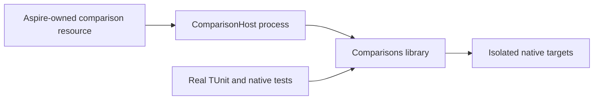

# ADR-043: Comparison library and executable host

Status: Accepted; host source exists, delivered-source and native qualification remain distinct.
Related: REQ-BC-019 / AC-HOST-001..007, AC-CQ-001/005/006, AC-MP-010/012; ADR-033, ADR-034, ADR-062, ADR-076, ADR-080.

## Decision

Keep KeyLoad.Comparisons as the library consumed by real tests and comparison composition. KeyLoad.ComparisonHost owns the sole comparison command-line entry point and its process lifecycle. Preserve the library's public CLR signatures, report serialization, target registrations, settings precedence, and existing AppHost resource ownership.

The host validates required settings before creating network clients. Every partially created target/client has one explicit cleanup owner, and cleanup attempts continue after earlier failures. Console handlers are detached before cancellation sources are disposed. The host preserves the original target order, reports, exit semantics and actual child completion; it does not fabricate verification or convert failed setup into an unsupported capability.

## Acceptance and ownership

REQ-BC-019 maps to AC-HOST-001..007. The criteria require real process success and failure flows, validation before resource allocation, cleanup ownership on partial construction, preserved primary and cleanup failures, terminal child settlement, and safe failure output. Tests use actual child processes and the existing Aspire-owned target topology; they do not substitute fake targets. **AC-HOST-007** specifically transfers each HTTP client from pending ownership before publishing the target, so every partially built target/client has exactly one cleanup owner. Ordered cleanup attempts every later target and unowned client despite an earlier disposal error. Preserve target order and successful report/exit behavior; cleanup failure emits only the existing safe target/type diagnostic and fails the host with `ComparisonTargetCleanupFailed`, without the original message or inner exception. The real child regression requires exact case cardinality, failed setup details, null measurements and zero samples for every unusable endpoint, retained safe cleanup diagnostics, nonzero exit and no credential disclosure.

**AC-ISO-003** remains the actual native-topology contract owned canonically by [BenchmarkComparisons](../Features/BenchmarkComparisons.md): observe genuine one/two/three-node membership, copies and acknowledgements for supported targets, and record unsupported native topology explicitly. Keep topology preflight separate from workload evidence; model/configuration selection cannot stand in for native membership or an acknowledged workload. This host ADR does not redefine or narrow those gates.

The feature-owned paths are [KeyLoad.Comparisons](../../benchmarks/KeyLoad.Comparisons/Features/BenchmarkComparisons/), [KeyLoad.ComparisonHost](../../benchmarks/KeyLoad.ComparisonHost/Features/BenchmarkComparisons/), and matching TUnit cases under [ComparisonTests](../../tests/KeyLoad.ComparisonTests/Features/BenchmarkComparisons/). Shared project, solution and AppHost wiring remain integration-owner changes. Rollback removes the host project and its matching AppHost wiring together; no shim or duplicate CLI is retained.

Required verification is the enabled full source build, formatting and governance checks, then the eligible exact-source Linux unit, recovery, RF3 SDK/MCP and native comparison gates. Keep the ADR Accepted until the mapped implementation and evidence are complete. Historical measurements and delivery receipts remain immutable evidence for their original source only.
