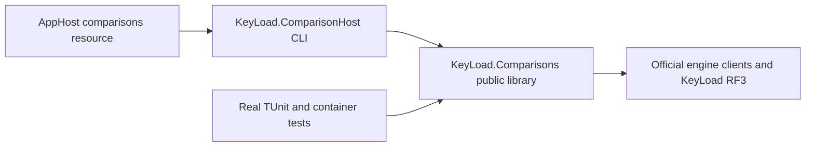

# ADR-043: comparative harness library and executable host

Status: Accepted implementation contract; implementation and qualification pending.
Owner: KeyLoad integration lead under the explicit strict-analysis/resource repair
goal. Related: ADR-033, ADR-034, ADR-035. Feature: BenchmarkComparisons.

## Decision and boundary

The actual strict benchmark source cut reports 32 CA1515 findings. Real test
assemblies consume its public types, so those types are an actual library API.
Retain KeyLoad.Comparisons project/path/assembly/namespace and all public CLR
signatures as a library. Introduce KeyLoad.ComparisonHost as the only CLI, with
feature-owned composition and lifecycle plus a thin Program. No visibility fixes
or analysis suppression. Public arrays/Single naming require their own accepted
migration; this decision does not authorize changing them or their wire values.

## Implementation contract

REQ-BC-019 maps to AC-HOST-001..006, existing AC-CQ-001/005/006 and AC-MP-010/012.
The detailed [acceptance](ADR-043-comparison-library-host.md) and
[ordered task graph](ADR-043-comparison-library-host.md) define pass/fail and evidence.

Ordered stages: lead policy/contract and frozen entry-point review; new real process
regressions before CLI implementation; worker source review; single lead project/
Aspire join; actual strict dependency build, format/governance and exact-SHA GitHub
unit/recovery/RF3/comparison/analyzer qualification. Keep this ADR Accepted until
every required stage and evidence exists.

HOST-CLI owns only the new host project after lead-authored local AGENTS; HOST-TEST
owns only new UnitTests BenchmarkComparisons process tests/helpers; HOST-JOIN alone
owns library csproj/old Program removal, solution, AppHost exact project reference
and Projects.KeyLoad_ComparisonHost substitution, inventory/maps/docs. Existing
contracts, adapters, runner, registration, profiles, report serialization, tests,
native topology and website remain protected. No concurrent same-file writes.

Keep all existing CLI settings and environment/argument precedence, current target
registration, resource name comparisons, waits/images/environment, report files and
exit meaning. Validate required settings before allocating network clients; track
partial construction owners explicitly, clean each once, detach console handlers
before cancellation-source disposal. Private ownership restructuring has no data,
authorization, schema, dependency or persistence migration. No fake verification.

The only removed executable is the replaced library Program. Rollback moves the
sole entry and matching project/Aspire wiring together; no shim or duplicate path.
Stop on an upstream defect or broader public/native/report contract need. Local
build/static proof is allowed; tests/load/recovery qualification are GitHub-only.
The historical six-engine baseline does not satisfy nine-engine ADR-034 acceptance.

Accepted cleanup substage TASK-MP-010AH-H: REQ-BC-019 now also maps AC-HOST-007.
Use an explicit pending-target ownership field before list publication; transfer
HTTP clients out of the unowned list before publishing, so any intervening failure
retains exactly one cleanup owner. Preserve original target order and successful
report/exit contracts. Ordered try/finally cleanup attempts all later targets and
unowned clients. A failure asynchronously prints the existing safe target/type
line and throws ComparisonTargetCleanupFailed with no original message/inner
exception; errors cannot silently leave a successful host exit. This is a host
error boundary repair, with no public library/data/topology/dependency migration.
The exact disjoint task graph, first-authored real process negative regression,
manual private-lifetime review exception, development builds and mandatory GitHub
qualification are in the host acceptance/plan. Keep this ADR Accepted; source
packets and clean builds alone do not satisfy the real process/engine gates.

TASK-ISO-015U joins ADR056 AC-ISO-003/006 with REQ-BC-019/AC-HOST-007 after
authentic1978 unit failure. Failed native initialization precedes capability
classification, as required by the independent IsolatedSetupFailureTests flow.
The cleanup regression must require exact case cardinality, failed setup details,
null measurements and zero samples for every unusable endpoint; retain all safe
cleanup diagnostics, nonzero exit and credential absence assertions. A bounded
worker owns only ComparisonHostCleanupTests.cs; root joins acceptance/plan/docs
and reviews the diff. No runner/adapter/settings/report contract change. The
actual full Unit and required GitHub suites are the proof; rollback cannot restore
an assertion that hides setup failure behind unsupported capability.
