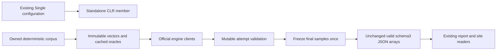

# ADR-044: immutable comparative harness contracts

Status: Accepted implementation contract; source integration and qualification pending.
Owner: KeyLoad integration lead, authorized strict-analysis/resource repair goal.
Related: REQ-BC-020; AC-BCT-001..006; ADR-033/034/035/041/043.

## Decision and caller boundary

Replace the nine diagnosed public mutable array properties and the cached oracle
returns with typed ImmutableArray, following the established solution contract.
This is an intentional solution-contained CLR migration, with no legacy aliases.
Preserve every valid report JSON array/field/enum spelling and workload/wire value.
Required DTO missing/null/default arrays reject; optional null and present empty arrays
remain distinct. This malformed-input hardening is explicit, not a compatibility
claim. SchemaVersion remains3; valid older array-bearing reports still read.

Rename the CLR zero topology member to Standalone, preserving Single JSON and
configuration spelling with JsonStringEnumMemberName and a TypeConverter. Numeric
values, binder case/trim/comma/numeric behavior and validation remain exact; new CLR
spelling is accepted additively. Replace ComparisonFailure everywhere with standard
ComparisonFailureException constructors; safe report text still shows coded message
only, never inner exception secrets. No enum or exception shim.

## Implementation contract

Ordered stages and exact task graph are [benchmark-contracts.plan.md](../../benchmark-contracts.plan.md),
derived from detailed [acceptance](../../benchmark-contracts.acceptance.md) and its
criterion/test matrix. Author real serializer/configuration/corpus/exception fixture
inputs first; then one shared contract owner; then disjoint engine consumers and
single lead shared runner/report join; exact diff/build/formatter review; actual
delivered-SHA GitHub full suites and honest retained evidence. No local tests/load.

T owns only new immutable/config/exception fixture files plus existing pure report/
stream fixtures. C owns old Contracts.cs and BenchmarkDataset.cs and their source
moves to Features/BenchmarkComparisons/, with new topology/contract-json/exception
helpers in that same slice. Namespace/assembly stays KeyLoad.Comparisons. P owns
only engine Targets and engine-prefixed feature helpers. L owns report writer,
runner/measurement/validation/protocol, host and remaining test/config callers,
local entry maps/docs/config/build/CI. C waits for authored T packet; P/L callers
wait for stable C signatures. No concurrent same-file writes or native-owner scope.
Lead inspects every complete packet and owns combined proof. Economical capable
workers cannot change architecture/contracts beyond this decision; escalate drift,
unsupported actual APIs, upstream defects or overlap. Terminal status and evidence
must be explicit; partial or idle packets do not unblock dependants.

Exclusively owned arrays may attach with ImmutableCollectionsMarshal.AsImmutableArray
only when all mutable aliases retire. Caller-owned input freezes once. Build corpus
and oracle arrays once; cache hits reuse immutable storage. Scalar cosine keeps the
exact original summation, tie breaking and hash sequence. Mutable samples remain
mutable through all post-timing validation, then attach once; no report/writer copy.
KeyLoad vector callers use existing immutable SDK fields directly. OpenSearch,
Qdrant and Postgres numeric transport serializes the same values without ToArray.

Report JSON keeps its existing Web options, indentation and enum converter. Register
the established strict immutable converters via public JsonDefaults.Options.GetConverter
for the exact concrete element types; do not clone product JSON defaults wholesale,
duplicate the converter or internalize the harness API. Required array properties
carry JsonRequired so missing input rejects. Constructor-owned getter-only corpus
properties retain their original input boundary; corpus generation is not a DTO
deserialization contract and those properties receive no required setter metadata.
Public documentation follows real
ownership, null/default behavior and code; no hidden severity/suppression changes.

The public enum's source-owned TypeConverter is a documented public configuration
extension. Its attribute and external TypeDescriptor fixtures establish the actual
reflection path; no artificial instance, global provider registration, IVT or
suppression is introduced to evade CA1812. Its ConvertFrom parameter follows the
base EnumConverter object contract; valid/malformed input behavior is unchanged.
This deliberate configuration surface joins AC-BCT-003/006 and existing external
binder/JSON/TypeDescriptor fixtures. See Microsoft's [CA1812 constructor-call
analysis](https://learn.microsoft.com/en-us/dotnet/fundamentals/code-analysis/quality-rules/ca1812)
and [TypeConverter attribute/reflection contract](https://learn.microsoft.com/en-us/dotnet/api/system.componentmodel.typeconverter?view=net-10.0).

PostgreSQL DDL/static SQL redesign, registration/topology/receipt changes, generated
site data and numeric gates are separate contracts. Every existing real engine/
RF3/.NET/MCP/recovery gate stays mandatory. Existing fake fixtures and old six-engine
assertions cannot qualify this stage and remain tracked independent repair work.

Migration is source-only harness caller migration; product persistence/API/security
N/A. Move mapped entry paths together and remove replaced files. Rollback this exact
contract/caller/fixture unit together, without fallback APIs. Keep this ADR Accepted
until implementation, all mapped tests and delivered-SHA evidence actually exist.
