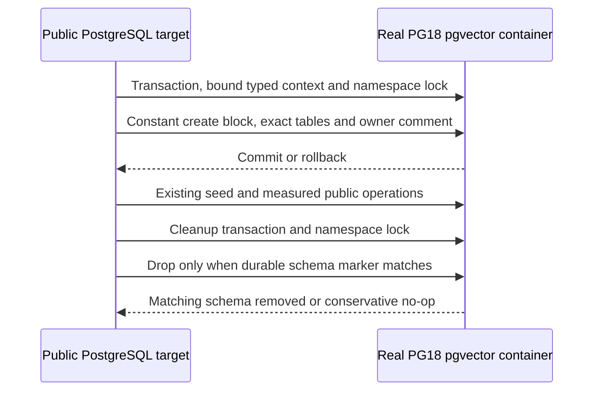

# ADR-045: Owned PostgreSQL comparison schemas and constant commands

Status: Accepted. Owner: lead benchmark integrator. Date: 2026-10-02.

REQ-BC-021 and AC-PG-001..006 in [acceptance](ADR-045-postgres-schema-ownership.md).
[Brainstorm](ADR-045-postgres-schema-ownership.md) records options/trade-offs;
[working plan](ADR-045-postgres-schema-ownership.md) contains TASK-MP-010AC-R/T/C/L and
criterion-to-test/verification joins. Feature: BenchmarkComparisons. Source and
runtime qualification remain incomplete; this ADR must not be marked Implemented
from a source packet or development build.

## Decision and boundaries

Keep the run Guid's existing bench_ schema name and exact measured workload. Add a
private per-target Guid lifecycle marker stored as the schema comment. Constant
client SQL binds native run/owner Guids, dimensions and deterministic namespace
lock key. A short explicit transaction supplies only transaction-local settings,
takes the namespace advisory lock and executes a constant server DO block with
quoted identifiers, checked numeric typmod and atomic schema/marker creation.
Cleanup takes the same lock and drops only a matching durable marker. It remains
safe when setup fails because another target owns the same namespace or when the
schema has already disappeared. Replication ALTER SYSTEM stays outside this DDL
transaction; native graph SQL branches assign exact existing constant statements.

Comments are visible lifecycle metadata, not secrets or database authorization.
The real database owner may alter them; marker mismatch conservatively prevents
deletion. No generic trusted-SQL wrapper, analyzer suppression or success-flag-only
cleanup. A commit-attempt hint is set only immediately before CommitAsync: it routes
uncertain responses to durable-marker verification, while a pre-commit rollback
closes the source without waiting again for a blocked namespace. It grants no
deletion authority. Cleanup errors may mask the primary setup failure; redesigning
that exception contract is outside this repair. No new measured query, table, API,
transport, topology or credential rule.

## Ordered implementation contract

1. Read-only R resolves installed Aspire connection API and one existing fixture;
   lead accepts detailed criteria and this ADR before any write-capable delegation.
2. T authors NEW internal PostgresSchema* real integration helpers under
   tests/KeyLoad.ComparisonTests/Features/BenchmarkComparisons. They exercise public
   targets and native metadata against the existing PG resource after measurement.
   First-authored packet is a dependency of C, no local test execution.
3. C owns ONLY Targets/PostgresTarget.cs and NEW feature PostgresSchema* production
   helpers. Preserve every earlier immutable/null/disposal repair and exact native
   workload/order. Typed parameters, short transaction and unconditional final
   source disposal are required. No shared config/tests/docs or adapter changes.
4. Lead serializes the one existing ComparisonTests call site, shared docs/config/
   artifacts, reads all delegated diffs, builds the true graph with enabled rules,
   and resolves genuine style/maintainability findings with their owners.
5. Canonical GitHub Actions executes all real TUnit comparison/RF3/recovery/.NET/MCP
   qualification suites and retains exact SHA/run/job/artifacts. Formatter/static
   governance do not substitute for runtime qualification. Record failures and
   repair without skipping suites or weakening assertions.
6. Join all requirements/tests/evidence and explicit fault/coverage limits before
   completion. Lead retains final architecture, integration and delivery ownership.

Dependencies: existing Npgsql10.0.3, Aspire13.6.0 and pinned pgvector0.8.6-pg18 image;
no packages or infrastructure install. One existing full RF3 AppHost supplies the
connection after the comparison process finishes. Test-owned databases and pools
are cleaned before AppHost teardown; no additional full cluster or measured timer.

Schema lifecycle and rollback: these are transient benchmark schemas. Current code
leaves unmarked namespaces untouched and never claims them. Product data is unchanged.
Rollback must not quietly revive unsafe deletion or weaken mandatory rules.
Arbitrary loss of an exact commit response remains an explicit real-fault evidence
gap; source design covers uncertain responses but that fault is not claimed tested.
Coverage/export/no-decrease and production endurance/power-loss gates remain open.

Accepted numeric source join TASK-MP-010AG-P, AC-PG-006 / AC-CQ-008 /
AC-BCT-005/006, has exact disjoint file ownership and ordered join in the working
plan. Replace the nested session with a top-level internal session and cohesive
document/vector/queue/graph/stream owners; a private topology helper returns the
same observed profile. The public facade remains the sole data-source owner.
Retain native SQL/parameters, read/lease/cardinality/replica checks, timing boundaries,
immutable buffers, setup/cancellation/disposal order and all public signatures.
Keep the source decomposition within the current private ownership boundaries;
it changes no wire or data contract. Lead reviews every diff and all enabled source/runtime gates;
no partial-type loophole, new exception or suppression is authorized.

Primary contracts: [PostgreSQL18 transaction-local settings and advisory locks](https://www.postgresql.org/docs/18/functions-admin.html),
[schema comments](https://www.postgresql.org/docs/18/sql-comment.html),
[Npgsql transaction and native parameter API](https://www.npgsql.org/doc/basic-usage.html).
