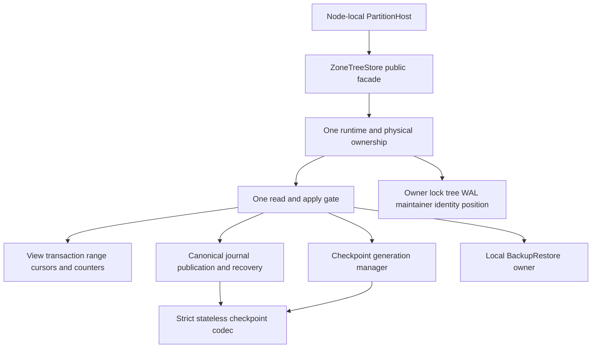
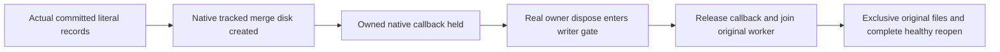
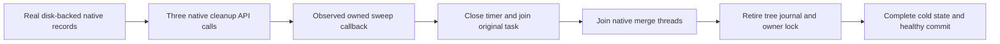

# ADR-046: Cohesive node-local storage owners under numeric gates

Status: Accepted. Date: 2026-10-02. Owner: lead storage integrator.
REQ-STORAGE-008; AC-SQ-001..008 in [acceptance](../Features/StorageRecovery.md),
AC-CQ-008 and AC-MP-001/002/012. [Brainstorm](../Features/StorageRecovery.md)
records alternatives/risks; [plan](../Features/StorageRecovery.md) is the ordered task
graph, exact file ownership, signatures, test matrix and verification join.
This decision remains Accepted until delivered-source qualification is complete.

## Retired generation ownership repair

REQ-STORAGE-020 / AC-DBHP-009 extends AC-SQ-004 and AC-DBHP-005/006.
Exact40f87 run37109874881 discovers a real post-InstallPrepared cleanup failure:
the retired maintainer/tree were successfully disposed during generation preparation
but remain referenced as live owners; final disposal repeats the maintainer call.
This is KeyLoad handle ownership, not a replacement or workaround for ZoneTree.

Ordered preserving contract: (1) root retains the original native failure and
freezes the real-store two-stage regression before product edits; (2) bounded
Luna owns only `ReplicaTermMetadataFailureTests.cs` for InstallPrepared and
JournalSwapped, exact poison checks, explicit closing and repeated actual Dispose;
(3) after root test-packet approval, the same worker owns only existing
`ZoneTreeStoreHandleDisposal.cs` and `ZoneTreeCheckpointGeneration.cs` to clear
successfully retired handle ownership before the later fault boundaries; (4)
root independently reviews all three files, builds/formats/static-checks, commits
all eligible current main scope and verifies exact-source native full suites.
Other helpers, runtime/public interfaces, options, packages, callbacks and formats
are out of scope; stop and escalate if a wider ownership change is necessary.

Keep failed-open maintainer/journal/tree/ownership and normal
maintainer/tree/journal/ownership orders, independently required cleanup,
generation/identity publication, journal swap, poison and recovery semantics.
No swallowed ObjectDisposedException, diagnostics waiver, new callback, data or
deployment change. Root owns shared docs/Git/gates. Rollback both product
helpers together after drain; retain the regression and native failure evidence.
The decision remains Accepted until actual qualification; process kills do not
qualify power-loss durability.

## Distinct-process owner regression

TASK-STORAGE-OWNER-PROCESS maps REQ-STORAGE-008 to the existing KL-008 requirement
and measurable AC-STORAGE-OWNER-001 in StorageRecovery. Current same-process
StoreLifetime contention and sequential CrashHost reopen tests do not establish
simultaneous distinct-process exclusion. Root freezes the acceptance before code;
unpack_atomicity Luna owns only the new StorageRecovery/Cases/
StorageOwnerProcessTests.cs and reuses the existing real Release inspector.

Ordered stages are: hold the actual parent store; launch and settle a denied
child with exact safe I/O failure and unchanged canonical identity/journal/value/
position; verify a healthy parent commit/read; reject and settle another child;
dispose the parent; verify successful child inspection and exact ordinary reopen.
Preserve original process, pipe, outer-owner and deadline bounds. Root reviews,
joins, builds and executes native normal/scalar plus current-source Linux full
recovery, retaining source, compiled identity and original native receipts. Native
storage-module coverage is supporting evidence; all other lifetime and product
gates stay open until actually qualified. No production, format, dependency,
public API or deployment change is permitted by this test-only stage. Rollback
removes only the added regression.

## TASK-STORAGE-MAINTENANCE-SNAPSHOT-003

REQ-STORAGE-MAINTENANCE-JOIN-003 / AC-STORAGE-MAINTENANCE-SNAPSHOT-005 in StorageRecovery, with BackupRestore REQ/AC-BACKUP-001/002/003, carry the original centrally bound IOptions through the existing restore owner into its private ApplyRestoreAuthorityState and use the canonical ResolveExecutionOptions before native runtime construction. Retain scalar WithExecutionSnapshot and configuration ownership; do not manufacture an execution-side wrapper, suppress KLD0037 or supply defaults. Root owns only the existing restore implementation, preserves per-store overrides/validation/native lifecycle and original failed source47 archive, then builds/formats, executes the genuine original failing class union in both unit profiles and recovery, and joins exact Linux complete suites. No format, public authority, provider, deadline, limit, fallback or maintenance bypass changes. This Accepted private snapshot repair remains unqualified until original native evidence exists. Rollback removes the one-source repair coherently; no original failure or required gate is waived.

## Decision

Preserve the public ZoneTreeStore facade and every format/caller contract. Compose
one private runtime/handle owner with cohesive initialization/identity, journal,
read/transaction/range, checkpoint-format/generation and BackupRestore components.
All feature code remains in the same repository and canonical slices. No second
gate/tree/WAL, partial-type loophole, quality exception or grain-owned storage.
PartitionHost retains physical ownership as Orleans activations move.

## Implementation contract

1. Lead reads exact current source/policies and accepts AC-SQ criteria/signatures
   and this ADR before delegated implementation. Read-only TASK-MP-010AF-R supplies
   discovery; actual source governs where its proposal differs. Existing successful
   GitHub baseline covers old SHA only, not this dirty source.
2. TASK-MP-010AF-T first authors independent real-store facade/failed-open/lock-reuse/
   double-dispose regressions in its one NEW StorageRecovery test file. No doubles,
   hooks or local execution. Lead reviews first packet before runtime writes.
3. TASK-MP-010AF-C owns only NEW checkpoint writer/reader/frame/metadata files under
   StorageRecovery with the frozen stateless signatures/shared constants in the
   acceptance. Preserve batches, headers, JSON/digest/modes/observers and footer
   stop during WAL replay; source review plus existing CheckpointTests/process
   publication/recovery cases are the proof.
4. Lead TASK-MP-010AF-L alone owns facade, runtime/initializer/identity, handles/
   journal, existing read/range/transaction partial conversion, generation manager,
   shared format and every doc/config/artifact. Startup opens and replays once.
   Preserve constructor-failure order maintainer/journal/tree/ownership and normal
   disposal order maintainer/tree/journal/ownership, with finally-based complete
   cleanup. Borrowed views/counters/budget timing stay exact under the same gate.
5. TASK-MP-010AF-B owns only NEW ZoneTreeBackupRestore-prefixed files in BackupRestore
   after runtime/identity interfaces freeze. Retain exact verified local backup,
   clean restore/private new identity/paused authority-state recipe and one ordinary
   restored facade. Route backup operations through the shared BackupRestore owner in the lead's same join.
6. Lead waits for all required full packets, reviews every diff against criteria,
   builds actual provider/full graph with all SDK/style/XML/numeric rules, and
   resolves genuine findings. Canonical GitHub runs real TUnit/MTP unit, process
   recovery and Docker/Aspire RF3 .NET/MCP suites for exact delivered SHA. Retain
   run/job/SARIF/raw artifacts; no skipped suite or worker claim is a passing gate.
7. Run required formatter/static governance and final SOLID/single-owner/format/
   fault-order review. Update traceability/status/README with authentic source and
   qualification boundaries. Coverage/export/no-decrease, endurance and power-loss
   remain incomplete until their separate real gates actually pass.

Dependencies and joins: existing centrally pinned ZoneTree/.NET10/TUnit only; no
new package/tool. The checkpoint codec has no runtime backreference; journal replay
uses its reader once. Snapshot verification remains gate-free; installation verifies
incoming before write lock, staged image under lock, then authoritative replacement
and replay in original order. Checkpoint manager and backup borrow the single runtime.
Lead joins unchanged public facade callers, unit/recovery/replica checkpoints and
both StorageRecovery/BackupRestore feature specs. All worker write scopes are disjoint.

Source-only refactoring: keep private responsibilities in canonical slices and
compose them through the facade. No data, public or wire contract change;
identity/checkpoint/WAL/backup bytes and error codes remain exact. Rollback this
entire private decomposition as one source unit; do not roll back enabled analysis,
add alternate API paths or reassign node-local storage to grains. Existing unrelated
native/website/adapter work is protected. Process kills qualify only their declared
failure model, never power-loss durability or production readiness.

## TASK-KL008-NATIVE-MAINTENANCE-JOIN-001 — actual native merge disposal

REQ-STORAGE-MAINTENANCE-JOIN-001: the existing node-local ZoneTree owner must join its actual tracked native merge thread before releasing tree/journal/owner file handles. This retains original KL008 disposal-waits-jobs acceptance; read-cut join alone does not prove maintenance completion. No product API, timer, dependency, format or public boundary changes.

AC-STORAGE-MAINTENANCE-JOIN-001: NativeMaintenanceLifetimeTests seeds complete independent literal byte records through real atomic Commit, updates/deletes through another Commit, and starts the existing native maintainer EvictToDisk. Observe native OnDiskSegmentCreated (actual disk record serialization completed on the merger thread), hold only that native callback under the existing ten-second lifetime bound, start real owner Dispose, observe actual same-owner queued writer under a real Read, then its acquired writer gate before releasing the merge callback. Dispose must remain incomplete only AFTER those native observations. Release and join original Dispose, observe SUCCESS terminal native merge and stopped original thread, open every original file exclusively, reopen same native owner/position/full literal scan, perform healthy real Commit and reopen its complete expected bytes. A pre-call Task state, native Start callback, sleep, padded corpus or getter-only check cannot substitute.

Ordered ownership: UnitTests StorageRecovery Cases/Helpers/Assertions; current ZoneTreeStoreRuntime and ZoneTreeStore internal friend composition share one real physical runtime/maintainer, no second provider or storage owner. Actual ZoneTree1.9.8 package repository commit13ee11e19007301fdea72b9210de62f6257f4929 source defines OnMergeOperationStarted before thread creation; therefore that event is not the work oracle. OnDiskSegmentCreated runs after native disk creation on merge worker; original maintainer Dispose waits tracked threads. Native caller/cleanup must join before closing barriers or deleting files, preserve primary plus cleanup errors, and retain root on failure. Cancellation of the test does not skip joining or fabricate a successful merge.

Root integrates guarded source then runs native focused/full normal/scalar and existing recovery/RF3 gates. No source-only PASS, power-loss/endurance, Linux delivery or original KL008 closure is claimed. Rollback removes only this authored test/doc addition.

Scope limitation of AC-STORAGE-MAINTENANCE-JOIN-001: pinned native Maintainer.Dispose joins merge threads, but its default periodic cache-cleanup Task is not retained/awaited. That merge case alone cannot qualify periodic-job completion. TASK-KL008-NATIVE-MAINTENANCE-JOIN-002 below supplies the remaining implementation contract; source and genuine operation evidence remain required.

## TASK-KL008-NATIVE-MAINTENANCE-JOIN-002 — complete physical maintenance ownership

Related contract: REQ-STORAGE-MAINTENANCE-JOIN-002 and AC-STORAGE-MAINTENANCE-JOIN-002/003 in StorageRecovery, preserving original KL008 disposal-waits-jobs acceptance. The pinned native maintainer constructor supports opting out of its untracked timer before startup; its public maintenance API supports caller-coordinated cache cleanup. Use those native APIs with one explicitly retained caller-owned task, rather than infer completion from native cancellation. [Pinned native source](https://github.com/ZoneTree/ZoneTree/blob/13ee11e19007301fdea72b9210de62f6257f4929/src/ZoneTree/Core/ZoneTreeMaintainer.cs) fixes the exact constructor/merge boundary; [native maintenance API](https://github.com/ZoneTree/ZoneTree/blob/13ee11e19007301fdea72b9210de62f6257f4929/src/ZoneTree/IZoneTreeMaintenance.cs) owns cache internals.

Implementation order and ownership: root owns `KeyLoad.Storage.ZoneTree/Features/StorageRecovery/Lifecycle/` retained maintenance task/timer/native maintainer, the existing runtime/initializer/checkpoint/disposal joins, and UnitTests StorageRecovery Cases/Helpers/Assertions complete positive/failure operation flows. Other implementation agents retain their disjoint ClusterRouting work. First freeze this contract, then instantiate the actual native maintainer with periodic cleanup disabled, start one context-free sequential native sweep task, join it before native merge/tree retirement, and wire the same lifetime after snapshot rebuild. Original guarded inspection remains job-free.

Bounds and failures: preserve native default30-second interval/one-minute block lifetime, automatic merge thresholds, synchronous canonical commit gate, journal/identity bytes and physical ownership. No external call or runtime-gate acquisition occurs in the cleanup worker; joining under the existing writer gate therefore does not depend on reentering it. Cancel and join the original worker before native maintainer disposal, and preserve every independent cleanup error. No renewal, retry, detached task, extra writer, request identity propagation or timeout increase. Internal real-operation tests may select a shorter positive timer interval and zero block-cache lifetime before that exact task starts; they still use the real provider and system clock with the existing ten-second bounded callback/lifetime control.

Configuration/clock join: add the two validated maintenance durations to the existing central StorageExecution owner and freeze its `IOptions` snapshot in the native store descriptor before files open. The interval must be at least one millisecond and fit the native timer range; block lifetime is nonnegative within that range. AC-STORAGE-MAINTENANCE-JOIN-004 maps all six invalid-duration rejection-before-ownership cases to real healthy commits and complete cold reopen through the same path. The retained timer reads that configuration directly. Convert `TimeProvider.System` monotonic elapsed duration from zero to native milliseconds for the disposable cache cutoff; the [.NET10 native POSIX implementation](https://github.com/dotnet/runtime/blob/v10.0.0/src/native/minipal/time.c) binds high/low clocks to one epoch (Linux MONOTONIC/COARSE; macOS UPTIME_RAW). Native clock resolution is retained; request evaluation/read-cut clocks and persisted timestamps are untouched. Windows epoch portability is unqualified and cannot be inferred from Linux/ARM local evidence. Do not weaken clock/configuration analyzers or add suppression to make this integration compile.

Integration and verification: join initializer, normal/failed-open retirement and checkpoint tree replacement coherently; qualify real disk-backed cleanup, held-job disposal, original worker failure, complete cold-reopen state and healthy continuation. Retain the original merge-thread, read-cut and pooled-buffer criteria. Root builds/formats the coherent solution once, retains a fresh genuine native census/source/PDB image binding and focused normal/scalar originals, then pushes the stage for exact-source Linux recovery/RF3 gates. Numeric coverage, power-loss and production readiness remain separate and unclaimed. No package, public contract or persisted format changes; rollback is a coherent source rollback of this lifetime and its joins, never a legacy reader or alternate format path.

