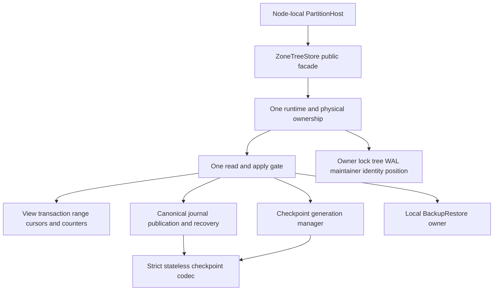

# ADR-046: Cohesive node-local storage owners under numeric gates

Status: Accepted. Date: 2026-10-02. Owner: lead storage integrator.
REQ-STORAGE-008; AC-SQ-001..008 in [acceptance](../Features/StorageRecovery.md),
AC-CQ-008 and AC-MP-001/002/012. [Brainstorm](../Features/StorageRecovery.md)
records alternatives/risks; [plan](../Features/StorageRecovery.md) is the ordered task
graph, exact file ownership, signatures, test matrix and verification join.
This decision remains Accepted until delivered-source qualification is complete.

## Retired generation ownership repair

REQ-STORAGE-020 / AC-DBHP-009 extends AC-SQ-004 and AC-DBHP-005/006.
Exact40f87 run37109874881 discovers a real post-InstallPrepared cleanup failure:
the retired maintainer/tree were successfully disposed during generation preparation
but remain referenced as live owners; final disposal repeats the maintainer call.
This is KeyLoad handle ownership, not a replacement or workaround for ZoneTree.

Ordered preserving contract: (1) root retains the original native failure and
freezes the real-store two-stage regression before product edits; (2) bounded
Luna owns only `ReplicaTermMetadataFailureTests.cs` for InstallPrepared and
JournalSwapped, exact poison checks, explicit closing and repeated actual Dispose;
(3) after root test-packet approval, the same worker owns only existing
`ZoneTreeStoreHandleDisposal.cs` and `ZoneTreeCheckpointGeneration.cs` to clear
successfully retired handle ownership before the later fault boundaries; (4)
root independently reviews all three files, builds/formats/static-checks, commits
all eligible current main scope and verifies exact-source native full suites.
Other helpers, runtime/public interfaces, options, packages, callbacks and formats
are out of scope; stop and escalate if a wider ownership change is necessary.

Keep failed-open maintainer/journal/tree/ownership and normal
maintainer/tree/journal/ownership orders, independently required cleanup,
generation/identity publication, journal swap, poison and recovery semantics.
No swallowed ObjectDisposedException, diagnostics waiver, new callback, data or
deployment change. Root owns shared docs/Git/gates. Rollback both product
helpers together after drain; retain the regression and native failure evidence.
The decision remains Accepted until actual qualification; process kills do not
qualify power-loss durability.

## Decision

Preserve the public ZoneTreeStore facade and every format/caller contract. Compose
one private runtime/handle owner with cohesive initialization/identity, journal,
read/transaction/range, checkpoint-format/generation and BackupRestore components.
All feature code remains in the same repository and canonical slices. No second
gate/tree/WAL, partial-type loophole, quality exception or grain-owned storage.
PartitionHost retains physical ownership as Orleans activations move.

## Implementation contract

1. Lead reads exact current source/policies and accepts AC-SQ criteria/signatures
   and this ADR before delegated implementation. Read-only TASK-MP-010AF-R supplies
   discovery; actual source governs where its proposal differs. Existing successful
   GitHub baseline covers old SHA only, not this dirty source.
2. TASK-MP-010AF-T first authors independent real-store facade/failed-open/lock-reuse/
   double-dispose regressions in its one NEW StorageRecovery test file. No doubles,
   hooks or local execution. Lead reviews first packet before runtime writes.
3. TASK-MP-010AF-C owns only NEW checkpoint writer/reader/frame/metadata files under
   StorageRecovery with the frozen stateless signatures/shared constants in the
   acceptance. Preserve batches, headers, JSON/digest/modes/observers and footer
   stop during WAL replay; source review plus existing CheckpointTests/process
   publication/recovery cases are the proof.
4. Lead TASK-MP-010AF-L alone owns facade, runtime/initializer/identity, handles/
   journal, existing read/range/transaction partial conversion, generation manager,
   shared format and every doc/config/artifact. Startup opens and replays once.
   Preserve constructor-failure order maintainer/journal/tree/ownership and normal
   disposal order maintainer/tree/journal/ownership, with finally-based complete
   cleanup. Borrowed views/counters/budget timing stay exact under the same gate.
5. TASK-MP-010AF-B owns only NEW ZoneTreeBackupRestore-prefixed files in BackupRestore
   after runtime/identity interfaces freeze. Retain exact verified local backup,
   clean restore/private new identity/paused authority-state recipe and one ordinary
   restored facade. Route backup operations through the shared BackupRestore owner in the lead's same join.
6. Lead waits for all required full packets, reviews every diff against criteria,
   builds actual provider/full graph with all SDK/style/XML/numeric rules, and
   resolves genuine findings. Canonical GitHub runs real TUnit/MTP unit, process
   recovery and Docker/Aspire RF3 .NET/MCP suites for exact delivered SHA. Retain
   run/job/SARIF/raw artifacts; no skipped suite or worker claim is a passing gate.
7. Run required formatter/static governance and final SOLID/single-owner/format/
   fault-order review. Update traceability/status/README with authentic source and
   qualification boundaries. Coverage/export/no-decrease, endurance and power-loss
   remain incomplete until their separate real gates actually pass.

Dependencies and joins: existing centrally pinned ZoneTree/.NET10/TUnit only; no
new package/tool. The checkpoint codec has no runtime backreference; journal replay
uses its reader once. Snapshot verification remains gate-free; installation verifies
incoming before write lock, staged image under lock, then authoritative replacement
and replay in original order. Checkpoint manager and backup borrow the single runtime.
Lead joins unchanged public facade callers, unit/recovery/replica checkpoints and
both StorageRecovery/BackupRestore feature specs. All worker write scopes are disjoint.

Source-only refactoring: keep private responsibilities in canonical slices and
compose them through the facade. No data, public or wire contract change;
identity/checkpoint/WAL/backup bytes and error codes remain exact. Rollback this
entire private decomposition as one source unit; do not roll back enabled analysis,
add alternate API paths or reassign node-local storage to grains. Existing unrelated
native/website/adapter work is protected. Process kills qualify only their declared
failure model, never power-loss durability or production readiness.
