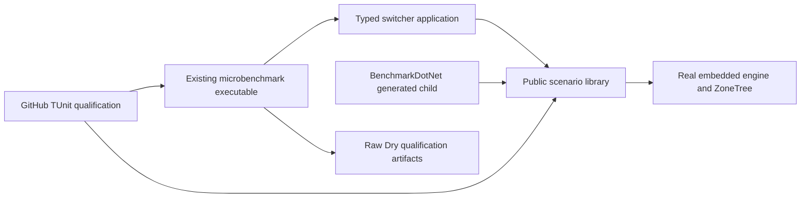

# ADR-047: public embedded benchmark scenarios and typed executable

Status: Accepted; implementation and qualification pending.
Related: REQ-BC-022, AC-EM-001..004, AC-CQ-007/008, ADR032/033/035.

BenchmarkDotNet0.15.8's generated external runner inherits the fixture. Its
[actual template](https://raw.githubusercontent.com/dotnet/BenchmarkDotNet/v0.15.8/src/BenchmarkDotNet/Templates/BenchmarkType.txt)
and [converter](https://raw.githubusercontent.com/dotnet/BenchmarkDotNet/v0.15.8/src/BenchmarkDotNet/Running/BenchmarkConverter.cs)
require public external visibility/methods; making an application fixture internal
to satisfy CA1515 breaks that consumer. Upstream inheritance is the explicit
justification for this otherwise unsealed public benchmark type. Keep compiler
policy and ordinary generated-process toolchain intact.

Choose a nonpackable public KeyLoad.BenchmarkScenarios library under canonical
BenchmarkComparisons ownership. Existing KeyLoad.Benchmarks remains the sole
microbenchmark executable, with only a typed application runner selecting the
fixture assembly. Public fixture CLR identity moves from the global executable
type to its library namespace, preserving three method names/filter fragments and
operation behavior. This is a benchmark tooling boundary, not a database product,
RF3 topology, managed dependency replacement or comparative-report migration.

Implementation contract, accepted before writes:

1. Lead owns new policy, this ADR, feature/architecture and central project/solution
   references/inventory/CI/status. W owns only new library source/csproj, existing
   microbenchmark Program/csproj/new typed runner and NEW EmbeddedBenchmark* TUnit
   sources. Exact permissions/task graph are in embedded-benchmark.plan.md.
2. W authors metadata/lifetime/actual-process assertions first, archives source
   and tests-first hashes, then coherent fixture move and ownership/clock/keys/XML
   repairs. Preserve seeding and every timed input/call/MemoryDiagnoser. Dispose
   acquired resources on setup error and repeated/uninitialized cleanup. Lead
   reviews complete failure/acquisition paths; environmental fault-path review is
   explicit supplemental evidence, not a fake deterministic runtime test.
3. Lead joins every diff, adds real references/inventory only after files exist,
   verifies25-project strict policy and23 custom consumers, normal Release builds,
   generated registration,400/200/50/3, formatter/governance/import/diff and source
   provenance. Coverage and other source prerequisites stay explicitly pending.
4. Exact-SHA GitHub TUnit invokes actual executable with Dry/full JSON. The pinned
   [exporter](https://raw.githubusercontent.com/dotnet/BenchmarkDotNet/v0.15.8/src/BenchmarkDotNet/Exporters/Json/JsonExporterBase.cs)
   supplies Method/Statistics/Measurements; all three need positive actual
   Workload/Result measurements and complete output/report retention. Exit0 alone
   is insufficient. No local runs, fake child or synthetic measurement evidence.
5. Full required unit/recovery/Docker Aspire RF3 SDK/MCP and existing gates must
   pass on the same delivered source. Dry results qualify runner execution only;
   comparative profiles/site/power-loss/endurance/production claims remain governed
   by their own gates. Update honest evidence before changing this ADR's status.

Dependencies retain existing centrally pinned SDK, BenchmarkDotNet and product
Query/Security/Storage projects. The first actual joined restore exposed NU1608:
BenchmarkDotNet's CSharp4.14.0 requires exact Common4.14.0 while the real Orleans
test graph already owns Common5.0.0. Before changing central dependencies, accept
only the CSharp5.0.0 peer pin, whose actual nuspec requires exact Common5.0.0 and
satisfies BenchmarkDotNet's minimum. Keep the existing Common/SDK/Orleans and
ManagedCode pins, analyzer SDK assets and all diagnostics unchanged. Lead alone
owns that shared configuration; actual paired restore, enabled builds and stage4's
real Dry generated consumer are required compatibility evidence. Rollback of the
complete benchmark join also removes the new peer pin; removing it alone leaves
the invalid graph and is not an accepted rollback. No ManagedCode release or
persisted migration follows from this compiler-package alignment.
Rollout is coherent source/library/host/test/reference change; no stored conversion.
Rollback removes that complete source unit while preserving strict policy, without
retaining the old fixture as a compatibility shim or diagnostic bypass. Shared
contracts/configuration/docs have one lead owner; independent query/storage/native
work cannot be overwritten. Accepted remains until every mapped gate succeeds.
