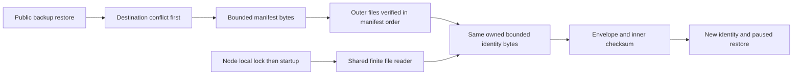

# ADR-048: bounded owned storage metadata

Status: Accepted; implementation and qualification pending.
Related: REQ-BACKUP-005, REQ-STORAGE-011, AC-BSM-001..005, AC-MP-006/012;
ADR008/011/033/035/046. This ADR's implementation contract defines exact
tasks and tests, accepted before writes.

Private manifest/identity readers must not allocate according to untrusted file
size. Restore also must parse the same identity bytes whose outer manifest hash
was verified. Choose inclusive16KiB manifest and4KiB identity-envelope limits;
normal compact schemas fit below512/1024bytes respectively. Default
[System.Text.Json byte-array representation](https://learn.microsoft.com/en-us/dotnet/standard/serialization/system-text-json/supported-types)
is base64; signing-key memory uses the existing strict converter. Existing JSON
case/depth/unknown-member/null/constructor policies remain unchanged.

Implementation contract:

1. Lead owns brainstorm/acceptance/plan, this ADR, feature/architecture/status and
   exactly two private ZoneTreePersistenceFormat budget constants. W owns only
   the named identity/backup readers/restore and NEW finite reader/Metadata* tests
   in the task graph. Archive before and author real public/filesystem regressions
   before production writes. Read-only V is strongest final review, no execution.
2. Reader opens one real FileStream, rejects length above budget before allocating,
   and reads at most budget+1 bytes into one finite owned region. An authoritative
   count and final length reject growth above limit. Return a memory slice without
   a second buffer copy; scoped stream disposal is unconditional. Oversize is
   existing file-specific FormatUnsupported, not a silent truncation.
3. Capture identity region while verifying manifest-listed files. Check its outer
   length/SHA over that region, stream WAL verification as before, and parse the
   captured identity only after every outer verification. Return StoreIdentity to
   the restore recipe; remove its identity reread. Startup Read reuses the reader
   after physical lock acquisition. Preserve all format bytes, ordinary error
   precedence, lock cleanup, destination check and flush/write/copy/commit order.
4. Lead and V inspect complete dataflow and independent real-file tests, including
   inclusive/overlimit, JSON/checksum/missing/error precedence, absent/nonempty
   destination, owner-lock release and managed allocation. Static proof is an
   explicit supplement for deterministic growth bounds and single-owned-region
   read; no fake stream/seam or racy test substitutes for actual runtime evidence.
5. Normal strict storage/UnitTests/full builds,400/200/64/3, canonical formatter,
   governance/import/diff, then stable exact-SHA GitHub TUnit/recovery/RF3 SDK/MCP
   and all required gates. Collector/raw numeric coverage remains separately
   unfinished until configured and verified. Record source versus executed proof
   before this ADR can become Implemented.

Compatibility changes only accepted input size: excessive whitespace or metadata
above budgets now fails explicitly. Supported stored schema/version and writer
output remain exact; no persisted migration or public signature/dependency change.
Rollout is the coherent private reader/restore/test unit. Rollback reverts it and
its constants, never changes durable files or introduces a fallback. Whole-backup
concurrent modification, cluster-cut restore, power loss, endurance and measured
physical I/O remain outside this private optimization. Dependency ownership and
node-local storage/grain-routing boundaries remain mandatory.
