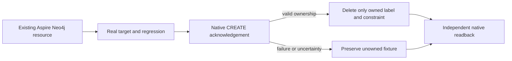

# ADR-049: Genuine Neo4j harness and acknowledged cleanup ownership

Status: Accepted; native comparison qualification remains pending.
Related: REQ-BC-023 / AC-GH-001..007, REQ-BC-001/002/009; ADR-032, ADR-033, ADR-034, ADR-035, ADR-043, ADR-044, ADR-071, ADR-076, ADR-080.

## Decision

Use the existing Aspire-owned ComparisonTests lifecycle for Neo4j regressions. Tests and the benchmark target must use a real pinned Neo4j Community server and the real KeyLoad RF3 target where applicable. Neo4j Community is a single-node native topology; 2-node and 3-node Neo4j slots remain explicit unsupported-topology dispositions. Do not represent a standalone server as a cluster or fabricate missing capabilities.

Grant cleanup authority only after a valid native CREATE acknowledgement confirms ownership of the label/constraint. On failure or uncertain acknowledgement, do not delete an unowned resource. Dispose each owned client and attempt every confirmed-owned cleanup while retaining primary and cleanup failures. An uncertain acknowledgement may leave an orphan; it is not proof of ownership or recovery safety.

Neo4j's HTTP Query API can return HTTP 202 for a query failure. Parse the documented JSON response shape: a successful CREATE may omit or contain an empty errors collection and must have the expected empty result shape, query type and opaque bookmark list. Reject malformed or missing claimed success and nonempty native errors. Diagnostics must not include server messages or credentials.

## Acceptance and implementation contract

AC-GH-001..007 require replacement of fake HTTP/target cases with genuine lifecycle tests; successful ownership acknowledgement; preservation of foreign constraints on duplicate/setup failures; validation of real native response shapes; complete measured writes/data readback; bounded mismatch/restoration flows; and exact-source qualification. Existing pure oracle cases remain useful when they do not stand in for native behavior.

The private protocol helper validates the already parsed JsonElement; it does not change the public target API, request body, native operation order or report schema. Root owns the existing ComparisonTests hook, friend visibility, AppHost lifecycle and shared joins. Tests remain under tests/KeyLoad.ComparisonTests/Features/BenchmarkComparisons/; target code remains in the Neo4j BenchmarkComparisons slice. No fake server, second host, proxy or product injector is introduced.

Run the full enabled source checks before exact-source Linux TUnit and native comparison qualification. A successful model test is not native startup, query, cleanup or performance evidence. Keep the ADR Accepted until every mapped gate has authentic evidence. Historical source/run receipts remain immutable and do not qualify the current source.
