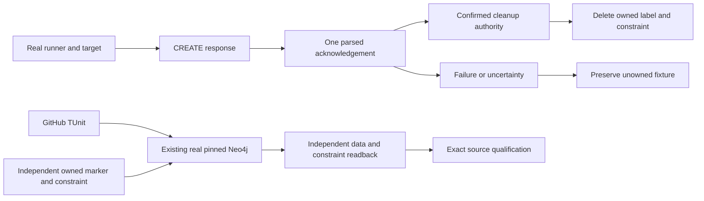

# ADR-049: Genuine Neo4j harness and acknowledged cleanup ownership

Status: Accepted; implementation and exact-source qualification pending.
Owner: KeyLoad benchmark lead. Date: 2026-10-02.
Related: REQ-BC-023 / AC-GH-001–007, REQ-BC-001/002/009,
ADR032/033/034/035/043/044. Detailed contract:
[acceptance](ADR-049-genuine-neo4j-harness.md) and
[ordered graph](ADR-049-genuine-neo4j-harness.md).

## Context and decision

Three existing harness unit cases use fake HTTP/target responses; three pure
oracle cases are useful. Existing ComparisonTests already owns real pinned Neo4j
and KeyLoad RF3 through Aspire, so use that same live lifecycle for real replacement
regressions. The main measured process disposes its targets before exiting; an
additional known-private-ID runner/target is required to inspect persisted writes
before target disposal. No second host, proxy, fake target or product injector.

Neo4jTarget currently grants cleanup authority before CREATE CONSTRAINT succeeds.
A native duplicate name on a different label can make failed-target disposal drop
another owner's constraint. Grant authority only after parsed successful CREATE
acknowledgement. Dispose/delete only confirmed-owned label/constraint; dispose the
owned client on every path. Lost acknowledgement may leave an orphan and requires
separate fault evidence; it never proves cleanup ownership or recovery safety.

[Query API documentation](https://neo4j.com/docs/query-api/current/query/)
shows HTTP202 for both success and query failure; successful examples omit errors.
[Plain JSON](https://neo4j.com/docs/query-api/current/plain-json/) defines data.fields
and data.values arrays. Accept documented omitted or empty errors with a valid
CREATE-only success shape: empty field/value arrays, queryType s and an opaque
string bookmarks array, including an empty list. Other query paths retain their
normal result expectations with generic safe error validation. Reject
malformed/missing claimed success and nonempty native errors
without logging server messages. Exact pinned writer verification is a blocking
preimplementation join; do not require an errors property that valid replies omit.

Pinned writer research is complete in the working plan. Exact internal methods
ValidateErrors and ValidateConstraintCreation take the already parsed JsonElement;
the latter checks errors first. Valid native codes use AC006's four-component
ASCII machine-code shape and existing Neo4j:code detail; malformed input uses
fixed Neo4j:InvalidQueryResponse detail without raw code/message/body. Root grants
only named ComparisonTests friend visibility. Genuine duplicate setup uses the
original Warmup0/Repetitions1 cut and a fresh target/client after direct disposal.
Every acknowledged-owned cleanup is attempted with bounded independent cleanup
tokens, including both target node deletion and constraint drop; client disposal
and original plus cleanup failures remain observable. No label-token removal claim.

Reject duplicate critical root errors/data/queryType/bookmarks, data fields/values,
and first native error code properties in either order. Later JSON properties
cannot erase an earlier error or grant ownership; unrelated metadata is preserved.

Use one source-owned internal response validator with real returned JSON and
controlled in-memory malformed-input cases. A named friend assembly limited to
ComparisonTests is allowed for that protocol boundary; public target CLR API,
wire/request/body/response ownership and measured operations stay unchanged.
Variants are test inputs and may not become benchmark/publication evidence.

## Implementation contract

1. Resolve actual pinned response writer/secret API and strongest contract review.
   Inspect full relevant historical-main CI baseline, preserve exact artifacts.
2. Review the six existing methods, target and shared caller. Author the real native
   duplicate constraint/marker and response regressions before production repair.
3. In parallel refactor the three pure methods once and implement genuine positive,
   mismatch/setup/warmup/CSV checks with real private clients/data/paths. Every
   original assertion maps to an exact new obligation; no fake remains at join.
4. Apply confirmed ownership and one-pass acknowledgement validation in existing
   Neo4jTarget plus new canonical Neo4jQueryResponse helper. Dispose unreturned
   documents and response streams; preserve actual target/client/session behavior.
5. Lead alone joins named test visibility and the existing ComparisonTests hook;
   retrieve real Aspire endpoint/password/image. Remove fake-response assertions only after
   real replacement source is complete and reviewed. Native/AppHost/shared writes are
   serialized; no overwritten independent work.
6. Strongest and lead inspect every source/error/lifetime/token/method/registration
   packet. Build/analyze/format/governance/numeric/coverage, then complete accepted
   nine-engine schema3/35+31 integration and every required product prerequisite.
7. Stable normal delivery and exact-SHA GitHub full TUnit/analyzer/unit/recovery/
   RF3 .NET/official MCP/comparison evidence. No skipped suite or source-only claim.

Exact owners/model tiers/scopes/dependencies/artifacts/start/join/terminal states
are the plan graph. Product runtime/persistence/frontend/schema: unchanged;
this changes private benchmark lifecycle and test proof only. Existing schema3 and
nine-engine requirements are mandatory. Historical six-engine evidence does not
qualify current requirements.
No new package, paid feature, global configuration or public API permission.

## Verification, rollout and rollback

AC001 preserves pure tests; AC002 captures actual HTTP202/native error and proves
fixture ownership after failed cleanup; AC003/006 validate authentic and malformed
protocol inputs; AC004 reads all28 writes/44nodes and96 measured CSV attempts before
cleanup; AC005 exercises genuine mismatch/restoration via the existing bounded
synchronous observer. AC007 requires complete exact-source GitHub/static/coverage
gates. Secret/native-detail assertions use Boolean checks so failure output cannot
echo credentials or native messages. Source-generation is not test execution.

No product data changes. Transient private resources disappear after genuine
successful ownership cleanup; uncertain acknowledgement may need operator cleanup.
Rollback is a coherent reviewed source/test unit preserving no-fakes policy and
cleanup authority. Environmental lost-response/cleanup faults remain explicit
qualification gaps until real fault tests; no production/durability or performance
claim follows from these mini-runs. Keep this ADR Accepted until every required
implementation/test/docs/verification join has authentic evidence.

