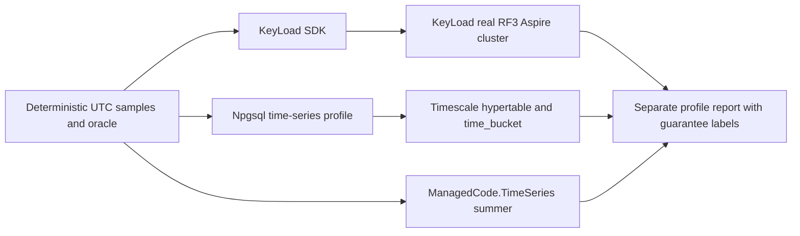

# ADR-050: Isolated TimeSeries and Timescale comparison profile

Status: Accepted; source implementation and full Release build complete, exact-SHA qualification pending. Date: 2026-10-02. Owner: BenchmarkComparisons lead. Related: REQ-TSC-001..006, AC-TSC-001..006, REQ-SERIES-007, AC-SERIES-007, REQ-BC-026, AC-BC-026; [TimeSeries](../Features/TimeSeries.md), [BenchmarkComparisons](../Features/BenchmarkComparisons.md), [acceptance](../../timeseries-comparison.acceptance.md), [plan](../../timeseries-comparison.plan.md).

## Accepted native digest assertion refinement

TASK-RUNTIME-TIMESCALE-W preserves REQ/AC-TSC-001/006 and the accepted image hash.
Official Aspire ContainerImageAnnotation makes Tag and SHA256 mutually exclusive;
WithImageSHA256 clears Tag. Run37005805424 failed before resource startup because
the test required tag plus digest in the native image name. The worker owns only
TimeSeriesAspireProfileTests.VerifyTimescaleImage and its named constants: assert
the native annotation's exact image repository and SHA256, require a resolved
digest-bearing image for cleanup, and keep the report's full source tag/digest.
No AppHost pin, actual readiness/oracle/foreign-schema/cleanup assertion, timeout,
report or package changes. Existing failing actual Aspire-model case is tests-first
proof; lead reviews source, builds/formats and qualifies the complete GitHub suite.
Rollback affects only test native-identity inspection; no migration is involved.
Primary source: [Aspire ContainerImageAnnotation](https://source.dot.net/Aspire.Hosting/ApplicationModel/ContainerImageAnnotation.cs.html).

## Decision

Add an isolated Aspire benchmark-mode TimescaleDB resource and a separate time-series comparison result. Run the same deterministic UTC sample workload against KeyLoad through the real RF3 .NET SDK, TimescaleDB through Npgsql and ManagedCode.TimeSeries as an explicitly in-memory aggregation primitive. Pin the Timescale image to its multi-platform digest and centrally pin the published ManagedCode package. Preserve the current nine-engine/schema3 comparison and KeyLoad's public/persisted sample contract.

The ManagedCode library does not become KeyLoad's persistence layer. Each arm reports its own durability, replication, and acknowledgement semantics. No combined winner score or equivalent guarantee is inferred.

## Implementation contract

1. Root adds `ManagedCode.TimeSeries` to `Directory.Packages.props`, adds its reference only to `benchmarks/KeyLoad.Comparisons/KeyLoad.Comparisons.csproj`, and owns shared comparison profile/report registration. Pin the published `10.0.0` version after NuGet availability verification.
2. Root owns `src/KeyLoad.AppHost/BenchmarkResources.cs` and `src/KeyLoad.AppHost/Features/BenchmarkComparisons/TimeSeriesBenchmarkResources.cs`. Register the Timescale resource only for the `timeseries` benchmark profile; use `timescale/timescaledb:2.30.2-pg18@sha256:e72689191e1c977892c53d6f2c344dbc4a9657a867dc8cc1899229f9d3672b2e`, parameterized Aspire connections, and readiness ordering. The container is ephemeral and has no cross-run data volume; the report claims persistence only for committed rows during that container's lifetime. Do not start it in ordinary RF3 product fixtures.
3. Root owns deterministic profile contracts/data/report and `benchmarks/KeyLoad.ComparisonHost/Features/BenchmarkComparisons/` composition. The shared oracle checks UTC buckets, exact values, order, range edges and duplicate identity. Timings separate persistent append/read/aggregate work from in-memory aggregation; retain every failure.
4. A bounded implementation task owns new Timescale Npgsql and ManagedCode.TimeSeries target files under `benchmarks/KeyLoad.Comparisons/Features/BenchmarkComparisons/TimeSeries/`. Use parameterized SQL, isolated per-run namespace/owner marker, hypertable-aware identity and cleanup only after positive ownership acknowledgement.
5. A disjoint task owns real TUnit tests under `tests/KeyLoad.ComparisonTests/Features/BenchmarkComparisons/TimeSeries/`: deterministic/oracle contracts, report guarantee metadata, actual Aspire resource startup, RF3 public SDK roundtrip and Timescale SQL results. No fake database/target or local test run.
6. Update TimeSeries and BenchmarkComparisons feature requirements, architecture map, ADR index, `docs/implementation/status.json`, task/coverage catalog, README and implementation comparison docs. Keep the existing nine-engine counts and status claims intact.
7. Root joins all source changes, runs the enabled solution build, format, governance and analyzer/complexity gates, then dispatches full GitHub CI. Preserve exact SHA, job URLs and artifacts; status remains pending until successful delivered-SHA evidence exists.

## Migration, rollout, rollback, verification and agent roles

No product data or public API migration occurs. The separate report is additive and is published only after successful matched CI evidence. Root is the sole owner of shared configuration, AppHost registration, public contracts, central package versions, workflow, docs and final integration. Worker ownership is limited to the new target files and its matching new test files; no shared-file overlap is allowed. Join point is the root comparison profile contract and one final full solution/CI run.

Rollback disables the optional comparison profile and removes only its resource, package reference, target, report and tests. Existing engine profiles and immutable reports remain untouched. Verification: full Release solution build, `dotnet format`, governance, and GitHub TUnit/comparison plus required recovery/RF3 SDK/MCP suites; no local runtime tests or measurements.

## Sources

- ManagedCode.TimeSeries package: https://www.nuget.org/packages/ManagedCode.TimeSeries/10.0.0
- Timescale official image metadata: https://hub.docker.com/layers/timescale/timescaledb/2.30.2-pg18/images/sha256-ce57e0dc6d92ef03073c23b940e5e0b3fd7e776aef20b60c2e941ac43f760d75
- Timescale Docker source: https://github.com/timescale/timescaledb-docker
