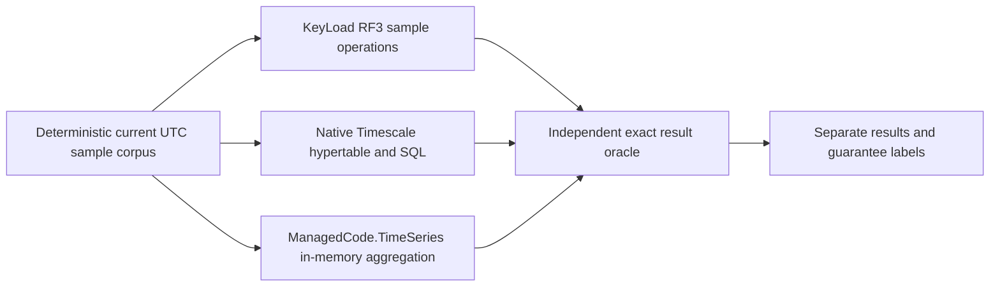

# ADR-050: TimeSeries and Timescale comparison

Status: Accepted; current workload-source update and delivered-source native qualification remain pending.
Related: REQ-TSC-001..006 / AC-TSC-001..006, REQ-SERIES-007 / AC-SERIES-007, REQ-BC-026 / AC-BC-026; [TimeSeries](../Features/TimeSeries.md), [BenchmarkComparisons](../Features/BenchmarkComparisons.md), ADR-034, ADR-059, ADR-071, ADR-076, ADR-080.

## Decision and boundaries

Keep the time-series comparison as a separately reported workload family. Compare KeyLoad's persisted sample operations through the real RF3 .NET SDK, TimescaleDB through its native PostgreSQL interface, and ManagedCode.TimeSeries as an explicitly in-memory aggregation primitive. The library is not a KeyLoad persistence provider. Reports must keep persistence, recovery, replication and acknowledgement guarantees distinct; no combined winner or equivalent guarantee may be inferred.

The current package pin is ManagedCode.TimeSeries 10.1.1. The Timescale resource is ephemeral `docker.io/timescale/timescaledb:2.30.2-pg18@sha256:e72689191e1c977892c53d6f2c344dbc4a9657a867dc8cc1899229f9d3672b2e`. Container model/source assertions do not establish native extension availability, replication, acknowledgement or performance. The existing 48-sample deterministic run is a correctness/control profile only; it cannot qualify scale performance or replace the two required record scales and operation counts.

## Preserved identity and artifact acceptance

- **AC-TSC-003:** `PackageVersion` comes from the actually loaded `ManagedCode.TimeSeries` assembly's `AssemblyInformationalVersion` package component before `+`; missing or blank assembly version metadata is rejected. The current consumer assertion is bound to the centrally pinned 10.1.1 package. Do not use an unrelated project version or relabel an immutable report.
- **AC-IMAGE-002:** for RF3 server image admission, consume the authenticated current source receipt (at most 65,536 bytes) and its named server manifest (at most 1,048,576 bytes); verify receipt schema/source revision, SHA-256 over the actual manifest bytes, registry digest, revision label and digest-qualified reference before any of the three native RF3 resources starts. All three rendered resources must use the same verified image repository and digest. These source/image limits are distinct from the TimeSeries workload-family plan; local source or model checks do not constitute authenticated native image qualification. See [ClusterFixtureImageIdentity](../../tests/KeyLoad.IntegrationTests/Features/ClusterReplication/Assertions/ClusterFixtureImageIdentity.cs) and the canonical cluster-replication acceptance.

## Current target and source gap

The intensive family retains 30 logical target/node/scenario identities: KeyLoad and TimescaleDB, native 1/2/3-node topologies, and Append, RawRangeRead, Latest, Aggregate and Windows. It also retains six separate topology preflight identities. Each logical cell produces two scale-specific workloads: 100,000 and 1,000,000 actual records, with at least 100,000 measured operations at each scale. Each of the resulting 60 scale-specific workload identities runs on a separate isolated Linux runner and measurement session; the two scales for one logical cell never share a runner, process, resource session or measurement identity. The six preflights are separately isolated jobs. The scales do not add targets/scenarios to the family and are outside the canonical 1,386-worker main cohort. The current source plan does not yet dispatch this 60-job plus six-preflight structure, so it remains a source gap, not an implemented or qualified feature.

The current source still encodes a 4,096-sample, 10,000-operation profile. Those values do not meet the current scale target and must not be presented as current qualification. The implementation change, per-scale corpus/readback budgets, scale-specific isolated job identity and evidence projection remain pending. No actual 100,000/1,000,000 TimeSeries result is claimed here.

Preserve real native sample operations and exact ordering/oracles: acknowledged append; inclusive raw range read; latest sample at an optional inclusive cut; complete half-open aggregates; and From-anchored, bounded dense windows. Use the currently validated execution options for concurrency, deadlines, output, resource and cleanup bounds; any bound that cannot admit the target corpus must be explicitly reviewed before changing it.

## Acceptance and implementation

REQ-TSC-001..006 / AC-TSC-001..006 and REQ-SERIES-007 / AC-SERIES-007 require the same independently derived corpus/oracle, native KeyLoad and Timescale operations, bounded output and process lifecycle, exact package/image/source provenance, honest guarantee labels, and actual delivered-source Linux qualification. Dataset counts describe records; measured operation counts describe operations and may not be substituted with BDN iterations or repeated reads over a smaller corpus.

Root owns the shared profile, target dispatch, AppHost resource composition, plan/evidence schema and documentation. Target code and matching TUnit tests remain in their BenchmarkComparisons TimeSeries feature paths. Tests use real Aspire resources, SDK, Npgsql and ZoneTree-backed KeyLoad state; no fake database or locally executed result substitutes for native evidence.

Ordered verification: update and validate the strict source plan and its independent tests; build/format/govern the delivered source; run isolated Linux native preflights and all planned intensive cells; preserve authenticated original results; then run the current aggregate/site/coverage/browser/freshness/provider gates. Rollback disables only this optional comparison family and removes its report/resources coherently. Existing KeyLoad TimeSeries APIs, storage, public formats and other benchmark targets remain unchanged. Keep this ADR Accepted until exact-source evidence covers both scales and every required gate.
