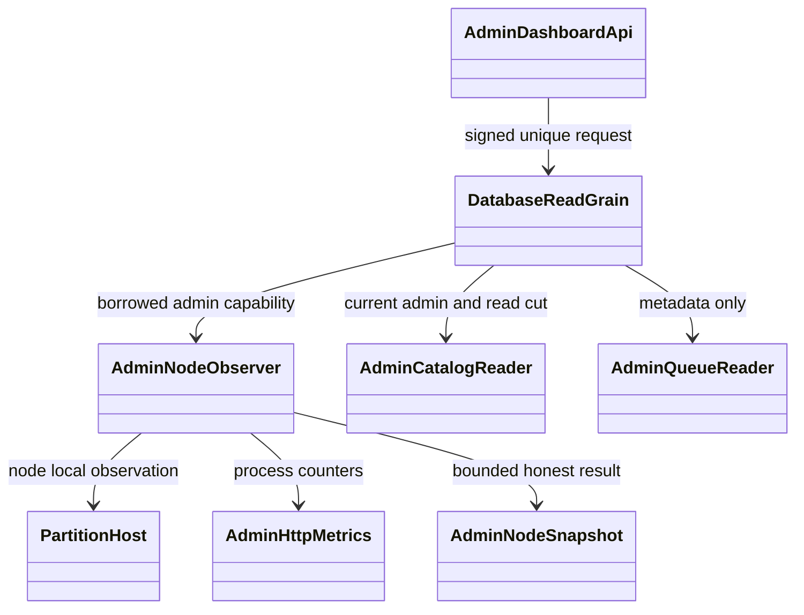

# ADR-051: same-origin read-only administration console

Status: Accepted. Date: 2026-10-02. Owner: KeyLoad lead. Related: REQ-AD-001..007 / AC-AD-001..007; ADR-036 Orleans routing, ADR-035 resource bounds, ADR-038 blobs and ADR-039 official MCP.

## Decision and rationale

Host the credential-free console shell and finite same-origin asset whitelist in the Server `AdminDashboard` slice, using embedded static resources. Protect all data reads with existing persisted identity and current administrator authority through separate Orleans request/read grains. The public Pages site retains its benchmark-evidence boundary. Add no packages/frameworks, schema, consensus or storage owner.

Catalog and queue metadata are gated bounded read pages. Physical file observations and process HTTP counters are borrowed from the executing node; report that node explicitly, incomplete scans and process resets. Frontend polls sequentially and retains bounded measured history; it does not claim cluster totals or persistent metric history. Existing authorized query AST and blob-list operations remain their current owners.

## Implementation contract

1. Lead owns the frozen DTO/protocol, acceptance, feature, plan, shared enum/routing/composition, SDK/MCP, architecture/status and delivery joins. Existing enum numeric values remain intact by appending three read kinds.
2. AD-B owns new Core/AdminDashboard readers, new Server/AdminDashboard C# observers/metrics/API, plus INodeAdministration and NodeAdministration bridge. Separate requests establish the existing quorum read barrier, reload authority and use bounded gated reads; filesystem observation retains node ownership with one concurrent scan, 2,048-entry/250 ms/200-output bounds and no symlink following.
3. AD-U owns only colocated Server/AdminDashboard/Assets. It implements accessible desktop/mobile console and memory-only session against frozen DTOs, existing query/blob operations, pagination, bounded real charts and disconnect/stale protections.
4. AD-T owns new matching UnitTests and IntegrationTests slices, derives failing regressions from AC before production joins, and exercises actual file stores/RF3/.NET/official MCP/browser. No fake dependencies or local test execution.
5. Lead joins every terminal complete packet, inspects diffs, resolves shared seams, performs development build/static checks, and delivers scoped relevant source using normal Git. Qualification occurs only through exact-SHA GitHub Actions with real artifacts; baseline failures and absent coverage remain explicit. ADR stays Accepted until every required AC, migration, docs and qualification passes.

Dependencies/start conditions: approved lead planning/ADR and frozen types precede write-capable workers; tasks and permissions are defined by the five ordered stages above and the durable AdminDashboard feature contract. Backend/UI/tests have disjoint paths. No worker changes shared contracts or installs tools. Ambiguity, extra scopes or unavailable infrastructure escalates to lead. Blocked/failed packets do not unblock joins.

## API and rollout

Add GET `/v1/admin/dashboard`, POST `/v1/admin/dashboard/resources` and POST `/v1/admin/dashboard/queue`, their typed SDK methods and explicit read-only official MCP tools. Static `/admin`, `/admin/` and named assets are exact allowlisted GET/HEAD routes; data paths receive no auth exemption. HTTP telemetry counts completed `/v1` and `/mcp` requests excluding dashboard polling, admission/status observations, static, health and internal routes; metrics contain only global process counters and elapsed duration, no sensitive labels.

Additive rollout needs coordinated server/SDK catalog support and no database migration. Rollback removes the dashboard slice and composition in one release, never renumbers existing reads or changes stored data. Public operation contracts, RF3 placement, distributed directory and activation repartitioning remain as configured. Physical observations are time-bounded filesystem metadata, not a durability proof. Manual visual rendering closes only subjective design; production/endurance/power-loss/coverage gates remain open until actual proof.
