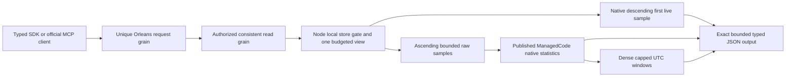

# ADR-052: bounded TimeSeries latest and raw aggregates

Status: Accepted; source joined, exact-SHA qualification and remaining gates pending.
Owner: KeyLoad lead integration owner. Date: 2026-10-02.
Related: KL-025; REQ/AC-SERIES-008..012; REQ-STORAGE-013 /
AC-RANGE-REV-001..003; ADR-004/005/010/014/035/036/041/050.

## Decision and rationale

Add typed read-only latest, whole-range statistics and dense fixed-window
statistics over the canonical persisted samples. Keep the existing inclusive
ReadSamples operation unchanged. Every new public request keeps its separate
Orleans request/read actors; physical node-local storage and the existing RF3
authority/consistent-cut behavior remain the owners of records and reads.

Use the published centrally pinned ManagedCode.TimeSeries 10.0.0 inside Core as
a bounded temporary numeric accumulator. It does not replace KeyLoad storage,
ordering, event deduplication, persisted authorization or replication. The owning
source at published commit23632b9f8d49d5a7feb337caa6cbeb5b22d7575a was inspected;
no dependency defect has been established and no consumer workaround is approved.

Three native DoubleTimeSeriesSummer instances use Strategy.Sum/Min/Max,
TimeSpan.MaxValue and maximum bucket count1. Pass each real sample timestamp and
value in the canonical UTC/sequence order. Every representable UTC date tick is
less than half TimeSpan.MaxValue, so native RoundUtc puts all values into one
bucket. This avoids unordered multi-bucket summation, retains actual dates and
uses native raw DataCount. Raw average is Sum/DataCount; the library's documented
bucket Average operation is a different contract and is not used here. Empty
windows need no native accumulator, and live accumulators do not retain samples.

## Public contract

| Operation | Input | Output / rules |
|---|---|---|
| Latest | ReadLatestSampleRequest(Partition,Set,SeriesId,AtOrBefore=null) | LatestSampleResult(SampleRecord? Sample); greatest UTC timestamp then greatest persisted sequence at/before optional inclusive cut; absent is null Sample; tags are projected by current persisted policy |
| Aggregate | AggregateSamplesRequest(Partition,Set,SeriesId,From,UntilExclusive=null,MaxSamples=10000) | SampleAggregate(Count,Sum,Minimum,Maximum,Average); complete half-open [From,UntilExclusive), UTC comparisons; null end includes the representable maximum timestamp |
| Windows | AggregateSampleWindowsRequest(Partition,Set,SeriesId,From,UntilExclusive,Width,MaxSamples=10000,MaxWindows=1000) | SampleAggregateWindowsResult(ImmutableArray<SampleAggregateWindow> Windows); each window has From, nullable UntilExclusive and SampleAggregate; dense ascending fixed-width UTC windows anchored at From, final window clamped |

Empty aggregate: Count=0, Sum=0, extrema/average=null. Equal range bounds are valid
empty ranges. Inverted range and nonpositive width give Validation. Finite input
whose accumulated sum is nonfinite gives Validation with a fixed safe message,
no partial response or mutations; a smaller following read remains healthy.
Raw average uses event counts, including multiple samples at equal timestamps.
Late committed data is visible on a new cut; event deduplication stays upstream.

The internal null-end tick is DateTimeOffset.MaxValue.UtcTicks+1, which fits long;
it is never constructed or serialized as a DateTimeOffset. Only a window ending
after the greatest representable tick returns null UntilExclusive. Bucket count
uses span/width and remainder, not overflowing span+width-1 arithmetic. End
advance clamps by remaining span before addition. Width may exceed the range.

Both caller caps must be positive and no larger than server MaxScanRecords /
MaxResults; invalid caps give BudgetExceeded. Check the calculated window count
against both caller and server bounds before allocation. A live matching sample
beyond MaxSamples is charged lookahead and makes the whole aggregate fail
BudgetExceeded; truncated statistics never count as success.

One ReadExecutionBudget.CreateView wraps the original gated view. Principal and
resource lookups, sample bytes and lookahead are charged exactly once. All new
operations require current persisted SeriesRead, including empty results. Check
cancellation/deadline during metadata, traversal, window fill and result writing.
Check the exact complete JSON output under the same configured MaxBatchBytes.
All result collections are immutable and retain ADR-041 array serialization.
The new HTTP and MCP canonical routes reserve the existing heavy-read ingress
working set under AC-SERIES-011, sharing capacity with query/search/range reads.
HttpAdmissionGovernor and its new TimeSeriesHttpAdmissionTests have the same root
integration owner; existing admission ceilings and release semantics are unchanged.

## Shared reverse storage contract

Add IKeyValueView.VisitReverseRange with the identical prefix, exclusive lower
afterKey, exclusive upper untilKey, observer, cancellation and borrowed visitor
parameters as VisitRange. Only order changes to descending encoded keys.
Parameterize the existing private range merge and its native cursors. Preserve
forward defaults, staged replacement/insert/tombstone precedence and counters.

The baseline uses pinned ZoneTree's CreateReverseIterator(NoRefresh); seek to
the lesser of caller upper bound and binary prefix successor. Empty/all-FF
prefix has no successor and uses native reverse start. Filter exclusive bounds
explicitly and stop below the lower/prefix boundary. Staged data uses the native
SortedSet.GetViewBetween(...).Reverse enumerator, not a buffered LINQ reverse.
Do not buffer/copy the full baseline, transaction changes or series history.
If seek throws, dispose the acquired native iterator before rethrowing.

Charge matching examined key/value bytes before callback or live lookahead.
Visitor=false stops before further cursor advance. Every failure releases the
native cursors and original storage gate. Latest stops after its first live
committed sample; its real-store logical baseline-entry delta is one, independent
of history size. Counters are logical work, not physical disk/RSS measurements.

## Ordered implementation and ownership contract

1. TASK-SERIES-CONTRACT-R8, root: accept this ADR, TimeSeries/StorageRecovery/
   ResourceExecution maps, acceptance and task graph before source. Root alone
   owns Abstractions new TimeSeries DTOs and shared IKeyValueView, Core csproj,
   BudgetedReadView, ZoneTreeStore/ZoneTreeReadView/ZoneTreeTransaction forwarding
   and new public Core/Features/TimeSeries/TimeSeriesReadOperations.cs. Public
   static extension operations ReadLatestSample/AggregateSamples/
   AggregateSampleWindows accept engine, principal, typed request, cancellation;
   they do not enlarge the existing oversized DatabaseEngine partial type.
2. TASK-SERIES-REVERSE-W8, cheaper capable worker: author genuine new
   UnitTests/Features/StorageRecovery/ReverseRangeTests,
   ReverseTransactionRangeTests and ReverseRangeResourceTests first. Own only
   ZoneTreeRangeReader, ZoneTreeBaselineCursor, ZoneTreeStagedCursor and
   ZoneTreeRangeBounds private files. Extend Visit with final optional
   bool reverse=false. No shared forwarding/interface or forward test edits.
3. TASK-SERIES-CORE-W8, disjoint cheaper capable worker: author new real
   UnitTests/Features/TimeSeries/SampleLatestTests, SampleAggregateTests,
   SampleAggregateWindowTests, SampleAggregateBudgetTests,
   SampleAggregateAuthorizationTests and private SampleAggregateTestData first.
   Own only new private Core/Features/TimeSeries/SampleReadScope,
   SampleReadKeys, SampleLatestReader, SampleAggregateAccumulator,
   SampleAggregateReader, SampleAggregateWindowReader and SampleWindowAccumulator
   files. Reader signatures are Read(DatabaseEngine,IKeyValueView,string
   principalId,typed request,ReadExecutionBudget); supplied view is already
   budgeted, so never wrap/charge it a second time. Root owns public facade.
4. TASK-SERIES-SURFACE-R8, root: add matching Client TimeSeries SDK slice, HTTP
   routes /v1/series/latest,/aggregate,/windows, append GrainReadKind values27..29
   preserving0..26, typed read dispatch, official MCP names
   keyload_series_latest/keyload_series_aggregate/keyload_series_windows,
   descriptions, input/output schema registrations and discovery expectations.
5. TASK-SERIES-RF3-W8, cheaper capable worker after a slot opens: own only new
   IntegrationTests/Features/TimeSeries files. Use existing genuine RF3 fixture,
   persisted credentials, real .NET and official MCP clients, parity/error cases
   and a real isolated follower kill/restart. No shared-fixture, topology,
   timeout, fake transport, retry-policy or authority changes.
6. TASK-SERIES-JOIN-R8, root: independently inspect every diff and acceptance
   oracle; join all completed work; full development restore/Release build,
   canonical format/static governance, all-source current-main commit/push,
   exact-SHA GitHub unit/recovery/Docker RF3/MCP/native report inspection and
   honest durable source/qualification evidence. Blocked/partial workers cannot
   unblock this join. No local tests, container or benchmark execution.

Existing e8d1a9eb1 CI run37049469093 is the full relevant baseline; all unit,
recovery/analyzer and RF3 jobs pass, comparison-smoke has two genuine Aspire
Waiting failures. Preserve them as failures and keep comparisons/measurements
distinct. Native report counts and hashes are retained in the runtime ledger.

## Verification, migration and rollback

Each criterion maps to test-owned independent raw oracles and real provider/
SDK/MCP/fault operations in the TimeSeries feature. Preserve all existing
forward/inclusive/security/replication tests. No doubles, weakened assertions,
global suppression, new retries or increased bounds. Native seek-error disposal
requires source/lifetime review because no real provider failure-injection API
is available; it is not claimed as an executed environmental fault branch.

No persisted format or data migration. Public changes are additive read APIs;
roll back the additive contracts/routes/read catalog/reader slice together while
retaining old numeric read kinds and storage formats. The separate ADR-050
comparison continues declaring its own measured operations; client-folded
statistics must not be relabeled measured server aggregation.

This ADR remains Accepted until all implementation, tests, docs and verification
exist. Numeric coverage, full comparison, endurance, power-loss, maximum speed,
activation movement, retention/rollups, SQL and compressed chunks remain open
gates/work. SMID waits for owner mapping; native Orleans Streams remains an
independent first-priority architecture workstream under the root policy.
